# Architecting an Industrial AI Platform: Decoupling Capabilities from Their Implementations, Governing Interactions, Staying in Control

> **Isolation, multi-tenancy, sovereignty, resilience, observability, and traceability: the architectural choices that turn heterogeneous AI capabilities into a governed, industrializable platform.**

Building an application that can use a language model has become relatively simple.

A few lines of configuration are enough to connect a model, expose tools, add document retrieval, or build a first agentic workflow.

For a first use case, this simplicity is even desirable.

The difficulty appears when we start to change scale.

What happens when several applications need to use the same infrastructure? When several teams want to use different models? When some workloads can use an external provider while others must stay on internal infrastructure? When each customer has its own data, tools, secrets, quotas, and security rules?

At that point, the problem changes in nature.

We are no longer simply integrating an AI capability into an application.

We are starting to build an **execution platform for AI capabilities**.

And with this platform, fairly classic software engineering questions resurface: decoupling, isolation, resilience, contracts, observability, security, governance, and dependency control.

What is specific here is the nature of the components we now have to integrate. Models evolve quickly. Providers change. Agentic frameworks multiply. New protocols appear. The capabilities available today will probably not be exactly the ones we use tomorrow.

The question, then, is not only how to assemble these technologies.

It is above all to determine **which responsibilities must remain under the platform's control while everything else evolves**.

---

## A- Building an AI Application Is Not Building an AI Platform

At small scale, a direct architecture can be perfectly reasonable.

An application calls a model. The model can use a tool. A document retrieval layer may complete its context.

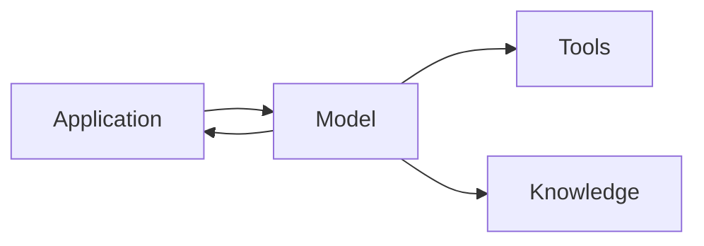

This architecture is easy to understand and quick to implement.

The problem appears when we start multiplying the system's dimensions.

Several applications then use several models, several providers, different agents, internal tools, different document sources, and sometimes several confidentiality levels.

Multi-tenancy can be added on top: several entities use the same platform without necessarily having the same rights, the same data, or the same capabilities.

An architecture that worked well for a first use case can then start to fragment.

One team implements its own model selection mechanism.

Another builds its own fallback system.

A third adds its own security rules.

Each product develops its own integrations, its own error handling, and its own way of tracing interactions.

The result may work.

But we do not really have a platform yet.

What we mostly have is several integrations sharing some infrastructure.

This is usually when the real architecture topic begins.

---

## B- Start With Responsibilities Rather Than Technologies

When a new technology appears in the AI ecosystem, it can be tempting to structure the architecture around it.

A new framework offers better orchestration.

A provider exposes a more capable model.

A protocol simplifies communication with tools.

A new search solution improves access to knowledge.

These developments matter, but they belong precisely to the part of the system that changes quickly.

The platform's role should be to prevent each of these developments from calling its architecture into question.

I therefore prefer to start with a different question:

> **Which responsibilities must we keep under control, regardless of the technologies chosen to implement them?**

Identity is one of them.

So is the tenant.

Access policies, quotas, routing, security rules, data classification, audit, traceability, and some resilience strategies are also platform responsibilities.

Alongside these are capabilities whose implementation may evolve: models, agentic engines, tools, search engines, RAG solutions, or external services.

This distinction lets us draw a first architectural boundary.

The platform owns its contracts and its rules.

Technologies provide the capabilities needed to execute them.

---

## C- The Adapter as an Architectural Boundary

The term *adapter* may immediately bring a design pattern to mind.

In this context, however, I find it more interesting to think of it as an **architectural boundary**.

The goal is not simply to hide an external API.

It is above all to prevent a particular implementation from imposing its own abstractions on the rest of the platform.

The system can, for example, reason around four broad families of capabilities:

```text
Model Capability
Agent Capability
Tool Capability
Knowledge Capability
```

These capabilities describe what the platform knows how to use.

Adapters describe how these capabilities are actually provided.

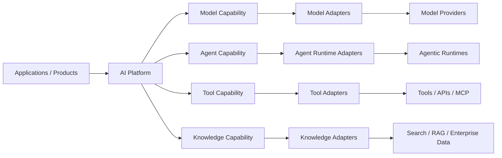

A `Model Adapter` can isolate the differences between several providers.

An `Agent Runtime Adapter` makes it possible to run certain agentic capabilities without making the chosen framework the center of the architecture.

A `Tool Adapter` provides a boundary with the company's services and tools.

A `Knowledge Adapter` decouples execution from the mechanisms used to retrieve or prepare context.

The core of the system can then reason with its own concepts:

```text
ExecutionRequest
ExecutionContext
Capability
Policy
ExecutionResult
```

This distinction brings an interesting property:

> **An implementation can change without forcing the platform to change its architectural language.**

This principle should not be turned into an absolute rule, however.

Creating an abstraction for every dependency can produce a needlessly complex architecture.

An adaptation boundary is mostly relevant when it protects an element likely to evolve independently of the platform's core.

The goal, then, is not to abstract everything.

It is to consciously choose **what we refuse to couple**.

---

## D- A Runtime Executes, a Platform Governs

A second distinction seems particularly important to me: the one between execution and control.

A runtime must be able to handle a request.

It receives a context, uses certain capabilities, possibly calls a model, an agent, or a tool, then produces a result.

But not all the decisions required for this execution should belong to it.

Let's take a few simple questions.

Can this tenant use this model?

Can this information leave the internal infrastructure?

Is this user allowed to call this tool?

Which consumption limit should apply?

Which fallback strategy is acceptable?

Which provider is authorized for this data classification?

These decisions belong more to platform governance than to the implementation of a particular workflow.

We can then conceptually distinguish two planes.

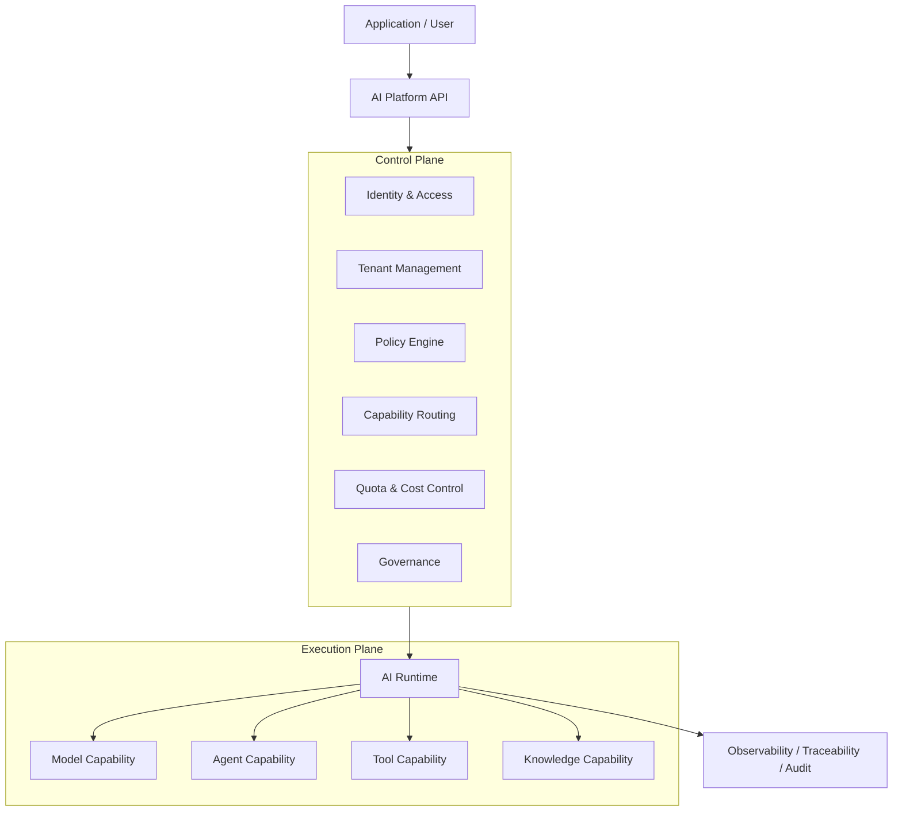

The **control plane** determines the conditions under which an execution may take place.

The **execution plane** carries out that execution.

This separation notably avoids scattering governance rules across every agent, every workflow, or every application.

The runtime executes within a frame.

The platform defines that frame.

This difference also becomes important when a platform has to support several execution mechanisms.

The runtime then no longer needs to be conflated with the platform itself.

It becomes a capability behind its contracts.

---

## E- Multi-Tenancy Is First and Foremost an Isolation Problem

Multi-tenancy is sometimes approached mainly as a persistence problem.

A record has a `tenant_id`.

Queries are filtered.

The topic seems handled.

For an AI platform, this approach is insufficient.

A tenant may have its own users, authorized models, tools, documents, secrets, quotas, security rules, and sovereignty constraints.

Isolation must therefore run through the entire execution.

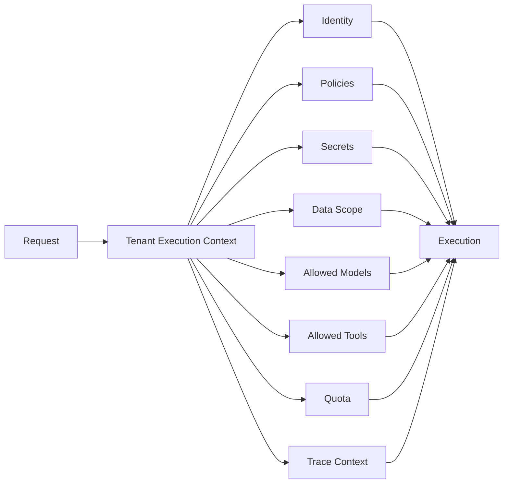

The tenant thus becomes a property of the **execution context**.

This context travels with the request as it passes through the platform's different capabilities.

This approach prevents correct isolation at the storage level from being bypassed further down the chain by a poorly selected tool, model, or document source.

> **In an AI platform, multi-tenancy is less a storage problem than an execution isolation problem.**

This does not mean, however, that every tenant must have dedicated infrastructure.

Isolation can be adapted to the level of risk.

| Level      | Isolation principle                     |
| ---------- | --------------------------------------- |
| Standard   | Shared resources with logical isolation |
| Reinforced | Separate data or execution capabilities |
| Regulated  | Dedicated environment or infrastructure |

This approach avoids two extremes: sharing everything or physically isolating everything.

The architecture then becomes proportionate to the sensitivity level of the context.

---

## F- Sovereignty Becomes a Routing Policy

Multi-model routing is often presented as an optimization problem.

We look for the best trade-off between quality, latency, cost, and availability.

These criteria still matter.

But in an enterprise environment, they are not enough.

Imagine that an external model performs better than a model hosted on internal infrastructure.

If the data being processed cannot leave a given perimeter, the comparison ends there.

The theoretically best-performing model is simply not an authorized route.

The decision then becomes multidimensional:

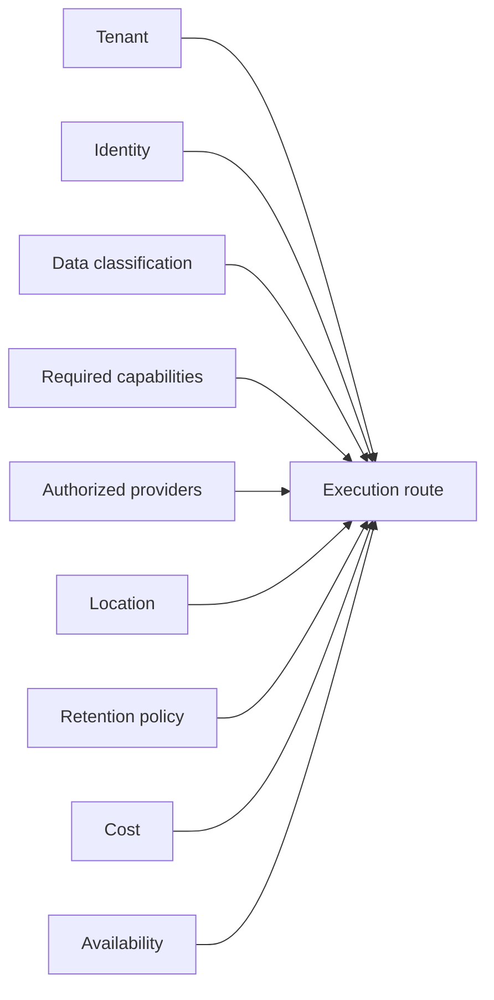

Sovereignty thus ceases to be solely an infrastructure choice.

It becomes a property of execution.

Public data may be allowed to use several providers.

Sensitive data may require a model deployed on controlled infrastructure.

A tenant subject to specific requirements may have a much more restrictive list of models, regions, or tools.

This approach also gives another dimension to the notion of an LLM Gateway.

Its role should not be reduced to spreading calls across several models.

Routing can become the concrete application of technical, economic, contractual, and regulatory policies.

---

## G- Resilience Must Be Governed Too

Distributed architectures have long had resilience mechanisms: timeout, retry, circuit breaker, rate limiting, backpressure, or fallback.

These mechanisms remain necessary.

But their application to AI capabilities sometimes needs to be revisited.

Take the case of a fallback between two models.

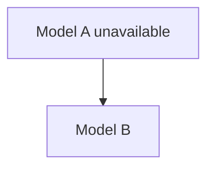

From a purely technical standpoint, this strategy seems reasonable.

But model B may behave differently.

Its cost may be higher.

Its hosting infrastructure may be located elsewhere.

Its retention policies may differ.

The fallback is therefore no longer only an availability mechanism.

It can change the properties of the execution.

The decision should look more like this:

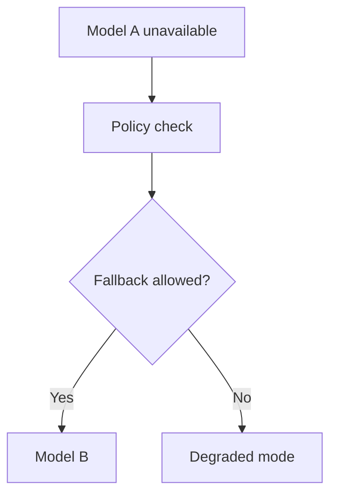

This distinction seems important to me.

> **A resilient platform does not simply look for another route. It looks for another acceptable route.**

A degraded mode may sometimes be preferable to a fallback that would violate the constraints defined for the tenant.

Resilience must not become a door for bypassing governance when the system encounters a failure.

---

## H- Observing the Infrastructure Is No Longer Enough

A distributed platform must naturally be observable.

Latency.

Availability.

Errors.

Consumption.

Saturation.

These metrics help us understand the technical health of the system.

But they are not always enough to answer another question:

> **Why did this execution use this model, this tool, and this data source?**

To answer it, we need to be able to reconstruct the execution's trajectory.

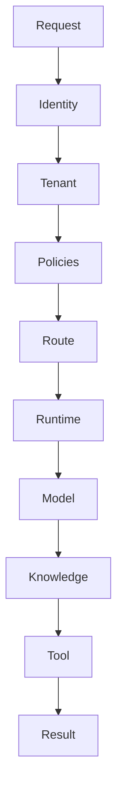

This trajectory can then be enriched with the model actually used, its version, the provider, the tool calls, the policy decisions, any fallbacks, the latency, the consumption, or the cost.

It then becomes useful to distinguish several levels of observation.

**Metrics** describe overall health.

**Logs** describe technical events.

**Distributed traces** reconstruct the path a request took across several components.

**AI execution traces** provide the context needed to understand how the capabilities were used.

Finally, **audit** answers another question: who used which capability, in what context, and under which policy?

This last dimension becomes even more important once agentic behaviors are introduced.

Observing only network calls tells us where a request went.

It does not necessarily tell us why certain decisions were made.

The observability of an AI platform must therefore progressively go beyond the state of the infrastructure to reach the **system's decision trajectory**.

---

## I- Centralizing Control Does Not Mean Centralizing All Execution

A question then naturally arises: do we need a central runtime?

A first approach is to route every execution through the same engine.

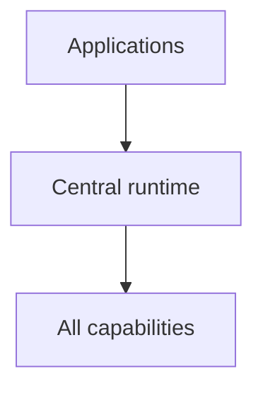

This architecture can bring a lot of consistency.

But as workloads diversify, this runtime can progressively become a major coupling point.

Another approach is to centralize mainly the platform's policies and contracts.

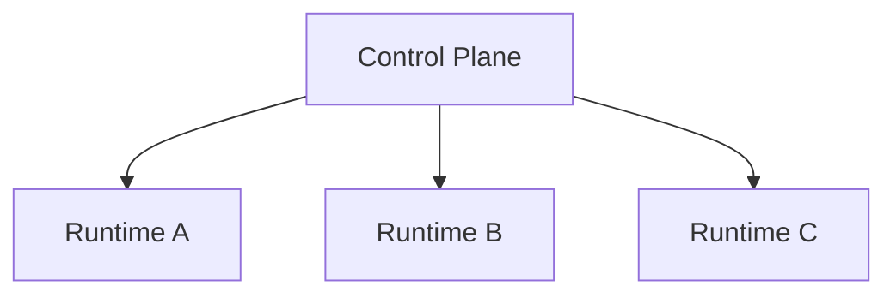

Each runtime can then be adapted to a type of workload, an environment, or a particular isolation level.

Implementations differ.

Governance rules remain shared.

This approach seems particularly interesting to me when a platform has to evolve with several teams or several kinds of AI systems.

> **Centralizing governance does not necessarily mean centralizing all workloads.**

The control plane can be consistent without imposing total uniformity on the execution plane.

This is precisely one of the reasons adapters and platform contracts become important.

They make it possible to accept some diversity of implementation without losing the coherence of the whole.

---

## J- A Reference Architecture, Not a Universal Blueprint

Bringing these principles together, a target architecture can be represented like this:

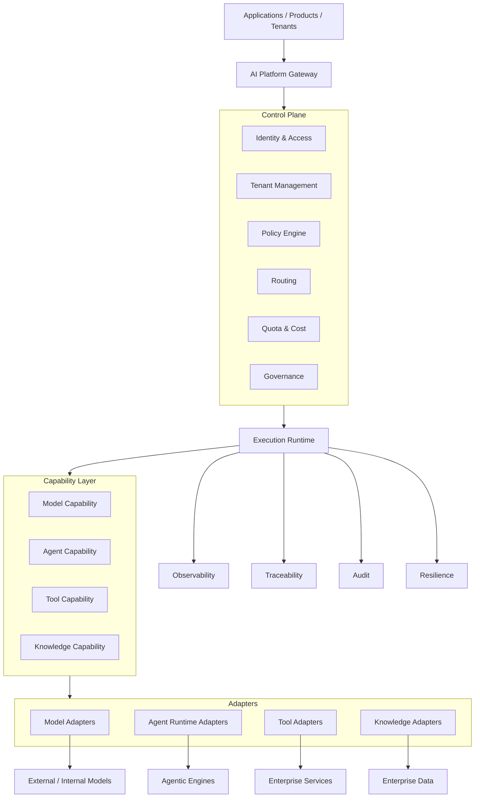

I deliberately consider this diagram a **reference architecture**.

Not a blueprint to be reproduced component by component.

A platform supporting two use cases probably does not need the same level of sophistication as a platform used by several dozen teams.

Likewise, not every project immediately needs a complex policy engine, several runtimes, or several isolation levels.

Industrialization must not become a justification for over-architecting a system.

The right level of architecture depends on the variability points actually observed.

If a single provider durably meets the need, a complex abstraction layer may be unnecessary.

If several models, environments, or sovereignty levels already coexist, the boundary becomes much more relevant.

The same reasoning applies to runtimes, tools, or knowledge systems.

An industrial architecture is not the one with the most layers.

It is the one that makes explicit the boundaries the system actually needs.

---

## K- What the Platform Must Ultimately Protect

After talking about the runtime, adapters, multi-tenancy, or routing, it is worth coming back to the essentials.

An AI platform should probably not seek first and foremost to protect a technology.

It should protect certain properties of the system.

**Decoupling**, so that implementations can evolve without transforming the entire architecture.

**Isolation**, to prevent a tenant, a piece of data, or an execution from leaving its authorized perimeter.

**Control**, so that structuring decisions remain carried by the platform rather than scattered across every integration.

**Resilience**, to keep operating without bypassing the defined rules.

**Observability**, to understand the technical and operational health of the system.

**Traceability**, to reconstruct why a route, a model, a tool, or a piece of data was used.

These properties are ultimately far more durable than the technologies used to implement them.

---

## Conclusion

At small scale, connecting an application directly to a model, a tool, or a framework can be perfectly reasonable.

Not every AI project should start by building a platform.

The problem appears when several products, teams, models, agents, tools, datasets, and sensitivity levels begin to coexist.

At that point, the decisive choice is no longer only that of the best model or the most advanced runtime.

The problem becomes architectural.

We have to determine what the platform owns.

What it delegates.

What it standardizes.

And above all, which boundaries it refuses to let depend on a particular implementation.

Adapters protect these boundaries.

The control plane carries the policies.

The runtime executes.

The tenant context carries isolation.

Routing enforces sovereignty constraints.

Resilience looks for an acceptable route rather than a merely available one.

Observability and traceability finally make executions understandable and verifiable.

Models will keep evolving.

So will agentic runtimes.

Protocols and tools will change.

A well-designed platform must be able to absorb part of these changes without losing the fundamental properties on which its operation rests.

This is probably where the main challenge of industrialization lies.

Not only in our ability to integrate more models, agents, or tools.

But in our ability to keep control of the system as these capabilities become numerous, distributed, and increasingly autonomous.

> **Industrializing AI is not only about multiplying capabilities. It is above all about keeping control as those capabilities multiply.**
