# Architecturer une plateforme IA industrielle : découpler les capacités de leurs implémentations, gouverner les interactions, garder le contrôle

> **Isolation, multi-tenant, souveraineté, résilience, observabilité et traçabilité : les choix d'architecture qui permettent de transformer des capacités IA hétérogènes en une plateforme gouvernée et industrialisable.**

Construire une application capable d'utiliser un modèle de langage est devenu relativement simple.

Quelques lignes de configuration permettent de connecter un modèle, d'exposer des outils, d'ajouter une recherche documentaire ou de construire un premier workflow agentique.

Pour un premier cas d'usage, cette simplicité est même souhaitable.

La difficulté apparaît lorsque l'on commence à changer d'échelle.

Que se passe-t-il lorsque plusieurs applications doivent utiliser la même infrastructure ? Lorsque plusieurs équipes veulent exploiter différents modèles ? Lorsque certains traitements peuvent utiliser un fournisseur externe alors que d'autres doivent rester sur une infrastructure interne ? Lorsque chaque client dispose de ses propres données, outils, secrets, quotas et règles de sécurité ?

À ce moment-là, le problème change de nature.

Nous ne sommes plus simplement en train d'intégrer une capacité IA dans une application.

Nous commençons à construire une **plateforme d'exécution pour des capacités IA**.

Et avec cette plateforme réapparaissent finalement des questions assez classiques de l'ingénierie logicielle : découplage, isolation, résilience, contrats, observabilité, sécurité, gouvernance et maîtrise des dépendances.

La particularité vient de la nature des composants que nous devons désormais intégrer. Les modèles évoluent rapidement. Les fournisseurs changent. Les frameworks agentiques se multiplient. De nouveaux protocoles apparaissent. Les capacités disponibles aujourd'hui ne seront probablement pas exactement celles que nous utiliserons demain.

La question n'est donc pas seulement de savoir comment assembler ces technologies.

Elle est surtout de déterminer **quelles responsabilités doivent rester sous le contrôle de la plateforme lorsque tout le reste évolue**.

---

## A- Construire une application IA n'est pas construire une plateforme IA

À petite échelle, une architecture directe peut être parfaitement raisonnable.

Une application appelle un modèle. Le modèle peut utiliser un outil. Une couche de recherche documentaire complète éventuellement son contexte.

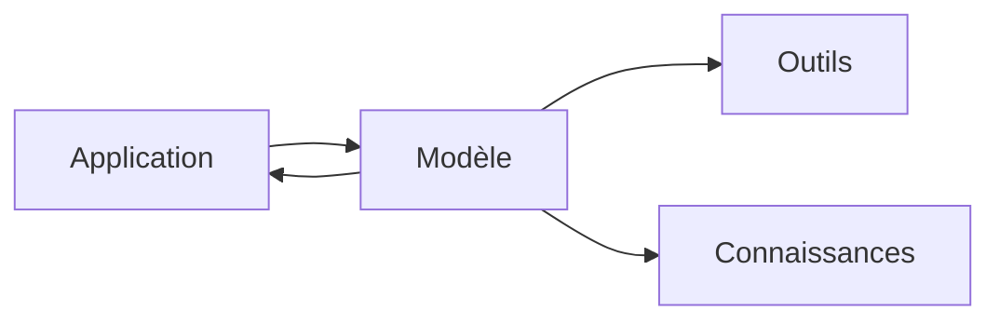

Cette architecture est facile à comprendre et rapide à mettre en œuvre.

Le problème apparaît lorsque l'on commence à multiplier les dimensions du système.

Plusieurs applications utilisent alors plusieurs modèles, plusieurs fournisseurs, différents agents, des outils internes, des sources documentaires différentes et parfois plusieurs niveaux de confidentialité.

À cela peut venir s'ajouter le multi-tenant : plusieurs entités utilisent la même plateforme sans nécessairement disposer des mêmes droits, des mêmes données ou des mêmes capacités.

Une architecture qui fonctionnait correctement pour un premier cas d'usage peut alors commencer à se fragmenter.

Une équipe implémente son propre mécanisme de sélection des modèles.

Une autre crée son système de fallback.

Une troisième ajoute ses propres règles de sécurité.

Chaque produit développe ses intégrations, sa gestion des erreurs et sa manière de tracer les interactions.

Le résultat peut fonctionner.

Mais nous ne disposons pas encore réellement d'une plateforme.

Nous avons surtout plusieurs intégrations partageant certaines infrastructures.

C'est généralement à ce moment-là que le véritable sujet d'architecture commence.

---

## B- Commencer par les responsabilités plutôt que par les technologies

Lorsqu'une nouvelle technologie apparaît dans l'écosystème IA, il peut être tentant de structurer l'architecture autour d'elle.

Un nouveau framework propose une meilleure orchestration.

Un fournisseur expose un modèle plus performant.

Un protocole simplifie la communication avec les outils.

Une nouvelle solution de recherche améliore l'accès à la connaissance.

Ces évolutions sont importantes, mais elles appartiennent précisément à la partie du système qui change rapidement.

Le rôle de la plateforme devrait être d'éviter que chacune de ces évolutions provoque une remise en cause de son architecture.

Je préfère donc commencer par une autre question :

> **Quelles responsabilités devons-nous continuer à maîtriser, indépendamment des technologies choisies pour les implémenter ?**

L'identité en fait partie.

Le tenant également.

Les politiques d'accès, les quotas, le routage, les règles de sécurité, la classification des données, l'audit, la traçabilité ou encore certaines stratégies de résilience sont aussi des responsabilités de plateforme.

À côté de cela existent des capacités dont l'implémentation peut évoluer : modèles, moteurs agentiques, outils, moteurs de recherche, solutions RAG ou services externes.

Cette distinction permet de poser une première frontière architecturale.

La plateforme possède ses contrats et ses règles.

Les technologies viennent fournir les capacités nécessaires à leur exécution.

---

## C- L'adapter comme frontière d'architecture

Le terme *adapter* peut immédiatement faire penser à un design pattern.

Dans ce contexte, je trouve cependant plus intéressant de le considérer comme une **frontière d'architecture**.

L'objectif n'est pas simplement de masquer une API externe.

Il s'agit surtout d'empêcher une implémentation particulière d'imposer ses propres abstractions au reste de la plateforme.

Le système peut par exemple raisonner autour de quatre grandes familles de capacités :

```text
Model Capability
Agent Capability
Tool Capability
Knowledge Capability
```

Ces capacités décrivent ce que la plateforme sait exploiter.

Les adapters décrivent comment ces capacités sont effectivement fournies.

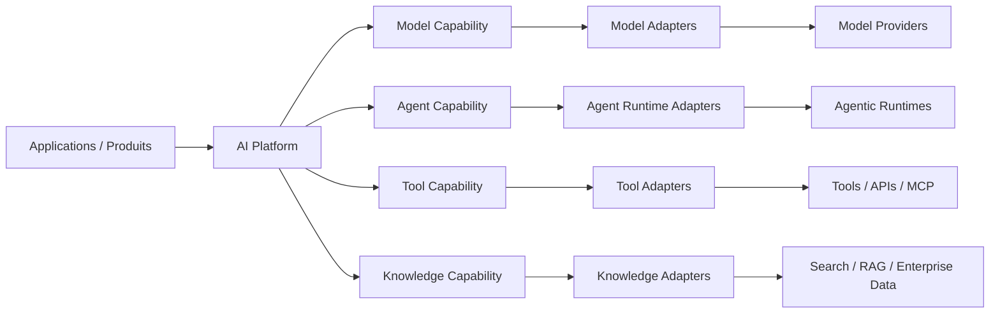

Un `Model Adapter` peut isoler les différences entre plusieurs fournisseurs.

Un `Agent Runtime Adapter` permet d'exécuter certaines capacités agentiques sans faire du framework utilisé le centre de l'architecture.

Un `Tool Adapter` fournit une frontière avec les services et outils de l'entreprise.

Un `Knowledge Adapter` découple l'exécution des mécanismes utilisés pour rechercher ou préparer le contexte.

Le cœur du système peut alors raisonner avec ses propres concepts :

```text
ExecutionRequest
ExecutionContext
Capability
Policy
ExecutionResult
```

Cette distinction apporte une propriété intéressante :

> **Une implémentation peut changer sans obliger la plateforme à changer de langage architectural.**

Il faut cependant éviter de transformer ce principe en règle absolue.

Créer une abstraction pour chaque dépendance peut produire une architecture inutilement complexe.

Une frontière d'adaptation devient surtout pertinente lorsqu'elle protège un élément susceptible d'évoluer indépendamment du cœur de la plateforme.

L'objectif n'est donc pas de tout abstraire.

Il est de choisir consciemment **ce que nous refusons de coupler**.

---

## D- Un runtime exécute, une plateforme gouverne

Une deuxième distinction me semble particulièrement importante : celle entre l'exécution et le contrôle.

Un runtime doit être capable de prendre en charge une demande.

Il reçoit un contexte, utilise certaines capacités, appelle éventuellement un modèle, un agent ou un outil, puis produit un résultat.

Mais toutes les décisions nécessaires à cette exécution ne devraient pas lui appartenir.

Prenons quelques questions simples.

Ce tenant peut-il utiliser ce modèle ?

Cette information peut-elle quitter l'infrastructure interne ?

Cet utilisateur est-il autorisé à appeler cet outil ?

Quelle limite de consommation doit s'appliquer ?

Quelle stratégie de fallback est acceptable ?

Quel fournisseur est autorisé pour cette classification de données ?

Ce sont des décisions qui relèvent davantage de la gouvernance de la plateforme que de l'implémentation d'un workflow particulier.

On peut alors distinguer conceptuellement deux plans.

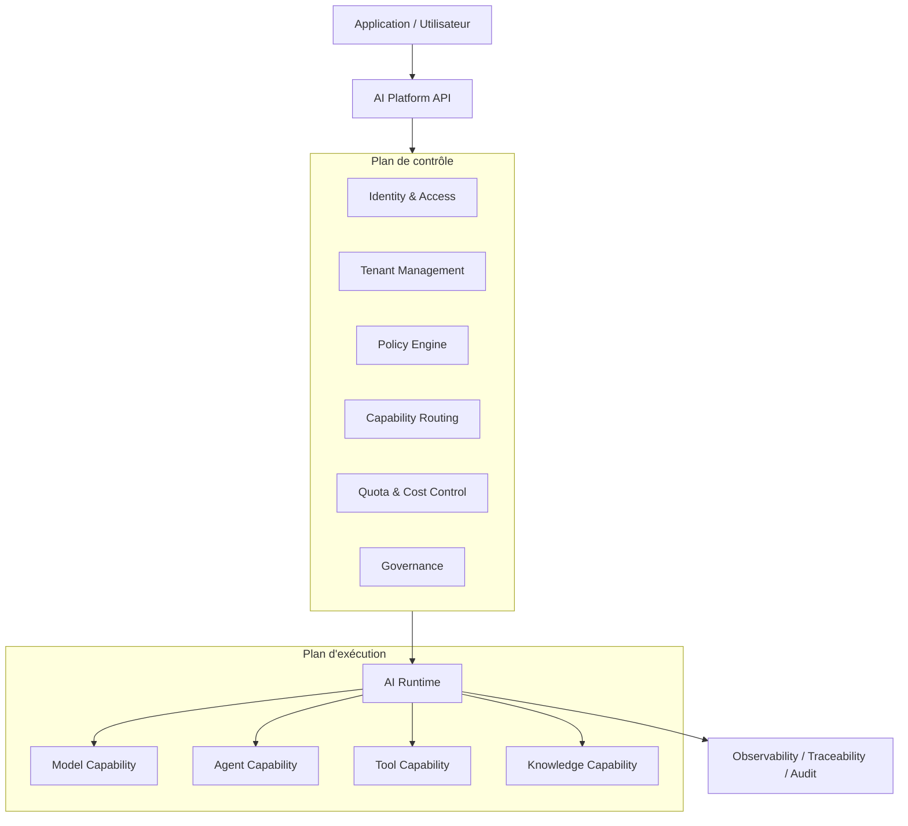

Le **plan de contrôle** détermine les conditions dans lesquelles une exécution peut avoir lieu.

Le **plan d'exécution** réalise cette exécution.

Cette séparation évite notamment de disperser les règles de gouvernance dans chaque agent, chaque workflow ou chaque application.

Le runtime exécute dans un cadre.

La plateforme définit ce cadre.

Cette différence devient également importante lorsqu'une plateforme doit supporter plusieurs mécanismes d'exécution.

Le runtime n'a alors plus besoin d'être confondu avec la plateforme elle-même.

Il devient une capacité derrière ses contrats.

---

## E- Le multi-tenant est d'abord un problème d'isolation

Le multi-tenant est parfois abordé principalement comme un problème de persistance.

Une donnée possède un `tenant_id`.

Les requêtes sont filtrées.

Le sujet semble traité.

Pour une plateforme IA, cette approche est insuffisante.

Un tenant peut disposer de ses propres utilisateurs, modèles autorisés, outils, documents, secrets, quotas, règles de sécurité et contraintes de souveraineté.

L'isolation doit donc traverser l'ensemble de l'exécution.

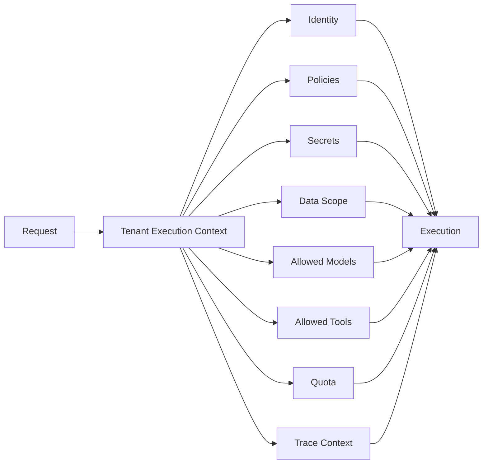

Le tenant devient ainsi une propriété du **contexte d'exécution**.

Ce contexte accompagne la requête lorsqu'elle traverse les différentes capacités de la plateforme.

Cette approche permet d'éviter qu'une isolation correcte au niveau du stockage soit contournée plus loin dans la chaîne par un outil, un modèle ou une source documentaire mal sélectionnés.

> **Dans une plateforme IA, le multi-tenant est moins un problème de stockage qu'un problème d'isolation de l'exécution.**

Cela ne signifie pas pour autant que tous les tenants doivent disposer d'une infrastructure dédiée.

L'isolation peut être adaptée au niveau de risque.

| Niveau     | Principe d'isolation                          |
| ---------- | --------------------------------------------- |
| Standard   | Ressources mutualisées avec isolation logique |
| Renforcé   | Données ou capacités d'exécution séparées     |
| Réglementé | Environnement ou infrastructure dédiée        |

Cette approche permet d'éviter deux extrêmes : tout mutualiser ou tout isoler physiquement.

L'architecture devient alors proportionnée au niveau de sensibilité du contexte.

---

## F- La souveraineté devient une politique de routage

Le routage multi-modèles est souvent présenté comme un problème d'optimisation.

On cherche le meilleur compromis entre qualité, latence, coût et disponibilité.

Ces critères restent importants.

Mais dans un environnement d'entreprise, ils ne suffisent pas.

Imaginons qu'un modèle externe fournisse de meilleures performances qu'un modèle hébergé sur une infrastructure interne.

Si les données traitées ne peuvent pas sortir d'un périmètre donné, la comparaison s'arrête là.

Le modèle théoriquement le plus performant n'est tout simplement pas une route autorisée.

La décision devient alors multidimensionnelle :

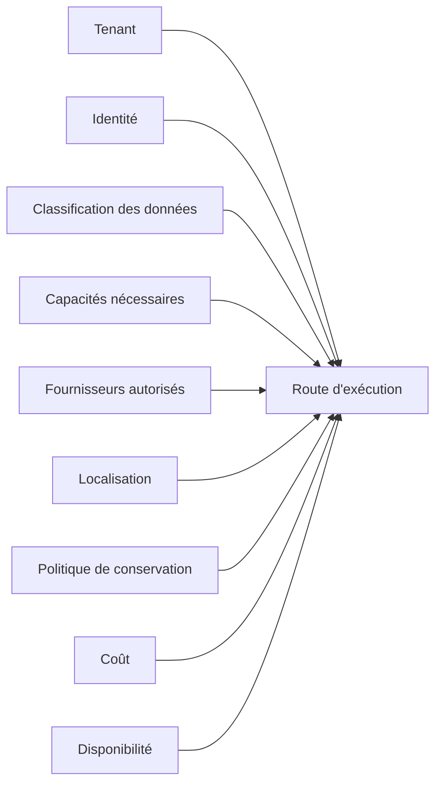

La souveraineté cesse ainsi d'être uniquement un choix d'infrastructure.

Elle devient une propriété de l'exécution.

Une donnée publique peut être autorisée à utiliser plusieurs fournisseurs.

Une donnée sensible peut imposer un modèle déployé sur une infrastructure maîtrisée.

Un tenant soumis à des exigences particulières peut disposer d'une liste beaucoup plus restrictive de modèles, de régions ou d'outils.

Cette approche donne également une autre dimension à la notion de LLM Gateway.

Son rôle ne devrait pas être réduit à répartir des appels entre plusieurs modèles.

Le routage peut devenir l'application concrète de politiques techniques, économiques, contractuelles et réglementaires.

---

## G- La résilience doit elle aussi être gouvernée

Les architectures distribuées disposent depuis longtemps de mécanismes de résilience : timeout, retry, circuit breaker, rate limiting, backpressure ou fallback.

Ces mécanismes restent nécessaires.

Mais leur application aux capacités IA doit parfois être revue.

Prenons le cas d'un fallback entre deux modèles.

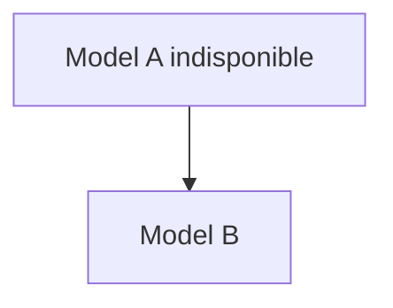

D'un point de vue purement technique, cette stratégie semble raisonnable.

Mais le modèle B peut avoir un comportement différent.

Son coût peut être plus élevé.

Son infrastructure d'hébergement peut être située ailleurs.

Ses politiques de conservation peuvent différer.

Le fallback n'est donc plus uniquement un mécanisme de disponibilité.

Il peut modifier les propriétés de l'exécution.

La décision devrait plutôt ressembler à ceci :

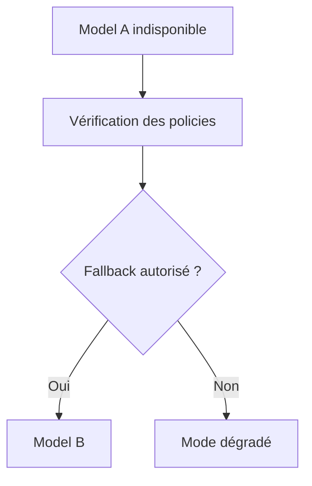

Cette distinction me semble importante.

> **Une plateforme résiliente ne cherche pas simplement une autre route. Elle cherche une autre route acceptable.**

Un mode dégradé peut parfois être préférable à un fallback qui violerait les contraintes définies pour le tenant.

La résilience ne doit pas devenir une porte permettant de contourner la gouvernance lorsque le système rencontre une défaillance.

---

## H- Observer l'infrastructure ne suffit plus

Une plateforme distribuée doit naturellement être observable.

Latence.

Disponibilité.

Erreurs.

Consommation.

Saturation.

Ces métriques permettent de comprendre la santé technique du système.

Mais elles ne suffisent pas toujours à répondre à une autre question :

> **Pourquoi cette exécution a-t-elle utilisé ce modèle, cet outil et cette source de données ?**

Pour cela, il faut pouvoir reconstruire la trajectoire de l'exécution.

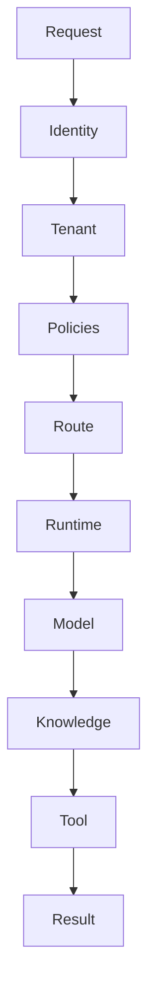

Cette trajectoire peut ensuite être enrichie avec le modèle réellement utilisé, sa version, le fournisseur, les appels d'outils, les décisions de politiques, les éventuels fallbacks, la latence, la consommation ou encore le coût.

Il devient alors utile de distinguer plusieurs niveaux d'observation.

Les **métriques** décrivent la santé globale.

Les **logs** décrivent les événements techniques.

Les **traces distribuées** reconstruisent le chemin emprunté par une requête entre plusieurs composants.

Les **traces d'exécution IA** apportent le contexte nécessaire pour comprendre comment les capacités ont été utilisées.

Enfin, l'**audit** répond à une autre question : qui a utilisé quelle capacité, dans quel contexte et sous quelle politique ?

Cette dernière dimension prend encore plus d'importance lorsque l'on introduit des comportements agentiques.

Observer uniquement les appels réseau permet de savoir où une requête est passée.

Cela ne permet pas nécessairement de comprendre pourquoi certaines décisions ont été prises.

L'observabilité d'une plateforme IA doit donc progressivement aller au-delà de l'état de l'infrastructure pour atteindre la **trajectoire de décision du système**.

---

## I- Centraliser le contrôle ne signifie pas centraliser toute l'exécution

Une question apparaît ensuite naturellement : faut-il un runtime central ?

Une première approche consiste à faire transiter toutes les exécutions par un même moteur.

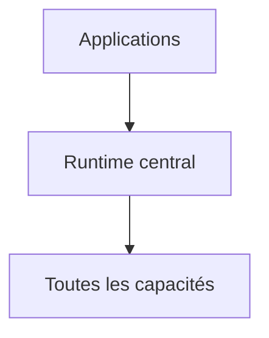

Cette architecture peut apporter beaucoup de cohérence.

Mais à mesure que les workloads se diversifient, ce runtime peut progressivement devenir un point de couplage important.

Une autre approche consiste à centraliser principalement les politiques et les contrats de la plateforme.

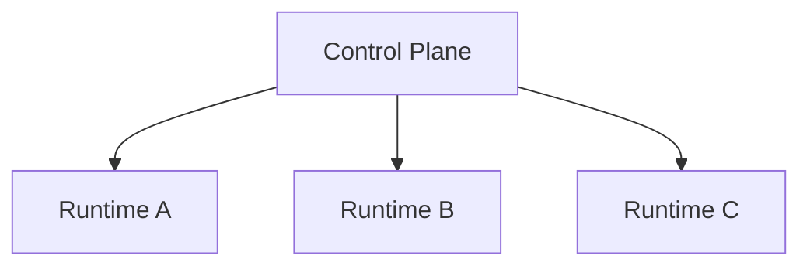

Chaque runtime peut alors être adapté à un type de workload, à un environnement ou à un niveau d'isolation particulier.

Les implémentations diffèrent.

Les règles de gouvernance restent communes.

Cette approche me semble particulièrement intéressante lorsqu'une plateforme doit évoluer avec plusieurs équipes ou plusieurs types de systèmes IA.

> **Centraliser la gouvernance ne signifie pas nécessairement centraliser tous les workloads.**

Le plan de contrôle peut être cohérent sans imposer une uniformité totale au plan d'exécution.

C'est précisément l'une des raisons pour lesquelles les adapters et les contrats de plateforme deviennent importants.

Ils permettent d'accepter une certaine diversité d'implémentation sans perdre la cohérence de l'ensemble.

---

## J- Une architecture de référence, pas un blueprint universel

En regroupant ces principes, on peut représenter une architecture cible de cette manière :

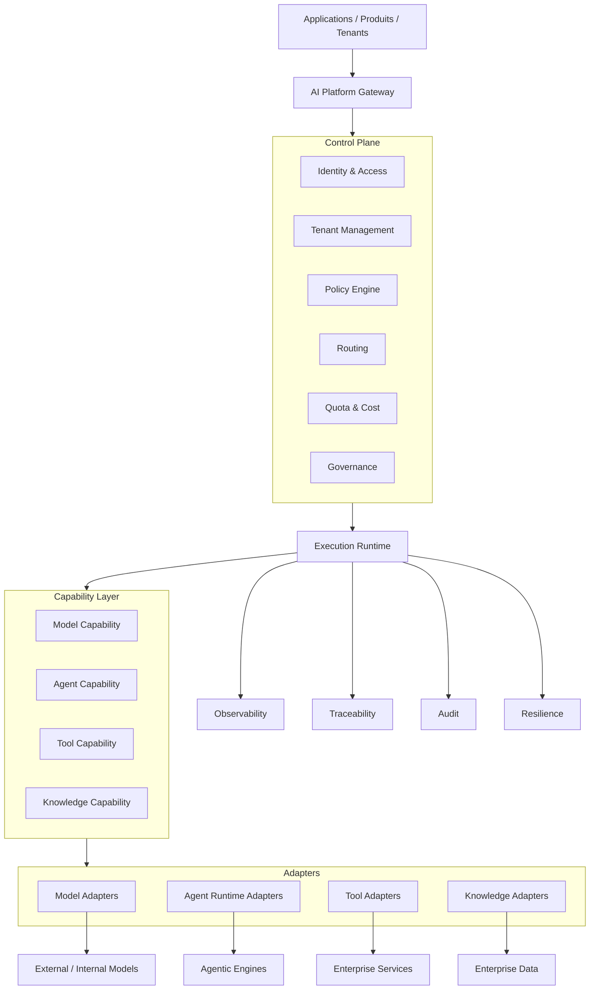

Je considère volontairement ce schéma comme une **architecture de référence**.

Pas comme un blueprint qu'il faudrait reproduire composant par composant.

Une plateforme supportant deux cas d'usage n'a probablement pas besoin du même niveau de sophistication qu'une plateforme utilisée par plusieurs dizaines d'équipes.

De la même manière, tous les projets n'ont pas immédiatement besoin d'un moteur de politiques complexe, de plusieurs runtimes ou de plusieurs niveaux d'isolation.

L'industrialisation ne doit pas devenir une justification pour surarchitecturer un système.

Le bon niveau d'architecture dépend des points de variabilité réellement observés.

Si un fournisseur unique répond durablement au besoin, une couche d'abstraction complexe peut être inutile.

Si plusieurs modèles, environnements ou niveaux de souveraineté cohabitent déjà, la frontière devient beaucoup plus pertinente.

Même raisonnement pour les runtimes, les outils ou les systèmes de connaissance.

Une architecture industrielle n'est pas celle qui contient le plus de couches.

C'est celle qui rend explicites les frontières dont le système a réellement besoin.

---

## K- Ce que la plateforme doit finalement protéger

Après avoir parlé de runtime, d'adapters, de multi-tenant ou de routage, il est utile de revenir à l'essentiel.

Une plateforme IA ne devrait probablement pas chercher en priorité à protéger une technologie.

Elle devrait protéger certaines propriétés du système.

Le **découplage**, pour permettre aux implémentations d'évoluer sans transformer l'ensemble de l'architecture.

L'**isolation**, pour empêcher un tenant, une donnée ou une exécution de sortir de son périmètre autorisé.

Le **contrôle**, pour que les décisions structurantes restent portées par la plateforme et non dispersées dans chaque intégration.

La **résilience**, pour continuer à fonctionner sans contourner les règles définies.

L'**observabilité**, pour comprendre la santé technique et opérationnelle du système.

La **traçabilité**, pour reconstruire pourquoi une route, un modèle, un outil ou une donnée ont été utilisés.

Ces propriétés sont finalement beaucoup plus durables que les technologies utilisées pour les implémenter.

---

## Conclusion

À petite échelle, connecter directement une application à un modèle, un outil ou un framework peut être parfaitement raisonnable.

Il ne faut probablement pas commencer chaque projet IA en construisant une plateforme.

Le problème apparaît lorsque plusieurs produits, équipes, modèles, agents, outils, données et niveaux de sensibilité commencent à cohabiter.

À ce moment-là, le choix déterminant n'est plus seulement celui du meilleur modèle ou du runtime le plus avancé.

Le problème devient architectural.

Il faut déterminer ce que la plateforme possède.

Ce qu'elle délègue.

Ce qu'elle standardise.

Et surtout quelles frontières elle refuse de laisser dépendre d'une implémentation particulière.

Les adapters permettent de protéger ces frontières.

Le plan de contrôle porte les politiques.

Le runtime exécute.

Le contexte tenant porte l'isolation.

Le routage applique les contraintes de souveraineté.

La résilience recherche une route acceptable plutôt qu'une route simplement disponible.

L'observabilité et la traçabilité rendent enfin les exécutions compréhensibles et vérifiables.

Les modèles continueront à évoluer.

Les runtimes agentiques également.

Les protocoles et les outils changeront.

Une plateforme bien conçue doit pouvoir absorber une partie de ces évolutions sans perdre les propriétés fondamentales sur lesquelles repose son fonctionnement.

C'est probablement là que se situe l'enjeu principal de l'industrialisation.

Pas uniquement dans notre capacité à intégrer davantage de modèles, d'agents ou d'outils.

Mais dans notre capacité à continuer à maîtriser le système lorsque ces capacités deviennent nombreuses, distribuées et de plus en plus autonomes.

> **Industrialiser l'IA ne consiste pas seulement à multiplier les capacités. Il s'agit surtout de conserver le contrôle à mesure que ces capacités se multiplient.**
