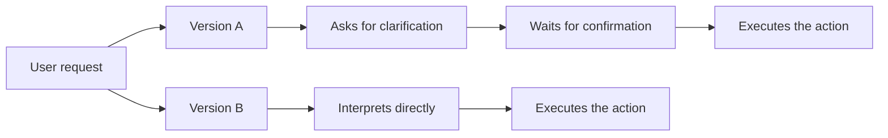
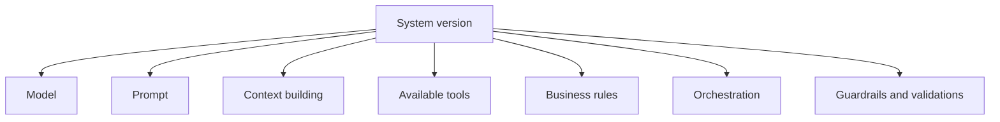
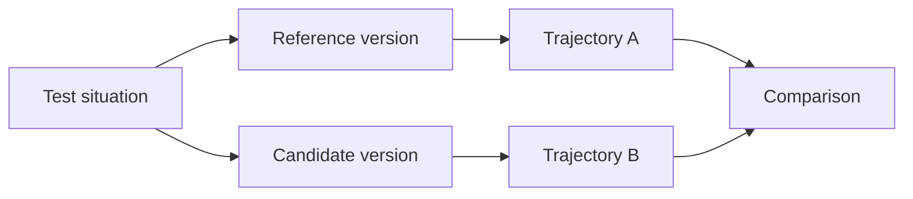
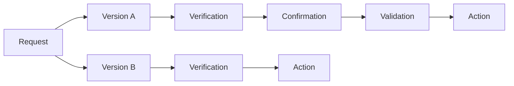
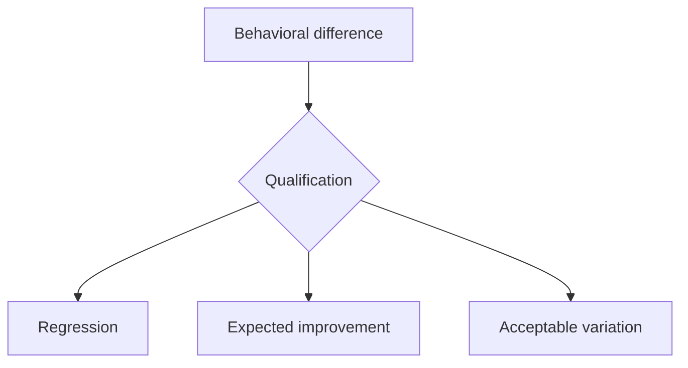
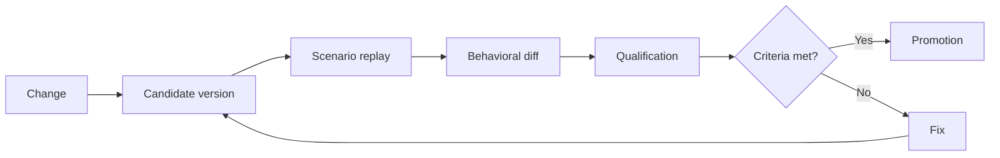

# Comparing Two Versions of an LLM System

## Identifying and Qualifying Behavioral Changes When a Model, Prompt, Tool, or Rule Evolves

Evolving an application built on LLM capabilities is rarely an isolated change.

We switch models. We adjust a prompt. We modify how context is built. We add a tool. We change an orchestration rule. We tighten a validation policy.

Technically, everything can keep working.

Integration tests pass. The APIs respond. Tools are called correctly. A few manual checks even give the impression that the new version is better.

Yet its behavior may have changed.

It may ask for clarification less often. Use a tool earlier. Accept a situation that used to be refused. Escalate to a human more readily. Apply a business rule differently. Or reach the same final result through a different decision trajectory.

This is precisely where comparing two versions becomes an engineering concern.

It is not about checking that two versions produce the same sentences.

It is about identifying **what changed in how they decide**, then determining whether that change is an improvement, an acceptable variation, or a regression.

---

## A New Version Does Not Only Change the Response

Take an application using LLM capabilities to handle a business request.

The first version receives an ambiguous request and chooses to ask for confirmation.

The second version, after an update to the model or the prompt, judges that it has enough information and proceeds directly.

Both versions can produce perfectly coherent responses.

But their behavior is no longer the same.



If we compare only the final wording, this difference can go unnoticed.

If we observe the intermediate decisions, it becomes immediately visible.

This is a direct continuation of the principle covered in <a href="/en/blog/tester-les-decisions" target="_blank" rel="noopener noreferrer">the previous article</a>: testing decisions rather than wording.

Once these decisions become observable and testable, they also become comparable across two versions.

---

## A System Version Is Not Just the Model

When behavior changes, the first instinct is often to look at the model.

Yet, in an application using LLM capabilities, the model is only one of the elements involved in the decision.

Observable behavior can be influenced by several components:



Changing the model can obviously alter the reasoning or the choices made.

But a prompt change can have the same effect.

A new rule in the orchestration code can change the priority between two tools. A change in the context can make certain information more visible. A modification to a tool can change the data available at decision time.

Comparing two versions, then, amounts to comparing **two complete system configurations**.

For example:

```text
Version A
model: model-v1
prompt: prompt-v12
tools: tools-v4
policies: policies-v3
orchestration: workflow-v7
```

versus:

```text
Version B
model: model-v2
prompt: prompt-v13
tools: tools-v4
policies: policies-v4
orchestration: workflow-v8
```

This distinction matters.

Otherwise, a regression observed after a model change risks being attributed to the model, when it actually came from a change to the prompt, the context, or a rule applied downstream.

---

## Replaying the Same Situations

To compare two versions, we first need to present them with the same situations.

The principle looks simple:



The reference version represents the currently accepted behavior.

The candidate version contains the change we want to introduce.

Both versions are run from:

* the same request;
* the same business context;
* the same available data whenever possible;
* the same preconditions;
* the same evaluation scenario.

The goal is not to make execution fully deterministic.

With an LLM, some variability will remain.

The goal is to make **the comparison framework stable enough that the observed differences carry meaning**.

---

## Comparing Decisions, Not Text

Suppose both versions reply:

**Version A**

> I need your confirmation before proceeding.

**Version B**

> Can you confirm this operation before it is executed?

The wording is different.

The behavior, however, is identical:

```text
Decision: ASK_FOR_CONFIRMATION
```

Conversely, two responses can be close in wording while conveying two different decisions.

```text
Version A
Decision: ASK_FOR_CONFIRMATION
Action: NONE
```

```text
Version B
Decision: EXECUTE
Action: CALL_PAYMENT_TOOL
```

The produced text is therefore not the right level of comparison.

For each scenario, it is more useful to observe elements such as:

```text
decision
selected_route
tool_calls
applied_rules
validation_required
human_escalation
business_state
final_action
```

This gives a representation much closer to the system's actual behavior.

---

## Comparing the Decision Trajectory Too

The final decision is not always enough.

Two versions can reach exactly the same result while following different paths.

Take a system that must modify sensitive data.

Version A follows this trajectory:

```text
Interpretation
    ↓
Data verification
    ↓
Confirmation request
    ↓
Validation
    ↓
Modification
```

Version B follows this one:

```text
Interpretation
    ↓
Data verification
    ↓
Modification
```

The final result can be identical: the data is correctly modified.

A test based solely on the final result would declare both versions equivalent.

Yet the second version dropped a validation step.



This difference can be insignificant in some domains.

In others, it can be a critical regression.

This is why comparison should, as much as possible, focus on **the decision trajectory**, not only on its outcome.

---

## A Difference Is Not Automatically a Regression

Detecting a difference is relatively simple.

Qualifying it matters far more.

When a candidate version behaves differently from the reference version, three broad situations can arise.



A difference can be an **improvement**.

For example, the new version asks for clarification when it detects an ambiguity the old version used to ignore.

It can also be an **acceptable variation**.

Two equivalent tools may be selected without changing the business outcome or violating a constraint.

Finally, it can be a **regression**.

For example, the system now executes an action without asking for the required validation.

The question, then, is not:

> Are the two versions identical?

But rather:

> Are the differences introduced by the new version compatible with the system's expected behavior?

---

## Behavioral Invariants Provide a Reference Point

This is where <a href="/en/blog/les-invariants-comportementaux" target="_blank" rel="noopener noreferrer">behavioral invariants</a> defined earlier in this series become essential.

Take the following invariant:

```text
INV-04
Every irreversible operation requires
explicit confirmation from the user.
```

The reference version upholds this invariant:

```text
Request
→ analysis
→ proposal
→ confirmation
→ execution
```

The new version produces:

```text
Request
→ analysis
→ execution
```

It is no longer enough to simply say:

> "The new version seems more aggressive."

We can state the problem precisely:

```text
Scenario: S-047

Version A
Decision: ASK_FOR_CONFIRMATION
Action: NONE

Version B
Decision: EXECUTE
Action: payment.execute

Invariant:
INV-04

Classification:
REGRESSION
```

The difference then becomes actionable for a team.

It can be tested, documented, discussed, and used as a validation criterion before deployment.

---

## Building a Behavioral Diff

This logic naturally leads to producing what we might call a **behavioral diff**.

The idea is close to the diff we have long used to compare two versions of code.

But here, it is the system's decisions that are being compared.

```text
Scenario: S-102

Input:
Ambiguous refund request

Version A:
route: HUMAN_REVIEW
tool: none
decision: ESCALATE

Version B:
route: REFUND
tool: refund.create
decision: EXECUTE

Difference:
route changed
tool usage changed
final decision changed

Invariant:
INV-07 — ambiguous refund requests require review

Qualification:
REGRESSION
```

A behavioral diff should let us quickly answer four questions:

1. **What changed?**
2. **Under which situations?**
3. **Which rule or invariant is involved?**
4. **Is the change acceptable?**

This turns an impression that is hard to analyze into engineering information.

---

## Not Every Difference Carries the Same Weight

Another difficulty appears quickly as the number of scenarios grows.

A single change can introduce dozens, even hundreds, of differences.

They do not all deserve the same level of attention.

We can, for example, distinguish:

```text
LOW
Wording variation or an equivalent choice.

MEDIUM
A strategy change with no impact
on a critical invariant.

HIGH
A business decision changes.

CRITICAL
Violation of a security, compliance,
or human-validation invariant.
```

This qualification helps avoid two extremes.

The first is treating every difference as an anomaly.

That quickly makes comparisons unusable.

The second is accepting every variation on the grounds that an LLM is non-deterministic.

That amounts to giving up control over the system's behavior.

The challenge, then, is to accept variability where it has no consequence, while staying strict on the decisions that genuinely commit the system.

---

## The Overall Score Can Mask a Regression

Suppose we now run 1,000 scenarios.

The reference version meets the expected behavior in 91% of cases.

The new version reaches 94%.

At first glance, the conclusion seems obvious:

```text
Version A: 91%
Version B: 94%
```

The new version looks better.

But look at the results by behavioral surface:

```text
General requests
A: 88%
B: 96%

Document search
A: 90%
B: 95%

Sensitive payments
A: 100%
B: 91%
```

The overall score improves.

Yet one critical surface regresses.

This is an important illustration of a principle we have already encountered in this series: **behavior must be observed by surface, by decision, and by invariant, not only through a global average**.

A statistical improvement can mask a much more significant functional regression.

---

## Comparison Becomes a Validation Mechanism

From here, comparing two versions is no longer about running a few prompts before and after a change.

It becomes a step in the system's evolution cycle.



A change can then be promoted if:

* critical invariants remain upheld;
* identified regressions are understood;
* significant differences have been qualified;
* acceptable variations have been documented;
* sensitive surfaces do not degrade beyond defined thresholds.

Changing the model, the prompt, or the orchestration then stops being an operation that is hard to evaluate.

It becomes a change whose behavioral consequences can be measured.

---

## Not Seeking Identity Between Two Versions

The goal, however, is not to freeze the system.

An application built on LLM capabilities must be able to evolve.

A new model may understand certain requests better. A prompt may reduce ambiguity. A new orchestration may avoid unnecessary tool calls. A new rule may improve security.

Trying to reproduce every behavior of the old version exactly would block some of these improvements.

The right question, then, is not:

> How do we prevent behavior from changing?

It is rather:

> How do we make changes visible enough to decide which ones we want to accept?

This nuance matters.

A behavioral baseline is not meant to keep the system motionless.

It exists to make its evolution **observable, comparable, and manageable**.

---

## Comparison Requires Representative Situations

But one difficulty remains.

A comparison can be perfectly instrumented and still lead to the wrong conclusions if it relies on a poor set of scenarios.

Testing only simple cases will give a falsely reassuring picture.

Testing only failure cases will give an artificially pessimistic picture.

Using scenarios built solely by the team can also leave out situations actually encountered in production.

The quality of the comparison, then, depends directly on the quality of the evaluation set used to run it.

That is the next logical step.

---

## Conclusion

In the first part of this series, we set out to understand the behavior of systems built on LLM capabilities:

1. [**Freezing the Behavior of an LLM System Before Evolving It**](/en/blog/figer-comportement-systeme-llm), to establish a baseline;
2. [**Observe Before Optimizing**](/en/blog/observer-avant-doptimiser), to make visible the elements that produce this behavior;
3. [**Decision Trajectory**](/en/blog/la-trajectoire-de-decision), to reconstruct the path between the request and the action;
4. [**Behavioral Surfaces**](/en/blog/les-surfaces-comportementales), to identify the areas where the system can vary or regress.

The second part now looks at how to **test and compare this behavior**.

We started by <a href="/en/blog/les-invariants-comportementaux" target="_blank" rel="noopener noreferrer">defining behavioral invariants</a>, to identify what must remain true despite these changes.

We then saw why it is better to <a href="/en/blog/tester-les-decisions" target="_blank" rel="noopener noreferrer">test decisions rather than wording</a>, so as not to confuse linguistic variation with an actual behavioral change.

Comparing two versions adds one more step: making the differences introduced by a change visible, then qualifying them.

The change is then no longer just observed.

It becomes explainable.

And, above all, it becomes possible to decide whether that change should be accepted.

The next difficulty is now knowing which situations to run this comparison on.

That is precisely the subject of the next article:

**Building a Representative Evaluation Set.**
