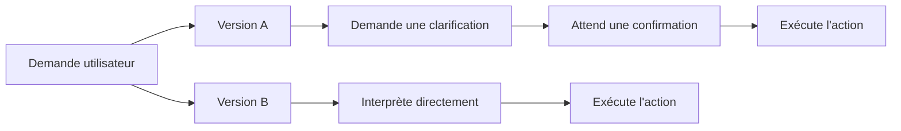
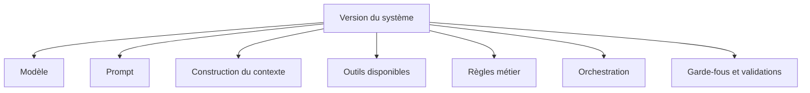
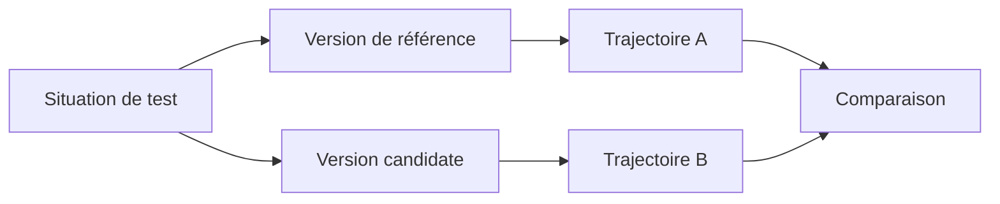
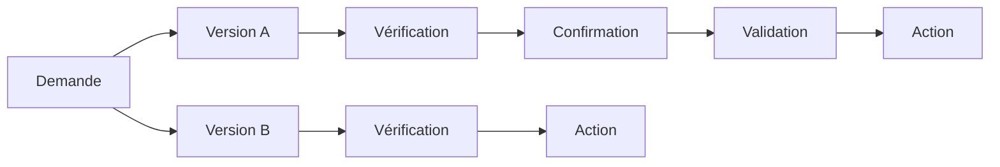
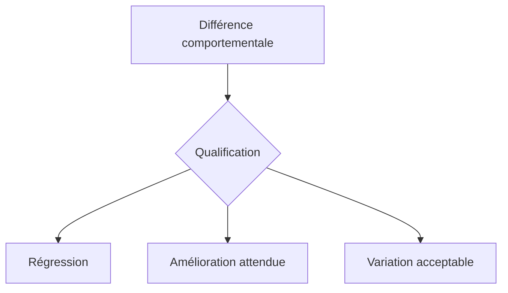
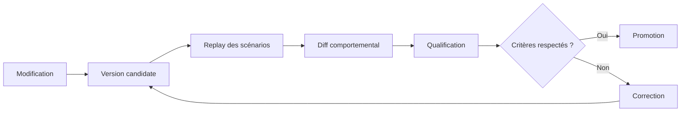

# Comparer deux versions d'un système LLM

## Identifier et qualifier les changements de comportement lorsqu'un modèle, un prompt, un outil ou une règle évolue

Faire évoluer une application intégrant les capacités d'un LLM est rarement une modification isolée.

On change de modèle. On ajuste un prompt. On modifie la construction du contexte. On ajoute un outil. On change une règle d'orchestration. On renforce une politique de validation.

Techniquement, tout peut continuer à fonctionner.

Les tests d'intégration passent. Les API répondent. Les outils sont correctement appelés. Quelques tests manuels donnent même l'impression que la nouvelle version est meilleure.

Pourtant, son comportement peut avoir changé.

Elle peut demander moins souvent une clarification. Utiliser un outil plus tôt. Accepter une situation auparavant refusée. Escalader davantage vers un humain. Appliquer différemment une règle métier. Ou arriver au même résultat final en empruntant une trajectoire de décision différente.

C'est précisément là que la comparaison entre deux versions devient un sujet d'ingénierie.

Il ne s'agit pas de vérifier que deux versions produisent les mêmes phrases.

Il s'agit d'identifier **ce qui a changé dans leur manière de décider**, puis de déterminer si ce changement constitue une amélioration, une variation acceptable ou une régression.

---

## Une nouvelle version ne change pas seulement la réponse

Prenons une application utilisant les capacités d'un LLM pour traiter une demande métier.

La première version reçoit une demande ambiguë et choisit de demander une confirmation.

La seconde version, après une évolution du modèle ou du prompt, estime disposer de suffisamment d'informations et poursuit directement le traitement.

Les deux versions peuvent produire des réponses parfaitement cohérentes.

Mais leur comportement n'est plus le même.



Si l'on compare uniquement les formulations finales, cette différence peut passer inaperçue.

Si l'on observe les décisions intermédiaires, elle devient immédiatement visible.

C'est la continuité directe du principe abordé dans <a href="/fr/blog/tester-les-decisions" target="_blank" rel="noopener noreferrer">l'article précédent</a> : tester les décisions plutôt que les formulations.

Une fois que ces décisions deviennent observables et testables, elles deviennent aussi comparables entre deux versions.

---

## Une version du système ne se résume pas au modèle

Lorsqu'un comportement change, le premier réflexe consiste souvent à regarder le modèle.

Pourtant, dans une application utilisant les capacités d'un LLM, le modèle n'est qu'un des éléments qui participent à la décision.

Le comportement observable peut être influencé par plusieurs composants :



Changer de modèle peut évidemment modifier le raisonnement ou les choix réalisés.

Mais un changement de prompt peut avoir le même effet.

Une nouvelle règle dans le code d'orchestration peut modifier la priorité entre deux outils. Une évolution du contexte peut rendre certaines informations plus visibles. Une modification d'un outil peut changer les données disponibles au moment de la décision.

Comparer deux versions revient donc à comparer **deux configurations complètes du système**.

Par exemple :

```text
Version A
model: model-v1
prompt: prompt-v12
tools: tools-v4
policies: policies-v3
orchestration: workflow-v7
```

avec :

```text
Version B
model: model-v2
prompt: prompt-v13
tools: tools-v4
policies: policies-v4
orchestration: workflow-v8
```

Cette distinction est importante.

Sinon, une régression observée après un changement de modèle risque d'être attribuée au modèle alors qu'elle provient en réalité d'une modification du prompt, du contexte ou d'une règle appliquée en aval.

---

## Rejouer les mêmes situations

Pour comparer deux versions, il faut commencer par leur présenter les mêmes situations.

Le principe paraît simple :



La version de référence représente le comportement actuellement accepté.

La version candidate contient l'évolution que l'on souhaite introduire.

Les deux versions sont exécutées à partir :

* de la même demande ;
* du même contexte métier ;
* des mêmes données disponibles lorsque cela est possible ;
* des mêmes préconditions ;
* du même scénario d'évaluation.

L'objectif n'est pas de rendre l'exécution totalement déterministe.

Avec un LLM, une part de variabilité restera possible.

L'objectif est de rendre **le cadre de comparaison suffisamment stable pour que les différences observées aient un sens**.

---

## Comparer les décisions, pas les textes

Supposons que les deux versions répondent :

**Version A**

> Je dois obtenir votre confirmation avant de poursuivre.

**Version B**

> Pouvez-vous confirmer cette opération avant son exécution ?

Les formulations sont différentes.

Le comportement est pourtant identique :

```text
Decision: ASK_FOR_CONFIRMATION
```

À l'inverse, deux réponses peuvent être proches dans leur formulation tout en traduisant deux décisions différentes.

```text
Version A
Decision: ASK_FOR_CONFIRMATION
Action: NONE
```

```text
Version B
Decision: EXECUTE
Action: CALL_PAYMENT_TOOL
```

Le texte produit n'est donc pas le bon niveau de comparaison.

Pour chaque scénario, il est plus utile d'observer des éléments comme :

```text
decision
selected_route
tool_calls
applied_rules
validation_required
human_escalation
business_state
final_action
```

On obtient alors une représentation beaucoup plus proche du comportement réel du système.

---

## Comparer aussi la trajectoire de décision

La décision finale ne suffit pas toujours.

Deux versions peuvent arriver exactement au même résultat tout en suivant des chemins différents.

Prenons un système qui doit modifier une donnée sensible.

La version A suit cette trajectoire :

```text
Interprétation
    ↓
Vérification des données
    ↓
Demande de confirmation
    ↓
Validation
    ↓
Modification
```

La version B suit celle-ci :

```text
Interprétation
    ↓
Vérification des données
    ↓
Modification
```

Le résultat final peut être identique : la donnée est correctement modifiée.

Un test basé uniquement sur le résultat final déclarerait les deux versions équivalentes.

Pourtant, la seconde version a supprimé une étape de validation.



Cette différence peut être insignifiante dans certains domaines.

Dans d'autres, elle peut constituer une régression critique.

C'est pourquoi la comparaison doit porter autant que possible sur **la trajectoire de décision**, et pas uniquement sur son résultat.

---

## Une différence n'est pas automatiquement une régression

Détecter une différence est relativement simple.

La qualifier est beaucoup plus important.

Lorsqu'une version candidate se comporte différemment de la version de référence, trois grandes situations peuvent apparaître.



Une différence peut être une **amélioration**.

Par exemple, la nouvelle version demande une clarification lorsqu'elle détecte une ambiguïté que l'ancienne version ignorait.

Elle peut aussi représenter une **variation acceptable**.

Deux outils équivalents peuvent être sélectionnés sans modifier le résultat métier ni enfreindre une contrainte.

Enfin, elle peut constituer une **régression**.

Par exemple, le système exécute désormais une action sans demander la validation exigée.

La question n'est donc pas :

> Les deux versions sont-elles identiques ?

Mais plutôt :

> Les différences introduites par la nouvelle version sont-elles compatibles avec le comportement attendu du système ?

---

## Les invariants comportementaux donnent un point de référence

C'est ici que <a href="/fr/blog/les-invariants-comportementaux" target="_blank" rel="noopener noreferrer">les invariants comportementaux</a> définis précédemment dans cette série prennent toute leur importance.

Prenons l'invariant suivant :

```text
INV-04
Toute opération irréversible nécessite
une confirmation explicite de l'utilisateur.
```

La version de référence respecte cet invariant :

```text
Demande
→ analyse
→ proposition
→ confirmation
→ exécution
```

La nouvelle version produit :

```text
Demande
→ analyse
→ exécution
```

Il ne s'agit plus simplement d'affirmer que :

> « La nouvelle version semble plus agressive. »

On peut formuler précisément le problème :

```text
Scenario: S-047

Version A
Decision: ASK_FOR_CONFIRMATION
Action: NONE

Version B
Decision: EXECUTE
Action: payment.execute

Invariant:
INV-04

Classification:
REGRESSION
```

La différence devient alors exploitable par une équipe.

Elle peut être testée, documentée, discutée et utilisée comme critère de validation avant déploiement.

---

## Construire un diff comportemental

Cette logique conduit naturellement à produire ce que l'on peut appeler un **diff comportemental**.

L'idée est proche du diff que nous utilisons depuis longtemps pour comparer deux versions de code.

Mais ici, ce sont les décisions du système qui sont comparées.

```text
Scenario: S-102

Input:
Demande de remboursement ambiguë

Version A:
route: HUMAN_REVIEW
tool: none
decision: ESCALATE

Version B:
route: REFUND
tool: refund.create
decision: EXECUTE

Difference:
route changed
tool usage changed
final decision changed

Invariant:
INV-07 — ambiguous refund requests require review

Qualification:
REGRESSION
```

Le diff comportemental doit permettre de répondre rapidement à quatre questions :

1. **Qu'est-ce qui a changé ?**
2. **Dans quelles situations ?**
3. **Quelle règle ou quel invariant est concerné ?**
4. **Le changement est-il acceptable ?**

On transforme ainsi une impression difficile à analyser en information d'ingénierie.

---

## Toutes les différences n'ont pas la même importance

Une autre difficulté apparaît rapidement lorsque le nombre de scénarios augmente.

Une évolution peut introduire des dizaines, voire des centaines de différences.

Toutes ne méritent pas le même niveau d'attention.

On peut par exemple distinguer :

```text
LOW
Variation de formulation ou choix équivalent.

MEDIUM
Modification d'une stratégie sans impact
sur un invariant critique.

HIGH
Changement de décision métier.

CRITICAL
Violation d'un invariant de sécurité,
de conformité ou de validation humaine.
```

Cette qualification permet d'éviter deux extrêmes.

Le premier consiste à considérer toute différence comme une anomalie.

Cela rend rapidement les comparaisons inutilisables.

Le second consiste à accepter toutes les variations sous prétexte qu'un LLM est non déterministe.

Cela revient à renoncer à contrôler le comportement du système.

L'enjeu consiste donc à accepter la variabilité là où elle est sans conséquence, tout en restant strict sur les décisions qui engagent réellement le système.

---

## Le score global peut masquer une régression

Supposons maintenant que l'on exécute 1 000 scénarios.

La version de référence respecte le comportement attendu dans 91 % des cas.

La nouvelle version atteint 94 %.

À première vue, la conclusion semble évidente :

```text
Version A : 91 %
Version B : 94 %
```

La nouvelle version paraît meilleure.

Mais observons les résultats par surface comportementale :

```text
Demandes générales
A : 88 %
B : 96 %

Recherche documentaire
A : 90 %
B : 95 %

Paiements sensibles
A : 100 %
B : 91 %
```

Le score global s'améliore.

Pourtant, une surface critique régresse.

C'est une illustration importante d'un principe déjà rencontré dans cette série : **le comportement doit être observé par surface, par décision et par invariant, pas uniquement à travers une moyenne globale**.

Une amélioration statistique peut masquer une régression fonctionnelle beaucoup plus importante.

---

## La comparaison devient un mécanisme de validation

À partir de là, comparer deux versions ne consiste plus à lancer quelques prompts avant et après une modification.

Cela devient une étape du cycle d'évolution du système.



Une évolution peut alors être promue si :

* les invariants critiques restent respectés ;
* les régressions identifiées sont comprises ;
* les différences importantes ont été qualifiées ;
* les variations acceptables ont été documentées ;
* les surfaces sensibles ne se dégradent pas au-delà des seuils définis.

Le changement de modèle, de prompt ou d'orchestration cesse alors d'être une opération difficile à évaluer.

Il devient une modification dont on peut mesurer les conséquences comportementales.

---

## Ne pas chercher l'identité entre deux versions

L'objectif n'est toutefois pas de figer le système.

Une application intégrant les capacités d'un LLM doit pouvoir évoluer.

Un nouveau modèle peut mieux comprendre certaines demandes. Un prompt peut réduire les ambiguïtés. Une nouvelle orchestration peut éviter des appels d'outils inutiles. Une nouvelle règle peut améliorer la sécurité.

Chercher à reproduire exactement chaque comportement de l'ancienne version empêcherait une partie de ces améliorations.

La bonne question n'est donc pas :

> Comment empêcher le comportement de changer ?

Elle est plutôt :

> Comment rendre les changements suffisamment visibles pour décider lesquels nous voulons accepter ?

Cette nuance est importante.

Une baseline comportementale n'est pas destinée à rendre le système immobile.

Elle sert à rendre son évolution **observable, comparable et maîtrisable**.

---

## Comparer nécessite des situations représentatives

Mais une difficulté reste entière.

Une comparaison peut être parfaitement instrumentée et pourtant conduire à de mauvaises conclusions si elle repose sur un mauvais ensemble de scénarios.

Tester uniquement les cas simples donnera une image rassurante.

Tester uniquement les erreurs donnera une image artificiellement pessimiste.

Utiliser des scénarios construits uniquement par l'équipe peut également laisser de côté certaines situations réellement rencontrées en production.

La qualité de la comparaison dépend donc directement de la qualité du jeu d'évaluation utilisé pour l'exécuter.

C'est la prochaine étape logique.

---

## Conclusion

Dans la première partie de cette série, nous avons cherché à comprendre le comportement des systèmes intégrant les capacités des LLM :

1. [**Figer le comportement d'un système LLM avant de le faire évoluer**](/fr/blog/figer-comportement-systeme-llm), pour disposer d'une baseline ;
2. [**Observer avant d'optimiser**](/fr/blog/observer-avant-doptimiser), pour rendre visibles les éléments qui produisent ce comportement ;
3. [**La trajectoire de décision**](/fr/blog/la-trajectoire-de-decision), pour reconstruire le chemin suivi entre la demande et l'action ;
4. [**Les surfaces comportementales**](/fr/blog/les-surfaces-comportementales), pour identifier les zones où le système peut varier ou régresser.

La deuxième partie s'intéresse maintenant à la manière de **tester et comparer ce comportement**.

Nous avons commencé par <a href="/fr/blog/les-invariants-comportementaux" target="_blank" rel="noopener noreferrer">définir les invariants comportementaux</a>, afin d'identifier ce qui doit rester vrai malgré les évolutions.

Nous avons ensuite vu pourquoi il est préférable de <a href="/fr/blog/tester-les-decisions" target="_blank" rel="noopener noreferrer">tester les décisions plutôt que les formulations</a>, afin de ne pas confondre variation linguistique et changement réel de comportement.

Comparer deux versions ajoute une étape supplémentaire : rendre visibles les différences introduites par une évolution, puis les qualifier.

Le changement n'est alors plus seulement constaté.

Il devient explicable.

Et surtout, il devient possible de décider si ce changement doit être accepté.

La prochaine difficulté est désormais de savoir sur quelles situations effectuer cette comparaison.

C'est précisément l'objet du prochain article :

**Construire un jeu d'évaluation représentatif.**
