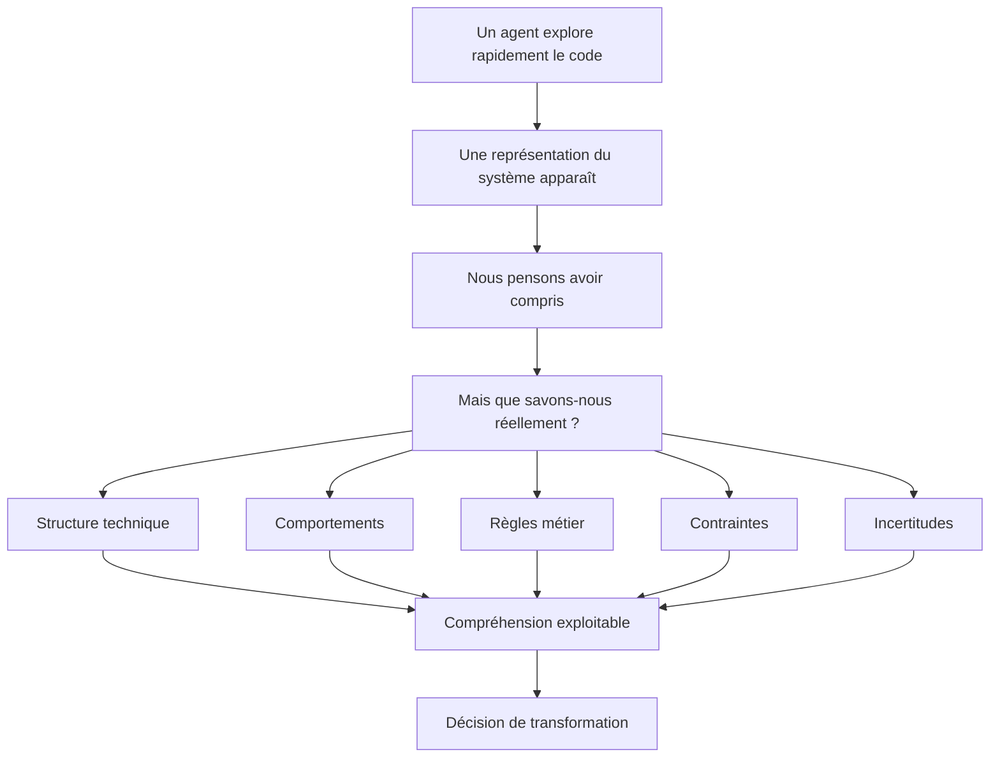
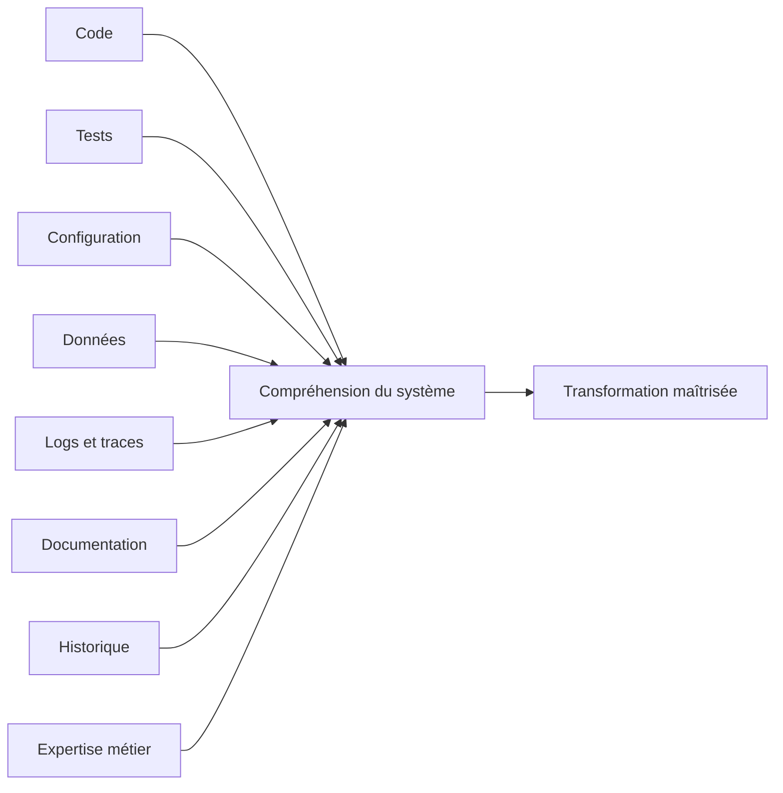
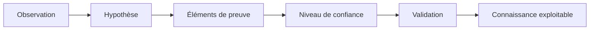
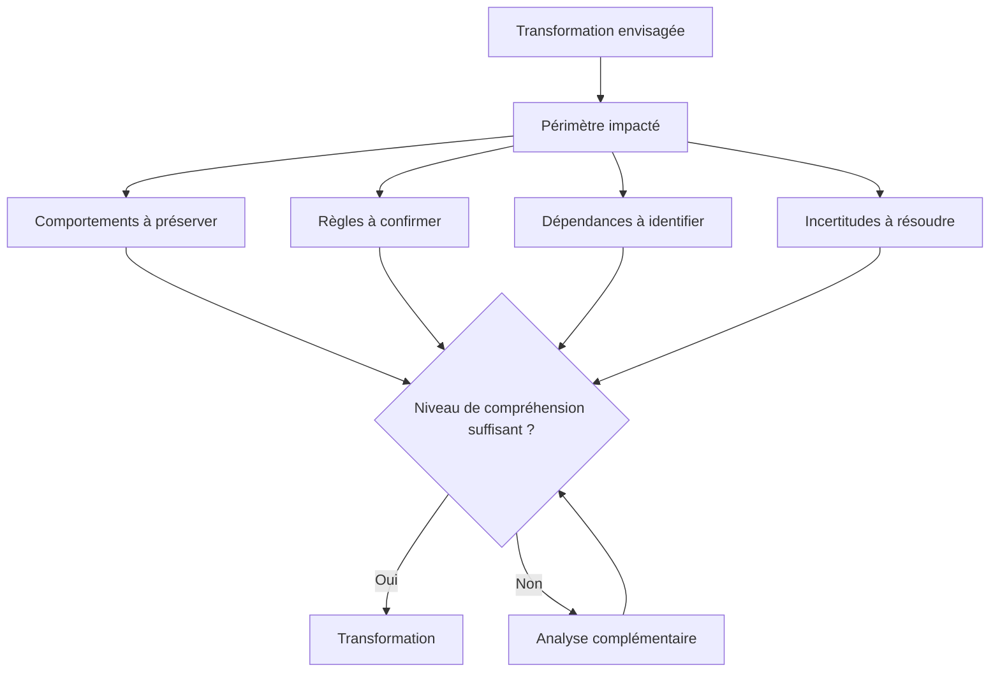

# Comprendre un système legacy avant de le transformer

> **Explorer un dépôt de code avec un agent est devenu rapide. Comprendre les comportements, les règles et les contraintes qu'il faut préserver avant de transformer le système reste un problème d'ingénierie.**

Demander à un agent de code d'explorer une application existante est devenu relativement simple.

En quelques minutes, il peut identifier les principaux modules, parcourir les dépendances, retrouver les points d'entrée, suivre certains appels, repérer des composants fortement couplés ou produire une première représentation de l'architecture.

Cette capacité change considérablement la manière d'aborder un système legacy.

Une analyse qui demandait auparavant plusieurs heures de navigation dans le code peut désormais être accélérée. Nous pouvons demander à un agent de retrouver le parcours d'une transaction, d'expliquer le rôle d'un module, d'identifier les dépendances d'une classe ou de cartographier les appels autour d'un cas d'usage.

Il devient alors tentant de poursuivre immédiatement.

Proposer une nouvelle architecture.

Migrer un framework.

Extraire un microservice.

Remplacer une dépendance obsolète.

Réécrire un module.

Ou demander directement à l'agent de produire la transformation.

Pourtant, quelque chose manque entre ces deux étapes.

Avoir compris comment le code est organisé ne signifie pas nécessairement avoir compris ce que le système doit continuer à faire.

Et dans un système qui fonctionne depuis plusieurs années, cette différence est loin d'être anodine.

Le code transporte des règles métier, mais aussi des compromis, des exceptions, des comportements implicites, des contraintes d'intégration et parfois des décisions dont la justification n'est plus documentée.

Certaines lignes que nous considérons aujourd'hui comme inutiles sont peut-être devenues indispensables au fonctionnement réel du système.

D'autres sont effectivement des vestiges qu'il faudrait supprimer.

Le problème est précisément de savoir les distinguer.

L'enjeu n'est donc probablement plus seulement d'accélérer la lecture du code.

Il est de construire une compréhension suffisamment fiable pour décider ce que nous pouvons transformer, ce que nous devons préserver et ce que nous devons encore vérifier.

---

## 1. Explorer un dépôt de code n'est plus le problème

Pendant longtemps, l'une des difficultés d'un projet de modernisation consistait simplement à entrer dans le système.

Il fallait identifier les modules, comprendre les conventions, parcourir les dépendances, retrouver les points d'entrée, suivre les appels entre plusieurs couches et reconstruire progressivement une représentation mentale de l'application.

Sur un système ancien et volumineux, cette phase pouvait être particulièrement coûteuse.

Les agents de code changent une partie de cette équation.

Ils permettent d'interroger le dépôt plutôt que de le parcourir uniquement de manière linéaire.

Nous pouvons leur demander où commence un traitement, quelles classes participent à une fonctionnalité, quelles tables sont utilisées, où une règle semble être appliquée ou quelles dépendances seraient touchées par une modification.

Cette capacité est importante.

Mais elle déplace aussi le problème.

Lorsque l'exploration devient plus rapide, nous pouvons facilement confondre vitesse d'accès à l'information et compréhension du système.

L'agent retrouve une condition dans le code.

Il peut expliquer ce qu'elle fait.

Il peut parfois retrouver les méthodes qui l'appellent.

Il peut même proposer une interprétation de son intention.

Mais cette interprétation n'établit pas nécessairement pourquoi cette condition existe, si elle correspond toujours à une règle métier ou si d'autres composants reposent implicitement sur son comportement.

> **Lire n'est pas encore comprendre.**

L'agent peut accélérer la lecture d'un système.

La décision de le transformer exige de savoir quels comportements, règles et contraintes cette lecture permet réellement d'établir.

---

## 2. L'illusion de compréhension

Prenons un cas volontairement simple.

Un système applique une règle particulière lorsqu'une transaction dépasse un certain montant. L'agent retrouve la condition dans le code, identifie la méthode concernée et constate que la valeur utilisée est définie directement dans le composant.

La conclusion peut sembler évidente : nous avons découvert une règle métier mal implémentée, qu'il faudrait extraire dans une configuration ou dans un composant métier plus propre.

Techniquement, cette analyse peut être correcte.

Mais plusieurs questions restent ouvertes.

Cette valeur correspond-elle encore à la règle actuelle ?

Est-elle spécifique à un produit, à un pays ou à un ancien contrat ?

Existe-t-il un traitement batch qui applique une règle différente ?

Une application consommatrice dépend-elle de ce comportement ?

Des transactions existantes seraient-elles interprétées différemment si nous changions cette règle ?

Le code nous donne une observation.

Il ne nous donne pas automatiquement toute l'histoire.

Le danger apparaît lorsque nous transformons trop rapidement cette observation en certitude.

Cette situation devient encore plus délicate avec un agent capable de produire une explication cohérente. Une explication bien formulée peut donner une impression de compréhension supérieure au niveau réel de preuve dont nous disposons.

Le problème ne vient donc pas seulement d'une éventuelle erreur du modèle.

Il vient également de notre manière d'utiliser ce qu'il produit.

Une analyse générée à partir du dépôt doit rester ce qu'elle est : une construction issue des éléments accessibles à l'agent.

> **Une hypothèse issue du code n'est pas encore une règle métier.**

Elle devient réellement exploitable lorsqu'elle peut être reliée à d'autres éléments qui permettent de confirmer, de nuancer ou de contredire cette interprétation.

---

## 3. Comprendre le code ou comprendre le système ?

Cette distinction me semble fondamentale pour aborder la modernisation avec des agents.

Comprendre le code consiste à reconstruire sa structure.

Quels sont les modules ?

Quels composants s'appellent entre eux ?

Où les données sont-elles transformées ?

Quelles dépendances sont utilisées ?

Quels chemins d'exécution pouvons-nous identifier ?

Comprendre le système pose une question différente.

Pourquoi ces chemins existent-ils ?

Quels comportements sont attendus ?

Quelles propriétés doivent rester vraies après la transformation ?

Quels consommateurs dépendent du système ?

Quelles contraintes opérationnelles ont influencé son architecture ?

Quelles anomalies apparentes sont en réalité devenues des comportements contractuels ?

Et quelles parties du système ne comprenons-nous pas encore suffisamment ?

Cette différence explique pourquoi une cartographie technique, même très détaillée, ne suffit pas toujours pour lancer une transformation.

Une application n'est pas uniquement constituée de classes, de modules et de dépendances.

Elle produit un comportement observable dans un environnement donné.

C'est ce comportement que la modernisation devra finalement préserver, corriger ou faire évoluer.

La structure nous aide à trouver où intervenir.

La compréhension du système nous aide à décider ce que l'intervention a le droit de changer.

---

## 4. Ce qu'un système legacy transporte avec lui

Un système legacy n'est pas simplement un système utilisant une ancienne technologie.

Il peut être techniquement ancien et parfaitement maîtrisé.

À l'inverse, une application relativement récente peut déjà être difficile à faire évoluer si ses responsabilités, ses comportements et ses dépendances sont mal compris.

Ce qui rend généralement la modernisation délicate est ce que le système a accumulé avec le temps.

Des règles métier ont été ajoutées.

Des exceptions sont apparues.

Des partenaires ont imposé certains contrats.

Des migrations de données ont laissé derrière elles des compatibilités à maintenir.

Des incidents ont conduit à ajouter des mécanismes de protection.

Certaines contraintes temporaires sont devenues permanentes.

Et toutes ces décisions ne sont pas nécessairement présentes dans la documentation.

Prenons un délai particulier avant le déclenchement d'un traitement.

Vu depuis le code, il peut sembler arbitraire.

Il peut s'agir d'une mauvaise implémentation.

Mais il peut également compenser le comportement d'un système externe, respecter une fenêtre de traitement bancaire ou protéger l'application contre une condition de concurrence observée plusieurs années auparavant.

Même chose pour une duplication de données, un mécanisme de retry inhabituel, un format ancien encore supporté ou une séquence d'appels apparemment inutile.

> **Une anomalie apparente n'est pas nécessairement une erreur à supprimer.**

Cela ne signifie pas qu'il faut conserver toutes les décisions historiques.

Ce serait l'excès inverse.

La modernisation consiste justement à distinguer ce qui reste nécessaire de ce qui ne l'est plus.

Pour y parvenir, nous devons sortir d'une lecture exclusivement structurelle du code.

---

## 5. Le dépôt de code n'est qu'une partie de l'histoire

Le dépôt de code constitue naturellement une source essentielle de connaissance.

Il nous montre ce qui a été implémenté.

Mais le comportement réel du système dépend souvent d'un ensemble plus large.

Les tests peuvent révéler des cas considérés comme suffisamment importants pour être protégés.

La configuration peut modifier profondément le comportement d'un même composant selon les environnements.

Les données permettent de comprendre quels cas existent réellement et avec quelle fréquence.

Les logs et les traces montrent les chemins effectivement exécutés.

Les scripts d'exploitation révèlent parfois des procédures qui n'apparaissent pas dans l'application elle-même.

La documentation contient des intentions qui ne sont plus nécessairement visibles dans l'implémentation.

L'historique des modifications peut aider à retrouver l'origine de certaines décisions.

Et l'expertise métier permet parfois d'expliquer en quelques minutes une règle qu'aucune analyse statique ne pourrait établir avec certitude.

Cela change la manière d'utiliser un agent.

Au lieu de lui demander uniquement :

> « Explique-moi comment fonctionne cette application. »

Nous pouvons progressivement lui fournir ou lui faire explorer plusieurs sources pour répondre à des questions plus précises.

Où cette règle apparaît-elle ?

Existe-t-il un test qui la protège ?

Quelles configurations peuvent modifier son comportement ?

Observe-t-on réellement ce chemin dans les logs ?

Quels consommateurs utilisent encore ce format ?

Existe-t-il des éléments contradictoires entre le code et la documentation ?

L'objectif n'est plus simplement de générer une description du système.

Il est de construire une compréhension traçable.

---

## 6. Passer de l'observation à la connaissance exploitable

C'est ici qu'une discipline supplémentaire devient nécessaire.

Lorsqu'un agent analyse un système, tout ce qu'il produit ne devrait pas avoir le même statut.

Une observation directement visible dans le code n'a pas la même valeur qu'une interprétation.

Une règle confirmée par plusieurs sources n'a pas le même niveau de confiance qu'une hypothèse issue d'une seule méthode.

Nous pouvons représenter cette progression de manière simple.

Supposons que l'agent observe qu'une demande dépassant un montant donné passe systématiquement par une validation supplémentaire.

L'observation peut être formulée ainsi :

> « Une condition déclenche `manualReview()` lorsque le montant dépasse le seuil configuré. »

L'hypothèse devient :

> « Les opérations supérieures à ce seuil nécessitent une validation humaine. »

Nous pouvons ensuite chercher des éléments qui renforcent ou affaiblissent cette interprétation.

Un test d'intégration couvre-t-il ce scénario ?

La documentation fonctionnelle mentionne-t-elle cette validation ?

Le seuil est-il identique dans tous les environnements ?

Les traces montrent-elles réellement le passage par cette étape ?

Existe-t-il des cas qui contournent la règle ?

Un expert métier peut-il confirmer son intention ?

À mesure que ces éléments convergent, l'hypothèse devient suffisamment fiable pour être utilisée dans la conception de la cible.

Cette progression est importante parce qu'elle introduit une différence entre ce que l'agent **déduit** et ce que le projet considère comme **établi**.

On pourrait par exemple utiliser quelques statuts simples :

| Statut | Signification |
| --- | --- |
| Observé | Élément directement identifié dans une source |
| Probable | Interprétation cohérente mais encore partiellement vérifiée |
| Confirmé | Comportement ou règle soutenu par plusieurs éléments ou validé |
| Contradictoire | Plusieurs sources donnent des indications incompatibles |
| Inconnu | Information nécessaire mais non déterminée |

L'intérêt d'un tel mécanisme n'est pas de bureaucratiser l'analyse.

Il est d'éviter qu'une hypothèse bien formulée se transforme silencieusement en spécification.

---

## 7. Rendre également visible ce que nous ne savons pas

Lorsque nous documentons un système, nous avons naturellement tendance à conserver les réponses.

Les modules identifiés.

Les flux compris.

Les règles retrouvées.

Les dépendances découvertes.

Pourtant, dans un projet de modernisation, les questions ouvertes peuvent être tout aussi importantes.

Pourquoi deux traitements apparemment équivalents utilisent-ils des règles différentes ?

Cette table est-elle encore alimentée ?

Ce format doit-il toujours être accepté ?

Ce batch est-il encore utilisé en production ?

Ce comportement constitue-t-il une règle métier ou un contournement historique ?

Que se passe-t-il réellement lorsque ce service externe ne répond pas ?

Une partie de la qualité de l'analyse consiste précisément à ne pas inventer une réponse lorsque les éléments disponibles ne permettent pas de conclure.

> **Ce que nous ne savons pas fait également partie de notre compréhension du système.**

Les incertitudes devraient donc devenir des artefacts du workflow.

Elles peuvent être associées à leur contexte, aux sources déjà consultées, à leur impact potentiel et à la personne ou au système susceptible de les résoudre.

Une question ouverte sur un ancien écran administratif n'a probablement pas la même priorité qu'une incertitude concernant la manière dont un montant financier est calculé.

Nous pouvons alors commencer à raisonner sur le risque.

Une transformation qui touche uniquement des comportements bien compris peut avancer rapidement.

Une transformation qui traverse plusieurs zones d'incertitude demande davantage de validation.

La confiance dans la transformation ne vient donc pas du nombre de fichiers analysés.

Elle vient du rapport entre ce que nous savons, ce que nous pouvons prouver et ce que nous savons encore devoir vérifier.

---

## 8. Comprendre suffisamment pour transformer

Une autre erreur serait d'en déduire qu'un système doit être entièrement documenté avant toute modification.

Sur une application importante, cette ambition serait souvent irréaliste.

Nous pouvons toujours découvrir un nouveau cas particulier, une ancienne intégration ou une décision oubliée.

L'objectif n'est pas d'atteindre une compréhension exhaustive.

Il est d'atteindre une compréhension suffisante pour la transformation envisagée.

Si nous voulons remplacer une bibliothèque isolée, le niveau de connaissance nécessaire peut être relativement local.

Si nous voulons extraire un domaine métier d'un monolithe, nous devons comprendre beaucoup plus précisément ses données, ses contrats, ses dépendances et ses invariants.

Si nous voulons remplacer complètement un système, la couverture nécessaire devient encore plus large.

Cette notion de compréhension suffisante me semble particulièrement importante lorsqu'on utilise des agents.

Un agent peut toujours continuer à explorer.

Il peut produire davantage de diagrammes, davantage de résumés, davantage de descriptions.

Mais produire davantage d'informations ne signifie pas nécessairement réduire le risque.

La bonne question devient plutôt :

> **Disposons-nous des connaissances nécessaires pour prendre cette décision de transformation ?**

Cela oblige à relier l'analyse à un objectif.

Quels comportements seront potentiellement affectés ?

Quelles règles devons-nous protéger ?

Quels contrats seront modifiés ?

Quelles zones restent trop incertaines pour avancer ?

À partir de là, l'agent cesse progressivement d'être uniquement un outil d'exploration.

Il devient un moyen d'accélérer un processus d'ingénierie dans lequel les observations, les hypothèses, les preuves et les décisions restent explicitement distinguées.

---

## Conclusion : transformer commence avant la génération de code

Les agents de code rendent l'exploration des systèmes existants beaucoup plus rapide.

C'est déjà une évolution importante.

Mais la modernisation d'un système legacy ne commence pas au moment où l'agent génère le nouveau code.

Elle commence lorsque nous essayons de déterminer ce que l'ancien système fait réellement, pourquoi il le fait et quelles propriétés doivent survivre à sa transformation.

Le dépôt de code constitue un point d'entrée.

Il ne constitue pas à lui seul la connaissance du système.

Les tests, la configuration, les données, les traces, la documentation et l'expertise métier permettent de compléter cette représentation.

L'agent peut nous aider à parcourir ces sources, à retrouver des relations et à formuler des hypothèses.

Mais une hypothèse ne devrait pas devenir silencieusement une vérité.

Elle doit pouvoir être reliée aux éléments qui la soutiennent, à son niveau de confiance et, lorsque cela est nécessaire, à une validation humaine.

Il faut également accepter de conserver les incertitudes.

Toutes les questions ne seront pas résolues immédiatement.

Toutes n'ont d'ailleurs pas besoin de l'être.

L'objectif n'est pas de tout comprendre avant de commencer.

Il est de savoir **ce que nous comprenons, sur quelles preuves cette compréhension repose et quelles incertitudes subsistent**.

C'est à partir de cette matière que la modernisation peut réellement commencer.

Car une fois le système suffisamment compris, une nouvelle question apparaît immédiatement.

Comment transformer toutes ces observations, règles, comportements, contraintes et questions ouvertes en artefacts suffisamment structurés pour guider la suite du travail ?

Autrement dit, comment passer d'une compréhension dispersée du système à des spécifications réellement exploitables par les développeurs, les architectes et les agents qui participeront à sa transformation ?

C'est le sujet du prochain article de cette série :

> **Passer du code aux spécifications exploitables.**
