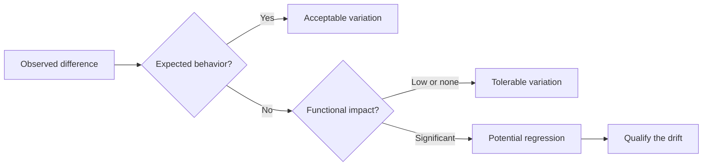
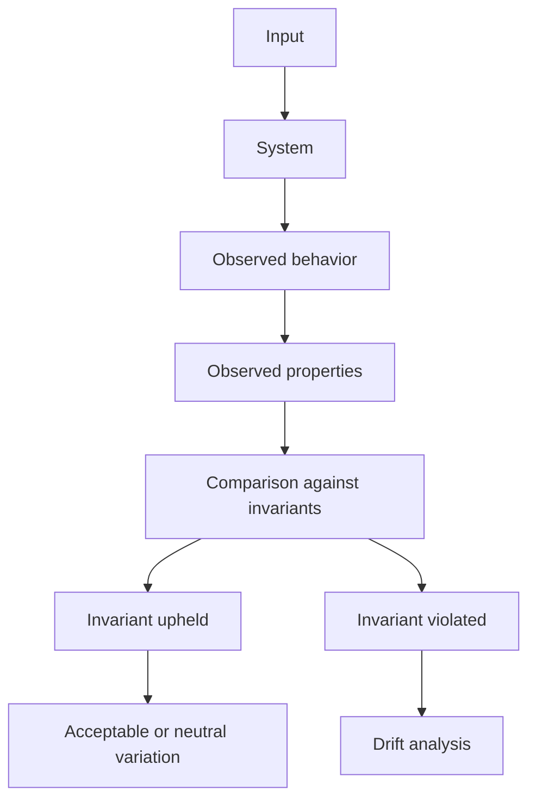
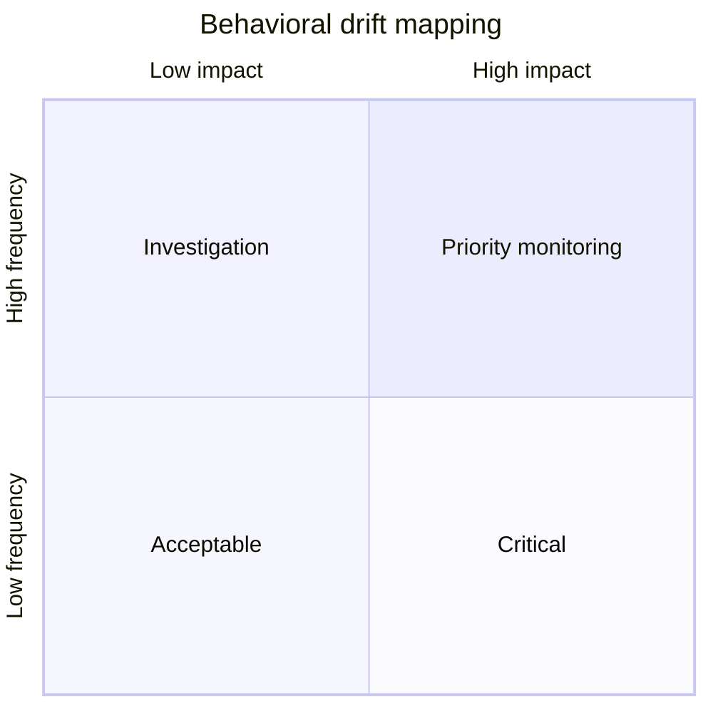
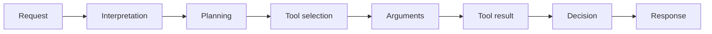
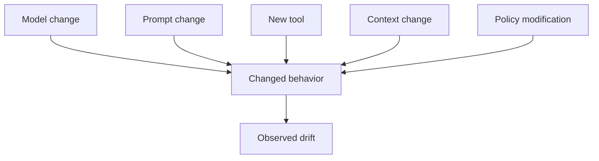
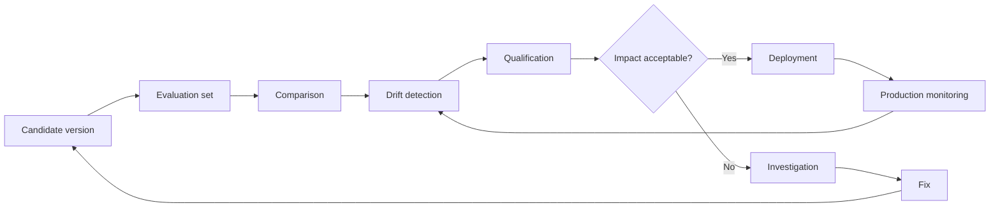

# Detecting and Qualifying Behavioral Drift

An LLM system can change without becoming less capable.

A new model version can produce different responses. A prompt can be reworded. A tool can change the information available. A security rule can be tightened. A change in temperature, context, or routing strategy can also change observed behavior.

The problem, then, is not simply detecting a difference.

The real challenge is determining **whether that difference constitutes behavioral drift**, what its nature is, how large it is, and above all what impact it has on the system.

This is a fundamental distinction in industrializing LLM-based systems:

> **A behavioral variation is not necessarily a regression.**

Evaluation must make this distinction in a reproducible way.

---

## 1. Detecting a Difference Is Not Enough

When a new version of a system is evaluated, we may find that it no longer produces exactly the same results as the previous one.

This can involve:

* the produced response;
* the decision made;
* the selected tool;
* the arguments passed to a tool;
* the confidence level;
* whether a request is refused or accepted;
* the number of steps in a workflow;
* the amount of context used;
* the structure of the response;
* the behavior when facing an ambiguous situation.

The first mistake is to treat every difference as an anomaly.

Take, for example, an assistant that must decide whether a request requires a tool call.

Version A produces:

```text
Tool call → data retrieval → response
```

Version B produces:

```text
Direct response
```

The difference is obvious.

But it does not yet let us conclude there is a regression.

If the necessary information was already present in the context, the direct response can be perfectly valid.

Conversely, if the response absolutely requires external data, the absence of a tool call can be a functional break.

The comparison must therefore evolve:



This is where the evaluation work really begins.

---

## 2. Drift Is a Difference from a Reference Behavior

To detect drift, we need a reference.

This reference can be made up of:

* behavioral invariants;
* business rules;
* security criteria;
* expected decisions;
* historical behaviors considered reliable;
* regulatory constraints;
* properties the system must preserve.

So we are not simply comparing:

```text
Version A ≠ Version B
```

We are instead trying to determine:

```text
Version B ≠ expected behavior
```

This distinction is essential.

The previous version is often a **point of comparison**, but it is not necessarily the truth.

An older version can itself contain flaws.

The reference, then, must be built from the behaviors we actually want to preserve.

---

## 3. Invariants Become the Reference Point

Behavioral invariants play a central role here.

An invariant describes a property that must remain true regardless of how the system evolves.

For example:

> A financial operation must never be executed without explicit user validation.

Or:

> A request requiring unavailable data must not be presented as certain.

Or:

> Confidential information must never be returned to an unauthorized user.

These properties are far more robust than comparing wordings.

We can represent the evaluation like this:



The question becomes:

> **What changed in the behavior, and which important properties does that change affect?**

---

## 4. Not All Drift Is Equal

An industrial evaluation strategy must avoid the binary:

```text
PASS / FAIL
```

A more useful classification distinguishes several levels.

### Neutral Variation

Behavior changes, but no important property is affected.

Examples:

* different wording;
* different order of two non-critical pieces of information;
* a shorter justification;
* choosing an equivalent tool.

The difference can be logged, but it does not necessarily require action.

### Acceptable Variation

The behavior is different, but stays within the space of allowed behaviors.

Example:

An agent chooses a different search strategy while still producing the same correct decision.

### Concerning Variation

The behavior remains functional but drifts away from a desired behavior.

Examples:

* more tool calls;
* more refusals;
* more clarification requests;
* an increased number of steps;
* measurable accuracy degradation on certain cases.

This drift may not be blocking, but it deserves investigation.

### Regression

An important functional property is no longer upheld.

Examples:

* a wrong decision;
* a critical tool not called;
* mandatory data ignored;
* an incorrect response;
* a business policy violated.

### Critical Regression

The drift compromises a security or compliance property, or a critical function.

Example:

```text
Sensitive data
      ↓
Faulty access control
      ↓
Information exposed
```

This classification lets us focus analysis effort on the changes that actually matter.

---

## 5. Qualifying Drift Along Several Dimensions

Drift should not be described by a single overall score.

Two systems can achieve the same success rate while presenting completely different risk profiles.

A useful qualification can take several dimensions into account.

### Direction

Does the drift improve or degrade the behavior?

### Frequency

Does the phenomenon appear:

* once;
* occasionally;
* regularly;
* systematically?

### Severity

What is the consequence of the drift?

### Scope

Does the drift concern:

* a specific case;
* a category of requests;
* a domain;
* the entire system?

### Stability

Is the behavior reproducible?

### Context Sensitivity

Does the drift appear only under certain conditions?

For example:

```text
Language
User
Request type
Provided context
Context length
Available tool
Model version
```

These dimensions turn a raw observation into a genuine diagnosis.

---

## 6. Measuring Frequency Is Not Enough

An error that appears in 1% of cases may seem negligible.

But if that 1% corresponds to the system's most sensitive operations, it can matter far more than a 10% degradation on requests with no consequence.

The overall rate often hides how errors are distributed.

Take two systems:

| Category | Version A | Version B |
| --- | ---: | ---: |
| General questions | 96% | 94% |
| Complex questions | 90% | 88% |
| Critical operations | 99% | 96% |
| Security | 100% | 98% |

An average score may suggest only a slight degradation.

Yet the drop on critical operations can be far more significant than what is observed on general questions.

Evaluation must therefore be **segmented**.

---

## 7. Mapping Drift

<a href="/en/blog/construire-jeu-evaluation" target="_blank" rel="noopener noreferrer">The evaluation set built previously</a> can become a map of behaviors.

Each case can be analyzed along several axes:



The goal is not to produce yet another chart for its own sake.

It is to be able to quickly answer four questions:

1. **Where does the system change?**
2. **How often?**
3. **With what severity?**
4. **On which properties?**

This mapping, in particular, helps distinguish localized drift from a systemic change.

---

## 8. Drift Can Be Multidimensional

An agent's behavior is not limited to the final response.

Drift can appear in the trajectory that leads to that response.



Two versions can produce the same final response while following different trajectories.

Version A:

```text
Request
→ search
→ verification
→ response
```

Version B:

```text
Request
→ search
→ search
→ reformulation
→ search
→ response
```

The final response can be correct in both cases.

Yet system B may show:

* more latency;
* more cost;
* more tool calls;
* more points of failure;
* higher context consumption.

There are, therefore, **behavioral drifts invisible in the final result**.

This matters particularly for agentic systems.

---

## 9. Distinguishing Local Drift from Systemic Drift

A change can affect a handful of specific cases or an entire category.

This distinction is essential.

### Local Drift

```text
1,000 cases evaluated
      ↓
12 cases changed
      ↓
10 in the same family
      ↓
problem likely localized
```

### Systemic Drift

```text
1,000 cases evaluated
      ↓
310 cases changed
      ↓
several categories affected
      ↓
structural change likely
```

The second situation should generally trigger deeper analysis.

It can stem from a change in:

* the model;
* the system prompt;
* a policy;
* a tool;
* routing;
* memory;
* the context;
* the agentic strategy.

The goal, then, is to trace the change back to its cause, not just note that it exists.

---

## 10. Looking for the Cause, Not Just the Symptom

Observed drift can be the result of an indirect change.



The evaluation system must therefore retain enough information to allow causal analysis.

For each important execution, it can be useful to keep:

* model version;
* prompt version;
* tools version;
* configuration;
* context;
* input data;
* decisions;
* tool calls;
* tool results;
* final output;
* metrics;
* evaluation verdict.

Without this traceability, a team can detect a regression without being able to explain where it came from.

---

## 11. The Behavioral Delta as an Object of Analysis

The goal is no longer just to store a score.

We need to be able to represent the **behavioral delta** between two versions.

For example:

```text
Case #1842

Version A
- decision: DENY
- tool: none
- justification: present

Version B
- decision: ACCEPT
- tool: none
- justification: present

Violated invariant:
→ a request in this category must be denied

Impact:
→ critical

Qualification:
→ regression
```

Conversely:

```text
Case #2711

Version A
- decision: ACCEPT
- tool: search_v1

Version B
- decision: ACCEPT
- tool: search_v2

Invariant:
→ the decision must be correct

Impact:
→ none

Qualification:
→ acceptable variation
```

The second case should not be treated as a regression simply because the system changed.

---

## 12. Introducing the Notion of a Drift Budget

Not every behavior needs to be perfectly stable.

In a real system, some amount of variation is unavoidable.

It can therefore be useful to define **drift budgets**.

| Dimension | Acceptable budget |
| --- | ---: |
| Wording | High |
| Style | High |
| Business decision | Very low |
| Critical tool call | Near zero |
| Security violation | Zero |
| Latency | Defined threshold |
| Number of tool calls | Defined threshold |
| Cost | Defined threshold |

This lets us formalize an essential rule:

> **The stability we seek must be proportional to the importance of the behavior.**

A system can be very flexible on wording and extremely conservative on a regulatory decision.

---

## 13. The Role of Thresholds

Thresholds turn observations into operational rules.

For example:

```text
Variation < 2%
→ acceptable

2% ≤ variation < 5%
→ monitoring

5% ≤ variation < 10%
→ investigation

Variation ≥ 10%
→ mandatory review
```

But these thresholds should never be treated as universal.

They must depend on:

* the domain;
* the risk;
* the criticality;
* how often the feature is used;
* the nature of the invariant;
* the cost of an error.

For a critical function, a single violation can be enough to block a release.

---

## 14. Toward Continuous Evaluation

Drift detection should not happen only before a production release.

It must also be observed after deployment.

An industrial architecture can follow this cycle:



The evaluation system then becomes a control loop.

It no longer serves only to say:

> "This version works."

It lets us say:

> "This version changed in this way, on these behaviors, with this level of impact, and these changes stay within accepted limits."

That is a major shift in how we think about quality assurance for LLM systems.

---

## 15. The Goal Is Not to Eliminate Change

An LLM system that never changes is not necessarily a good system.

Evolution can bring:

* better decisions;
* better performance;
* better tools;
* better security;
* lower costs;
* better robustness.

Trying to reproduce historical outputs exactly can even block some of these improvements.

The goal, then, is not:

```text
Old behavior = New behavior
```

but rather:

```text
New behavior
        ↓
upholds the invariants
        ↓
stays within acceptable budgets
        ↓
improves or preserves the important properties
```

Stability should apply to **what matters**, not necessarily to everything that can be observed.

---

## 16. Drift Is Ultimately a Governance Problem

Technical detection is only the first step.

An organization must also decide:

* which variations are acceptable;
* which drift requires review;
* which violations block a deployment;
* who can accept a degradation;
* which metrics must be monitored;
* which evidence must be retained.

This turns evaluation into a governance mechanism.

We progressively move from:

```text
Evaluating a model
```

to:

```text
Governing the evolution of a behavioral system
```

This distinction becomes especially important when several components evolve independently:

```text
Model
   +
Prompt
   +
Tools
   +
Data
   +
Policies
   +
Orchestrator
   ↓
System behavior
```

Drift, then, can be produced by any one of these components.

---

## Conclusion of the Series

Detecting a difference is relatively simple.

Determining whether that difference constitutes a genuine regression is far harder.

Evaluating an LLM system must therefore go beyond comparing outputs to analyze:

* invariants;
* decisions;
* trajectories;
* tools;
* frequencies;
* impacts;
* case categories;
* drift budgets.

The question is no longer:

> **"Does the new system respond like the old one?"**

but:

> **"Does the new system still behave in line with the properties we decided to protect?"**

This approach lets us accept evolution while keeping regression under control.

It also marks a shift from simply evaluating models to genuinely **governing the behavior of AI systems**.

An industrial-grade LLM system must be able to evolve. But that evolution must remain observable, measurable, and governable.

Maturity, then, is not about preventing change.

It is about knowing:

* **what can change;**
* **what must not change;**
* **within what limits change is acceptable;**
* **what impact a drift can have;**
* **and what decisions to make once a limit has been crossed.**

This series has followed a single thread: understand the behavior of an LLM system before trying to optimize it, then learn to test it, compare it, and govern its evolution.

A first part made this behavior understandable:

1. [**Freezing the Behavior of an LLM System Before Evolving It**](/en/blog/figer-comportement-systeme-llm), to establish a baseline;
2. [**Observe Before Optimizing**](/en/blog/observer-avant-doptimiser), to make visible the elements that produce this behavior;
3. [**Decision Trajectory**](/en/blog/la-trajectoire-de-decision), to reconstruct the path between the request and the action;
4. [**Behavioral Surfaces**](/en/blog/les-surfaces-comportementales), to identify the areas where the system can vary or regress.

A second part taught us how to test and compare this behavior:

1. [**Defining the Behavioral Invariants of an LLM System**](/en/blog/les-invariants-comportementaux), to know what must remain true despite changes;
2. [**Testing Decisions Rather Than Wording**](/en/blog/tester-les-decisions), to avoid confusing linguistic variation with an actual behavioral change;
3. [**Comparing Two Versions of an LLM System**](/en/blog/comparer-deux-versions), to qualify the differences introduced by a change;
4. [**Building a Representative Evaluation Set**](/en/blog/construire-jeu-evaluation), to give those comparisons a solid and durable foundation;
5. **Detecting and Qualifying Behavioral Drift**, to tell a regression apart from a mere variation.

> **The goal is not to freeze the system's behavior. It is to know what can evolve without losing what matters.**
