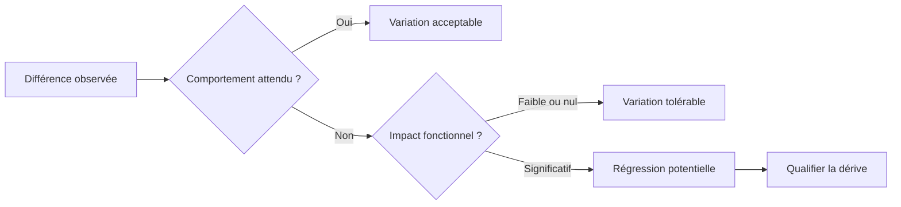
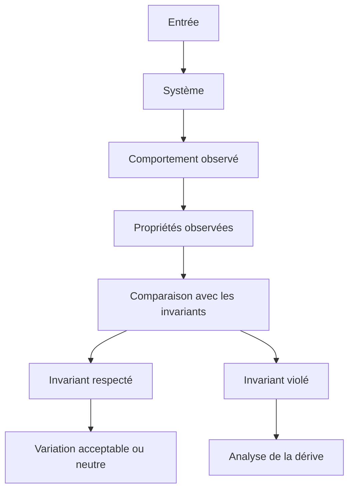
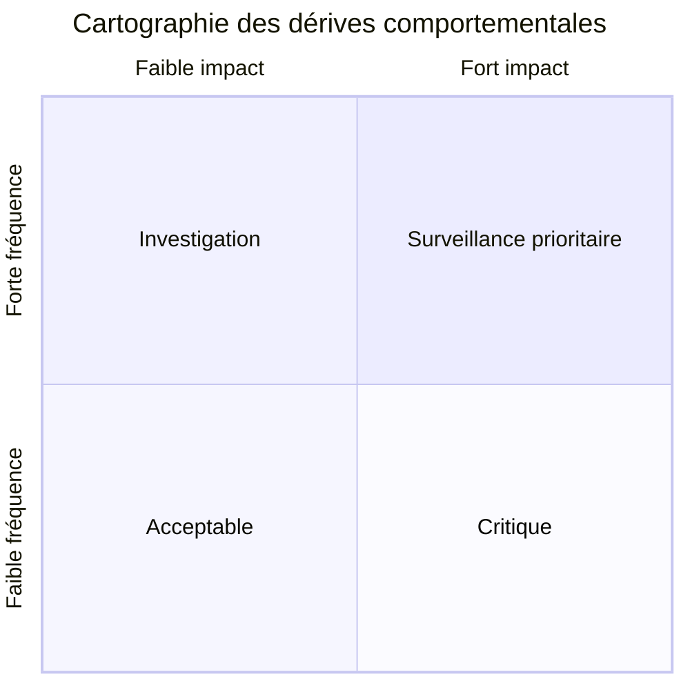
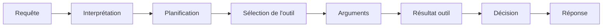
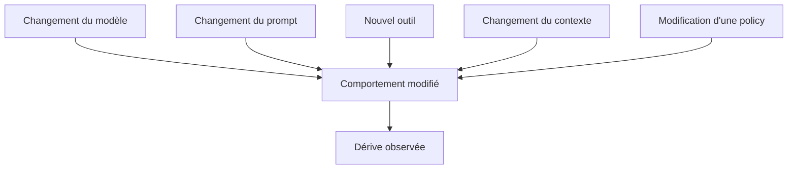
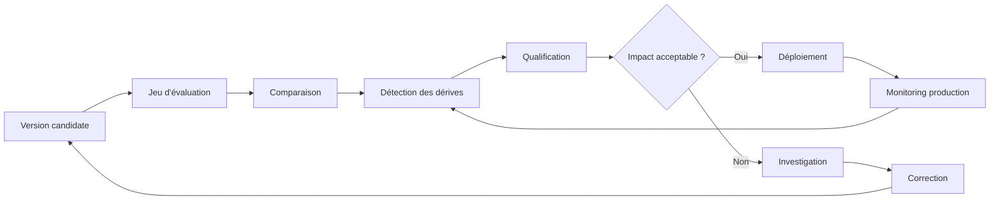

# Détecter et qualifier les dérives comportementales

Un système LLM peut changer sans devenir moins performant.

Une nouvelle version du modèle peut produire des réponses différentes. Un prompt peut être reformulé. Un outil peut modifier les informations disponibles. Une règle de sécurité peut être renforcée. Un changement de température, de contexte ou de stratégie de routage peut également modifier le comportement observé.

Le problème n'est donc pas simplement de détecter une différence.

Le véritable enjeu est de déterminer **si cette différence constitue une dérive comportementale**, quelle est sa nature, quelle est son ampleur et surtout quel est son impact sur le système.

C'est une distinction fondamentale dans l'industrialisation des systèmes fondés sur des LLM :

> **Une variation de comportement n'est pas nécessairement une régression.**

L'évaluation doit permettre de faire cette différence de manière reproductible.

---

## 1. Détecter une différence ne suffit pas

Lorsqu'une nouvelle version d'un système est évaluée, on peut constater qu'elle ne produit plus exactement les mêmes résultats que la précédente.

Cela peut concerner :

* la réponse produite ;
* la décision prise ;
* l'outil sélectionné ;
* les arguments transmis à un outil ;
* le niveau de confiance ;
* le refus ou l'acceptation d'une requête ;
* le nombre d'étapes d'un workflow ;
* la quantité de contexte utilisée ;
* la structure de la réponse ;
* le comportement face à une situation ambiguë.

La première erreur consiste alors à considérer toute différence comme une anomalie.

Considérons par exemple un assistant qui doit déterminer si une demande nécessite l'appel d'un outil.

La version A produit :

```text
Appel de l'outil → récupération des données → réponse
```

La version B produit :

```text
Réponse directe
```

La différence est évidente.

Mais elle ne permet pas encore de conclure à une régression.

Si les informations nécessaires étaient déjà présentes dans le contexte, la réponse directe peut être parfaitement valide.

À l'inverse, si la réponse nécessite impérativement une donnée externe, l'absence d'appel à l'outil peut constituer une rupture fonctionnelle.

La comparaison doit donc évoluer :



Le travail d'évaluation commence réellement à ce moment-là.

---

## 2. Une dérive est une différence par rapport à un comportement de référence

Pour détecter une dérive, il faut disposer d'un référentiel.

Ce référentiel peut être constitué :

* d'invariants comportementaux ;
* de règles métier ;
* de critères de sécurité ;
* de décisions attendues ;
* de comportements historiques considérés comme fiables ;
* de contraintes réglementaires ;
* de propriétés que le système doit préserver.

On ne compare donc pas simplement :

```text
Version A ≠ Version B
```

On cherche plutôt à déterminer :

```text
Version B ≠ comportement attendu
```

Cette distinction est essentielle.

La version précédente constitue souvent un **point de comparaison**, mais elle ne constitue pas nécessairement la vérité.

Une ancienne version peut elle-même contenir des défauts.

Le référentiel doit donc être construit à partir des comportements que l'on souhaite réellement préserver.

---

## 3. Les invariants deviennent le point de référence

Les invariants comportementaux jouent ici un rôle central.

Un invariant décrit une propriété qui doit rester vraie malgré l'évolution du système.

Par exemple :

> Une opération financière ne doit jamais être exécutée sans validation explicite de l'utilisateur.

Ou :

> Une demande nécessitant une donnée indisponible ne doit pas être présentée comme certaine.

Ou encore :

> Une information confidentielle ne doit jamais être retournée à un utilisateur non autorisé.

Ces propriétés sont beaucoup plus robustes que la comparaison de formulations.

On peut alors représenter l'évaluation ainsi :



La question devient :

> **Qu'est-ce qui a changé dans le comportement, et quelles propriétés importantes ce changement affecte-t-il ?**

---

## 4. Toutes les dérives ne se valent pas

Une stratégie d'évaluation industrielle doit éviter le binaire :

```text
PASS / FAIL
```

Une classification plus utile consiste à distinguer plusieurs niveaux.

### Variation neutre

Le comportement change, mais aucune propriété importante n'est affectée.

Exemples :

* formulation différente ;
* ordre différent de deux informations non critiques ;
* justification plus courte ;
* choix d'un outil équivalent.

La différence peut être enregistrée, mais elle ne nécessite pas nécessairement d'action.

### Variation acceptable

Le comportement est différent, mais reste dans l'espace des comportements autorisés.

Exemple :

Un agent choisit une autre stratégie de recherche tout en produisant la même décision correcte.

### Variation préoccupante

Le comportement reste fonctionnel mais s'éloigne d'un comportement souhaité.

Exemples :

* davantage d'appels d'outils ;
* plus de refus ;
* plus de demandes de clarification ;
* augmentation du nombre d'étapes ;
* dégradation mesurable de la précision sur certains cas.

Cette dérive peut ne pas être bloquante, mais elle mérite une investigation.

### Régression

Une propriété fonctionnelle importante n'est plus respectée.

Exemples :

* mauvaise décision ;
* outil critique non appelé ;
* donnée obligatoire ignorée ;
* réponse incorrecte ;
* politique métier violée.

### Régression critique

La dérive compromet une propriété de sécurité, de conformité ou une fonction critique.

Exemple :

```text
Donnée sensible
      ↓
Mauvais contrôle d'accès
      ↓
Information exposée
```

La classification permet alors de concentrer l'effort d'analyse sur les changements réellement importants.

---

## 5. Qualifier la dérive selon plusieurs dimensions

Une dérive ne doit pas être décrite uniquement par un score global.

Deux systèmes peuvent obtenir le même taux de réussite tout en présentant des profils de risque totalement différents.

Une qualification utile peut prendre en compte plusieurs dimensions.

### Direction

La dérive améliore-t-elle ou dégrade-t-elle le comportement ?

### Fréquence

Le phénomène apparaît-il :

* une fois ;
* occasionnellement ;
* régulièrement ;
* systématiquement ?

### Sévérité

Quelle est la conséquence de la dérive ?

### Étendue

La dérive concerne-t-elle :

* un cas particulier ;
* une catégorie de requêtes ;
* un domaine ;
* l'ensemble du système ?

### Stabilité

Le comportement est-il reproductible ?

### Sensibilité au contexte

La dérive apparaît-elle uniquement dans certaines conditions ?

Par exemple :

```text
Langue
Utilisateur
Type de demande
Contexte fourni
Longueur du contexte
Outil disponible
Version du modèle
```

Ces dimensions permettent de transformer une observation brute en véritable diagnostic.

---

## 6. Mesurer la fréquence ne suffit pas

Une erreur qui apparaît dans 1 % des cas peut sembler négligeable.

Mais si ces 1 % correspondent aux opérations les plus sensibles du système, elle peut être beaucoup plus importante qu'une dégradation de 10 % sur des requêtes sans conséquence.

Le taux global masque souvent la distribution des erreurs.

Prenons deux systèmes :

| Catégorie | Version A | Version B |
| --- | ---: | ---: |
| Questions générales | 96 % | 94 % |
| Questions complexes | 90 % | 88 % |
| Opérations critiques | 99 % | 96 % |
| Sécurité | 100 % | 98 % |

Un score moyen peut donner l'impression d'une faible dégradation.

Pourtant, la baisse sur les opérations critiques peut être beaucoup plus importante que celle observée sur les questions générales.

L'évaluation doit donc être **segmentée**.

---

## 7. Cartographier les dérives

<a href="/fr/blog/construire-jeu-evaluation" target="_blank" rel="noopener noreferrer">Le jeu d'évaluation construit précédemment</a> peut devenir une carte des comportements.

Chaque cas peut être analysé selon plusieurs axes :



L'objectif n'est pas de produire un graphique supplémentaire pour lui-même.

Il s'agit de pouvoir répondre rapidement à quatre questions :

1. **Où le système change-t-il ?**
2. **À quelle fréquence ?**
3. **Avec quelle gravité ?**
4. **Sur quelles propriétés ?**

Cette cartographie permet notamment de distinguer une dérive localisée d'un changement systémique.

---

## 8. Une dérive peut être multidimensionnelle

Le comportement d'un agent ne se limite pas à la réponse finale.

Une dérive peut apparaître dans la trajectoire qui mène à cette réponse.



Deux versions peuvent produire la même réponse finale tout en utilisant des trajectoires différentes.

Version A :

```text
Requête
→ recherche
→ vérification
→ réponse
```

Version B :

```text
Requête
→ recherche
→ recherche
→ reformulation
→ recherche
→ réponse
```

La réponse finale peut être correcte dans les deux cas.

Pourtant, le système B peut présenter :

* davantage de latence ;
* davantage de coûts ;
* davantage d'appels d'outils ;
* davantage de points de défaillance ;
* une consommation supérieure de contexte.

Il existe donc des **dérives comportementales invisibles dans le résultat final**.

C'est particulièrement important pour les systèmes agentiques.

---

## 9. Distinguer dérive locale et dérive systémique

Une modification peut affecter quelques cas particuliers ou une catégorie entière.

Cette distinction est essentielle.

### Dérive locale

```text
1000 cas évalués
      ↓
12 cas modifiés
      ↓
10 dans une même famille
      ↓
problème probablement localisé
```

### Dérive systémique

```text
1000 cas évalués
      ↓
310 cas modifiés
      ↓
plusieurs catégories concernées
      ↓
changement structurel probable
```

La seconde situation doit généralement déclencher une analyse plus profonde.

Elle peut provenir d'un changement de :

* modèle ;
* prompt système ;
* politique ;
* outil ;
* routage ;
* mémoire ;
* contexte ;
* stratégie agentique.

L'enjeu est alors de retrouver la cause du changement, pas seulement de constater son existence.

---

## 10. Chercher la cause, pas seulement le symptôme

Une dérive observée peut être le résultat d'une modification indirecte.



Le système d'évaluation doit donc conserver suffisamment d'informations pour permettre une analyse causale.

Pour chaque exécution importante, il peut être utile de conserver :

* version du modèle ;
* version du prompt ;
* version des outils ;
* configuration ;
* contexte ;
* données d'entrée ;
* décisions ;
* appels d'outils ;
* résultats d'outils ;
* sortie finale ;
* métriques ;
* verdict d'évaluation.

Sans cette traçabilité, l'équipe peut détecter une régression sans être capable d'expliquer son origine.

---

## 11. Le delta comportemental comme objet d'analyse

L'objectif n'est donc plus seulement de stocker un score.

Il faut pouvoir représenter le **delta comportemental** entre deux versions.

Par exemple :

```text
Cas #1842

Version A
- décision : REFUS
- outil : aucun
- justification : présente

Version B
- décision : ACCEPT
- outil : aucun
- justification : présente

Invariant violé :
→ une demande de cette catégorie doit être refusée

Impact :
→ critique

Qualification :
→ régression
```

À l'inverse :

```text
Cas #2711

Version A
- décision : ACCEPT
- outil : search_v1

Version B
- décision : ACCEPT
- outil : search_v2

Invariant :
→ la décision doit être correcte

Impact :
→ aucun

Qualification :
→ variation acceptable
```

Le deuxième cas ne doit pas être traité comme une régression simplement parce que le système a changé.

---

## 12. Introduire la notion de budget de dérive

Tous les comportements n'ont pas besoin d'être parfaitement stables.

Dans un système réel, une certaine quantité de variation est inévitable.

Il peut donc être utile de définir des **budgets de dérive**.

| Dimension | Budget acceptable |
| --- | ---: |
| Formulation | Élevé |
| Style | Élevé |
| Décision métier | Très faible |
| Appel d'outil critique | Quasi nul |
| Violation de sécurité | Nul |
| Latence | Seuil défini |
| Nombre d'appels outils | Seuil défini |
| Coût | Seuil défini |

Cela permet de formaliser une règle essentielle :

> **La stabilité recherchée doit être proportionnelle à l'importance du comportement.**

Un système peut être très flexible sur la formulation et extrêmement conservateur sur une décision réglementaire.

---

## 13. Le rôle des seuils

Les seuils permettent de transformer les observations en règles opérationnelles.

Par exemple :

```text
Variation < 2 %
→ acceptable

2 % ≤ variation < 5 %
→ surveillance

5 % ≤ variation < 10 %
→ investigation

Variation ≥ 10 %
→ revue obligatoire
```

Mais ces seuils ne doivent jamais être considérés comme universels.

Ils doivent dépendre :

* du domaine ;
* du risque ;
* de la criticité ;
* de la fréquence d'utilisation ;
* de la nature de l'invariant ;
* du coût d'une erreur.

Pour une fonction critique, une seule violation peut suffire à bloquer une livraison.

---

## 14. Vers un système d'évaluation continu

La détection des dérives ne devrait pas être réalisée uniquement avant une mise en production.

Elle doit également être observée après le déploiement.

Une architecture industrielle peut suivre le cycle suivant :



Le système d'évaluation devient alors une boucle de contrôle.

Il ne sert plus uniquement à dire :

> « Cette version fonctionne. »

Il permet de dire :

> « Cette version a changé de telle manière, sur tels comportements, avec tel niveau d'impact, et ces changements restent dans les limites acceptées. »

C'est une différence majeure dans la manière de concevoir l'assurance qualité des systèmes LLM.

---

## 15. L'objectif n'est pas de supprimer le changement

Un système LLM qui ne change jamais n'est pas nécessairement un bon système.

L'évolution peut apporter :

* de meilleures décisions ;
* de meilleures performances ;
* de meilleurs outils ;
* une meilleure sécurité ;
* une réduction des coûts ;
* une meilleure robustesse.

Chercher à reproduire exactement les sorties historiques peut même empêcher certaines améliorations.

L'objectif n'est donc pas :

```text
Ancien comportement = Nouveau comportement
```

mais plutôt :

```text
Nouveau comportement
        ↓
respecte les invariants
        ↓
reste dans les budgets acceptables
        ↓
améliore ou préserve les propriétés importantes
```

La stabilité doit porter sur **ce qui compte**, pas nécessairement sur tout ce qui est observable.

---

## 16. Une dérive est finalement un problème de gouvernance

La détection technique n'est que la première étape.

Une organisation doit également décider :

* quelles variations sont acceptables ;
* quelles dérives nécessitent une revue ;
* quelles violations bloquent un déploiement ;
* qui peut accepter une dégradation ;
* quelles métriques doivent être surveillées ;
* quelles preuves doivent être conservées.

Cela transforme l'évaluation en mécanisme de gouvernance.

On passe progressivement de :

```text
Évaluer un modèle
```

à :

```text
Gouverner l'évolution d'un système comportemental
```

Cette distinction devient particulièrement importante lorsque plusieurs composants évoluent indépendamment :

```text
Modèle
   +
Prompt
   +
Outils
   +
Données
   +
Policies
   +
Orchestrateur
   ↓
Comportement du système
```

Une dérive peut donc être produite par n'importe lequel de ces composants.

---

## Conclusion de la série

Détecter une différence est relativement simple.

Déterminer si cette différence constitue une véritable régression est beaucoup plus difficile.

L'évaluation d'un système LLM doit donc dépasser la comparaison des sorties pour analyser :

* les invariants ;
* les décisions ;
* les trajectoires ;
* les outils ;
* les fréquences ;
* les impacts ;
* les catégories de cas ;
* les budgets de dérive.

La question n'est plus :

> **« Le nouveau système répond-il comme l'ancien ? »**

mais :

> **« Le nouveau système continue-t-il à se comporter conformément aux propriétés que nous avons décidé de protéger ? »**

Cette approche permet d'accepter l'évolution tout en contrôlant la régression.

Elle marque également le passage d'une logique de simple évaluation de modèles à une logique de **maîtrise du comportement des systèmes IA**.

Un système LLM industriel doit pouvoir évoluer. Mais cette évolution doit rester observable, mesurable et gouvernable.

La maturité ne consiste donc pas à empêcher le changement.

Elle consiste à savoir :

* **ce qui peut changer ;**
* **ce qui ne doit pas changer ;**
* **dans quelles limites le changement est acceptable ;**
* **quel impact une dérive peut avoir ;**
* **et quelles décisions prendre lorsqu'une limite est franchie.**

Cette série a suivi un même fil directeur : comprendre le comportement d'un système LLM avant de chercher à l'optimiser, puis apprendre à le tester, le comparer et gouverner son évolution.

Une première partie a permis de rendre ce comportement compréhensible :

1. [**Figer le comportement d'un système LLM avant de le faire évoluer**](/fr/blog/figer-comportement-systeme-llm), pour disposer d'une baseline ;
2. [**Observer avant d'optimiser**](/fr/blog/observer-avant-doptimiser), pour rendre visibles les éléments qui produisent ce comportement ;
3. [**La trajectoire de décision**](/fr/blog/la-trajectoire-de-decision), pour reconstruire le chemin suivi entre la demande et l'action ;
4. [**Les surfaces comportementales**](/fr/blog/les-surfaces-comportementales), pour identifier les zones où le système peut varier ou régresser.

Une seconde partie a permis d'apprendre à tester et comparer ce comportement :

1. [**Définir les invariants comportementaux**](/fr/blog/les-invariants-comportementaux), pour savoir ce qui doit rester vrai malgré les évolutions ;
2. [**Tester les décisions plutôt que les formulations**](/fr/blog/tester-les-decisions), pour ne pas confondre variation linguistique et changement réel de comportement ;
3. [**Comparer deux versions d'un système LLM**](/fr/blog/comparer-deux-versions), pour qualifier les différences introduites par une évolution ;
4. [**Construire un jeu d'évaluation représentatif**](/fr/blog/construire-jeu-evaluation), pour donner à ces comparaisons un fondement solide et durable ;
5. **Détecter et qualifier les dérives comportementales**, pour distinguer une régression d'une simple variation.

> **L'objectif n'est pas de figer le comportement du système. Il est de savoir ce qui peut évoluer sans perdre ce qui compte.**
