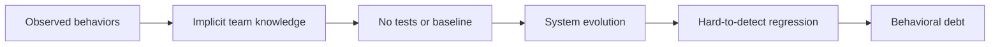
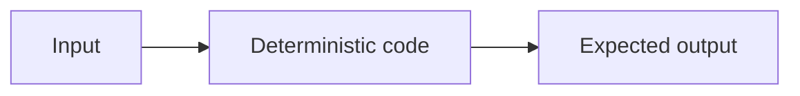
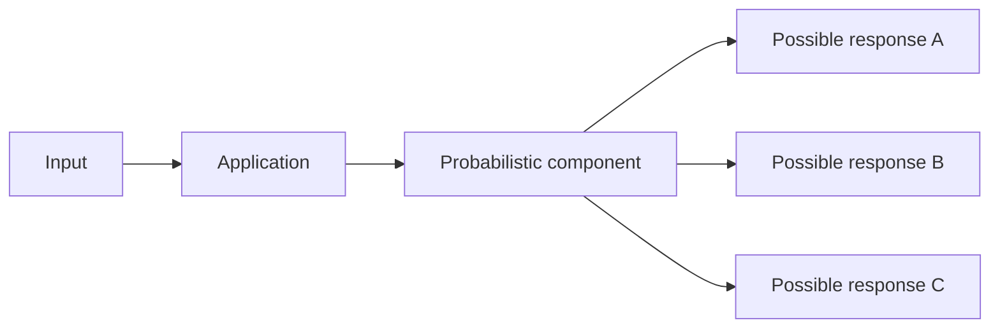
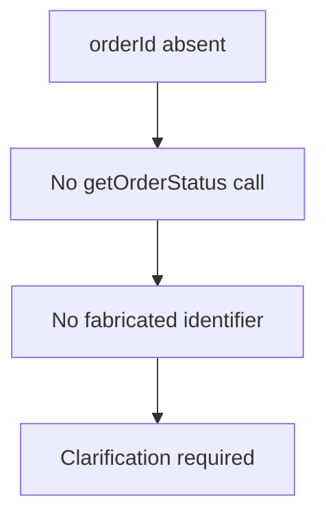
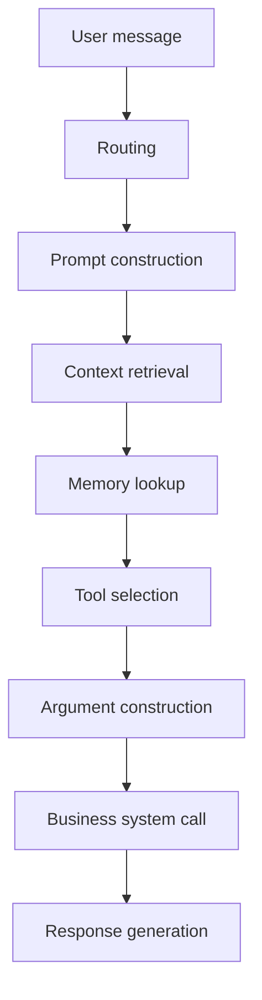
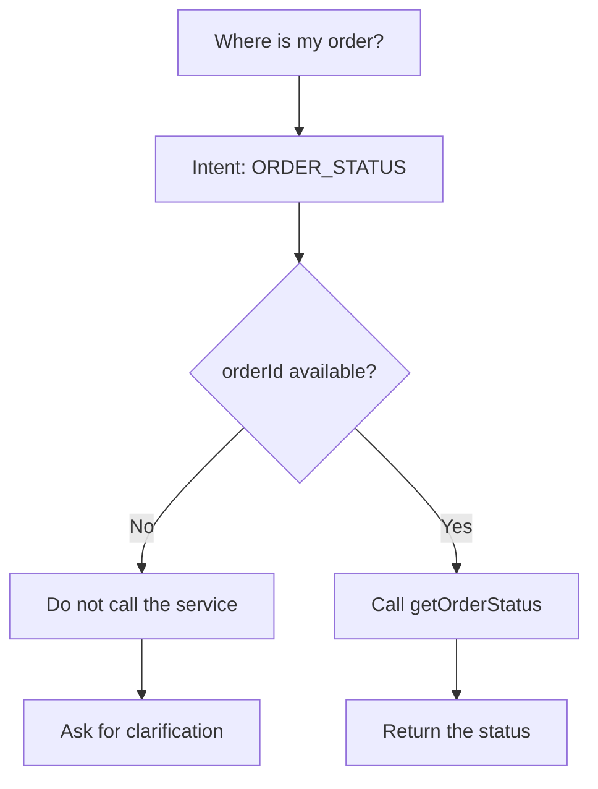
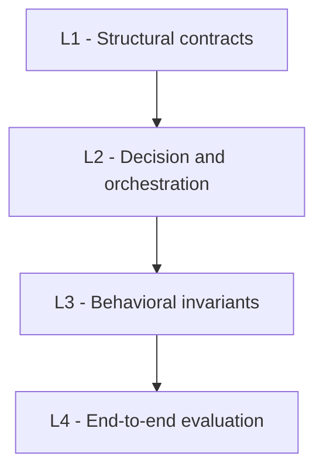
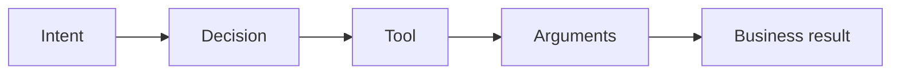
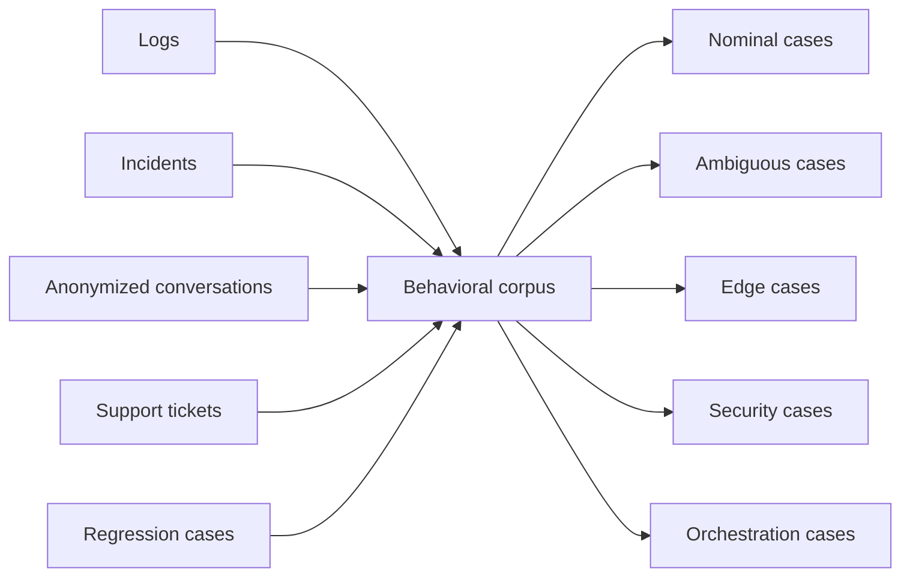
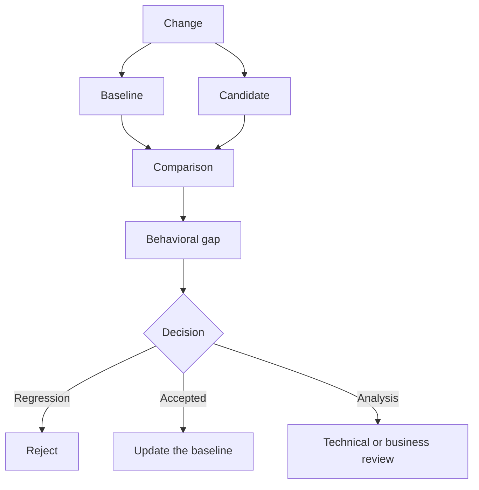

# Freezing the Behavior of an LLM System Before Evolving It

> **Why characterization tests become a governance mechanism for controlling the evolution of applications integrating the capabilities of LLMs.**

Changing the model has become relatively simple.

Sometimes a few configuration lines are enough to replace a provider, try a new version, or switch to another model family. The first results may even look better: more accurate answers, lower latency, lower cost.

The team runs a few manual tests. The main flows work. The change is deployed.

A few days later, a user asks:

> Where is my order?

No order identifier is available in the conversation.

The old version asked for clarification before continuing. The new one tries to fill in the missing information, builds a plausible identifier, and calls the business service directly.

Technically, nothing seems broken.

The API responds. The model produces a coherent sentence. The order tracking service is available.

Yet the system behavior has changed.

This is probably one of the problems we still underestimate when we evolve LLM-based applications.

We compare models. We measure latency. We track costs. *We sometimes evaluate answer quality*.

But are we actually able to say which behaviors changed between two versions of our system?

And more importantly:

> **Did we improve the system, or did we simply move its behavior elsewhere?**

*Characterization tests can answer part of that question*.

Not by trying to make the LLM deterministic, but by making explicit the behaviors we refuse to lose.

---

## We accumulate behavioral debt

In a classic application, a significant part of the system behavior is usually materialized somewhere.

In tests, API contracts, business rules, or, failing that, in code.

It is never perfect. Legacy applications have already taught us that documentation and tests do not always tell the full story.

With LLM applications, another phenomenon appears.

A part of the behavior is known only by the team.

« *Normally, in this case, it asks for clarification.* »

« *With this prompt version, it calls the right tool.* »

« *If no identifier is available, it must not contact the business service.* »

« *This model version works better on this flow.* »

These sentences describe real system behaviors. Yet they are sometimes absent from any test.

We know them because we used the application, handled an incident, or spent hours tuning a prompt.

The system therefore contains behaviors that the team knows implicitly, but cannot automatically replay or protect.

That is what I call here **behavioral debt**.

> **Behavioral debt appears when the system can do something that the team is not yet able to describe as an expected or protected behavior.**

This debt remains almost invisible as long as the system changes slowly.

It becomes much more concrete when we change a model, a prompt, a retriever, a tool, or memory handling.



At that point, we discover that we do not have a precise enough reference to compare before and after.

---

## What legacy software already taught us

This problem is not entirely new.

When we work on a poorly tested legacy application, the first reflex should not be to refactor it.

Before transforming the system, we try to understand what it actually does.

That is one of the roles of characterization tests.

A specification test checks what the system **should do**.

A characterization test starts with a slightly different question:

> **What does the system actually do today?**

The observed behavior may be imperfect. It may even contain a bug.

But before changing it, we want to be able to detect that it changed.

This discipline has long been used to gradually regain control of an existing system.

The difficulty with LLM applications is that we cannot simply record their outputs and compare them character by character.

In a deterministic component, we can usually reason like this:



With the same input and the same state, we expect the same result.

In a system that integrates an LLM, the situation is different:



Several responses can differ in wording while still respecting the same business behavior.

The real question becomes:

> **How do we characterize behavior when the exact output is not the contract?**

The answer starts by accepting that we have sometimes tried to freeze the wrong thing.

---

## Do not freeze the responses, characterize the invariants

Let us return to our order-tracking case.

The user asks:

> Where is my order?

No identifier is present in the conversation.

The model may answer:

> Could you give me your order number?

Or:

> I need the order identifier to check its status.

Or even:

> Which order would you like to check?

These three responses are different.

They can still all be correct.

A test based on strict textual equality would therefore be fragile.

```java
assertThat(response)
    .isEqualTo("Could you give me your order number?");
```

What we want to protect is not that sentence.

We want to protect a set of invariants.



That is where the business contract lives.

Not in the exact wording of the response.

> **We should not freeze the LLM's sentences. We should freeze the system's invariants.**

Some invariants describe what must happen.

The system must ask for clarification.

Others describe forbidden behaviors.

The system must not call the business service without an identifier.

It must not invent an order number.

It must not assume which order the user wants to check.

In a probabilistic system, it is sometimes easier to define what the system **must never do** than to describe the ideal response it should produce.

A characterization case could therefore be represented simply as:

```yaml
case: ORDER_STATUS_WITHOUT_ID

input: "Where is my order?"

state:
  orderId: absent

expected:
  clarificationRequired: true

forbidden:
  - toolCall:getOrderStatus
  - fabricatedOrderId
  - assumedOrderStatus
```

We are not trying to enforce a sentence.

We are trying to protect a decision.

---

## A response is the visible trace of a decision trajectory

A LLM response does not appear spontaneously.

It is usually the result of a chain of processing steps and decisions.



A visible regression in the response may come from the model.

But it can also come from a different document returned by the retriever, a change in context ordering, information retained in memory, a modification in a tool schema, a new routing rule, or a fallback that no longer triggers.

Testing only the final response can sometimes reveal that a behavior changed.

It does not always show where it changed.

I find it more useful to reason in terms of a **decision trajectory**.



The final text remains free.

The trajectory describes the behavior we want to protect.

> **A LLM response is the visible consequence of a decision trajectory. Testing only the consequence means ignoring the path that produced it.**

---

## Not everything should be tested with an LLM

Because an application uses an LLM, we sometimes end up wanting to evaluate the entire system with an LLM.

Yet a large part of its behavior remains deterministic.

I prefer to separate tests into four levels.



### L1 - Structural contracts

Here we test deterministic elements: context construction, tool schemas, structured outputs, configuration, routing rules, transmitted parameters, and policies injected into the prompt.

These are classic software tests.

In Java, JUnit and AssertJ are very good at this work.

They are fast, understandable, and inexpensive.

They should remain our first line of defense.

### L2 — Decision and orchestration

Here we verify the trajectory taken by the system.



Was the right tool selected?

Do the arguments match the actual conversation state?

Was a fallback triggered?

Is the system making the right decision before producing a response?

### L3 — Behavioral invariants

Here we protect business behaviors.

In an educational application:

* guide progressively;
* do not give the solution directly;
* take the student's level into account.

In a banking assistant:

* never expose sensitive data;
* do not start an operation without explicit consent;
* respect authorization rules.

These behaviors belong to the product and the business domain.

### L4 — End-to-end evaluation

This is the level at which we evaluate the complete system: model, retriever, memory, tools, and final response.

At that stage, we can measure semantic quality or use a *LLM-as-a-Judge*.

But this layer should complement the others, never replace them.

> **The more a behavior can be tested without an LLM, the less it should depend on an LLM test.**

---

## The behavioral corpus already often exists

When we start working on the evaluation of an LLM application, the temptation is often to generate several hundred prompts.

I am not convinced that is the best starting point.

The first interesting behaviors are often already present:

* in logs;
* in anonymized conversations;
* in incidents;
* in support tickets;
* in scenarios replayed after each change.

I would start with those.

Not to build a massive dataset immediately.

But to create a **behavioral corpus**.



Each case should describe:

* the input;
* the initial state;
* the context;
* the expected decisions;
* the forbidden behaviors;
* the business invariants.

The best starting corpus is often already in the system traces.

---

## Give LLM-as-a-Judge jurisdiction, not full power

LLM-as-a-Judge is useful.

It can evaluate the quality of an explanation, the respect of a functional scope, or the semantic equivalence of two responses.

However, it should not verify what our system can already control deterministically.

| Behavior                | Mechanism             |
| ----------------------- | --------------------- |
| Tool called             | Assertion in code     |
| Valid arguments         | Validation            |
| Authorization           | Business rule         |
| Mandatory information   | Deterministic assert  |
| Scope compliance        | Semantic evaluation   |
| Explanation quality     | LLM-as-a-Judge        |

> **The question is not only whether LLM-as-a-Judge is reliable. The question is what we give it authority over.**

---

## The behavioral baseline becomes an engineering asset

When we evolve a model, a prompt, a retriever, or a tool, we can compare the current behavior with that of the new version.



The baseline is not just a snapshot.

It represents the system's behavioral reference.

Updating it is an engineering decision, and sometimes even a product or business decision.

The baseline then becomes a knowledge asset about how the system really works.

---

## What I would put in place on an existing project

I would not start by installing a complete LLM evaluation platform.

I would start by:

1. identifying about thirty critical flows;
2. reusing incidents that already happened;
3. making business behaviors explicit;
4. instrumenting model and tool calls;
5. building a first baseline;
6. comparing that baseline before each significant evolution.

For each case, I would simply describe:

```text
Input
State
Expected Decision
Forbidden Decision
Invariant
```

Then I would systematically capture:

```text
model
prompt version
retrieved documents
tool calls
arguments
business result
response
```

The evaluation platforms come later.

They should support a discipline.

Not replace it.

> **Start with thirty behaviors you refuse to break, not three thousand synthetic prompts.**

---

## Characterize before optimizing

LLMs have introduced a probabilistic component into our applications.

They have not removed our responsibility over system behavior.

Changing a model, modifying a prompt, or evolving a retriever should not be just a technical operation followed by a few manual tests.

These are changes that can alter the product's behavior.

Characterization tests bring back an old principle of software engineering: understand and make visible the current behavior before transforming it.

As long as we do not try to freeze the sentences produced by the model.

What we must protect are the decisions, the invariants, and the critical behaviors of the system.

> **An LLM system that cannot be characterized is a system that is evolved by intuition.**

The problem is not that the model is probabilistic.

The problem begins when we can no longer say which behaviors its evolution changed.

---

## Conclusion

Applications integrating the capabilities of LLMs force us to revisit some of our practices, but they do not call the fundamental principles of software engineering into question.

On the contrary, the more probabilistic a system becomes, the more necessary it is to make explicit the behaviors we want to preserve.

Characterization tests are not meant to make an LLM deterministic.

They make it possible to build a behavioral baseline, detect significant changes, and decide, with a clear understanding of the system, which changes should be accepted, corrected, or rejected.

As applications become more agentic, models evolve faster, and orchestration chains grow more complex, this discipline will no longer belong only to software quality.

It will become a central element of AI system governance.

Because, at the end of the day, the question is not whether a model responds differently.

The real question is whether the system still behaves the way we designed it to.

And that is probably where the difference will be made between a convincing demo and a truly industrializable AI application.
