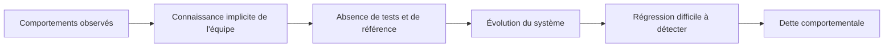
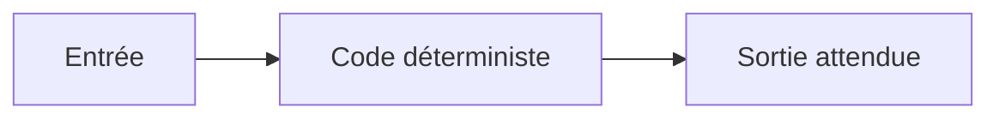
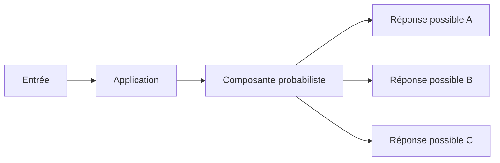
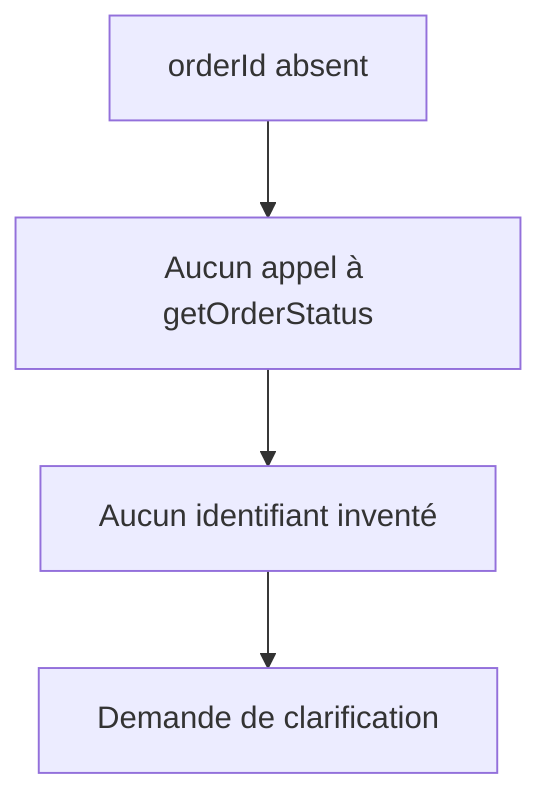
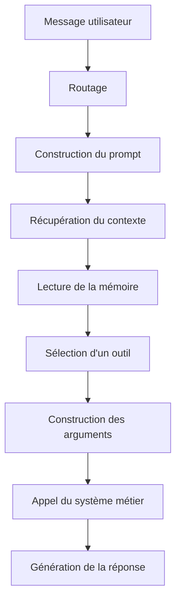
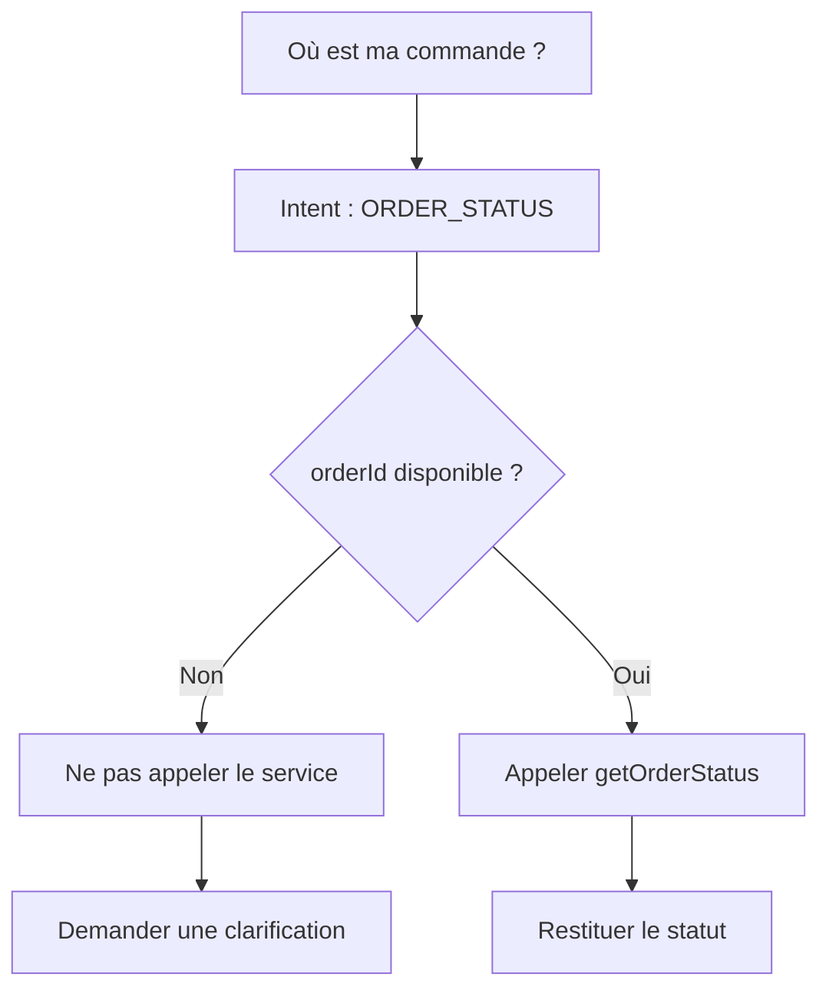
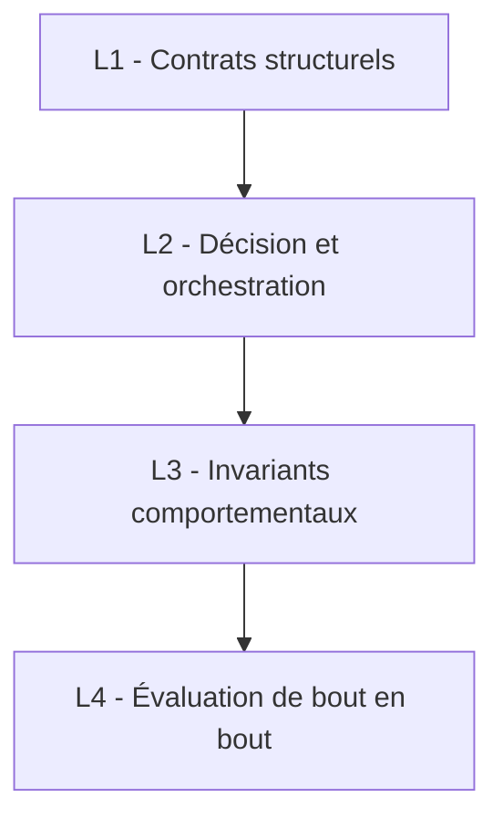
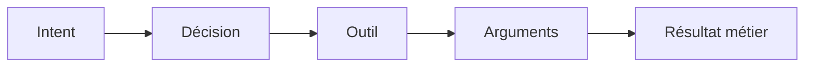
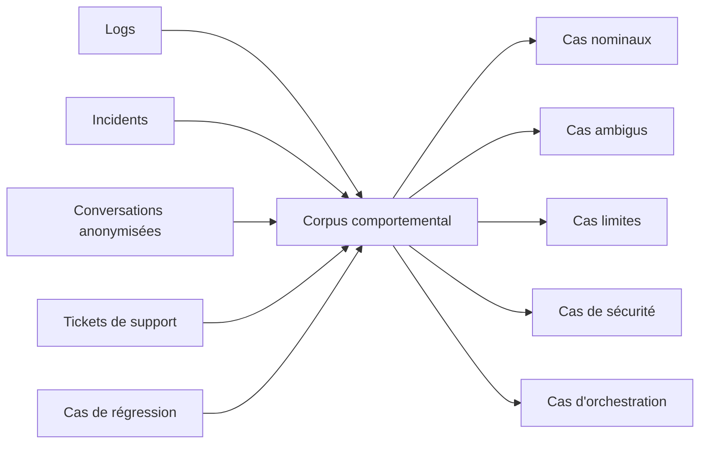
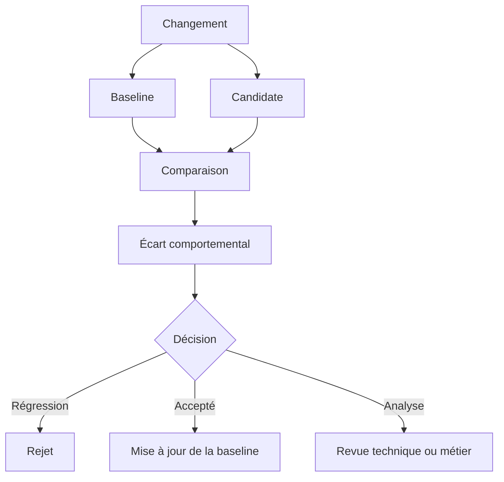

# Figer le comportement d'un système LLM avant de le faire évoluer

> **Pourquoi les tests de caractérisation deviennent un mécanisme de gouvernance pour maîtriser l'évolution des applications intégrant les capacités des LLM.**

Changer de modèle est devenu relativement simple.

Quelques lignes de configuration suffisent parfois pour remplacer un fournisseur, tester une nouvelle version ou basculer vers une autre famille de modèles. Les premiers résultats peuvent même sembler meilleurs : réponses plus précises, latence réduite, coût inférieur.

L'équipe réalise quelques tests manuels. Les principaux parcours fonctionnent. Le changement est déployé.

Quelques jours plus tard, un utilisateur demande :

> Où est ma commande ?

Aucun identifiant de commande n'est disponible dans la conversation.

L'ancienne version demandait une précision avant de poursuivre. La nouvelle tente de compléter l'information manquante, construit un identifiant plausible et appelle directement le service métier.

Techniquement, rien ne semble cassé.

L'API répond. Le modèle produit une phrase cohérente. Le service de suivi de commande est disponible.

Pourtant, le comportement du système a changé.

C'est probablement l'un des problèmes que nous sous-estimons encore lorsque nous faisons évoluer des applications basées sur des LLM.

Nous comparons les modèles. Nous mesurons la latence. Nous suivons les coûts. *Nous évaluons parfois la qualité des réponses*.

Mais sommes-nous réellement capables de dire quels comportements ont changé entre deux versions de notre système ?

Et surtout :

> **Avons-nous amélioré le système ou simplement déplacé son comportement ?**

*Les tests de caractérisation peuvent apporter une partie de la réponse*.

Non pas en essayant de rendre le LLM déterministe, mais en rendant explicites les comportements que nous refusons de perdre.

---

## Nous accumulons une dette comportementale

Dans une application classique, une partie importante du comportement du système est généralement matérialisée quelque part.

Dans les tests, les contrats d'API, les règles métier ou, à défaut, dans le code.

Ce n'est jamais parfait. Les applications legacy nous ont suffisamment appris que la documentation et les tests ne racontent pas toujours toute l'histoire.

Avec les applications LLM, un autre phénomène apparaît.

Une partie du comportement est connue uniquement par l'équipe.

« *Normalement, dans ce cas, il demande une précision.* »

« *Avec cette version du prompt, il appelle le bon outil.* »

« *Si aucun identifiant n'est disponible, il ne doit pas contacter le service métier.* »

« *Cette version du modèle fonctionne mieux sur ce parcours.* »

Ces phrases décrivent des comportements réels du système. Pourtant, elles ne figurent parfois dans aucun test.

Nous les connaissons parce que nous avons utilisé l'application, rencontré un incident ou passé plusieurs heures à ajuster un prompt.

Le système possède alors des comportements que l'équipe connaît implicitement, mais qu'elle ne sait ni rejouer automatiquement ni protéger.

C'est ce que j'appelle ici une **dette comportementale**.

> **La dette comportementale apparaît lorsque le système sait faire quelque chose que l'équipe n'est pas encore capable de décrire comme un comportement attendu ou protégé.**

Cette dette reste presque invisible tant que le système évolue peu.

Elle devient beaucoup plus concrète lorsque nous changeons un modèle, un prompt, un retriever, un outil ou la gestion de la mémoire.



À ce moment-là, nous découvrons que nous ne disposons pas d'une référence suffisamment précise pour comparer l'avant et l'après.

---

## Ce que le logiciel legacy nous a déjà appris

Ce problème n'est pas complètement nouveau.

Lorsque nous intervenons sur une application legacy peu testée, le premier réflexe ne devrait pas être de la refactorer.

Avant de transformer le système, nous cherchons à comprendre ce qu'il fait réellement.

C'est l'un des rôles des tests de caractérisation.

Un test de spécification vérifie ce que le système **devrait faire**.

Un test de caractérisation commence par une question légèrement différente :

> **Que fait réellement le système aujourd'hui ?**

Le comportement observé peut être imparfait. Il peut même contenir une anomalie.

Mais avant de le modifier, nous voulons être capables de détecter qu'il a changé.

Cette discipline est utilisée depuis longtemps pour reprendre progressivement le contrôle d'un système existant.

La difficulté avec les applications LLM est que nous ne pouvons pas simplement enregistrer leurs sorties et les comparer caractère par caractère.

Dans un composant déterministe, nous pouvons généralement raisonner ainsi :



À entrée et état identiques, nous attendons le même résultat.

Dans un système intégrant un LLM, la situation est différente :



Plusieurs réponses peuvent différer dans leur formulation tout en respectant le même comportement métier.

La vraie question devient alors :

> **Comment caractériser un comportement lorsque la sortie exacte n'est pas le contrat ?**

La réponse commence par accepter que nous avons parfois essayé de figer la mauvaise chose.

---

## Ne pas figer les réponses, mais caractériser les invariants

Reprenons notre cas de suivi de commande.

L'utilisateur demande :

> Où est ma commande ?

Aucun identifiant n'est présent dans la conversation.

Le modèle peut répondre :

> Pouvez-vous me communiquer votre numéro de commande ?

Ou :

> J'ai besoin de l'identifiant de la commande pour vérifier son statut.

Ou encore :

> Quelle commande souhaitez-vous consulter ?

Ces trois réponses sont différentes.

Elles peuvent pourtant être toutes les trois correctes.

Un test fondé sur une stricte égalité textuelle serait donc fragile.

```java
assertThat(response)
    .isEqualTo("Pouvez-vous me communiquer votre numéro de commande ?");
```

Ce que nous voulons protéger n'est pas cette phrase.

Nous voulons protéger un ensemble d'invariants.



Le contrat métier se trouve ici.

Pas dans la formulation exacte de la réponse.

> **Nous ne devons pas figer les phrases du LLM. Nous devons figer les invariants du système.**

Certains invariants décrivent ce qui doit se produire.

Le système doit demander une précision.

D'autres décrivent des comportements interdits.

Le système ne doit pas appeler le service métier sans identifiant.

Il ne doit pas inventer un numéro de commande.

Il ne doit pas supposer quelle commande l'utilisateur souhaite consulter.

Dans un système probabiliste, il est parfois plus simple de définir ce que le système **ne doit jamais faire** que de décrire la réponse idéale qu'il devrait produire.

Un cas de caractérisation pourrait ainsi être représenté simplement :

```yaml
case: ORDER_STATUS_WITHOUT_ID

input: "Où est ma commande ?"

state:
  orderId: absent

expected:
  clarificationRequired: true

forbidden:
  - toolCall:getOrderStatus
  - fabricatedOrderId
  - assumedOrderStatus
```

Nous ne cherchons pas à imposer une phrase.

Nous cherchons à protéger une décision.

---

## Une réponse est la trace visible d'une trajectoire de décision

Une réponse LLM n'apparaît pas spontanément.

Elle est généralement la conséquence d'une chaîne de traitements et de décisions.



Une régression visible dans la réponse peut provenir du modèle.

Mais elle peut aussi provenir d'un document différent remonté par le retriever, d'un changement dans l'ordre du contexte, d'une information conservée dans la mémoire, d'une modification du schéma d'un outil, d'une nouvelle règle de routage ou d'un fallback qui ne se déclenche plus.

Tester uniquement la réponse finale permet parfois de détecter qu'un comportement a changé.

Cela ne permet pas toujours de comprendre où il a changé.

Je trouve plus utile de raisonner en **trajectoire de décision**.



Le texte final reste libre.

La trajectoire décrit le comportement que nous souhaitons protéger.

> **Une réponse LLM est la conséquence visible d'une trajectoire de décision. Tester uniquement la conséquence revient à ignorer le chemin qui l'a produite.**

---

## Tout ne doit pas être testé avec un LLM

Parce qu'une application utilise un LLM, nous finissons parfois par vouloir évaluer l'ensemble du système avec un LLM.

Pourtant, une grande partie de son comportement reste déterministe.

Je préfère séparer les tests en quatre niveaux.



### L1 - Contrats structurels

Nous testons ici les éléments déterministes : construction du contexte, schémas des outils, sorties structurées, configuration, règles de routage, paramètres transmis et politiques injectées dans le prompt.

Ce sont des tests logiciels classiques.

En Java, JUnit et AssertJ savent très bien faire ce travail.

Ils sont rapides, explicables et peu coûteux.

Ils doivent rester notre première ligne de défense.

### L2 - Décision et orchestration

Nous vérifions ici la trajectoire prise par le système.



Le bon outil a-t-il été sélectionné ?

Les arguments correspondent-ils à l'état réel de la conversation ?

Un fallback a-t-il été déclenché ?

Le système prend-il la bonne décision avant de produire une réponse ?

### L3 - Invariants comportementaux

Nous protégeons ici les comportements métier.

Dans une application éducative :

* guider progressivement ;
* ne pas donner directement la solution ;
* prendre en compte le niveau de l'élève.

Dans un assistant bancaire :

* ne jamais exposer une donnée sensible ;
* ne pas initier une opération sans consentement explicite ;
* respecter les règles d'autorisation.

Ces comportements appartiennent au produit et au métier.

### L4 - Évaluation de bout en bout

C'est à ce niveau que nous évaluons le système complet : modèle, retriever, mémoire, outils et réponse finale.

Nous pouvons alors mesurer la qualité sémantique ou utiliser un *LLM-as-a-Judge*.

Mais cette couche doit compléter les autres, jamais les remplacer.

> **Plus un comportement peut être testé sans LLM, moins il devrait dépendre d'un test LLM.**

---

## Le corpus comportemental existe souvent déjà

Lorsque l'on commence à travailler sur l'évaluation d'une application LLM, la tentation est souvent de générer plusieurs centaines de prompts.

Je ne suis pas certain que ce soit le meilleur point de départ.

Les premiers comportements intéressants sont souvent déjà présents :

* dans les logs ;
* dans les conversations anonymisées ;
* dans les incidents ;
* dans les tickets de support ;
* dans les scénarios rejoués après chaque évolution.

Je commencerais par ces éléments.

Pas pour construire immédiatement un jeu de données massif.

Mais pour créer un **corpus comportemental**.



Chaque cas devrait décrire :

* l'entrée ;
* l'état initial ;
* le contexte ;
* les décisions attendues ;
* les comportements interdits ;
* les invariants métier.

Le meilleur corpus de départ est souvent déjà dans les traces du système.

---

## Donner au LLM-as-a-Judge une juridiction, pas les pleins pouvoirs

Le LLM-as-a-Judge est utile.

Il peut évaluer la qualité d'une explication, le respect d'un périmètre fonctionnel ou l'équivalence sémantique de deux réponses.

En revanche, il ne devrait pas vérifier ce que notre système sait déjà contrôler de manière déterministe.

| Comportement             | Mécanisme              |
| ------------------------ | ---------------------- |
| Outil appelé             | Assertion dans le code |
| Arguments valides        | Validation             |
| Autorisation             | Règle métier           |
| Information obligatoire  | Assertion déterministe |
| Respect du périmètre     | Évaluation sémantique  |
| Qualité de l'explication | LLM-as-a-Judge         |

> **La question n'est pas seulement de savoir si le LLM-as-a-Judge est fiable. La question est de définir sur quoi nous lui donnons autorité.**

---

## La baseline comportementale devient un actif d'ingénierie

Lorsque nous faisons évoluer un modèle, un prompt, un retriever ou un outil, nous pouvons comparer le comportement actuel avec celui de la nouvelle version.



La baseline n'est pas un simple snapshot.

Elle représente la référence comportementale du système.

Sa mise à jour est une décision d'ingénierie, parfois même une décision produit ou métier.

La baseline devient alors un actif de connaissance sur le fonctionnement réel du système.

---

## Ce que je mettrais en place sur un projet existant

Je ne commencerais pas par installer une plateforme complète d'évaluation LLM.

Je commencerais par :

1. identifier une trentaine de parcours critiques ;
2. reprendre les incidents déjà rencontrés ;
3. expliciter les comportements métier ;
4. instrumenter les appels au modèle et aux outils ;
5. construire une première baseline ;
6. comparer cette baseline avant chaque évolution significative.

Pour chaque cas, je décrirais simplement :

```text
Input
State
Expected Decision
Forbidden Decision
Invariant
```

Puis je capturerais systématiquement :

```text
model
prompt version
retrieved documents
tool calls
arguments
business result
response
```

Les plateformes d'évaluation viendront ensuite.

Elles doivent outiller une discipline.

Pas la remplacer.

> **Commencez par trente comportements que vous refusez de casser, pas par trois mille prompts synthétiques.**

---

## Caractériser avant d'optimiser

Les LLM ont introduit une composante probabiliste dans nos applications.

Ils n'ont pas supprimé notre responsabilité sur le comportement du système.

Changer de modèle, modifier un prompt ou faire évoluer un retriever ne devrait pas être uniquement une opération technique suivie de quelques tests manuels.

Ce sont des changements susceptibles de modifier le comportement du produit.

Les tests de caractérisation permettent de reprendre un principe ancien de l'ingénierie logicielle : comprendre et rendre visible le comportement actuel avant de le transformer.

À condition de ne pas chercher à figer les phrases produites par le modèle.

Ce que nous devons protéger, ce sont les décisions, les invariants et les comportements critiques du système.

> **Un système LLM que l'on ne sait pas caractériser est un système que l'on fait évoluer à l'intuition.**

Le problème n'est pas que le modèle soit probabiliste.

Le problème commence lorsque nous sommes incapables de dire quels comportements son évolution vient de modifier.

---

## Conclusion

Les applications intégrant les capacités des LLM nous obligent à revoir certaines de nos pratiques, mais elles ne remettent pas en cause les principes fondamentaux de l'ingénierie logicielle.

Au contraire, plus un système devient probabiliste, plus il devient nécessaire de rendre explicites les comportements que nous souhaitons préserver.

Les tests de caractérisation ne cherchent pas à rendre un LLM déterministe.

Ils permettent de construire une référence comportementale, de détecter les évolutions significatives et de décider, en connaissance de cause, quels changements doivent être acceptés, corrigés ou rejetés.

À mesure que les applications deviennent plus agentiques, que les modèles évoluent plus rapidement et que les chaînes d'orchestration gagnent en complexité, cette discipline ne relèvera plus uniquement de la qualité logicielle.

Elle deviendra un élément central de la gouvernance des systèmes d'intelligence artificielle.

Car, au fond, la question n'est pas de savoir si un modèle répond différemment.

La véritable question est de savoir si le système se comporte toujours comme nous l'avons conçu.

Et c'est probablement là que se jouera la différence entre une démonstration convaincante et une application d'IA réellement industrialisable.
