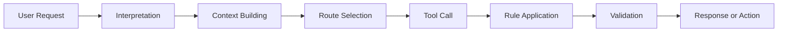

# Decision Trajectory

## Reconstruct the Path Followed by an LLM System to Understand, Compare, and Govern Its Decisions

When an application with LLM capabilities produces an incorrect response, analysis often begins with the visible result.

Was the answer relevant? Were the provided facts accurate? Was the tone appropriate? Was the expected action executed?

These questions are necessary, but they remain insufficient.

A response is only the visible part of system behavior. Before producing it, the application interpreted a request, built a context, selected a route, retrieved data, called one or more tools, applied rules, and sometimes triggered validation.

The final result depends on this succession of decisions.

In the <a href="/en/blog/figer-comportement-systeme-llm" target="_blank" rel="noopener noreferrer">first article of this series</a>, we saw why it was necessary to **freeze the behavior of an LLM system before evolving it**. The goal was to establish a baseline to compare the system before and after modification.

In the <a href="/en/blog/observer-avant-doptimiser" target="_blank" rel="noopener noreferrer">second article, “Observe Before Optimizing”</a>, we expanded the scope of observability. It is not enough to track latency, technical errors, or token consumption. We must also make visible the data, decisions, tools, and validations that produce the behavior.

Once these events are made observable, a new question emerges:

> How can we link this information to understand the path actually followed by the system?

This is precisely the role of decision trajectory.

---

## A Response Does Not Tell How It Was Produced

Two systems can produce almost identical responses while following very different paths.

Imagine a banking application capable of responding to a request for a payment limit increase.

In a first execution, the system:

1. correctly identifies the customer's intent;
2. retrieves their profile and risk level;
3. verifies eligibility rules;
4. determines that automatic increase is not authorized;
5. transfers the request to an advisor.

In a second execution, the system:

1. identifies the same intent;
2. does not retrieve risk-related information;
3. relies only on data present in the conversation;
4. generates a response indicating the request will be reviewed;
5. does not trigger any transfer to an advisor.

To the user, the responses might seem similar. In both cases, they understand that their request is not immediately accepted.

Yet the system's behavior is fundamentally different.

In the first case, the response results from a compliant trajectory: the necessary data was consulted, business rules were applied, and the expected escalation was triggered.

In the second case, the generated text masks a break in the process. Important data was not retrieved, a rule was not applied, and the business action was not executed.

If evaluation focuses only on the textual response, this drift can remain invisible.

The system appears to still be working. In reality, it is no longer making decisions the same way.

---

## From Result to Trajectory

A decision trajectory represents the succession of steps followed by the system between the user's request and the final result.

It can be described as follows:



This diagram is intentionally generic. Not all applications have exactly the same steps, and a real execution is rarely this linear.

The system may call multiple tools, reconsider an interpretation, complete its context, handle a failure, or request human validation. Some steps may be absent, repeated, or executed in parallel.

The trajectory therefore does not aim to impose a single workflow. It provides a structured representation of what actually happened.

It enables answering questions that typically remain unanswered when observing only the output:

* What intent did the system recognize?
* Which data was added to the context?
* Which route was selected?
* Which tool was called?
* With which parameters?
* Which business rule was evaluated?
* Which result influenced the next decision?
* Was validation expected?
* Which action was actually executed?

This information transforms an opaque execution into a sequence that can be analyzed, compared, and governed.

---

## Decision Trajectory Is Not the Model's Chain of Thought

Discussing decision trajectory can create confusion with the model's internal reasoning.

The goal is not to record or expose a supposed detailed thought process of the LLM. An application does not need access to internal chain of thought to understand its own behavior.

What interests us is at the system level.

The application knows the instructions it selected, the documents it retrieved, the routes it took, the tools it called, the parameters it passed, the rules it applied, and the validations it requested.

These elements are observable because they belong to the application's architecture and orchestration.

Decision trajectory does not seek to explain every token generated by the model. It seeks to reconstruct the controllable decisions surrounding its use.

This distinction is important.

The LLM can remain probabilistic, but the application that frames it must be able to account for the structural choices it makes.

---

## Reconstructing Execution as a Sequence of Events

To make a trajectory actionable, each important step can be represented as an event.

An event describes what happened at a specific moment:

* an intent was detected;
* a data source was selected;
* a document was retrieved;
* a tool was called;
* a rule was evaluated;
* a validation failed;
* an action was authorized;
* a human escalation was triggered.

Each event must be linked to the same execution through a correlation ID. It then becomes possible to reconstruct the complete sequence, from the initial request to the business result.

An event can contain information such as:

```yaml
execution_id: exec-2026-04582
step: tool_call
timestamp: 2026-07-28T10:32:14Z
component: customer-risk-service
decision: retrieve_customer_risk
input_reference: customer-18452
result: risk_level_high
status: success
next_step: manual_review
```

The goal is not to record everything indiscriminately. A trace that is too detailed quickly becomes expensive, unreadable, and hard to exploit.

We must capture information that explains the system's important transitions.

Why was this source consulted? Why was this tool selected? Why was the automated route abandoned? Why was human validation requested?

The value of a trajectory does not depend on the volume of data collected. It depends on its ability to make decisions comprehensible.

---

## From Interpretation to Action

The trajectory begins as soon as the request is interpreted.

### Interpreting the Request

Before calling a tool or generating a response, the system builds a representation of what the user is trying to achieve.

This interpretation can include:

* the detected intent;
* identified entities;
* expressed constraints;
* confidence level;
* remaining ambiguities;
* potential need for clarification.

This first step influences everything that follows.

An interpretation error can lead the system to build unsuitable context, select the wrong route, or call a tool that does not match the actual need.

In our banking example, the phrase "I would like to be able to pay a bill for 3,000 euros" can be interpreted as a request for information about limits, as a request for temporary increase, or as an intention to perform a transaction immediately.

The appropriate response depends on this distinction.

### Building Context

Once the intent is identified, the system gathers the information needed to execute.

This context can include conversation history, instructions, user data, retrieved documents, business rules, or results from previous steps.

Context building is a decision in itself.

Two executions can use the same model and the same apparent prompt, yet produce different behaviors because they do not mobilize the same data.

An actionable trajectory must therefore indicate which sources were consulted, which elements were retained, and when relevant, why some elements were excluded.

It is not necessarily required to store complete documents or sensitive data in traces. References, identifiers, versions, or fingerprints can suffice to reconstruct the source of the context.

### Choosing a Route

Many LLM applications do not follow a single workflow.

Depending on the request, they may:

* respond directly;
* perform document search;
* consult a business service;
* trigger a specialized agent;
* request clarification;
* transfer the request to a human;
* refuse an action.

Routing is one of the most sensitive points in the trajectory.

An incorrect route can produce a convincing response while bypassing the expected process.

An assistant might, for example, generate a response from its general knowledge when the situation requires consulting a contract database. The text might seem coherent, but the trajectory is not acceptable.

Observing routing reveals not only which route was selected, but also which criteria guided that selection.

### Calling a Tool

Calling a tool often transforms a conversation into an action.

The system can search for information, create a file, calculate an amount, modify data, trigger a payment, or send a notification.

At this level, the trajectory must make several elements visible:

* the selected tool;
* the requested operation;
* the transmitted parameters;
* the returned result;
* encountered errors;
* potential retries;
* the impact of the result on the next step.

A simple technical status is not always enough.

A call can be technically successful while returning incomplete or inconsistent business data. Conversely, a technical failure can lead the system to choose a perfectly acceptable fallback route.

The trajectory must therefore connect the technical result and its business meaning.

### Applying Rules

In an enterprise application, the model should not be the sole decision-maker.

Business rules, regulatory constraints, security policies, and risk thresholds must remain explicit and controllable.

The trajectory must show which rules were evaluated, in what version, and with what result.

This information becomes essential when rules evolve.

A difference between two executions may stem not from the model, but from a new version of an eligibility policy, a modified threshold, or a change in the order of control application.

Without this visibility, the change risks being wrongly attributed to the LLM.

### Validating Before Acting

Not all decisions can be executed automatically.

Some require additional validation:

* output schema validation;
* critical data verification;
* compliance check;
* user confirmation;
* human approval;
* amount or risk level validation.

Validation often constitutes the last barrier between an intermediate decision and an irreversible action.

The trajectory must indicate whether this validation was executed, bypassed, failed, or deemed unnecessary.

A correct response obtained without required validation is not compliant behavior.

### Producing a Response or Executing an Action

The final result can be text, but also a transformation, recommendation, update, or business action.

It is important to distinguish what the system announced from what it actually executed.

An assistant might claim a request was transferred when no operation was performed. It might also trigger the correct action while generating an ambiguous confirmation.

The trajectory must therefore connect the conversational output to the actual business result.

This distinction prevents confusing message quality with operation success.

---

## Two Similar Responses, Two Different Risk Levels

Let us take a more concrete example.

A user asks:

> Can I get a refund for this order?

In a first execution, the system retrieves the order, checks its date, consults the applicable refund policy, determines the product is eligible, and offers to start the process.

In a second execution, the system recognizes the topic, finds a general policy in its context, and produces a similar response, but does not consult the actual order.

Both responses could be worded as:

> Your order appears eligible for a refund. I can guide you through the process.

An evaluation focusing only on text might consider both results equivalent.

They are not.

The first response is based on effective verification. The second relies on generalization.

The difference is not stylistic. It concerns the level of proof, decision compliance, and the risk of committing an unjustified action.

Comparing trajectories allows detecting this type of divergence before it produces a visible incident.

---

## Comparing Trajectories Rather Than Outputs Alone

When a system evolves, comparing responses remains useful. It allows evaluating writing quality, relevance, completeness, or output stability.

But it must be complemented by comparing trajectories.

This comparison can cover several dimensions:

* recognized intent;
* consulted sources;
* retained documents;
* selected route;
* called tools;
* used parameters;
* evaluated rules;
* executed validations;
* triggered actions.

A modification can be considered acceptable even if the trajectory changes, provided that change is expected and controlled.

For example, a new version might replace two successive calls with a single, more reliable and less expensive tool. The trajectory evolves, but this evolution corresponds to intentional optimization.

Conversely, a trajectory can drift silently.

The system might stop consulting an important source, bypass a rule, multiply unnecessary calls, or trigger an automated route more frequently at the expense of human validation.

The final text does not always reveal these changes.

This is why a behavioral baseline should not contain only input and output examples. It should also describe expected invariants in the trajectory.

For a given request, one might require that:

* the contract policy is consulted;
* customer identity is verified;
* no action is executed without confirmation;
* high risk level triggers escalation;
* a response is never produced from the model's general knowledge alone.

These invariants provide more robust comparison criteria than text similarity alone.

---

## From Good Response to Acceptable Trajectory

In a traditional application, a test often verifies that a given input produces the expected output.

With an LLM system, this approach becomes more difficult. Multiple formulations can be valid, and the same request can produce slightly different responses.

Trajectory allows shifting part of verification toward more stable properties.

The question is no longer simply:

> Did the system produce exactly the expected response?

It becomes:

> Did the system follow an acceptable trajectory to produce its result?

An acceptable trajectory can be defined by explicit constraints:

* certain data must always be consulted;
* certain tools can only be called in specific contexts;
* certain rules must always be applied;
* certain actions require confirmation;
* certain situations must trigger human escalation;
* certain routes are forbidden when confidence is insufficient.

This approach does not seek to make the system entirely deterministic.

It aims to constrain variability where it can be accepted and impose invariants where it presents a risk.

The model can retain freedom in formulating the response. It should not have the same freedom in accessing data, applying rules, or executing sensitive actions.

---

## Trajectory as an Investigation Tool

When an incident occurs, technical logs usually show that a call failed or an exception occurred.

But many behavioral incidents produce no technical error.

The system might take an unsuitable route, use the wrong source, misinterpret data, or skip validation while returning a response with HTTP 200 status.

The trajectory then provides an investigation support.

It allows locating when behavior began to diverge:

* was the initial intent incorrect?
* was the context incomplete?
* did document retrieval return irrelevant content?
* did the router select the wrong workflow?
* did the tool receive wrong parameters?
* was a rule incorrectly evaluated?
* was final validation bypassed?

This sequential reading avoids immediately concentrating analysis on the model.

In many cases, the cause lies elsewhere: in data, routing, tools, rules, interface contracts, or orchestration.

The LLM becomes a trajectory component, not the default explanation for all unexpected behavior.

---

## Trajectory as a Governance Tool

Governing an LLM system cannot be limited to a list of principles.

It must be translatable into the actual functioning of the application.

Trajectory provides this link between defined policies and their effective application.

An organization can decide that high-impact decisions must be based on an official source. This rule must appear in observed trajectories.

It can require that financial actions need explicit confirmation. The trajectory must show passage through this validation.

It can demand that ambiguous requests be transferred to a human. Routing must make this constraint verifiable.

Governance becomes observable.

It is no longer just asserting that the system respects certain rules, but demonstrating how they were applied during an execution.

This capability becomes particularly important when multiple components evolve independently: model, prompts, tools, rules, document index, memory, router, or business services.

Trajectory allows measuring the real effect of these changes on overall behavior.

---

## Designing Truly Actionable Trajectories

Implementing a decision trajectory is not about adding scattered logs in code.

It requires coherent representation of execution.

Each step should use common vocabulary, stable identifiers, and understandable statuses. Events must be linkable and placed in their execution order.

It is also useful to distinguish multiple information levels.

The first level answers: **what happened?**

The second explains: **why was this decision made?**

The third clarifies: **what effect did this decision have on what followed?**

Take a routing example.

Simply indicating that the `manual_review` route was selected remains limited.

A more actionable trace would clarify that this route was chosen because the risk level exceeded the threshold allowed for automatic processing, and that this decision halted execution of the initially requested action.

The trajectory gains value without reproducing detailed internal reasoning.

---

## Do Not Confuse With Simple Distributed Tracing

Distributed tracing tools constitute an important foundation.

They allow tracking calls between services, measuring latencies, visualizing dependencies, and correlating technical errors.

But a technical trace does not automatically represent a decision trajectory.

A span might indicate that a search service was called. It does not necessarily specify why this search was necessary, which decision led to this call, or how its result changed what followed.

Behavioral trajectory adds this semantic dimension.

It relies on existing observability mechanisms, but gives them a decision-oriented reading.

There is no need to create entirely separate infrastructure. Rather, enrich technical traces with business and decision events that enable understanding behavior.

---

## Finding the Right Level of Granularity

A trajectory that is too sparse cannot explain an execution.

A trajectory that is too detailed becomes hard to read, expensive to store, and potentially dangerous if it exposes sensitive data.

The right granularity depends on the application's associated risk.

An internal documentation assistant will not have the same requirements as a system capable of triggering payments, recommending medical decisions, or initiating administrative procedures.

The greater the decision's impact, the more the trajectory must make visible sources, rules, validations, and responsibilities.

Some information can be kept as references rather than raw content. Personal data must be masked or anonymized. Retention periods must be defined. Trace access must be controlled.

Observing behavior must not create a new security or privacy risk.

Trajectory must be designed as a governance object in its own right.

---

## How Trajectory Changes Testing

Once trajectories are available, tests can verify more than the final response.

They can ensure that sensitive requests always take a controlled route, that a required tool was called, that a rule was evaluated, or that human validation was triggered.

Assertions then become behavioral.

For a refund request, a test can accept multiple response formulations while requiring that the order and applicable policy were consulted.

For a payment request, the test can tolerate different explanations, but reject any trajectory that executes the action without confirmation.

For document search, the test can verify that the response relies on authorized and sufficiently recent sources.

This approach reduces dependence on fragile text comparisons.

It also allows detecting regressions not yet visible in output.

---

## A Foundation for Governing Action-Capable Systems

This becomes even more important when the system does more than respond.

As soon as it can call tools, modify data, or trigger operations, trajectory becomes a control requirement.

An action should not be considered safe simply because its result seems correct.

We must be able to establish:

* what triggered it;
* which data it relied on;
* which rules authorized it;
* which validations were performed;
* the identity of the responsible component or person;
* the consequences produced.

Trajectory thus links the initial intent to the actual action.

It becomes a form of execution proof.

This proof does not guarantee all decisions will be perfect. It does enable making errors analyzable, evolutions comparable, and responsibilities more explicit.

---

## Make Behavior Visible Before Trying to Fix It

When an LLM system produces an unexpected result, temptation often leads to modifying the prompt, changing the model, or adding new instructions.

These adjustments can improve some cases, but sometimes occur before the real cause is understood.

Without trajectory, it is hard to know if the problem comes from interpretation, context, data retrieval, routing, a tool, a rule, or final generation.

The system risks being corrected locally, without treating the source of drift.

Reconstructing trajectory changes the order of operations.

It is no longer about immediately modifying the most visible component. It is first about identifying the step where behavior diverged from what was expected.

This discipline brings LLM systems closer to engineering practices already used for understanding distributed systems and complex business processes.

We do not optimize what we cannot observe.

Similarly, we cannot govern a decision whose path we cannot reconstruct.

---

## Conclusion

An LLM system's behavior is not limited to the text it produces.

It is built through a succession of interpretations, selections, calls, rules, validations, and actions.

Decision trajectory makes this succession visible.

It allows understanding why a response was produced, comparing two versions of the system, and verifying that important decisions follow acceptable paths.

It also reveals a limitation of output-focused evaluations: two similar responses can mask fundamentally different behaviors.

One can result from a compliant process, based on correct data and validations. The other can be the result of a shortcut, omission, or bypass that has not yet produced a visible error.

Reconstructing trajectories does not eliminate LLM system variability. It allows knowing where it appears, how it propagates, and how far it can be accepted.

Once trajectories are observable, a new step becomes necessary: identifying the precise zones where behavior can vary, drift, or regress.

Interpretation, context, data retrieval, routing, tools, rules, validation, or final action: each of these zones constitutes a behavioral surface.

These are the surfaces that must then be mapped to determine where to observe, where to test, and where to place safeguards.