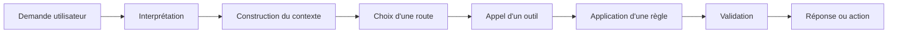

# La trajectoire de décision

## Reconstituer le chemin suivi par un système LLM pour comprendre, comparer et gouverner ses décisions

Lorsqu'une application intégrant les capacités d'un LLM produit une réponse incorrecte, l'analyse commence souvent par le résultat visible.

La réponse était-elle pertinente ? Les informations fournies étaient-elles exactes ? Le ton était-il approprié ? L'action attendue a-t-elle été exécutée ?

Ces questions sont nécessaires, mais elles restent insuffisantes.

Une réponse n'est que la partie visible du comportement du système. Avant de la produire, l'application a interprété une demande, construit un contexte, sélectionné une route, récupéré des données, appelé un ou plusieurs outils, appliqué des règles et parfois déclenché une validation.

Le résultat final dépend de cette succession de décisions.

Dans le premier article de cette série, nous avons vu pourquoi il était nécessaire de **figer le comportement d'un système LLM avant de le faire évoluer**. L'objectif était d'établir une baseline permettant de comparer le système avant et après une modification.

Dans le deuxième article, **Observer avant d'optimiser**, nous avons élargi le périmètre de l'observabilité. Il ne suffit pas de suivre la latence, les erreurs techniques ou la consommation de tokens. Il faut également rendre visibles les données, les décisions, les outils et les validations qui participent à la production du comportement.

Une fois ces événements rendus observables, une nouvelle question apparaît :

> Comment relier ces informations pour comprendre le chemin réellement suivi par le système ?

C'est précisément le rôle de la trajectoire de décision.

---

## Une réponse ne raconte pas comment elle a été produite

Deux systèmes peuvent produire des réponses presque identiques tout en ayant suivi des chemins très différents.

Imaginons une application bancaire capable de répondre à une demande de relèvement de plafond de paiement.

Dans une première exécution, le système :

1. identifie correctement l'intention du client ;
2. récupère son profil et son niveau de risque ;
3. vérifie les règles d'éligibilité ;
4. constate que le relèvement automatique n'est pas autorisé ;
5. transmet la demande à un conseiller.

Dans une seconde exécution, le système :

1. identifie la même intention ;
2. ne récupère pas les informations relatives au risque ;
3. s'appuie uniquement sur les données présentes dans la conversation ;
4. génère une réponse indiquant que la demande sera examinée ;
5. ne déclenche aucune transmission vers un conseiller.

Pour l'utilisateur, les réponses peuvent sembler proches. Dans les deux cas, il comprend que sa demande n'est pas immédiatement acceptée.

Pourtant, le comportement du système est profondément différent.

Dans le premier cas, la réponse résulte d'une trajectoire conforme : les données nécessaires ont été consultées, les règles métier ont été appliquées et l'escalade attendue a été déclenchée.

Dans le second cas, le texte généré masque une rupture dans le processus. Une donnée importante n'a pas été récupérée, une règle n'a pas été appliquée et l'action métier n'a pas été exécutée.

Si l'évaluation porte uniquement sur la réponse textuelle, cette dérive peut rester invisible.

Le système semble toujours fonctionner. En réalité, il ne prend plus ses décisions de la même manière.

---

## Du résultat à la trajectoire

La trajectoire de décision représente la succession des étapes suivies par le système entre la demande utilisateur et le résultat final.

Elle peut être décrite sous la forme suivante :



Ce schéma est volontairement générique. Toutes les applications ne possèdent pas exactement les mêmes étapes, et une exécution réelle est rarement aussi linéaire.

Le système peut appeler plusieurs outils, revenir sur une interprétation, compléter son contexte, gérer un échec ou demander une validation humaine. Certaines étapes peuvent être absentes, répétées ou exécutées en parallèle.

La trajectoire n'a donc pas pour objectif d'imposer un workflow unique. Elle fournit une représentation structurée de ce qui s'est effectivement produit.

Elle permet de répondre à des questions qui restent généralement sans réponse lorsque l'on observe uniquement la sortie :

* Quelle intention le système a-t-il reconnue ?
* Quelles données ont été ajoutées au contexte ?
* Quelle route a été sélectionnée ?
* Quel outil a été appelé ?
* Avec quels paramètres ?
* Quelle règle métier a été évaluée ?
* Quel résultat a influencé la décision suivante ?
* Une validation était-elle attendue ?
* Quelle action a réellement été exécutée ?

Ces informations transforment une exécution opaque en un enchaînement que l'on peut analyser, comparer et gouverner.

---

## La trajectoire de décision n'est pas la chaîne de pensée du modèle

Parler de trajectoire de décision peut créer une confusion avec le raisonnement interne du modèle.

L'objectif n'est pas d'enregistrer ou d'exposer une prétendue pensée détaillée du LLM. Une application n'a pas besoin d'accéder à une chaîne de pensée interne pour comprendre son propre comportement.

Ce qui nous intéresse se situe au niveau du système.

L'application connaît les instructions qu'elle a sélectionnées, les documents qu'elle a récupérés, les routes qu'elle a empruntées, les outils qu'elle a appelés, les paramètres qu'elle a transmis, les règles qu'elle a appliquées et les validations qu'elle a demandées.

Ces éléments sont observables parce qu'ils appartiennent à l'architecture et à l'orchestration de l'application.

La trajectoire de décision ne cherche donc pas à expliquer chaque token généré par le modèle. Elle cherche à reconstituer les décisions contrôlables qui entourent son utilisation.

Cette distinction est importante.

Le LLM peut rester probabiliste, mais l'application qui l'encadre doit être capable de rendre compte des choix structurants qu'elle effectue.

---

## Reconstituer une exécution comme une séquence d'événements

Pour rendre une trajectoire exploitable, chaque étape importante peut être représentée comme un événement.

Un événement décrit ce qui s'est produit à un instant donné :

* une intention a été détectée ;
* une source de données a été sélectionnée ;
* un document a été récupéré ;
* un outil a été appelé ;
* une règle a été évaluée ;
* une validation a échoué ;
* une action a été autorisée ;
* une escalade humaine a été déclenchée.

Chaque événement doit être rattaché à la même exécution grâce à un identifiant de corrélation. Il devient alors possible de reconstruire la séquence complète, depuis la demande initiale jusqu'au résultat métier.

Un événement peut contenir des informations telles que :

```yaml
execution_id: exec-2026-04582
step: tool_call
timestamp: 2026-07-28T10:32:14Z
component: customer-risk-service
decision: retrieve_customer_risk
input_reference: customer-18452
result: risk_level_high
status: success
next_step: manual_review
```

L'objectif n'est pas de tout enregistrer sans distinction. Une trace trop détaillée devient rapidement coûteuse, illisible et difficile à exploiter.

Il faut capturer les informations qui permettent d'expliquer les transitions importantes du système.

Pourquoi cette source a-t-elle été consultée ? Pourquoi cet outil a-t-il été sélectionné ? Pourquoi la route automatique a-t-elle été abandonnée ? Pourquoi une validation humaine a-t-elle été demandée ?

La valeur d'une trajectoire ne dépend pas du volume de données collectées. Elle dépend de sa capacité à rendre les décisions compréhensibles.

---

## De l'interprétation à l'action

La trajectoire commence dès l'interprétation de la demande.

### Interpréter la demande

Avant d'appeler un outil ou de générer une réponse, le système construit une représentation de ce que l'utilisateur cherche à obtenir.

Cette interprétation peut comprendre :

* l'intention détectée ;
* les entités identifiées ;
* les contraintes exprimées ;
* le niveau de confiance ;
* les ambiguïtés restantes ;
* le besoin éventuel de clarification.

Cette première étape influence toute la suite.

Une erreur d'interprétation peut conduire le système à construire un contexte inadapté, sélectionner une mauvaise route ou appeler un outil qui ne correspond pas au besoin réel.

Dans notre exemple bancaire, la phrase « Je voudrais pouvoir payer un billet à 3 000 euros » peut être interprétée comme une demande d'information sur les plafonds, comme une demande de relèvement temporaire ou comme une intention d'effectuer immédiatement une transaction.

La réponse appropriée dépend de cette distinction.

### Construire le contexte

Une fois l'intention identifiée, le système rassemble les informations nécessaires à l'exécution.

Ce contexte peut inclure l'historique de la conversation, des instructions, des données utilisateur, des documents récupérés, des règles métier ou les résultats d'étapes précédentes.

La construction du contexte est une décision à part entière.

Deux exécutions peuvent utiliser le même modèle et le même prompt apparent, mais produire des comportements différents parce qu'elles ne mobilisent pas les mêmes données.

Une trajectoire exploitable doit donc indiquer quelles sources ont été consultées, quels éléments ont été retenus et, lorsque cela est pertinent, pourquoi certains éléments ont été exclus.

Il ne s'agit pas nécessairement de stocker l'intégralité des documents ou des données sensibles dans les traces. Des références, des identifiants, des versions ou des empreintes peuvent suffire pour reconstituer l'origine du contexte.

### Choisir une route

De nombreuses applications LLM ne suivent pas un workflow unique.

Selon la demande, elles peuvent :

* répondre directement ;
* effectuer une recherche documentaire ;
* consulter un service métier ;
* déclencher un agent spécialisé ;
* demander une clarification ;
* transférer la demande à un humain ;
* refuser une action.

Le routage constitue l'un des points les plus sensibles de la trajectoire.

Une route incorrecte peut produire une réponse convaincante tout en contournant le processus attendu.

Un assistant peut, par exemple, générer une réponse à partir de ses connaissances générales alors que la situation exige la consultation d'une base contractuelle. Le texte peut sembler cohérent, mais la trajectoire n'est pas acceptable.

Observer le routage permet de savoir non seulement quelle route a été sélectionnée, mais aussi sur quels critères cette sélection s'est appuyée.

### Appeler un outil

L'appel d'un outil transforme souvent une conversation en action.

Le système peut rechercher une information, créer un dossier, calculer un montant, modifier une donnée, déclencher un paiement ou envoyer une notification.

À ce niveau, la trajectoire doit rendre visibles plusieurs éléments :

* l'outil sélectionné ;
* l'opération demandée ;
* les paramètres transmis ;
* le résultat retourné ;
* les erreurs rencontrées ;
* les nouvelles tentatives éventuelles ;
* l'impact du résultat sur l'étape suivante.

Un simple statut technique ne suffit pas toujours.

Un appel peut être techniquement réussi tout en retournant une donnée métier incomplète ou incohérente. À l'inverse, un échec technique peut conduire le système à choisir une route de secours parfaitement acceptable.

La trajectoire doit donc articuler le résultat technique et sa signification métier.

### Appliquer les règles

Dans une application d'entreprise, le modèle ne doit pas être l'unique décideur.

Les règles métier, les contraintes réglementaires, les politiques de sécurité et les seuils de risque doivent rester explicites et contrôlables.

La trajectoire doit montrer quelles règles ont été évaluées, dans quelle version et avec quel résultat.

Cette information devient essentielle lorsque les règles évoluent.

Une différence entre deux exécutions peut provenir non pas du modèle, mais d'une nouvelle version d'une politique d'éligibilité, d'un seuil modifié ou d'un changement dans l'ordre d'application des contrôles.

Sans cette visibilité, la modification risque d'être attribuée à tort au LLM.

### Valider avant d'agir

Toutes les décisions ne peuvent pas être exécutées automatiquement.

Certaines nécessitent une validation supplémentaire :

* validation d'un schéma de sortie ;
* vérification d'une donnée critique ;
* contrôle de conformité ;
* confirmation de l'utilisateur ;
* approbation humaine ;
* validation d'un montant ou d'un niveau de risque.

La validation constitue souvent la dernière barrière entre une décision intermédiaire et une action irréversible.

La trajectoire doit indiquer si cette validation a été exécutée, contournée, échouée ou jugée inutile.

Une réponse correcte obtenue sans la validation obligatoire ne constitue pas un comportement conforme.

### Produire une réponse ou exécuter une action

Le résultat final peut être un texte, mais aussi une transformation, une recommandation, une mise à jour ou une action métier.

Il est important de distinguer ce que le système a annoncé de ce qu'il a réellement exécuté.

Un assistant peut affirmer qu'une demande a été transmise alors qu'aucune opération n'a été effectuée. Il peut également déclencher une action correcte tout en générant une confirmation ambiguë.

La trajectoire doit donc relier la sortie conversationnelle au résultat métier réel.

Cette distinction évite de confondre la qualité du message avec la réussite de l'opération.

---

## Deux réponses similaires, deux niveaux de risque différents

Prenons un exemple plus concret.

Un utilisateur demande :

> Puis-je obtenir un remboursement pour cette commande ?

Dans une première exécution, le système récupère la commande, vérifie sa date, consulte la politique de remboursement applicable, constate que le produit est éligible et propose de démarrer la procédure.

Dans une seconde exécution, le système reconnaît le sujet, retrouve une politique générale dans son contexte et produit une réponse similaire, mais ne consulte pas la commande réelle.

Les deux réponses peuvent être formulées ainsi :

> Votre commande semble éligible à un remboursement. Je peux vous accompagner dans la procédure.

Une évaluation portant uniquement sur le texte pourrait considérer les deux résultats comme équivalents.

Ils ne le sont pas.

La première réponse est fondée sur une vérification effective. La seconde repose sur une généralisation.

La différence n'est pas stylistique. Elle concerne le niveau de preuve, la conformité de la décision et le risque d'engager une action injustifiée.

Comparer les trajectoires permet de détecter ce type de divergence avant qu'elle ne produise un incident visible.

---

## Comparer les trajectoires plutôt que les seules sorties

Lorsqu'un système évolue, la comparaison des réponses reste utile. Elle permet d'évaluer la qualité rédactionnelle, la pertinence, la complétude ou la stabilité du résultat.

Mais elle doit être complétée par une comparaison des trajectoires.

Cette comparaison peut porter sur plusieurs dimensions :

* l'intention reconnue ;
* les sources consultées ;
* les documents retenus ;
* la route sélectionnée ;
* les outils appelés ;
* les paramètres utilisés ;
* les règles évaluées ;
* les validations exécutées ;
* les actions déclenchées.

Une modification peut être considérée comme acceptable même si la trajectoire change, à condition que ce changement soit attendu et maîtrisé.

Par exemple, une nouvelle version peut remplacer deux appels successifs par un outil unique, plus fiable et moins coûteux. La trajectoire évolue, mais cette évolution correspond à une optimisation volontaire.

À l'inverse, une trajectoire peut dériver silencieusement.

Le système peut cesser de consulter une source importante, contourner une règle, multiplier les appels inutiles ou déclencher plus fréquemment une route automatique au détriment d'une validation humaine.

Le texte final ne révèle pas toujours ces changements.

C'est pourquoi une baseline comportementale ne devrait pas contenir uniquement des exemples d'entrées et de sorties. Elle devrait également décrire les invariants attendus dans la trajectoire.

Pour une demande donnée, on peut par exemple exiger que :

* la politique contractuelle soit consultée ;
* l'identité du client soit vérifiée ;
* aucune action ne soit exécutée sans confirmation ;
* un niveau de risque élevé déclenche une escalade ;
* une réponse ne soit jamais produite à partir des seules connaissances générales du modèle.

Ces invariants fournissent des critères de comparaison plus robustes que la seule similarité textuelle.

---

## De la bonne réponse à la trajectoire acceptable

Dans une application classique, un test vérifie souvent qu'une entrée donnée produit la sortie attendue.

Avec un système LLM, cette approche devient plus difficile. Plusieurs formulations peuvent être considérées comme valides, et une même demande peut conduire à des réponses légèrement différentes.

La trajectoire permet de déplacer une partie de la vérification vers des propriétés plus stables.

La question n'est plus uniquement :

> Le système a-t-il produit exactement la réponse attendue ?

Elle devient :

> Le système a-t-il suivi une trajectoire acceptable pour produire son résultat ?

Une trajectoire acceptable peut être définie par des contraintes explicites :

* certaines données doivent obligatoirement être consultées ;
* certains outils ne peuvent être appelés que dans un contexte précis ;
* certaines règles doivent toujours être appliquées ;
* certaines actions nécessitent une confirmation ;
* certaines situations doivent conduire à une escalade humaine ;
* certaines routes sont interdites lorsque le niveau de confiance est insuffisant.

Cette approche ne cherche pas à rendre le système entièrement déterministe.

Elle vise à encadrer la variabilité là où elle peut être acceptée et à imposer des invariants là où elle présente un risque.

Le modèle peut conserver une liberté dans la formulation de la réponse. Il ne doit pas pour autant disposer de la même liberté dans l'accès aux données, l'application des règles ou l'exécution d'une action sensible.

---

## La trajectoire comme outil d'investigation

Lorsqu'un incident survient, les journaux techniques permettent généralement de savoir qu'un appel a échoué ou qu'une exception s'est produite.

Mais de nombreux incidents comportementaux ne produisent aucune erreur technique.

Le système peut suivre une route inadaptée, utiliser une mauvaise source, interpréter incorrectement une donnée ou omettre une validation tout en retournant une réponse avec un statut HTTP 200.

La trajectoire fournit alors un support d'investigation.

Elle permet de localiser le moment où le comportement a commencé à diverger :

* l'intention initiale était-elle incorrecte ?
* le contexte était-il incomplet ?
* la récupération documentaire a-t-elle retourné un contenu non pertinent ?
* le routeur a-t-il sélectionné le mauvais workflow ?
* l'outil a-t-il reçu des paramètres erronés ?
* une règle a-t-elle été mal évaluée ?
* la validation finale a-t-elle été contournée ?

Cette lecture séquentielle évite de concentrer immédiatement l'analyse sur le modèle.

Dans de nombreux cas, la cause se trouve ailleurs : dans les données, le routage, les outils, les règles, les contrats d'interface ou l'orchestration.

Le LLM devient alors un composant de la trajectoire, et non l'explication par défaut de tout comportement inattendu.

---

## La trajectoire comme outil de gouvernance

La gouvernance d'un système LLM ne peut pas se limiter à une liste de principes.

Elle doit pouvoir se traduire dans le fonctionnement réel de l'application.

La trajectoire fournit ce lien entre les politiques définies et leur application effective.

Une organisation peut décider qu'une décision à fort impact doit être fondée sur une source officielle. Cette règle doit se retrouver dans les trajectoires observées.

Elle peut imposer qu'une action financière nécessite une confirmation explicite. La trajectoire doit montrer le passage par cette validation.

Elle peut exiger qu'une demande ambiguë soit transférée à un humain. Le routage doit rendre cette contrainte vérifiable.

La gouvernance devient alors observable.

Il ne s'agit plus seulement d'affirmer que le système respecte certaines règles, mais de pouvoir démontrer comment elles ont été appliquées au cours d'une exécution.

Cette capacité devient particulièrement importante lorsque plusieurs composants évoluent indépendamment : modèle, prompts, outils, règles, index documentaire, mémoire, routeur ou services métier.

La trajectoire permet de mesurer l'effet réel de ces changements sur le comportement global.

---

## Concevoir des trajectoires réellement exploitables

La mise en place d'une trajectoire de décision ne consiste pas à ajouter quelques logs dispersés dans le code.

Elle nécessite une représentation cohérente de l'exécution.

Chaque étape devrait utiliser un vocabulaire commun, des identifiants stables et des statuts compréhensibles. Les événements doivent pouvoir être reliés entre eux et replacés dans leur ordre d'exécution.

Il est également utile de distinguer plusieurs niveaux d'information.

Le premier niveau répond à la question : **qu'est-ce qui s'est passé ?**

Le deuxième explique : **pourquoi cette décision a-t-elle été prise ?**

Le troisième précise : **quel effet cette décision a-t-elle eu sur la suite ?**

Prenons un exemple de routage.

Indiquer uniquement que la route `manual_review` a été sélectionnée reste limité.

Une trace plus exploitable préciserait que cette route a été choisie parce que le niveau de risque dépassait le seuil autorisé pour un traitement automatique, et que cette décision a interrompu l'exécution de l'action initialement demandée.

La trajectoire gagne ainsi en valeur sans chercher à reproduire un raisonnement interne détaillé.

---

## Ne pas confondre avec un simple tracing distribué

Les outils de tracing distribué constituent une base importante.

Ils permettent de suivre les appels entre services, de mesurer les latences, de visualiser les dépendances et de corréler les erreurs techniques.

Mais une trace technique ne représente pas automatiquement une trajectoire de décision.

Un span peut indiquer qu'un service de recherche a été appelé. Il ne précise pas nécessairement pourquoi cette recherche était nécessaire, quelle décision a conduit à cet appel ni comment son résultat a modifié la suite du traitement.

La trajectoire comportementale ajoute cette dimension sémantique.

Elle s'appuie sur les mécanismes existants d'observabilité, mais leur donne une lecture orientée vers les décisions.

Il n'est donc pas nécessaire de créer une infrastructure entièrement séparée. Il faut plutôt enrichir les traces techniques avec les événements métier et décisionnels qui permettent de comprendre le comportement.

---

## Trouver le bon niveau de granularité

Une trajectoire trop pauvre ne permet pas d'expliquer une exécution.

Une trajectoire trop détaillée devient difficile à lire, coûteuse à stocker et potentiellement dangereuse si elle expose des données sensibles.

Le bon niveau de granularité dépend du risque associé à l'application.

Un assistant documentaire interne n'aura pas les mêmes exigences qu'un système capable de déclencher un paiement, de recommander une décision médicale ou d'engager une procédure administrative.

Plus l'impact de la décision est important, plus la trajectoire doit rendre visibles les sources, les règles, les validations et les responsabilités.

Certaines informations peuvent être conservées sous forme de références plutôt que de contenu brut. Les données personnelles doivent être masquées ou pseudonymisées. Les durées de conservation doivent être définies. Les accès aux traces doivent être contrôlés.

Observer le comportement ne doit pas créer un nouveau risque de sécurité ou de confidentialité.

La trajectoire doit être conçue comme un objet de gouvernance à part entière.

---

## Ce que la trajectoire change dans la manière de tester

Une fois les trajectoires disponibles, les tests peuvent vérifier autre chose que la réponse finale.

Ils peuvent s'assurer qu'une demande sensible emprunte toujours une route contrôlée, qu'un outil obligatoire a bien été appelé, qu'une règle a été évaluée ou qu'une validation humaine a été déclenchée.

Les assertions deviennent alors comportementales.

Pour une demande de remboursement, un test peut accepter plusieurs formulations de réponse tout en exigeant que la commande et la politique applicable aient été consultées.

Pour une demande de paiement, le test peut tolérer différentes explications, mais refuser toute trajectoire qui exécute l'action sans confirmation.

Pour une recherche documentaire, le test peut vérifier que la réponse repose sur des sources autorisées et suffisamment récentes.

Cette approche réduit la dépendance à des comparaisons textuelles fragiles.

Elle permet également de détecter des régressions qui ne sont pas encore visibles dans la sortie.

---

## Une base pour gouverner les systèmes capables d'agir

Cette question devient encore plus importante lorsque le système ne se contente plus de répondre.

Dès qu'il peut appeler des outils, modifier des données ou déclencher des opérations, la trajectoire devient une condition de maîtrise.

Une action ne devrait pas être considérée comme sûre uniquement parce que son résultat semble correct.

Il faut pouvoir établir :

* ce qui l'a déclenchée ;
* les données sur lesquelles elle s'est appuyée ;
* les règles qui l'ont autorisée ;
* les validations qui ont été effectuées ;
* l'identité du composant ou de la personne responsable ;
* les conséquences produites.

La trajectoire relie ainsi l'intention initiale à l'action réelle.

Elle devient une forme de preuve d'exécution.

Cette preuve ne garantit pas que toutes les décisions seront parfaites. Elle permet cependant de rendre les erreurs analysables, les évolutions comparables et les responsabilités plus explicites.

---

## Rendre le comportement lisible avant de chercher à le corriger

Lorsqu'un système LLM produit un résultat inattendu, la tentation consiste souvent à modifier le prompt, changer de modèle ou ajouter une nouvelle instruction.

Ces ajustements peuvent améliorer certains cas, mais ils interviennent parfois avant même que la cause réelle soit comprise.

Sans trajectoire, il est difficile de savoir si le problème vient de l'interprétation, du contexte, de la récupération des données, du routage, d'un outil, d'une règle ou de la génération finale.

Le système risque alors d'être corrigé localement, sans traiter la source de la dérive.

Reconstituer la trajectoire change l'ordre des opérations.

Il ne s'agit plus de modifier immédiatement le composant le plus visible. Il s'agit d'abord d'identifier l'étape à laquelle le comportement s'est écarté de ce qui était attendu.

Cette discipline rapproche les systèmes LLM des pratiques d'ingénierie déjà utilisées pour comprendre les systèmes distribués et les processus métier complexes.

On n'optimise pas ce que l'on ne sait pas observer.

De la même manière, on ne gouverne pas une décision dont on ne peut pas reconstituer le chemin.

---

## Conclusion

Le comportement d'un système LLM ne se limite pas au texte qu'il produit.

Il se construit à travers une succession d'interprétations, de sélections, d'appels, de règles, de validations et d'actions.

La trajectoire de décision rend cette succession visible.

Elle permet de comprendre pourquoi une réponse a été produite, de comparer deux versions du système et de vérifier que les décisions importantes suivent des chemins acceptables.

Elle révèle également une limite des évaluations centrées uniquement sur les sorties : deux réponses similaires peuvent masquer des comportements profondément différents.

L'une peut résulter d'un processus conforme, fondé sur les bonnes données et les bonnes validations. L'autre peut être le résultat d'un raccourci, d'une omission ou d'un contournement qui n'a pas encore produit d'erreur visible.

Reconstituer les trajectoires ne supprime pas la variabilité des systèmes LLM. Cela permet de savoir où elle apparaît, comment elle se propage et jusqu'où elle peut être acceptée.

Une fois ces trajectoires rendues observables, une nouvelle étape devient nécessaire : identifier les zones précises dans lesquelles le comportement peut varier, dériver ou régresser.

Interprétation, contexte, récupération des données, routage, outils, règles, validation ou action finale : chacune de ces zones constitue une surface comportementale.

Ce sont ces surfaces qu'il faudra ensuite cartographier pour déterminer où observer, où tester et où placer les garde-fous.