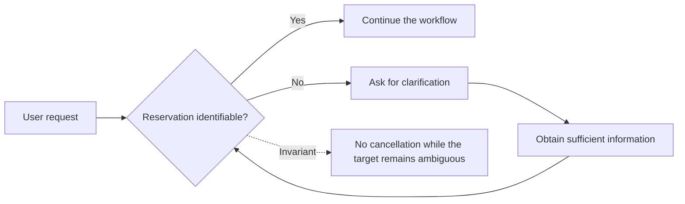
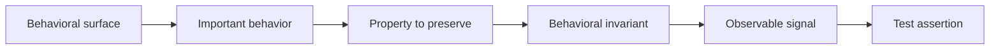
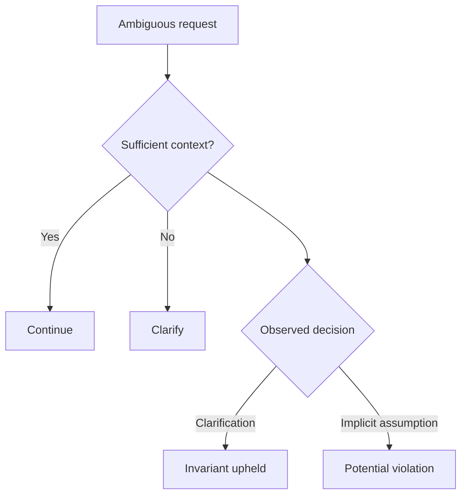
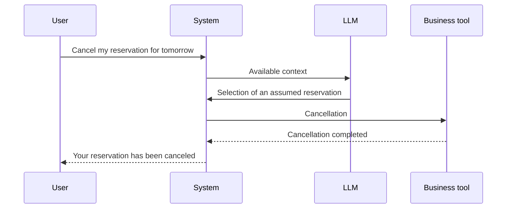
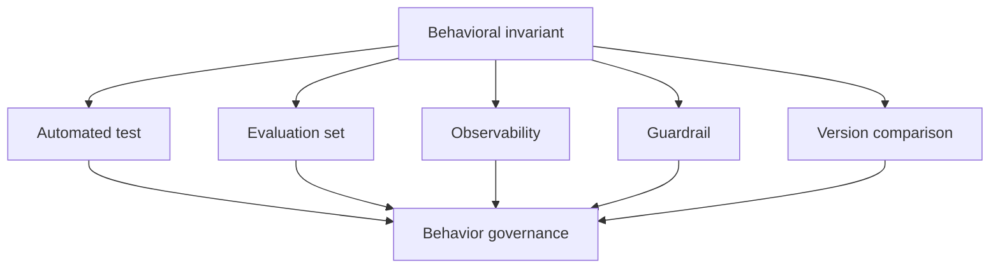
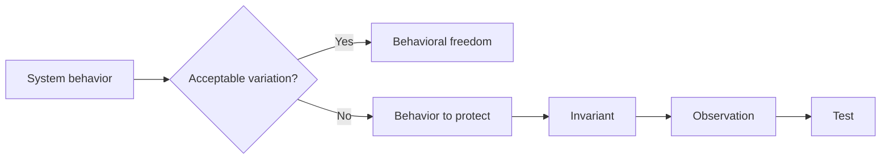

# Defining the Behavioral Invariants of an LLM System

## Turning the Behaviors We Want to Preserve into Explicit, Observable, and Verifiable Properties

In <a href="/en/blog/les-surfaces-comportementales" target="_blank" rel="noopener noreferrer">the first part of this series</a>, we set out to understand how the behavior of a system built on LLM capabilities is formed.

We started by establishing a behavioral reference, then made execution observable, reconstructed the decision trajectory, and identified the surfaces on which behavior can vary, drift, or regress.

This mapping answers one essential question:

> **Where can the system's behavior change?**

It immediately opens another:

> **Among all these possible behaviors, which ones absolutely must remain true?**

This is where behavioral invariants come in.

Take an assistant capable of canceling a reservation.

A user asks it:

> Cancel my reservation for tomorrow.

Yet two reservations are scheduled for that day.

The system may ask which one should be canceled. It may present both available reservations. It may rephrase the request before continuing.

These responses are different.

But they can all comply with the same essential behavior:

> **The system must not execute any cancellation until the reservation in question has been identified without ambiguity.**

What must remain stable, then, is not necessarily the response produced.

It is the property the system must uphold during its execution.

This is the property we need to learn how to formalize.

---

## We Often Know the Rules Without Having Formalized Them

In many teams, the important behaviors of an application are already known.

They surface in discussions, test reviews, tickets, or incident reports.

« *In that case, it must ask for clarification.* »

« *This service must never be called without an identifier.* »

« *This information must always come from the business reference system.* »

« *The user must confirm before the action is executed.* »

These statements express something important.

They indicate that some variations are acceptable and others are not.

Yet they often remain too implicit to become verification criteria.

What exactly does « asking for clarification » mean?

At what point does the identifier become mandatory?

What information counts as a valid confirmation?

How do we verify that the data used actually comes from the expected reference system?

Once a system relies, even partly, on decisions produced or influenced by an LLM, this vagueness becomes hard to sustain.

We need to be able to distinguish what may vary from what must remain stable.

The challenge, then, is not only to identify the important behaviors.

We must turn them into properties precise enough that we can observe whether they are upheld or violated.

---

## An Invariant Is Not an Expected Response

This is probably the most important distinction.

In a classic software test, we are used to providing an input and checking an expected output.

That logic still holds for many deterministic components.

It becomes fragile once applied directly to natural-language generation.

Take our request again:

> Cancel my reservation for tomorrow.

The system could reply:

> You have two reservations scheduled for tomorrow. Which one would you like to cancel?

But it could just as well produce:

> I see two reservations for tomorrow. Could you specify which one you'd like to cancel?

Or:

> Two reservations match your request. I need to identify the one in question before continuing.

The wording differs.

The behavior remains compatible with the same rule:

> No cancellation can be executed while the target reservation remains ambiguous.

A behavioral invariant therefore does not necessarily describe **what the system must say**.

It describes **what must remain true in its behavior**.

This distinction preserves the useful variability of language without losing control over the decisions that matter.

---

## Moving from the Behavioral Surface to the Invariant

In the previous article, we introduced behavioral surfaces to identify the places where behavior can change.

Interpreting the request.

Building the context.

Retrieving information.

Making a decision.

Executing a tool.

Applying a rule.

Validation.

Business outcome.

A surface tells us **where to look**.

The invariant specifies **what we want to protect on that surface**.

Take the surface tied to tool execution.

The system has a function that can cancel a reservation.

The mere existence of that tool defines no behavioral rule.

We must determine under which conditions its use is valid.

The business intent might be:

> A reservation must not be canceled by mistake.

That intent is still too general to be tested.

We can progressively refine it:

> The cancellation tool must not be called when several reservations match the user's request and none has been explicitly selected.

We now have several observable elements:

* several reservations match the request;
* no reservation has yet been selected;
* the cancellation tool must not be executed.

The business intent is starting to become a behavioral contract.

---

## An Invariant Must Specify Its Context

An invariant is not necessarily true in every situation.

Saying:

> The system must always ask for confirmation.

may sound reassuring.

But such a rule quickly becomes hard to work with.

Is a confirmation needed to look up information?

To generate a simulation?

To change a user preference?

To trigger an irreversible operation?

The context of application is part of the invariant.

A more precise formulation could be:

> When an operation permanently modifies a reservation, the system must obtain explicit confirmation before calling the tool responsible for that modification.

We can then identify four elements.

| Element | Question |
| --- | --- |
| Condition | In which situation does the invariant apply? |
| Expected behavior | What must the system do? |
| Forbidden behavior | What must it not do? |
| Observation | Which trace lets us verify the behavior? |

This structure keeps invariants from turning into general principles that are impossible to evaluate.

A good invariant reduces ambiguity.

It lets two people observing the same execution reach a similar conclusion about whether it was upheld or violated.

---

## Four Families of Behavioral Invariants

Not every invariant concerns the same part of the system.

To start, four families cover a large share of the behaviors we generally want to protect.

### 1. Decision Invariants

They govern the choices the system makes.

For example:

> When a request is ambiguous and no information in the context resolves that ambiguity, the system must ask for clarification before continuing.

The wording of the clarification matters little.

What matters is the decision made.

Did the system recognize that it lacked sufficient information?

Did it choose to ask for a precision?

Or did it build an assumption and continue execution?

The invariant concerns this fork in the road.

### 2. Action Invariants

They concern what the system can actually execute.

A system may produce a poor phrasing with no operational consequence.

It may also trigger a wrong action while delivering a perfectly worded response.

The second situation is generally more important to detect.

An action invariant might, for example, establish that:

> An irreversible operation cannot be executed without prior validation.

Or:

> A tool that requires a business identifier must never be called with an identifier that the model constructed or assumed.

We are no longer only testing generation.

We are checking the relationship between the decision and the action actually triggered.

### 3. Data and Context Invariants

Some decisions are only valid if they rest on the right information.

Take a system able to report an order's status.

A response like:

> Your order is currently being shipped.

may look correct.

But if the system never queried the service holding the order's actual status, the expected behavior was not upheld.

The invariant could then be formulated as follows:

> An order's current status must come from the business service responsible for tracking it, and must not be inferred from the model's general knowledge.

The information used becomes part of the behavior.

This means that to test the system, we must be able to observe not only its response, but also the sources, data, and context that fed into the decision.

### 4. Business Outcome Invariants

Finally, some invariants concern the system's final state directly.

They describe neither a sentence nor an intermediate decision.

They protect a business consequence.

For example:

> An ambiguous request must never lead to the modification of a resource that was not explicitly identified.

Several trajectories can lead to this rule being upheld.

The system may ask for clarification very early.

It may detect the ambiguity when selecting the tool.

A guardrail may also block execution just before the modification.

The invariant stays the same:

the forbidden business outcome must not occur.

---

## An Invariant Becomes Useful When Its Violation Can Be Observed

Some statements resemble invariants without actually being one.

> The system must be careful.

> The system must correctly understand the user.

> The response must be relevant.

> The system must avoid mistakes.

These goals are legitimate.

But what must we observe to determine whether they are met?

The difficulty is not only semantic.

It becomes a testing problem directly.

If we cannot characterize a violation, we cannot build a reliable assertion.

Take:

> The system must be careful before executing a sensitive action.

We can try to make this intent observable:

> When an operation is classified as sensitive, no tool that can execute it may be called before an explicit validation has been logged in the decision trajectory.

We can now verify:

* the classification of the operation;
* the presence or absence of a validation;
* the order of events;
* whether the tool was called at all.

The invariant has changed in nature.

It has moved from an intent to a verifiable property.

> **A behavioral invariant becomes truly actionable once its violation can be observed.**

This observability also explains why the different parts of this series are connected.

We cannot properly test what we cannot observe.

We cannot precisely observe a behavior without understanding its trajectory.

And we cannot decide where to place controls without knowing the surfaces on which that behavior can vary.

---

## Testing the Invariant Where It Can Actually Be Violated

A common mistake is to check every invariant solely from the final response.

Yet some violations are invisible in the produced text.

Imagine this trajectory:

The final response is clear.

Grammatically, nothing reveals a problem.

The violation happened earlier: the system selected a reservation without having enough information.

If we evaluate only the final text, this anomaly can go unnoticed.

The test must therefore sit at the level where the invariant can actually be violated.

For some invariants, that will be the decision-making step.

For others, context building.

For others still, a tool call or the business outcome.

This approach progressively shifts testing from the text to the behavior.

---

## Not Every Desirable Behavior Is an Invariant

Formalizing invariants does not mean turning every product expectation into an absolute constraint.

A system can have many desirable qualities:

* producing concise responses;
* adopting an appropriate vocabulary;
* using a clear structure;
* favoring certain phrasings;
* offering a smooth conversational experience.

These characteristics can be evaluated.

They should not necessarily be treated as invariants.

Take:

> The response should be concise.

A slightly longer response is not automatically a behavioral regression.

Conversely:

> The system must not execute an operation on an ambiguous resource.

The violation can have a direct business consequence.

We therefore need to distinguish several levels of expectation.

| Level | Example | Consequence of a variation |
| --- | --- | --- |
| Preference | Favoring a concise response | Generally acceptable |
| Quality criterion | Providing a relevant response | To be assessed |
| Expected behavior | Asking for clarification in case of ambiguity | To be monitored |
| Invariant | Not executing an action on an ambiguous target | Violation to be qualified |

This distinction becomes essential when we need to compare two versions of the system.

Two different versions do not need to produce exactly the same responses.

They must, however, continue to uphold the properties we decided to protect.

---

## Building a Registry of Invariants

There is no need to start by formalizing the entire behavior of the application.

That would probably be counterproductive.

A first version can focus on the paths where a variation would have a real impact.

Irreversible actions.

Important business rules.

Decisions that determine access to a feature.

Data that must come from a specific source.

Behaviors that have already caused a regression.

Cases where a wrong decision would have far greater consequences than a merely poor phrasing.

For each of these behaviors, a simple registry can be built.

| Field | Description |
| --- | --- |
| Identifier | Stable reference for the invariant |
| Surface | Behavioral area concerned |
| Condition | Situation in which it applies |
| Expected | Behavior that must be observed |
| Forbidden | Behavior that constitutes a violation |
| Observation | Trace or event that enables verification |
| Criticality | Impact associated with the violation |

The goal is not to produce another heavy piece of documentation.

It is to make explicit what the team already considers important enough to protect.

A single invariant can then feed several mechanisms:

The invariant then becomes more than a test rule.

It forms a shared reference between the business, the product, engineering, and the system's control mechanisms.

---

## Starting with What We Refuse to Lose

Trying to describe the entire behavior of a system built on LLM capabilities right away can quickly become impractical.

A more pragmatic approach starts with a different question:

> **Which behaviors would we refuse to lose in the system's next evolution?**

If we change models, which decision must remain stable?

If we modify the system prompt, which rule must always be applied?

If we add a new tool, which action must remain impossible under certain conditions?

If we change how context is built, which data must keep coming from controlled sources?

These questions progressively surface the invariants that truly matter.

This is not about removing all variability.

Quite the opposite.

An application built on LLM capabilities should be able to benefit from that variability whenever it improves the phrasing, the adaptation to context, or the quality of the interaction.

The goal is to separate this useful freedom from the behaviors on which the system must not improvise.

This is the boundary that progressively turns an application that is hard to compare into a system whose evolutions can be governed.

---

## From Invariants to Behavioral Tests

The first part of this series aimed to make behavior understandable.

We established a reference point.

We made execution observable.

We reconstructed the decision trajectory.

We identified the surfaces on which behavior can vary.

This second part begins by defining what we want to preserve on those surfaces.

A behavioral invariant does not try to impose a single response on the model.

It establishes a property that must remain true despite the variability of wording, data, or execution conditions.

To become actionable, that property must be contextualized, observable, and precise enough that its violation can be identified.

This distinction matters.

If we turn every expected phrasing into a contract, we risk building brittle tests that fail as soon as the model chooses to express the same idea correctly in a different way.

But if we only test the apparent quality of the response, we may let far more important changes slip through in decisions, in the tools used, or in business outcomes.

The next step, then, is to shift our focus even further.

No longer only asking:

> **Does the response resemble the one we expected?**

But rather:

> **Did the system make the decisions we actually meant to verify?**

That is the subject of the next article:

**Testing Decisions Rather Than Wording.**
