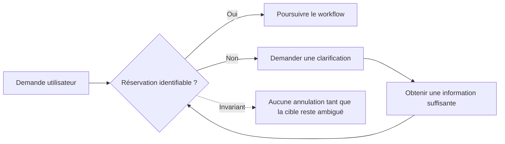
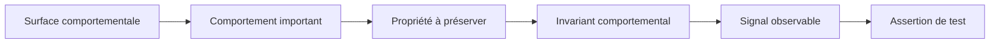
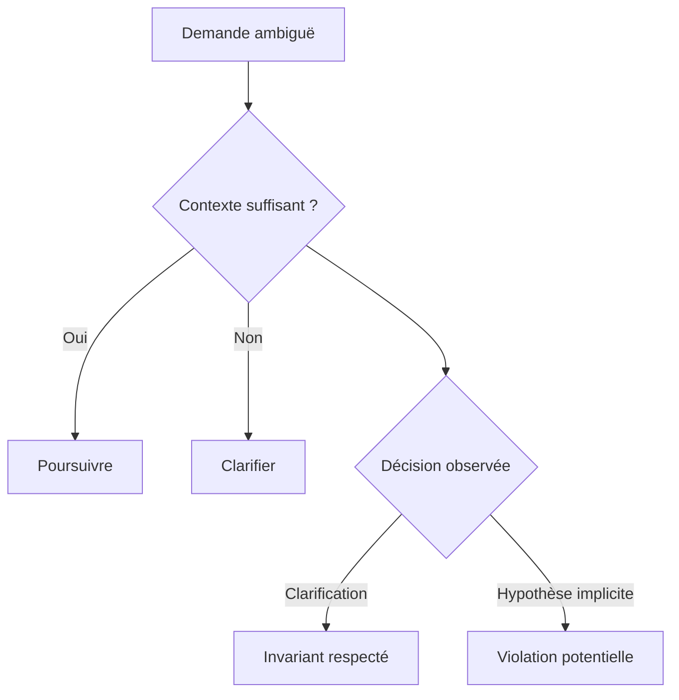
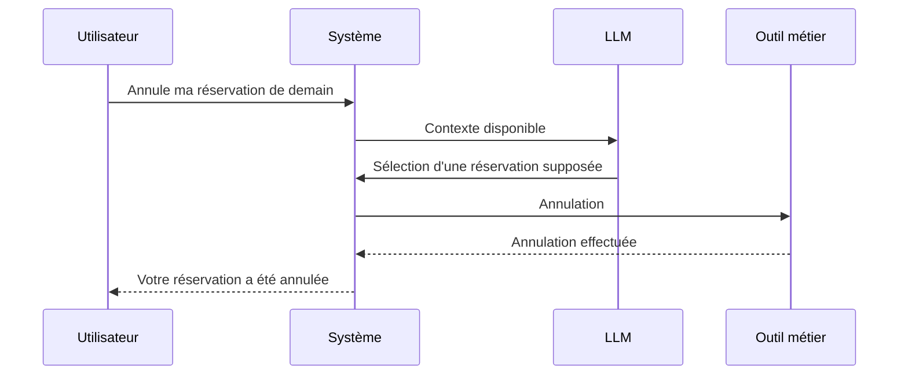
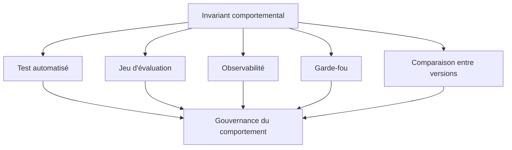
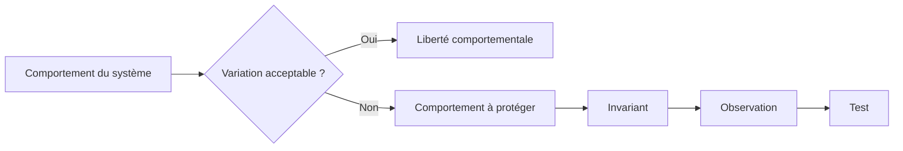

# Définir les invariants comportementaux d'un système LLM

## Transformer les comportements que l'on souhaite préserver en propriétés explicites, observables et vérifiables

Dans la première partie de cette série, nous avons cherché à comprendre comment se construit le comportement d'un système intégrant les capacités des LLM.

Nous avons commencé par <a href="/fr/blog/figer-comportement-systeme-llm" target="_blank" rel="noopener noreferrer">établir une référence comportementale</a>, puis <a href="/fr/blog/observer-avant-doptimiser" target="_blank" rel="noopener noreferrer">rendu l'exécution observable</a>, <a href="/fr/blog/la-trajectoire-de-decision" target="_blank" rel="noopener noreferrer">reconstitué la trajectoire de décision</a> et <a href="/fr/blog/les-surfaces-comportementales" target="_blank" rel="noopener noreferrer">identifié les surfaces sur lesquelles le comportement peut varier, dériver ou régresser</a>.

Cette cartographie répond à une question essentielle :

> **Où le comportement du système peut-il changer ?**

Elle en ouvre immédiatement une autre :

> **Parmi tous ces comportements possibles, lesquels doivent absolument rester vrais ?**

C'est ici qu'interviennent les invariants comportementaux.

Prenons un assistant capable d'annuler une réservation.

Un utilisateur lui demande :

> Annule ma réservation de demain.

Deux réservations sont pourtant prévues pour cette journée.

Le système peut demander laquelle doit être annulée. Il peut présenter les deux réservations disponibles. Il peut reformuler la demande avant de poursuivre.

Ces réponses sont différentes.

Mais elles peuvent toutes respecter le même comportement essentiel :

> **Le système ne doit exécuter aucune annulation tant que la réservation concernée n'a pas été identifiée sans ambiguïté.**

Ce qui doit rester stable n'est donc pas nécessairement la réponse produite.

C'est la propriété que le système doit respecter au cours de son exécution.

C'est cette propriété que nous devons apprendre à formaliser.

---

## Nous connaissons souvent les règles sans les avoir formalisées

Dans beaucoup d'équipes, les comportements importants d'une application sont connus.

Ils apparaissent dans les discussions, les revues de tests, les tickets ou les retours d'incidents.

« *Dans ce cas, il doit demander une précision.* »

« *Il ne faut jamais appeler ce service sans identifiant.* »

« *Cette information doit obligatoirement venir du référentiel métier.* »

« *L'utilisateur doit confirmer avant que l'action soit exécutée.* »

Ces phrases expriment quelque chose d'important.

Elles indiquent que certaines variations sont acceptables et que d'autres ne le sont pas.

Pourtant, elles restent souvent trop implicites pour devenir des critères de vérification.

Que signifie exactement « demander une précision » ?

À quel moment l'identifiant devient-il obligatoire ?

Quelle information constitue une confirmation valide ?

Comment vérifier que la donnée utilisée provient réellement du référentiel attendu ?

À partir du moment où un système repose en partie sur des décisions produites ou influencées par un LLM, cette imprécision devient difficile à conserver.

Nous devons être capables de distinguer ce qui peut varier de ce qui doit rester stable.

L'enjeu n'est donc pas seulement d'identifier les comportements importants.

Il faut les transformer en propriétés suffisamment précises pour pouvoir constater leur respect ou leur violation.

---

## Un invariant n'est pas une réponse attendue

C'est probablement la distinction la plus importante.

Dans un test logiciel classique, nous sommes souvent habitués à fournir une entrée et à vérifier une sortie attendue.

Cette logique reste valable pour de nombreux composants déterministes.

Elle devient plus fragile lorsqu'elle est appliquée directement à une génération en langage naturel.

Reprenons notre demande :

> Annule ma réservation de demain.

Le système pourrait répondre :

> Vous avez deux réservations prévues demain. Laquelle souhaitez-vous annuler ?

Mais il pourrait également produire :

> Je vois deux réservations pour demain. Pouvez-vous préciser celle que vous souhaitez annuler ?

Ou encore :

> Deux réservations correspondent à votre demande. Je dois identifier celle concernée avant de poursuivre.

Les formulations diffèrent.

Le comportement, lui, reste compatible avec la même règle :

> Aucune annulation ne peut être exécutée tant que la réservation cible reste ambiguë.

Un invariant comportemental ne décrit donc pas nécessairement **ce que le système doit dire**.

Il décrit **ce qui doit rester vrai dans son comportement**.

Cette distinction permet de conserver la variabilité utile du langage sans perdre le contrôle sur les décisions importantes.

---

## Passer de la surface comportementale à l'invariant

Dans l'article précédent, nous avons introduit les surfaces comportementales pour identifier les endroits où le comportement peut changer.

Interprétation de la demande.

Construction du contexte.

Récupération de l'information.

Prise de décision.

Exécution d'un outil.

Application d'une règle.

Validation.

Résultat métier.

Une surface indique **où observer**.

L'invariant précise **ce que nous voulons protéger sur cette surface**.

Prenons la surface liée à l'exécution d'un outil.

Le système dispose d'une fonction permettant d'annuler une réservation.

Le simple fait que cet outil existe ne définit aucune règle comportementale.

Il faut déterminer dans quelles conditions son utilisation est valide.

L'intention métier peut être :

> Une réservation ne doit pas être annulée par erreur.

Cette intention est encore trop générale pour être testée.

Nous pouvons progressivement la préciser :

> L'outil d'annulation ne doit pas être appelé lorsque plusieurs réservations correspondent à la demande de l'utilisateur et qu'aucune n'a été explicitement sélectionnée.

Nous disposons maintenant de plusieurs éléments observables :

* plusieurs réservations correspondent à la demande ;
* aucune réservation n'a encore été sélectionnée ;
* l'outil d'annulation ne doit pas être exécuté.

L'intention métier commence à devenir un contrat comportemental.

---

## Un invariant doit préciser son contexte

Un invariant n'est pas nécessairement vrai dans toutes les situations.

Dire :

> Le système doit toujours demander une confirmation.

peut sembler rassurant.

Mais une telle règle devient rapidement difficile à exploiter.

Une confirmation est-elle nécessaire pour consulter une information ?

Pour générer une simulation ?

Pour modifier une préférence utilisateur ?

Pour déclencher une opération irréversible ?

Le contexte d'application fait partie de l'invariant.

Une formulation plus précise pourrait être :

> Lorsqu'une opération modifie définitivement une réservation, le système doit obtenir une confirmation explicite avant d'appeler l'outil responsable de cette modification.

Nous pouvons alors identifier quatre éléments.

| Élément | Question |
| --- | --- |
| Condition | Dans quelle situation l'invariant s'applique-t-il ? |
| Comportement attendu | Que doit faire le système ? |
| Comportement interdit | Que ne doit-il pas faire ? |
| Observation | Quelle trace permet de vérifier le comportement ? |

Cette structure évite de transformer les invariants en principes généraux impossibles à évaluer.

Un bon invariant réduit l'ambiguïté.

Il permet à deux personnes observant la même exécution d'arriver à une conclusion similaire sur son respect ou sa violation.

---

## Quatre familles d'invariants comportementaux

Tous les invariants ne portent pas sur la même partie du système.

Pour commencer, quatre familles permettent de couvrir une grande partie des comportements que nous cherchons généralement à protéger.

### 1. Les invariants de décision

Ils encadrent les choix réalisés par le système.

Par exemple :

> Lorsqu'une demande est ambiguë et qu'aucune information du contexte ne permet de lever cette ambiguïté, le système doit demander une clarification avant de poursuivre.

Le texte de la clarification importe peu.

Ce qui compte est la décision prise.

Le système a-t-il reconnu qu'il ne disposait pas de suffisamment d'informations ?

A-t-il choisi de demander une précision ?

Ou a-t-il construit une hypothèse et poursuivi l'exécution ?

L'invariant porte sur cette bifurcation.

### 2. Les invariants d'action

Ils concernent ce que le système peut effectivement exécuter.

Un système peut produire une mauvaise formulation sans conséquence opérationnelle.

Il peut également déclencher une mauvaise action avec une réponse parfaitement rédigée.

Cette seconde situation est généralement plus importante à détecter.

Un invariant d'action peut par exemple établir que :

> Une opération irréversible ne peut être exécutée sans validation préalable.

Ou :

> Un outil nécessitant un identifiant métier ne doit jamais être appelé avec un identifiant construit ou supposé par le modèle.

Nous ne testons plus seulement la génération.

Nous vérifions la relation entre la décision et l'action effectivement déclenchée.

### 3. Les invariants de données et de contexte

Certaines décisions ne sont valides que si elles reposent sur les bonnes informations.

Prenons un système capable d'indiquer le statut d'une commande.

Une réponse comme :

> Votre commande est actuellement en cours d'expédition.

peut sembler correcte.

Mais si le système n'a jamais consulté le service contenant le statut réel de la commande, le comportement attendu n'a pas été respecté.

L'invariant peut alors être formulé ainsi :

> Le statut courant d'une commande doit provenir du service métier chargé de son suivi et ne doit pas être déduit à partir des connaissances générales du modèle.

L'information utilisée devient une partie du comportement.

Cela signifie que pour tester le système, nous devons être capables d'observer non seulement sa réponse, mais également les sources, les données et le contexte ayant participé à la décision.

### 4. Les invariants de résultat métier

Enfin, certains invariants concernent directement l'état final du système.

Ils ne décrivent ni une phrase ni une décision intermédiaire.

Ils protègent une conséquence métier.

Par exemple :

> Une demande ambiguë ne doit jamais conduire à la modification d'une ressource qui n'a pas été explicitement identifiée.

Plusieurs trajectoires peuvent conduire au respect de cette règle.

Le système peut demander une clarification très tôt.

Il peut détecter l'ambiguïté au moment de sélectionner l'outil.

Un garde-fou peut également bloquer l'exécution juste avant la modification.

L'invariant reste le même :

le résultat métier interdit ne doit pas se produire.

---

## Un invariant devient utile lorsqu'une violation peut être observée

Certaines formulations ressemblent à des invariants sans réellement en être.

> Le système doit être prudent.

> Le système doit comprendre correctement l'utilisateur.

> La réponse doit être pertinente.

> Le système doit éviter les erreurs.

Ces objectifs sont légitimes.

Mais que devons-nous observer pour déterminer s'ils sont respectés ?

La difficulté n'est pas seulement sémantique.

Elle devient directement une difficulté de test.

Si nous ne savons pas caractériser une violation, nous ne savons pas construire une assertion fiable.

Prenons :

> Le système doit être prudent avant d'exécuter une action sensible.

Nous pouvons essayer de rendre cette intention observable :

> Lorsqu'une opération est classée comme sensible, aucun outil permettant de l'exécuter ne doit être appelé avant qu'une validation explicite ait été enregistrée dans la trajectoire de décision.

Nous pouvons désormais vérifier :

* la classification de l'opération ;
* la présence ou l'absence d'une validation ;
* l'ordre des événements ;
* l'appel éventuel de l'outil.

L'invariant a changé de nature.

Il est passé d'une intention à une propriété vérifiable.

> **Un invariant comportemental devient réellement exploitable lorsque sa violation peut être observée.**

Cette observabilité explique aussi pourquoi les différentes parties de cette série sont liées.

Nous ne pouvons pas tester correctement ce que nous ne pouvons pas observer.

Nous ne pouvons pas observer précisément un comportement sans comprendre sa trajectoire.

Et nous ne pouvons pas décider où placer les contrôles sans connaître les surfaces sur lesquelles ce comportement peut varier.

---

## Tester l'invariant là où il peut être violé

Une erreur fréquente serait de vérifier tous les invariants uniquement à partir de la réponse finale.

Certaines violations sont pourtant invisibles dans le texte produit.

Imaginons cette trajectoire :

La réponse finale est claire.

Grammaticalement, rien ne permet d'identifier un problème.

La violation s'est produite plus tôt : le système a sélectionné une réservation sans disposer de suffisamment d'informations.

Si nous évaluons uniquement le texte final, cette anomalie peut passer inaperçue.

Le test doit donc être placé au niveau où l'invariant peut réellement être violé.

Pour certains invariants, ce sera la prise de décision.

Pour d'autres, la construction du contexte.

Pour d'autres encore, l'appel d'un outil ou le résultat métier.

Cette approche déplace progressivement le test du texte vers le comportement.

---

## Tout comportement souhaitable n'est pas un invariant

Formaliser les invariants ne signifie pas transformer toutes les attentes produit en contraintes absolues.

Un système peut avoir de nombreuses qualités souhaitables :

* produire des réponses concises ;
* adopter un vocabulaire adapté ;
* utiliser une structure claire ;
* privilégier certaines formulations ;
* proposer une expérience conversationnelle fluide.

Ces caractéristiques peuvent être évaluées.

Elles ne doivent pas nécessairement être traitées comme des invariants.

Prenons :

> La réponse devrait être concise.

Une réponse légèrement plus longue n'est pas automatiquement une régression comportementale.

À l'inverse :

> Le système ne doit pas exécuter une opération sur une ressource ambiguë.

La violation peut avoir une conséquence métier directe.

Il faut donc distinguer plusieurs niveaux d'attente.

| Niveau | Exemple | Conséquence d'une variation |
| --- | --- | --- |
| Préférence | Privilégier une réponse concise | Généralement acceptable |
| Critère de qualité | Fournir une réponse pertinente | À évaluer |
| Comportement attendu | Demander une précision en cas d'ambiguïté | À surveiller |
| Invariant | Ne pas exécuter une action sur une cible ambiguë | Violation à qualifier |

Cette distinction devient essentielle lorsqu'il faudra comparer deux versions du système.

Deux versions différentes ne doivent pas nécessairement produire exactement les mêmes réponses.

Elles doivent en revanche continuer à respecter les propriétés que nous avons décidé de protéger.

---

## Construire un registre d'invariants

Il n'est pas nécessaire de commencer par formaliser l'ensemble du comportement de l'application.

Ce serait probablement contre-productif.

Une première version peut se concentrer sur les parcours où une variation aurait un impact réel.

Les actions irréversibles.

Les règles métier importantes.

Les décisions qui conditionnent l'accès à une fonctionnalité.

Les données qui doivent provenir d'une source précise.

Les comportements ayant déjà provoqué une régression.

Les cas pour lesquels une mauvaise décision aurait plus de conséquences qu'une simple mauvaise formulation.

Pour chacun de ces comportements, un registre simple peut être construit.

| Champ | Description |
| --- | --- |
| Identifiant | Référence stable de l'invariant |
| Surface | Zone comportementale concernée |
| Condition | Situation dans laquelle il s'applique |
| Attendu | Comportement qui doit être observé |
| Interdit | Comportement qui constitue une violation |
| Observation | Trace ou événement permettant la vérification |
| Criticité | Impact associé à la violation |

L'objectif n'est pas de produire une nouvelle documentation lourde.

Il s'agit de rendre explicite ce que l'équipe considère déjà comme suffisamment important pour être protégé.

Un même invariant peut ensuite alimenter plusieurs mécanismes :

L'invariant devient alors plus qu'une règle de test.

Il constitue une référence commune entre le métier, le produit, l'ingénierie et les mécanismes de contrôle du système.

---

## Commencer par ce que nous refusons de perdre

Chercher immédiatement à décrire l'intégralité du comportement d'un système intégrant les capacités des LLM peut rapidement devenir difficile.

Une approche plus pragmatique consiste à commencer par une autre question :

> **Quels comportements refuserions-nous de perdre lors de la prochaine évolution du système ?**

Si nous changeons de modèle, quelle décision doit rester stable ?

Si nous modifions le prompt système, quelle règle doit toujours être appliquée ?

Si nous ajoutons un nouvel outil, quelle action doit rester impossible dans certaines conditions ?

Si nous changeons la construction du contexte, quelles données doivent continuer à provenir de sources maîtrisées ?

Ces questions permettent de faire émerger progressivement les invariants réellement importants.

Il ne s'agit pas de supprimer toute variabilité.

Au contraire.

Une application intégrant les capacités des LLM doit pouvoir bénéficier de cette variabilité lorsque celle-ci améliore la formulation, l'adaptation au contexte ou la qualité de l'interaction.

L'objectif est de distinguer cette liberté utile des comportements sur lesquels le système ne doit pas improviser.

C'est cette frontière qui transforme progressivement une application difficile à comparer en un système dont les évolutions peuvent être gouvernées.

---

## Des invariants aux tests comportementaux

La première partie de cette série cherchait à rendre le comportement compréhensible.

Nous avons établi une référence.

Nous avons rendu l'exécution observable.

Nous avons reconstitué la trajectoire de décision.

Nous avons identifié les surfaces sur lesquelles le comportement peut varier.

Cette deuxième partie commence en définissant ce que nous voulons conserver sur ces surfaces.

Un invariant comportemental ne cherche pas à imposer une réponse unique au modèle.

Il établit une propriété qui doit rester vraie malgré la variabilité des formulations, des données ou des conditions d'exécution.

Pour devenir exploitable, cette propriété doit être contextualisée, observable et suffisamment précise pour que sa violation puisse être identifiée.

Cette distinction est importante.

Car si nous transformons chaque formulation attendue en contrat, nous risquons de construire des tests fragiles qui échouent dès que le modèle choisit d'exprimer correctement la même idée autrement.

Mais si nous ne testons que la qualité apparente de la réponse, nous pouvons laisser passer des changements beaucoup plus importants dans les décisions, les outils utilisés ou les résultats métier.

La prochaine étape consiste donc à déplacer encore davantage le regard.

Non plus seulement demander :

> **La réponse ressemble-t-elle à celle que nous attendions ?**

Mais plutôt :

> **Le système a-t-il pris les décisions que nous voulions réellement vérifier ?**

C'est l'objet du prochain article :

**Tester les décisions plutôt que les formulations.**
