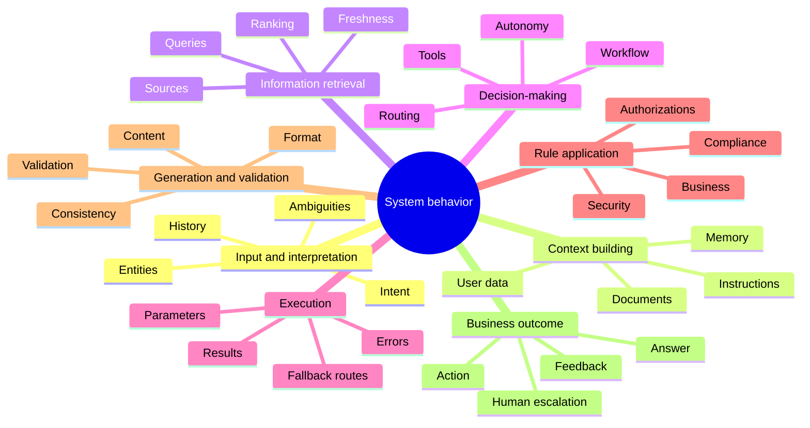
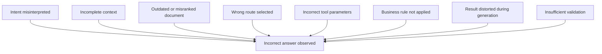

# Behavioral Surfaces

## Mapping the Areas Where an LLM System's Behavior Can Vary, Drift, or Regress

An incorrect answer is not always the result of poor generation.

The model may have produced a coherent answer from incomplete context. It may have used outdated information that an external tool retrieved correctly. The system may also have selected the wrong workflow, passed an invalid parameter, or ignored a business rule that was available to it.

The problem appears in the answer, but its cause may be found much earlier in the execution.

In the <a href="/en/blog/la-trajectoire-de-decision" target="_blank" rel="noopener noreferrer">previous article</a>, we introduced the **decision trajectory** to reconstruct the path followed by a system between a user request and the resulting outcome. This trajectory makes the main execution stages visible: interpretation, context building, routing, tool calls, rule application, validation, and generation.

This representation answers a first question:

> What path did the system follow to produce this result?

It does not yet identify precisely where its behavior can vary.

To go further, we need to break this trajectory down into **behavioral surfaces**.

The question then becomes:

> Where can the system's behavior change, and which controls should be placed there?

## A Behavioral Surface Is Not a Technical Component

A behavioral surface is an area of the system where a variation in data, instructions, decisions, rules, or execution conditions can change the observable result.

It does not necessarily correspond to a service, module, or architectural layer.

Context building, for example, may involve several components:

* an orchestrator;
* conversational memory;
* a document search engine;
* user data;
* a set of system instructions;
* a mechanism for dynamically selecting information.

From an architectural perspective, these elements may be distributed across several components. From a behavioral perspective, they contribute to the same function: determining which information the model can access when it produces a decision or answer.

Behavioral mapping therefore does not merely represent the system's technical structure.

It identifies where behavior is formed, transformed, able to vary, or able to drift.

> A behavioral surface does not only describe where the system operates. It indicates where its behavior can change.

## 1. Input and Interpretation

The first surface appears when the system receives a request.

Before building an answer, it must interpret the request, detect an intent, identify relevant entities, and determine whether the conversation history should be considered.

Two similar formulations can lead to different interpretations. Information from an earlier exchange can change the meaning of an apparently simple request. An ambiguity may be detected, ignored, or resolved through an implicit assumption.

This surface includes:

* the detected intent;
* extracted entities;
* identified ambiguities;
* any reformulation of the request;
* the use of conversation history;
* assumptions used to complete missing information.

A variation at this level can send the entire execution down the wrong trajectory.

The control question becomes:

> Did the system correctly understand what the user was asking?

## 2. Context Building

Once the request has been interpreted, the system builds the context used to make a decision or call a model.

This context is not limited to the user's message. It may include general instructions, domain-specific rules, conversational memory, user preferences, retrieved documents, or data from the information system.

The presence of information does not guarantee that it will be used. Its order, priority, freshness, and position in the context can influence the model's behavior.

Context building is therefore a particularly sensitive surface. A missing instruction, unsuitable memory, or document injected at the wrong time can change the answer even when the model and request remain unchanged.

The question to ask is:

> Did the system build the right context for this request?

## 3. Information Retrieval

When an answer depends on external information, the system's behavior is also determined by how that information is searched for and selected.

The system may query a document repository, a business API, a search engine, an internal catalog, or several sources at the same time.

At this level, variability may come from:

* the query that was produced;
* the sources that were queried;
* the filters that were applied;
* the number of results that were kept;
* document ranking;
* information freshness;
* source quality or authority.

An incorrect answer may therefore be generated correctly from a misranked or outdated document.

Generation is then only the last visible link in a drift that began during information retrieval.

The control question becomes:

> Did the system retrieve the right information, from the right sources, at the right time?

## 4. Decision-Making

Applications using LLM capabilities no longer limit themselves to producing text.

They may choose a route, select a tool, trigger a workflow, request additional information, execute an action, or transfer the process to a human operator.

These choices form a behavioral surface in their own right.

Decision-making includes:

* routing;
* tool selection;
* workflow selection;
* the decision to answer or act;
* the use of human validation;
* the level of autonomy granted to the system;
* the decision to stop or continue execution.

An answer may be relevant in content while having been produced through a route that should never have been used.

The question is therefore:

> Did the system choose the right way to handle the request?

## 5. Execution

A correct decision can still be executed incorrectly.

The system may select the right tool but pass it an incorrect identifier. It may call the right service with incomplete parameters, misinterpret the returned result, or trigger a retry that changes the expected flow.

This surface includes:

* transmitted parameters;
* calls that were made;
* returned results;
* execution times;
* technical errors;
* retries;
* partial results;
* fallback routes.

Recovery mechanisms deserve particular attention. A fallback route may improve technical resilience while degrading functional behavior if it uses a less reliable source or bypasses an important control.

The question to ask is:

> Was the system's decision executed correctly?

## 6. Rule Application

Business rules, security policies, and compliance controls are not merely constraints placed around the model.

They directly participate in the system's behavior.

A rule may authorize an action, require validation, restrict access to data, change a decision, or interrupt execution.

This surface includes:

* business rules;
* eligibility thresholds;
* security policies;
* compliance controls;
* authorizations;
* user-specific restrictions;
* escalation conditions;
* mandatory validations.

A rule that is correctly defined but not applied has no operational value.

It is therefore not enough to verify that the rule exists in specifications or code. We must be able to demonstrate that it was evaluated at the right time and actually influenced the trajectory.

The central question becomes:

> Were the rules that should have governed this execution actually applied?

## 7. Generation and Validation

Generation transforms information, decisions, and intermediate results into content that can be used by a user or another system.

This may be a text response, a structured object, a command, a report, or a proposed action.

Model variability is particularly visible at this level, but this surface should not be reduced to word choice.

It also covers:

* generated content;
* the expected format;
* the presence of mandatory information;
* consistency with the sources;
* compliance with business constraints;
* automatic validation;
* human validation;
* transformation of the result before it is sent.

An answer may be factually correct but unusable because it does not follow the expected format. It may also be well structured but inconsistent with the retrieved information.

The control question is therefore:

> Did the system correctly transform and validate the results it obtained?

## 8. Business Outcome

A system's behavior does not stop at the generated text.

The answer may trigger an action, modify data, create a transaction, send a notification, or cause a human escalation.

The business outcome represents the actual consequence of the execution.

This surface includes:

* the answer that was actually sent;
* the action that was executed;
* the data that was modified;
* the transaction that was triggered;
* escalation to a human operator;
* user feedback;
* whether the original need was resolved.

Two different answers may produce the same business outcome. Conversely, two textually similar answers may lead to very different consequences.

Behavioral evaluation cannot therefore be limited to comparing generated wording.

The final question becomes:

> Did the system produce the expected business outcome?

## Mapping Behavior as a Whole

The different surfaces can be represented around the system's overall behavior.

This representation should not be read as a simple functional decomposition.

Each branch identifies an area where a local change can produce a global variation.

Changing a model, an instruction, a search strategy, or a validation threshold does not only modify one component. It can shift the entire trajectory followed by the system.

## The Same Symptom Can Have Several Causes

Imagine a business assistant that gives a user incorrect information, but presents it clearly, coherently, and convincingly.

The first reaction might be to blame the model.

Yet several trajectories can lead to the same symptom.

The visible answer alone cannot identify the source of the drift.

We need to trace the trajectory, observe intermediate decisions, and locate the surface where behavior first began to diverge from the expected outcome.

This is precisely what behavioral mapping makes possible.

## A Surface Is Also a Control Point

The value of this mapping is not limited to understanding the system.

Each surface represents five things at the same time.

### An Area of Variability

Several decisions or outcomes may be possible without necessarily being incorrect.

The system may select two different but equally relevant documents. It may produce several acceptable formulations or choose different valid routes depending on the context.

### A Potential Source of Drift

A local change can alter global behavior.

A new model, a prompt change, a new document source, or a different routing policy can shift the decisions made by the system.

### An Observation Point

Each surface should produce appropriate traces.

Observing only the initial request and final answer does not explain intermediate decisions. We also need to retain detected intents, selected documents, called tools, evaluated rules, and completed validations.

### A Testing Boundary

Each surface can be checked through specific tests.

We can test routing stability, tool selection, business-rule application, or the presence of a validation without requiring an exactly identical text response.

### A Place for a Guardrail

A control can be placed where the risk appears.

An ambiguity can trigger a clarification request. An insufficiently reliable source can be excluded. A sensitive action can require human validation. A business rule can stop execution before an irreversible consequence occurs.

## Building an Actionable Map

An actionable map must do more than name the surfaces.

For each one, we need to document the elements that allow it to be observed, tested, and controlled.

| Element | Question to document |
| --- | --- |
| Surface | Where can behavior vary? |
| Inputs | Which data influences this area? |
| Decisions | Which choices are made? |
| Outputs | Which intermediate result is produced? |
| Acceptable variability | Which differences can be tolerated? |
| Observability | Which traces must be retained? |
| Tests | Which behaviors must be verified? |
| Guardrails | Which controls limit drift? |
| Responsibility | Who validates or owns the decision? |

This grid turns a general representation of the system into a concrete governance mechanism.

It also helps avoid a common trap: placing every control at the end of the process.

A final validation can detect some problems. It cannot always correct a misinterpreted intent, a poorly selected source, or an action that has already been executed.

Controls should be placed as close as possible to the surfaces where variations and risks appear.

## Knowing Where Behavior Can Change

Understanding the behavior of a system using LLM capabilities is not limited to observing the answers it produces.

We must first establish a reference point, make execution visible, reconstruct the decisions that were made, and identify the areas in which those decisions can vary.

This is the path followed in this series about understanding behavior:

1. [**Freezing the Behavior of an LLM System Before Evolving It**](/en/blog/figer-comportement-systeme-llm), to establish a reference before any transformation;
2. [**Observe Before Optimizing**](/en/blog/observer-avant-doptimiser), to make visible the data, decisions, tools, and validations that produce behavior;
3. [**Decision Trajectory**](/en/blog/la-trajectoire-de-decision), to reconstruct the path between the user request and the final outcome;
4. **Behavioral Surfaces**, to locate the areas where behavior can vary, drift, or regress.

This progression can be summarized as follows:

> Freezing preserves a reference point.  
> Observing makes execution visible.  
> Reconstructing explains the path that was followed.  
> Mapping identifies where behavior can change.

Behavioral surfaces therefore turn the decision trajectory into a map that can be used for observation, testing, and governance.

They make it possible to stop treating an incorrect answer as merely a generation problem and to see it instead as the possible result of drift that emerged in different parts of the system.

> To govern the behavior of an LLM system, we must know precisely where it can change.

This part has explained how behavior is built and where it can evolve.

The next question is what should remain stable on each surface despite changes in the model, data, and execution conditions.

That question opens the next part of the series, dedicated to testing, comparing, and verifying behavior.
