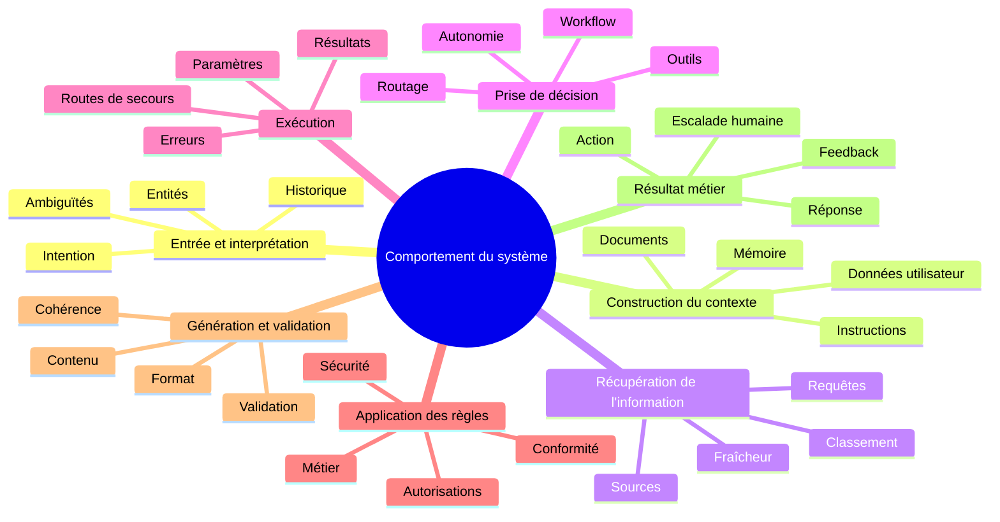
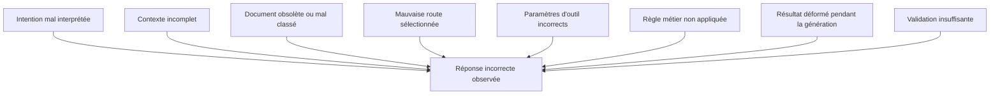

# Les surfaces comportementales

## Cartographier les zones où le comportement d'un système LLM peut varier, dériver ou régresser

Une réponse incorrecte n'est pas toujours le résultat d'une mauvaise génération.

Le modèle peut avoir produit une réponse cohérente à partir d'un contexte incomplet. Il peut avoir utilisé une information obsolète correctement récupérée par un outil. Le système peut également avoir sélectionné le mauvais workflow, transmis un paramètre erroné ou ignoré une règle métier pourtant disponible.

Le problème apparaît dans la réponse, mais sa cause peut se trouver bien plus tôt dans l'exécution.

Dans <a href="/fr/blog/la-trajectoire-de-decision" target="_blank" rel="noopener noreferrer">l'article précédent</a>, nous avons introduit la **trajectoire de décision** pour reconstituer le chemin suivi par un système entre une demande utilisateur et le résultat produit. Cette trajectoire rend visibles les principales étapes d'une exécution : interprétation, construction du contexte, routage, appel d'un outil, application d'une règle, validation et génération.

Cette représentation répond à une première question :

> Quel chemin le système a-t-il suivi pour produire ce résultat ?

Elle ne permet cependant pas encore de déterminer précisément les endroits où son comportement peut varier.

Pour aller plus loin, il faut décomposer cette trajectoire en **surfaces comportementales**.

La question devient alors :

> À quel endroit du système le comportement peut-il changer, et quels contrôles faut-il y placer ?

## Une surface comportementale n'est pas un composant technique

Une surface comportementale est une zone du système dans laquelle une variation des données, des instructions, des décisions, des règles ou des conditions d'exécution peut modifier le résultat observable.

Elle ne correspond pas nécessairement à un service, à un module ou à une couche d'architecture.

La construction du contexte, par exemple, peut mobiliser plusieurs composants :

* un orchestrateur ;
* une mémoire conversationnelle ;
* un moteur de recherche documentaire ;
* des données utilisateur ;
* un ensemble d'instructions système ;
* un mécanisme de sélection dynamique des informations.

D'un point de vue architectural, ces éléments peuvent être distribués dans plusieurs composants. D'un point de vue comportemental, ils participent pourtant à une même fonction : déterminer les informations auxquelles le modèle aura accès au moment de produire une décision ou une réponse.

La cartographie comportementale ne cherche donc pas seulement à représenter la structure technique du système.

Elle cherche à identifier les endroits où le comportement se forme, se transforme, peut varier ou peut dériver.

> Une surface comportementale ne décrit pas uniquement où le système fonctionne. Elle indique où son comportement peut changer.

## 1. L'entrée et l'interprétation

La première surface se situe au moment où le système reçoit la demande.

Avant de construire une réponse, il doit interpréter cette demande, détecter une intention, identifier certaines entités et déterminer si l'historique de la conversation doit être pris en compte.

Deux formulations proches peuvent produire des interprétations différentes. Une information présente dans un échange précédent peut modifier le sens d'une demande apparemment simple. Une ambiguïté peut être détectée, ignorée ou résolue à partir d'une hypothèse implicite.

Cette surface comprend notamment :

* l'intention détectée ;
* les entités extraites ;
* les ambiguïtés identifiées ;
* la reformulation éventuelle de la demande ;
* la prise en compte de l'historique ;
* les hypothèses utilisées pour compléter les informations manquantes.

Une variation à ce niveau peut orienter toute la suite de l'exécution vers une mauvaise trajectoire.

La question de contrôle devient :

> Le système a-t-il correctement compris ce que l'utilisateur demande ?

## 2. La construction du contexte

Une fois la demande interprétée, le système construit le contexte qui sera utilisé pour prendre une décision ou solliciter un modèle.

Ce contexte ne se limite pas au message de l'utilisateur. Il peut inclure des instructions générales, des règles spécifiques à un domaine, une mémoire conversationnelle, des préférences utilisateur, des documents récupérés ou des données issues du système d'information.

La présence d'une information ne garantit pas qu'elle sera utilisée. Son ordre, sa priorité, sa fraîcheur et sa position dans le contexte peuvent influencer le comportement du modèle.

La construction du contexte constitue ainsi une surface particulièrement sensible. Une instruction manquante, une mémoire inadaptée ou un document injecté au mauvais moment peut modifier la réponse, même lorsque le modèle et la demande restent identiques.

La question à poser est alors :

> Le système a-t-il construit le bon contexte pour traiter cette demande ?

## 3. La récupération de l'information

Lorsqu'une réponse dépend d'informations externes, le comportement du système est également déterminé par la manière dont ces informations sont recherchées et sélectionnées.

Le système peut interroger une base documentaire, une API métier, un moteur de recherche, un catalogue interne ou plusieurs sources simultanément.

À ce niveau, la variabilité peut provenir :

* de la requête produite ;
* des sources interrogées ;
* des filtres appliqués ;
* du nombre de résultats conservés ;
* du classement des documents ;
* de la fraîcheur des informations ;
* de la qualité ou de l'autorité des sources.

Une réponse incorrecte peut donc être générée correctement à partir d'un document mal classé ou devenu obsolète.

La génération n'est alors que le dernier maillon visible d'une dérive apparue pendant la récupération de l'information.

La question de contrôle devient :

> Le système a-t-il récupéré les bonnes informations, dans les bonnes sources et au bon moment ?

## 4. La prise de décision

Les applications utilisant les capacités des LLM ne se contentent plus toujours de produire du texte.

Elles peuvent choisir une route, sélectionner un outil, déclencher un workflow, demander une information complémentaire, exécuter une action ou transférer le traitement à un opérateur humain.

Ces choix forment une surface comportementale à part entière.

La prise de décision couvre notamment :

* le routage ;
* la sélection d'un outil ;
* le choix d'un workflow ;
* la décision de répondre ou d'agir ;
* le recours à une validation humaine ;
* le niveau d'autonomie accordé au système ;
* la décision d'interrompre ou de poursuivre l'exécution.

Une réponse peut être pertinente dans son contenu tout en ayant été produite par une route qui n'aurait jamais dû être utilisée.

La question devient donc :

> Le système a-t-il choisi la bonne manière de traiter la demande ?

## 5. L'exécution

Une décision correcte peut encore être mal exécutée.

Le système peut sélectionner le bon outil, mais lui transmettre un identifiant incorrect. Il peut appeler le bon service avec des paramètres incomplets, interpréter incorrectement le résultat retourné ou déclencher une nouvelle tentative qui modifie le déroulement attendu.

Cette surface comprend :

* les paramètres transmis ;
* les appels réalisés ;
* les résultats retournés ;
* les délais d'exécution ;
* les erreurs techniques ;
* les nouvelles tentatives ;
* les résultats partiels ;
* les routes de secours.

Les mécanismes de reprise méritent une attention particulière. Une route de secours peut améliorer la résilience technique tout en dégradant le comportement fonctionnel si elle utilise une source moins fiable ou contourne un contrôle important.

La question à poser est :

> La décision prise par le système a-t-elle été correctement exécutée ?

## 6. L'application des règles

Les règles métier, les politiques de sécurité et les contrôles de conformité ne sont pas de simples contraintes ajoutées autour du modèle.

Ils participent directement au comportement du système.

Une règle peut autoriser une action, imposer une validation, limiter l'accès à une donnée, modifier une décision ou interrompre une exécution.

Cette surface regroupe notamment :

* les règles métier ;
* les seuils d'éligibilité ;
* les politiques de sécurité ;
* les contrôles de conformité ;
* les autorisations ;
* les restrictions liées à l'utilisateur ;
* les conditions d'escalade ;
* les validations obligatoires.

Une règle correctement définie mais non appliquée n'a aucune valeur opérationnelle.

Il ne suffit donc pas de vérifier son existence dans les spécifications ou dans le code. Il faut pouvoir démontrer qu'elle a bien été évaluée au bon moment et qu'elle a réellement influencé la trajectoire.

La question centrale devient :

> Les règles qui devaient encadrer cette exécution ont-elles réellement été appliquées ?

## 7. La génération et la validation

La génération transforme les informations, décisions et résultats intermédiaires en contenu exploitable par l'utilisateur ou par un autre système.

Il peut s'agir d'une réponse textuelle, d'un objet structuré, d'une commande, d'un rapport ou d'une proposition d'action.

La variabilité du modèle est particulièrement visible à ce niveau, mais cette surface ne doit pas être réduite au choix des mots.

Elle couvre également :

* le contenu généré ;
* le format attendu ;
* la présence des informations obligatoires ;
* la cohérence avec les sources ;
* le respect des contraintes métier ;
* la validation automatique ;
* la validation humaine ;
* la transformation du résultat avant son envoi.

Une réponse peut être factuellement correcte, mais inutilisable parce qu'elle ne respecte pas le format attendu. Elle peut également être bien structurée, mais incohérente avec les informations récupérées.

La question de contrôle est donc :

> Le système a-t-il correctement transformé et validé les résultats obtenus ?

## 8. Le résultat métier

Le comportement d'un système ne s'arrête pas au texte généré.

La réponse peut déclencher une action, modifier une donnée, créer une transaction, envoyer une notification ou provoquer une escalade humaine.

Le résultat métier représente la conséquence réelle de l'exécution.

Cette surface couvre notamment :

* la réponse effectivement envoyée ;
* l'action exécutée ;
* la donnée modifiée ;
* la transaction déclenchée ;
* l'escalade vers un opérateur humain ;
* le retour de l'utilisateur ;
* la résolution ou non du besoin initial.

Deux réponses différentes peuvent produire le même résultat métier. À l'inverse, deux réponses textuellement proches peuvent conduire à des conséquences très différentes.

L'évaluation du comportement ne peut donc pas se limiter à comparer les formulations produites.

La question finale devient :

> Le système a-t-il produit le résultat métier attendu ?

## Cartographier le comportement dans son ensemble

Les différentes surfaces peuvent être représentées autour du comportement global du système.

Cette représentation ne doit pas être lue comme une simple décomposition fonctionnelle.

Chaque branche désigne une zone dans laquelle une modification locale peut produire une variation globale.

Changer un modèle, une instruction, une stratégie de recherche ou un seuil de validation ne modifie pas seulement un composant. Cela peut déplacer toute la trajectoire suivie par le système.

## Un même symptôme peut avoir plusieurs origines

Imaginons un assistant métier qui fournit à un utilisateur une information incorrecte, mais formulée de manière claire, structurée et convaincante.

Le premier réflexe pourrait être d'attribuer le problème au modèle.

Pourtant, plusieurs trajectoires peuvent conduire au même symptôme.

La réponse visible ne permet pas, à elle seule, d'identifier l'origine de la dérive.

Il faut pouvoir remonter la trajectoire, observer les décisions intermédiaires et localiser la surface sur laquelle le comportement a commencé à s'écarter du résultat attendu.

C'est précisément ce que la cartographie comportementale rend possible.

## Une surface est aussi un point de contrôle

L'intérêt de cette cartographie ne réside pas uniquement dans la compréhension du système.

Chaque surface représente simultanément cinq choses :

### Une zone de variabilité

Plusieurs décisions ou résultats peuvent être possibles sans être nécessairement incorrects.

Le système peut, par exemple, sélectionner deux documents différents mais également pertinents. Il peut produire plusieurs formulations acceptables ou choisir plusieurs routes valides selon le contexte.

### Une source potentielle de dérive

Une modification locale peut faire évoluer le comportement global.

Un nouveau modèle, un changement de prompt, une nouvelle source documentaire ou une politique de routage différente peut déplacer les décisions prises par le système.

### Un point d'observation

Chaque surface doit produire des traces adaptées.

Observer uniquement la requête initiale et la réponse finale ne permet pas de comprendre les décisions intermédiaires. Il faut également conserver les intentions détectées, les documents retenus, les outils appelés, les règles évaluées et les validations réalisées.

### Un périmètre de test

Chaque surface peut faire l'objet de vérifications spécifiques.

Il est possible de tester la stabilité d'un routage, la sélection d'un outil, l'application d'une règle métier ou la présence d'une validation, sans exiger une réponse textuelle strictement identique.

### Un emplacement pour un garde-fou

Un contrôle peut être placé à l'endroit où le risque apparaît.

Une ambiguïté peut déclencher une demande de précision. Une source insuffisamment fiable peut être exclue. Une action sensible peut nécessiter une validation humaine. Une règle métier peut interrompre l'exécution avant qu'une conséquence irréversible ne se produise.

## Construire une cartographie exploitable

Une cartographie utile ne doit pas seulement nommer les surfaces.

Pour chacune d'elles, il faut documenter les éléments qui permettent de l'observer, de la tester et de la contrôler.

| Élément | Question à documenter |
| --- | --- |
| Surface | Où le comportement peut-il varier ? |
| Entrées | Quelles données influencent cette zone ? |
| Décisions | Quels choix sont réalisés ? |
| Sorties | Quel résultat intermédiaire est produit ? |
| Variabilité acceptable | Quelles différences peuvent être tolérées ? |
| Observabilité | Quelles traces doivent être conservées ? |
| Tests | Quels comportements doivent être vérifiés ? |
| Garde-fous | Quels contrôles limitent les dérives ? |
| Responsabilité | Qui valide ou assume la décision ? |

Cette grille permet de passer d'une représentation générale du système à un dispositif de gouvernance concret.

Elle aide également à éviter un piège fréquent : placer tous les contrôles à la fin du processus.

Une validation finale peut détecter certains problèmes. Elle ne peut cependant pas toujours corriger une intention mal interprétée, une mauvaise source sélectionnée ou une action déjà exécutée.

Les contrôles doivent être placés au plus près des surfaces où les variations et les risques apparaissent.

## Savoir où le comportement peut changer

Comprendre le comportement d'un système utilisant les capacités des LLM ne consiste pas uniquement à observer les réponses qu'il produit.

Il faut d'abord établir un point de référence, rendre l'exécution visible, reconstituer les décisions prises, puis identifier les zones dans lesquelles ces décisions peuvent varier.

C'est le chemin suivi dans cette série consacrée à la compréhension du comportement :

1. [**Figer le comportement d'un système LLM avant de le faire évoluer**](/fr/blog/figer-comportement-systeme-llm), pour établir une référence avant toute transformation ;
2. [**Observer avant d'optimiser**](/fr/blog/observer-avant-doptimiser), pour rendre visibles les données, les décisions, les outils et les validations qui produisent le comportement ;
3. [**La trajectoire de décision**](/fr/blog/la-trajectoire-de-decision), pour reconstituer le chemin suivi entre la demande utilisateur et le résultat final ;
4. **Les surfaces comportementales**, pour localiser les zones où le comportement peut varier, dériver ou régresser.

Cette progression peut être résumée ainsi :

> Figer permet de conserver un point de référence.  
> Observer permet de rendre l'exécution visible.  
> Reconstituer permet de comprendre le chemin suivi.  
> Cartographier permet d'identifier où le comportement peut changer.

Les surfaces comportementales transforment ainsi la trajectoire de décision en une carte exploitable pour l'observation, le test et la gouvernance.

Elles permettent de ne plus considérer une réponse incorrecte comme un simple problème de génération, mais comme le résultat possible d'une dérive apparue à différents endroits du système.

> Pour gouverner le comportement d'un système LLM, il faut savoir précisément où il peut changer.

Cette partie a permis de comprendre comment le comportement se construit et où il peut évoluer.

La question suivante consiste désormais à déterminer ce qui doit rester stable sur chacune de ces surfaces, malgré la variabilité du modèle, des données et des conditions d'exécution.

Elle ouvre la prochaine partie de la série, consacrée au test, à la comparaison et à la vérification du comportement.
