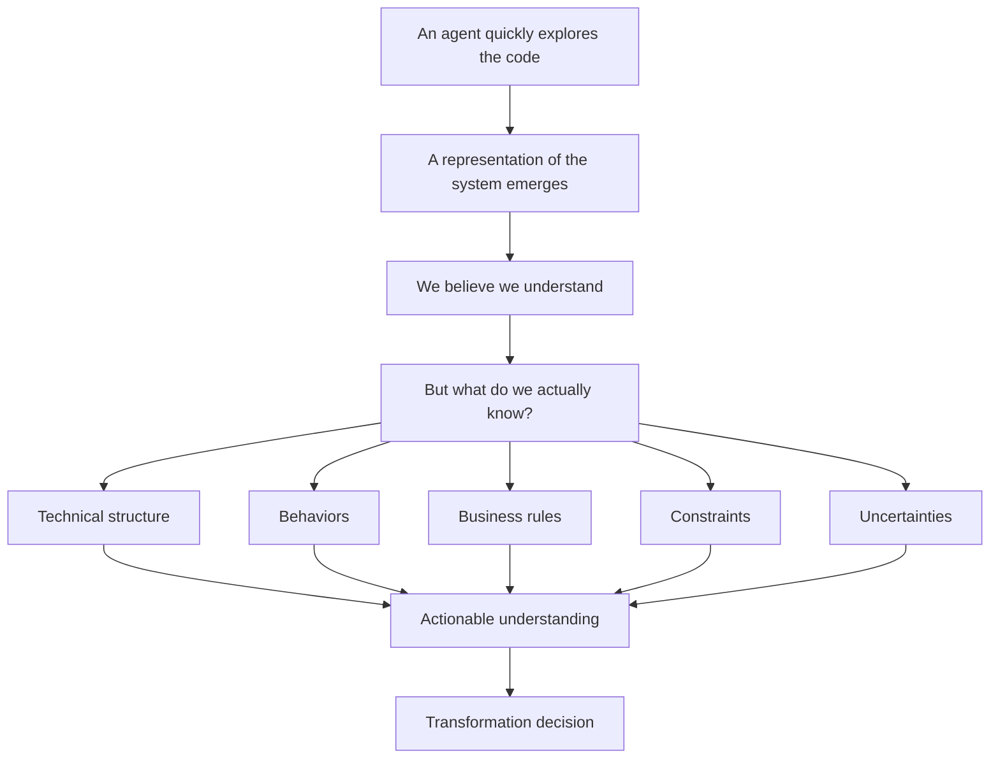
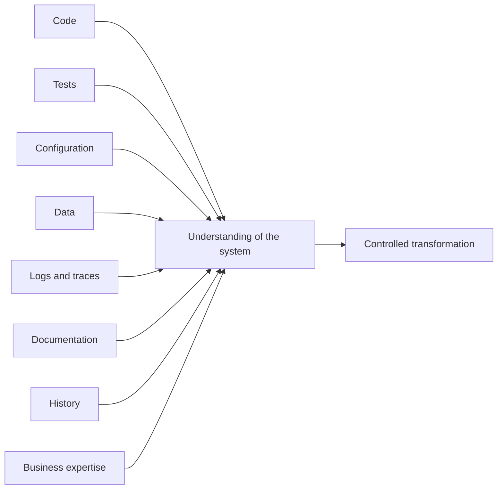
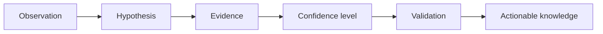
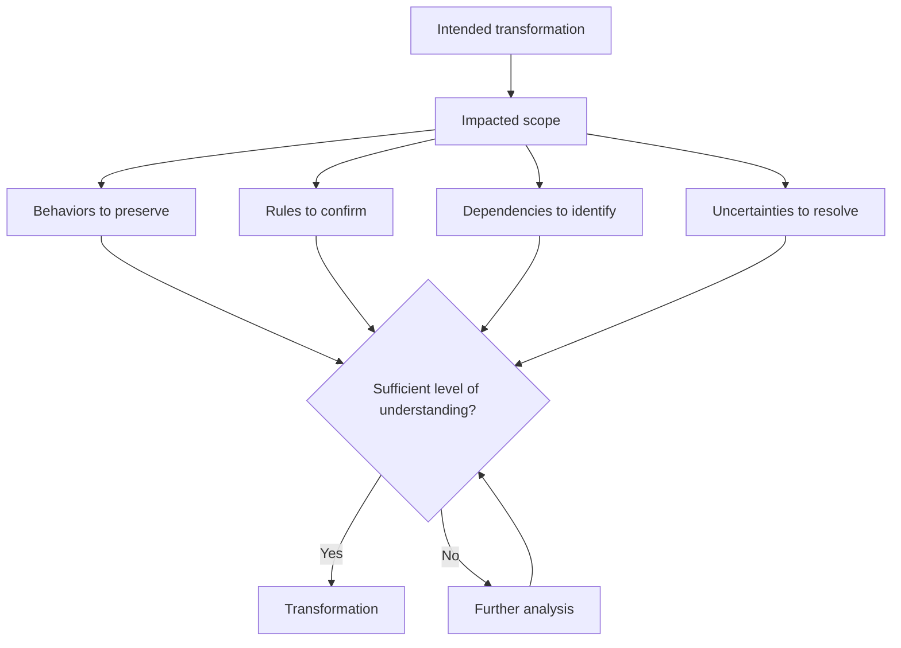

# Modernizing a Legacy System with AI: Understanding Before Transforming

> **Exploring a code repository with an agent has become fast. Understanding the behaviors, rules, and constraints that must be preserved before transforming the system is still an engineering problem.**

Asking a coding agent to explore an existing application has become relatively simple.

Within minutes, it can identify the main modules, walk through the dependencies, locate the entry points, follow certain calls, spot tightly coupled components, or produce a first representation of the architecture.

This capability considerably changes how we approach a legacy system.

An analysis that used to require hours of navigating through the code can now be accelerated. We can ask an agent to trace the path of a transaction, explain the role of a module, identify the dependencies of a class, or map the calls around a use case.

It then becomes tempting to move on immediately:

- Propose a new architecture.
- Migrate a framework.
- Extract a microservice.
- Replace an obsolete dependency.
- Rewrite a module.
- Or ask the agent directly to produce the transformation.

Yet something is missing between these two steps.

Having understood how the code is organized does not necessarily mean having understood what the system must keep doing.

And in a system that has been running for several years, that difference is far from trivial.

The code carries business rules, but also trade-offs, exceptions, implicit behaviors, integration constraints, and sometimes decisions whose justification is no longer documented.

Some lines we now consider useless may have become essential to how the system actually works.

Others really are remnants that should be removed.

The problem is precisely knowing how to tell them apart.

The challenge is therefore probably no longer just about speeding up how we read the code.

It is about building an understanding reliable enough to decide what we can transform, what we must preserve, and what we still need to verify.

---

## 1. Exploring a Repository Is No Longer the Problem

For a long time, one of the difficulties of a modernization project was simply getting into the system.

You had to identify the modules, understand the conventions, walk through the dependencies, locate the entry points, follow calls across several layers, and progressively rebuild a mental representation of the application.

On an old and large system, this phase could be particularly expensive.

Coding agents change part of that equation.

They let us query the repository rather than only reading through it linearly.

We can ask them where a process starts, which classes take part in a feature, which tables are used, where a rule seems to be applied, or which dependencies would be affected by a change.

This capability matters.

But it also shifts the problem.

When exploration becomes faster, we can easily confuse speed of access to information with understanding of the system.

The agent finds a condition in the code.

It can explain what it does.

It can sometimes find the methods that call it.

It can even propose an interpretation of its intent.

But that interpretation does not necessarily establish why the condition exists, whether it still matches a business rule, or whether other components implicitly rely on its behavior.

> **Reading is not yet understanding.**

The agent can speed up the reading of a system.

The decision to transform it requires knowing which behaviors, rules, and constraints that reading actually allows us to establish.

---

## 2. The Illusion of Understanding

Let's take a deliberately simple case.

A system applies a specific rule when a transaction exceeds a certain amount. The agent finds the condition in the code, identifies the method involved, and notices that the value used is defined directly in the component.

The conclusion may seem obvious: we have discovered a poorly implemented business rule that should be extracted into configuration or into a cleaner business component.

Technically, this analysis may be correct.

But several questions remain open:

- Does this value still match the current rule?
- Is it specific to a product, a country, or an old contract?
- Is there a batch process that applies a different rule?
- Does a consuming application depend on this behavior?
- Would existing transactions be interpreted differently if we changed this rule?

The code gives us an observation.

It does not automatically give us the whole story.

The danger appears when we turn that observation into certainty too quickly.

This situation becomes even more delicate with an agent capable of producing a coherent explanation. A well-worded explanation can give an impression of understanding that exceeds the actual level of evidence we have.

The problem therefore does not come only from a possible error by the model.

It also comes from how we use what it produces.

An analysis generated from the repository must remain what it is: a construction built from the elements accessible to the agent.

> **A hypothesis derived from the code is not yet a business rule.**

It becomes truly actionable when it can be connected to other elements that confirm, qualify, or contradict that interpretation.

---

## 3. Understanding the Code or Understanding the System?

This distinction seems fundamental to me when approaching modernization with agents.

Understanding the code means rebuilding its structure:

- What are the modules?
- Which components call each other?
- Where is the data transformed?
- Which dependencies are used?
- Which execution paths can we identify?

Understanding the system asks a different question:

- Why do these paths exist?
- Which behaviors are expected?
- Which properties must remain true after the transformation?
- Which consumers depend on the system?
- Which operational constraints have shaped its architecture?
- Which apparent anomalies have in fact become contractual behaviors?
- And which parts of the system do we still not understand well enough?

This difference explains why a technical map, even a very detailed one, is not always enough to launch a transformation.

An application is not made only of classes, modules, and dependencies.

It produces observable behavior in a given environment.

That behavior is what modernization will ultimately have to preserve, correct, or evolve.

The structure helps us find where to intervene.

Understanding the system helps us decide what the intervention is allowed to change.

---

## 4. What a Legacy System Carries With It

A legacy system is not simply a system built on old technology.

It can be technically old and perfectly well mastered.

Conversely, a relatively recent application can already be hard to evolve if its responsibilities, behaviors, and dependencies are poorly understood.

What generally makes modernization delicate is what the system has accumulated over time:

- Business rules have been added.
- Exceptions have appeared.
- Partners have imposed certain contracts.
- Data migrations have left compatibility layers behind that must be maintained.
- Incidents have led to the addition of protection mechanisms.
- Some temporary constraints have become permanent.
- And not all of these decisions are necessarily present in the documentation.

Take a specific delay before a process is triggered.

Seen from the code, it may look arbitrary.

It may be a poor implementation.

But it may also compensate for the behavior of an external system, respect a banking processing window, or protect the application against a race condition observed several years earlier.

The same goes for a data duplication, an unusual retry mechanism, an old format still supported, or a sequence of calls that appears useless.

> **An apparent anomaly is not necessarily an error to remove.**

This does not mean every historical decision must be kept.

That would be the opposite excess.

Modernization is precisely about distinguishing what is still necessary from what no longer is.

To get there, we need to move beyond an exclusively structural reading of the code.

---

## 5. The Repository Is Only Part of the Story

The code repository is naturally an essential source of knowledge.

It shows us what has been implemented.

But the actual behavior of the system often depends on a broader set of elements:

- **Tests** can reveal cases considered important enough to be protected.
- **Configuration** can profoundly change the behavior of the same component from one environment to another.
- **Data** helps us understand which cases actually exist and how often.
- **Logs and traces** show the paths that are actually executed.
- **Operations scripts** sometimes reveal procedures that do not appear in the application itself.
- **Documentation** contains intentions that are no longer necessarily visible in the implementation.
- **Change history** can help trace the origin of certain decisions.
- **Business expertise** can sometimes explain in a few minutes a rule that no static analysis could establish with certainty.

This changes how we use an agent.

Instead of only asking it:

> "Explain to me how this application works."

We can progressively provide it with, or have it explore, several sources to answer more precise questions:

- Where does this rule appear?
- Is there a test that protects it?
- Which configurations can change its behavior?
- Do we actually observe this path in the logs?
- Which consumers still use this format?
- Are there contradictions between the code and the documentation?

The goal is no longer simply to generate a description of the system.

It is to build a traceable understanding.

---

## 6. From Observation to Actionable Knowledge

This is where an additional discipline becomes necessary.

When an agent analyzes a system, not everything it produces should have the same status.

An observation directly visible in the code does not have the same value as an interpretation.

A rule confirmed by several sources does not have the same level of confidence as a hypothesis derived from a single method.

We can represent this progression in a simple way.

Suppose the agent observes that a request exceeding a given amount systematically goes through an additional validation.

The observation can be stated as follows:

> "A condition triggers `manualReview()` when the amount exceeds the configured threshold."

The hypothesis becomes:

> "Operations above this threshold require human validation."

We can then look for elements that strengthen or weaken this interpretation:

- Does an integration test cover this scenario?
- Does the functional documentation mention this validation?
- Is the threshold identical in every environment?
- Do the traces actually show this step being executed?
- Are there cases that bypass the rule?
- Can a business expert confirm its intent?

As these elements converge, the hypothesis becomes reliable enough to be used in the design of the target.

This progression matters because it introduces a difference between what the agent **infers** and what the project considers **established**.

We could, for example, use a few simple statuses:

| Status | Meaning |
| --- | --- |
| Observed | Element directly identified in a source |
| Probable | Coherent interpretation, still only partially verified |
| Confirmed | Behavior or rule supported by several elements or validated |
| Contradictory | Several sources give incompatible indications |
| Unknown | Information that is needed but not yet determined |

The point of such a mechanism is not to bureaucratize the analysis.

It is to prevent a well-worded hypothesis from silently turning into a specification.

---

## 7. Also Making Visible What We Do Not Know

When we document a system, we naturally tend to keep the answers:

- The modules identified.
- The flows understood.
- The rules recovered.
- The dependencies discovered.

Yet, in a modernization project, the open questions can be just as important:

- Why do two apparently equivalent processes use different rules?
- Is this table still being populated?
- Must this format still be accepted?
- Is this batch still used in production?
- Is this behavior a business rule or a historical workaround?
- What actually happens when this external service does not respond?

Part of the quality of the analysis lies precisely in not inventing an answer when the available elements do not allow a conclusion.

> **What we do not know is also part of our understanding of the system.**

Uncertainties should therefore become artifacts of the workflow.

They can be associated with their context, the sources already consulted, their potential impact, and the person or system likely to resolve them.

An open question about an old administrative screen probably does not have the same priority as an uncertainty about how a financial amount is calculated.

We can then start reasoning about risk.

A transformation that only touches well-understood behaviors can move quickly.

A transformation that crosses several areas of uncertainty requires more validation.

Confidence in the transformation therefore does not come from the number of files analyzed.

It comes from the relationship between what we know, what we can prove, and what we know we still need to verify.

---

## 8. Understanding Enough to Transform

Another mistake would be to conclude that a system must be fully documented before any change.

On a large application, that ambition would often be unrealistic.

We can always discover a new special case, an old integration, or a forgotten decision.

The goal is not to reach an exhaustive understanding.

It is to reach an understanding sufficient for the intended transformation.

If we want to replace an isolated library, the required level of knowledge may be relatively local.

If we want to extract a business domain from a monolith, we need a much more precise understanding of its data, contracts, dependencies, and invariants.

If we want to replace a system entirely, the required coverage becomes even broader.

This notion of sufficient understanding seems particularly important to me when using agents.

An agent can always keep exploring.

It can produce more diagrams, more summaries, more descriptions.

But producing more information does not necessarily mean reducing risk.

The right question becomes instead:

> **Do we have the knowledge needed to make this transformation decision?**

This forces us to connect the analysis to a goal:

- Which behaviors will potentially be affected?
- Which rules must we protect?
- Which contracts will be changed?
- Which areas remain too uncertain to move forward?

From there, the agent progressively stops being only an exploration tool.

It becomes a way to accelerate an engineering process in which observations, hypotheses, evidence, and decisions remain explicitly distinguished.

---

## Conclusion: Transformation Begins Before Code Generation

Coding agents make exploring existing systems much faster.

That is already a significant evolution.

But modernizing a legacy system does not begin when the agent generates the new code.

It begins when we try to determine what the old system actually does, why it does it, and which properties must survive its transformation.

The code repository is an entry point.

It does not, on its own, constitute knowledge of the system.

Tests, configuration, data, traces, documentation, and business expertise complete that representation.

The agent can help us go through these sources, recover relationships, and formulate hypotheses.

But a hypothesis should not silently become a truth.

It must be traceable to the elements that support it, to its confidence level, and, when necessary, to human validation.

We must also accept keeping uncertainties around.

Not every question will be resolved immediately.

Not every question needs to be.

The goal is not to understand everything before starting.

It is to know **what we understand, what evidence that understanding rests on, and which uncertainties remain**.

That is the material from which modernization can truly begin.

Because once the system is sufficiently understood, a new question appears immediately.

How do we turn all these observations, rules, behaviors, constraints, and open questions into artifacts structured enough to guide the rest of the work?

In other words, how do we move from a scattered understanding of the system to specifications that developers, architects, and the agents taking part in its transformation can actually use?

That is the subject of the next article in this series:

> **From Code to Actionable Specifications.**
