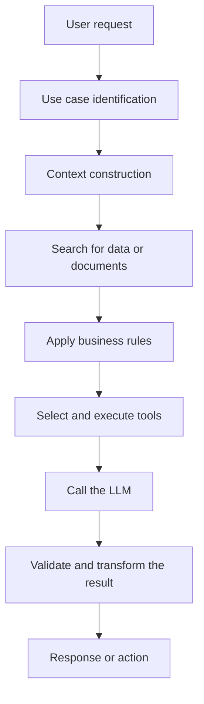
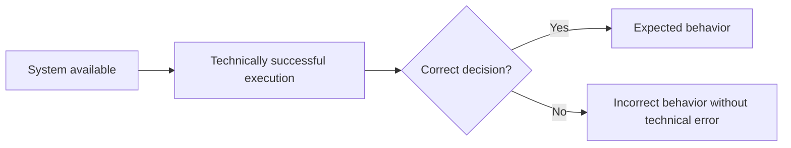
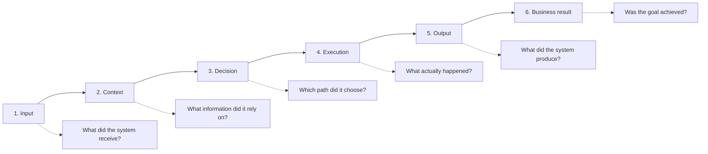
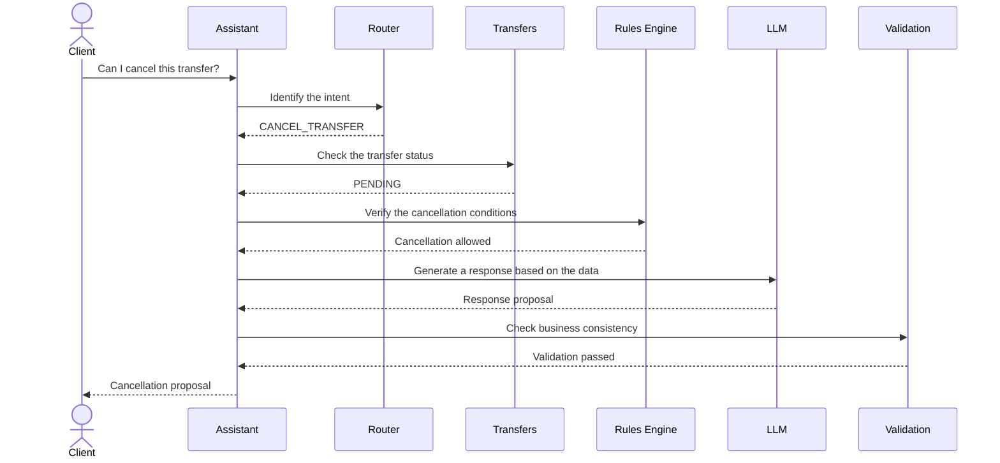
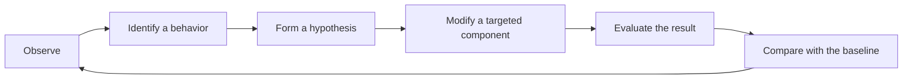
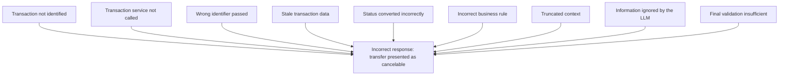
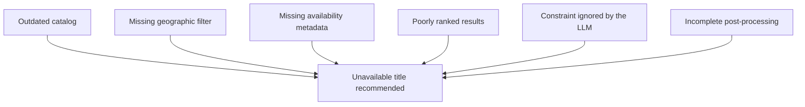
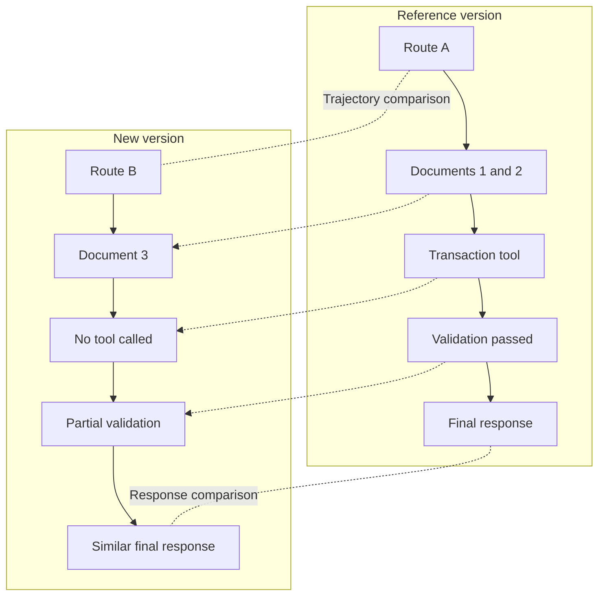

# Observe Before Optimizing

## Making the real behavior of an LLM system visible before trying to improve it

When an application integrating the capabilities of LLMs produces an unsatisfactory response, the first instinct is often to change the prompt, switch models, or tune a few generation parameters.

Is the answer too vague? Add more instructions.

Is the system using incorrect information? Strengthen the response rules.

Is the assistant failing to trigger the expected action? Add another instruction to the system prompt.

These changes can produce an immediate improvement. They can also move the problem elsewhere, hide its real origin, or introduce regressions in other use cases.

Because the generated response is only the visible part of the behavior.

In an LLM application, the result shown to the user usually depends on a broader chain: request interpretation, context construction, document retrieval, business rule application, tool selection, external service calls, result processing, and response validation.

Before optimizing a system, we therefore need to be able to observe what it actually does.

Not just what it says, but the path it takes to produce that answer.

---

## A correct answer can hide incorrect behavior

Take the case of a banking assistant helping a customer who wants to cancel a transfer.

The customer asks:

> I just made a transfer of 2,000 euros. Is it still possible to cancel it?

The assistant replies:

> A transfer can be canceled as long as it has not yet been executed. Check its status from your banking portal or contact your advisor quickly.

At first glance, the answer looks reasonable.

It is cautious, understandable, and does not promise an operation the bank may not be able to perform.

But what actually happened?

Did the system consult the status of the transfer in question?

Did it identify that the customer was referring to a specific transaction?

Did it call the banking service that retrieves that transaction?

Did it verify the cancellation conditions specific to that type of transfer?

Or did it simply generate a plausible answer from general knowledge contained in the model?

The answer can be correct in form while being incorrect from the perspective of the expected system.

In a banking application, the value of behavior does not lie only in the wording quality of the answer. It also depends on the system's ability to use the right data, apply the appropriate rules, and follow the expected path.

A generic answer may seem satisfactory in a demo. It becomes insufficient as soon as the system is expected to intervene in a real business process.

Optimizing only the generated text would then risk reinforcing an illusion of reliability without fixing the main problem: the assistant may never consult the transaction data.

---

## A bad response does not necessarily come from the model

Now consider a streaming platform with a conversational assistant.

A user asks:

> Find me a family movie under two hours, available in French and without overly violent scenes.

The assistant recommends a movie that is unavailable in the user's country and whose runtime exceeds two hours.

The model seems to have answered badly.

The first reaction might be to modify the prompt and insist more strongly on duration, language, and availability constraints.

Yet several causes are possible.

The catalog sent to the system may have contained stale information.

The search engine may have ignored the geographic filter.

The content runtime may have been missing from the indexed metadata.

The retrieval system may have selected movies that were semantically close to the request without applying the structured constraints.

The model may also have received ten results, none of which actually satisfied the full set of criteria.

In that case, the LLM is not necessarily the source of the problem. It produces an answer from an already degraded context.

Changing the model will not fix a poorly indexed catalog.

Strengthening the prompt will not make a missing metadata field appear.

Increasing the number of retrieved documents will not compensate for an incorrect regional filter.

Before changing the system, we therefore need to locate the step where the behavior drifted away from what was expected.

---

## Behavior belongs to the system, not only to the LLM

A system integrating the capabilities of LLMs is usually more than just an input sent to a model and a response returned to the user.

It looks more like a complete processing chain.



Each step contributes to the final behavior.

In a banking case, the system may need to identify the relevant account, verify the user's rights, look up the transaction, determine its status, check the cancellation rules, and then suggest the proper action.

In a streaming platform, it may need to understand the expressed preferences, retrieve the user's profile, query the catalog available in their region, filter content, rank the results, and generate a clear explanation.

The model participates in the process, but it does not necessarily control every step.

The observable behavior results from the interaction between:

* available data;
* instructions;
* the model;
* the orchestrator;
* tools;
* business rules;
* retrieval mechanisms;
* memory;
* validations;
* external systems.

That distinction changes how improvement should be approached.

The question is no longer only:

> How do we get a better response from the model?

The question becomes:

> Which component of the system produces or influences the behavior we are trying to change?

---

## Technical monitoring is not enough

Teams usually know how to supervise a software system.

They track service availability, response times, errors, resource consumption, dependency calls, and processing failures.

In an LLM application, they often add a few extra indicators:

* number of tokens consumed;
* average cost per request;
* model latency;
* provider error rate;
* number of tool calls;
* document retrieval time;
* conversation volume.

These metrics are necessary.

They help detect outages, performance degradation, cost increases, or operational issues.

But they do not always explain what the system decided to do.

A service can respond in less than two seconds, with no technical error, while still following the wrong trajectory.

The model call may have succeeded even though the wrong context was sent to it.

A tool may have returned HTTP 200 while providing an unsuitable business value.

A document search may be technically fast while retrieving irrelevant documents.



Technical monitoring mainly answers the question:

> Is the system working correctly?

Behavioral observation tries to answer a different one:

> What is the system actually doing when it works?

The two approaches are complementary. The second does not replace the first, but it becomes essential as soon as the result depends on probabilistic decisions, dynamically retrieved data, and several orchestrated components.

---

## Making the chain that produces behavior observable

Observing an LLM system does not mean blindly recording every prompt, every response, and every piece of manipulated data.

The goal is to produce enough information to understand the decisions made by the system, without turning every execution into an unusable mass of logs.

This observation can be structured around six levels.



### 1. The input

We first need to know what the system actually received.

The request sent to the model is not always identical to the user's initial message. It may have been rewritten, enriched, summarized, or combined with conversation history.

For a banking request, it can be useful to know:

* the original request;
* the channel used;
* the authenticated user;
* the account involved;
* the session state;
* the information gathered from previous exchanges.

For a streaming platform, the input may also include language, country, family profile, age restrictions, or the device used.

Without that visibility, a team can analyze the system response without knowing what information was actually available at generation time.

### 2. The constructed context

The model does not respond only to the user's request. It responds to the full context that is provided to it.

That context may contain:

* system instructions;
* business rules;
* retrieved documents;
* tool results;
* a conversation summary;
* user preferences;
* security constraints;
* examples;
* information coming from memory.

In the transfer-cancellation case, we need to be able to verify whether the actual transaction status was included in the context.

In the movie-recommendation case, we need to know whether runtime, language, regional availability, and content classification were present.

Observing the context makes it possible to distinguish a bad generation from a bad model input.

### 3. The decisions made by the orchestrator

Many applications use a router or orchestrator to decide which processing path should be applied.

The system may choose among several routes:

* respond directly;
* retrieve documents;
* call a business tool;
* ask for clarification;
* hand the request to an advisor;
* trigger a workflow;
* refuse the action.

These decisions must be observable.

If the banking assistant does not call the transfer lookup service, we need to know whether the use case was misclassified, whether the tool was unavailable, or whether the system considered the call unnecessary.

The decision is as important as the result.

### 4. Tool execution

When a system uses tools, observation must cover their actual execution.

It is not enough to know that a tool was called.

We also need to know:

* with which parameters;
* at what moment;
* for which intent;
* with which result;
* after how many attempts;
* with which possible error;
* with which transformation of the result.

An assistant may select the right tool while passing it the wrong transaction identifier.

It may call the streaming catalog correctly but forget to pass the user's country.

It may also receive a correct response from an external service and then misinterpret it.

Without a structured trace, those differences remain invisible behind the same final response.

### 5. The produced output

The output does not always match the raw text generated by the model.

It can be:

* validated;
* filtered;
* reformulated;
* enriched;
* truncated;
* translated;
* rejected;
* replaced by a fallback message.

We therefore need to distinguish the model output from what is actually shown to the user.

A validator can, for example, detect that the recommended movie is not available in the region and remove that recommendation.

If the user still receives an empty or incoherent answer, the problem is no longer at the generation stage, but in the correction mechanism.

### 6. The business result

The final step is to observe what the behavior actually produced.

Did the user get the information they were looking for?

Did they continue with the proposed flow?

Was the banking action executed?

Did the recommendation lead to playback?

Did an advisor have to take over the conversation?

Did the user immediately rephrase the same request?

An answer can look correct in isolation while still failing to achieve the business goal.

Observation should therefore not stop at the text. When possible, it should connect the answer to its operational result.

---

## Observing a banking interaction end to end

In the case of a transfer-cancellation request, the expected trajectory can be represented as a sequence.



This diagram exposes several control points.

The system must identify the intent, look up the transaction, apply the business rules, generate a coherent answer, and then validate the result.

An answer can be wrong even if some of those steps succeeded.

Observation must make it possible to determine exactly which step failed or was bypassed.

---

## From logs to behavioral traces

Recording more logs does not guarantee better understanding.

A sequence of technical lines showing that a router, a search engine, and a model were called does not necessarily let us reconstruct the system's logic.

To be useful, observation must be correlated around a single execution.

A behavioral trace could look like this:

```json
{
  "traceId": "tr-981745",
  "useCase": "bank-transfer-cancellation",
  "userIntent": "CANCEL_TRANSFER",
  "entities": {
    "transferId": "masked-transfer-id"
  },
  "route": "TRANSFER_SUPPORT",
  "contextSources": [
    "transfer-status-service",
    "cancellation-policy-v4"
  ],
  "toolCalls": [
    {
      "tool": "getTransferStatus",
      "status": "SUCCESS",
      "result": {
        "transferStatus": "PENDING"
      }
    }
  ],
  "decision": "CANCELLATION_REQUEST_ALLOWED",
  "validation": {
    "status": "PASSED",
    "rules": [
      "customer-ownership",
      "transfer-status",
      "cancellation-policy"
    ]
  },
  "finalAction": "DISPLAY_CANCELLATION_CONFIRMATION"
}
```

This trace is not meant to capture an internal chain of thought from the model.

It captures observable and controllable system elements:

* the chosen intent;
* the data consulted;
* the tools called;
* the application decisions;
* the validated rules;
* the final action.

That distinction matters.

Understanding behavior does not require exposing a detailed internal reasoning trace from the model. What really matters is making visible the architectural and business decisions that can be checked, compared, and audited.

---

## Observe without exposing sensitive data

Observation also introduces risk.

In a banking context, traces can contain personal data, account identifiers, transaction information, or elements covered by banking secrecy.

In a streaming platform, they may reveal consumption habits, preferences, family profiles, or data concerning minors.

It would therefore be dangerous to record every conversation and every context in full under the pretext of improving the system.

Observation must be designed with the same rigor as the rest of the architecture:

* data minimization;
* identifier masking;
* access control;
* defined retention periods;
* environment separation;
* encryption;
* traceability of access;
* deletion or anonymization of sensitive data.

Not all information should be kept in raw form.

A pseudonymized technical identifier may be enough to correlate events.

The status of a transaction can be useful without keeping its amount.

Preference categories can be observed without storing the full viewing history.

The goal is not to store everything. It is to keep the elements needed to understand the behavior with a controlled level of risk.

---

## Moving from judgment to hypothesis

Without observation, anomalies are often described in general terms:

> The assistant responds poorly to cancellation requests.

> The recommendations are not relevant enough.

> The model does not always follow the rules.

These statements describe a symptom, but they do not let us decide precisely what to change.

Structured observation makes it possible to produce more useful hypotheses.

In the banking context:

> When the user does not explicitly mention the word "transfer", the router classifies some cancellation requests as general support and does not call the transaction lookup service.

In the streaming context:

> When several constraints are expressed in natural language, semantic search favors topical proximity and does not systematically turn runtime and regional availability into structured filters.

Those hypotheses can be tested.

They also help identify which component should be changed.

In the first case, the improvement may concern routing or intent extraction.

In the second, it may concern the translation of constraints into search filters.

The main prompt may not be involved in either problem.



Optimization is no longer a succession of intuitive tweaks. It becomes an experimental process.

---

## The same anomaly can have several origins

Suppose a banking assistant sometimes tells a customer that a transfer can be canceled even though it has already been executed.

Several causes can produce exactly the same incorrect response.



Without observation, those scenarios get mixed together.

The team sees a bad response and changes the prompt.

With a behavioral trace, it can determine at which step the system diverged.

The same reasoning applies to a streaming platform that recommends an unavailable title.



The quality of a system integrating the capabilities of LLMs therefore depends as much on its ability to produce an answer as on the team's ability to explain where that answer came from.

---

## The first behavioral indicators

Observation can also produce indicators that are closer to the system's real operation.

In a banking assistant, it may be useful to track:

* the proportion of transactional requests that triggered a call to the banking system;
* the rate of decisions based on verified data;
* the transfer-to-advisor rate;
* inconsistencies between an operation's status and the produced answer;
* requests immediately rephrased by the user;
* failed business validations.

In a streaming platform, we can observe:

* compliance with explicit constraints;
* the rate of titles that are actually available;
* the proportion of results filtered after generation;
* the number of requests requiring rephrasing;
* the diversity of proposed content;
* the playback rate after recommendation;
* the gaps between expressed preferences and the metadata of the proposed content.

These indicators do not replace qualitative evaluation.

They do, however, help identify trends, detect degradation, and prioritize investigations.

---

## Start with a limited scope

Making the full behavior observable from version one can become expensive and complex.

A more pragmatic approach is to start with the most sensitive use cases.

In banking, that may involve operations with a transaction, a contractual commitment, personal data, or a decision that can have financial impact.

In a streaming platform, priority may go to child profiles, content restrictions, geographic availability, or recommendations that depend on multiple data sources.

For each use case, it is possible to define:

* important decisions;
* expected data sources;
* tools that must be called;
* rules that must be respected;
* events to trace;
* information to mask;
* business results to observe.

This framework makes it possible to build useful observability gradually, without indiscriminately recording everything the system does.

---

## Observe so you can compare

In the previous article, we established the need to freeze the behavior of an LLM system before evolving it.

That baseline preserves representative cases, expectations, results, and invariants.

But a baseline based only on final responses remains limited.

When two versions produce different answers, it helps us see the gap, but not always explain it.

Observation completes that baseline.

It makes it possible to compare not only the outputs, but also the elements that produced them:

* the selected routes;
* the retrieved documents;
* the tools called;
* the applied rules;
* the errors encountered;
* the validations executed;
* the actions taken.



A new version may produce a more polished answer while no longer calling an essential business tool.

It may keep a similar response while using a stale data source.

It may also legitimately change the wording without changing the business decision.

Comparing only the text makes those differences hard to interpret.

Observing the system makes it possible to distinguish an acceptable variation from a real drift.

---

## Before improving the answer, understand the path

An LLM application should not be optimized like a simple text generation interface.

Its behavior is produced by a set of components that interpret, search, decide, execute, and validate.

When a result is unsatisfactory, the model is only one possible cause among others.

The real challenge is therefore to make visible the chain that links the user's request to the final result.

Observe the input.

Observe the context.

Observe the decisions.

Observe the tools.

Observe the validations.

Observe the business result.

That visibility changes how the system evolves.

It avoids correcting symptoms with extra instructions.

It makes it possible to form hypotheses, target changes, and measure their effects.

It also makes governance possible on the basis of facts rather than a general impression of quality.

Because before optimizing an answer, we need to understand the path that produced it.

That path is the system's decision trajectory.

That is the trajectory we must then learn to represent, reconstruct, and compare.

---

## Conclusion - Observe to improve with control

Improving an LLM system should not start with a prompt tweak, a model switch, or a new rule.

It should start with a simpler question:

> What actually happened inside the system?

An incorrect answer can come from the model, but also from bad routing, incomplete context, stale data, a wrongly called tool, or insufficient validation.

Conversely, a correct answer can hide a fragile behavior if the system did not consult the expected data, apply the planned business rules, or follow the necessary trajectory.

Observing before optimizing therefore helps us move away from intuitive correction.

Observation turns an impression into a fact, a fact into a hypothesis, and then a hypothesis into a targeted and measurable change.

It helps us understand not only what the system produces, but also the conditions under which it produces it.

That capability becomes essential as soon as the LLM is involved in sensitive processes, such as a banking operation, a personalized recommendation, or a decision based on several data sources.

Freezing a baseline makes it possible to detect that a behavior changed.

Observing the system makes it possible to understand why it changed.

The next step is now to represent that path more precisely: the decisions taken, the tools called, the data used, the branches encountered, and the validations executed.

In other words, we need to learn how to reconstruct the system's decision trajectory.
