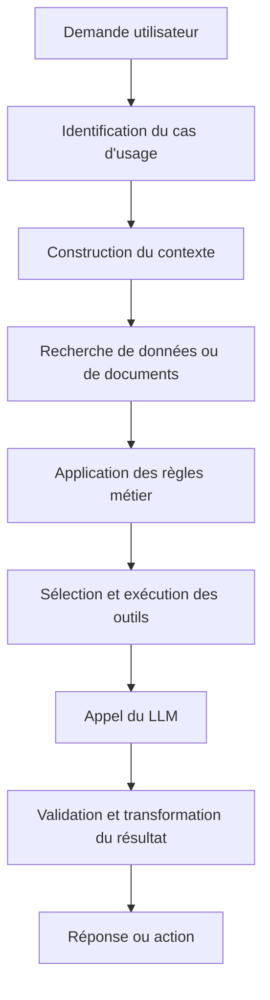
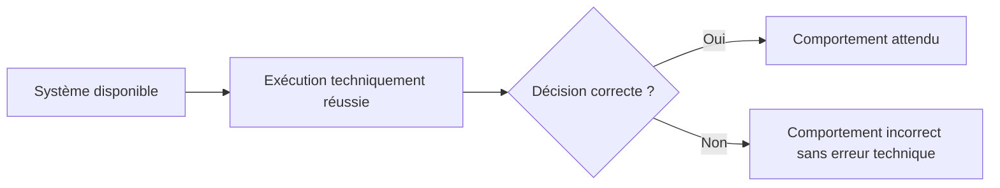
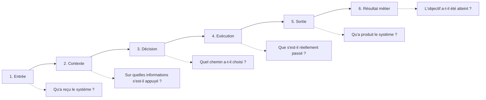
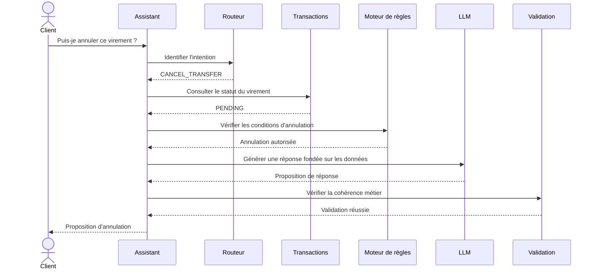
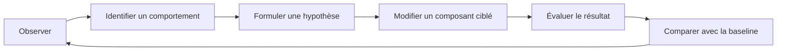
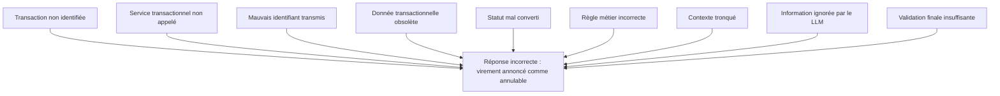
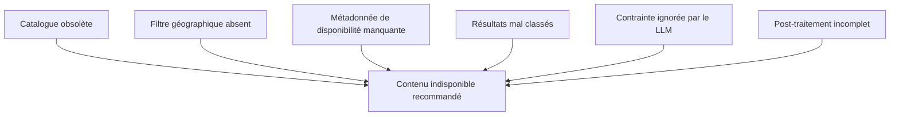
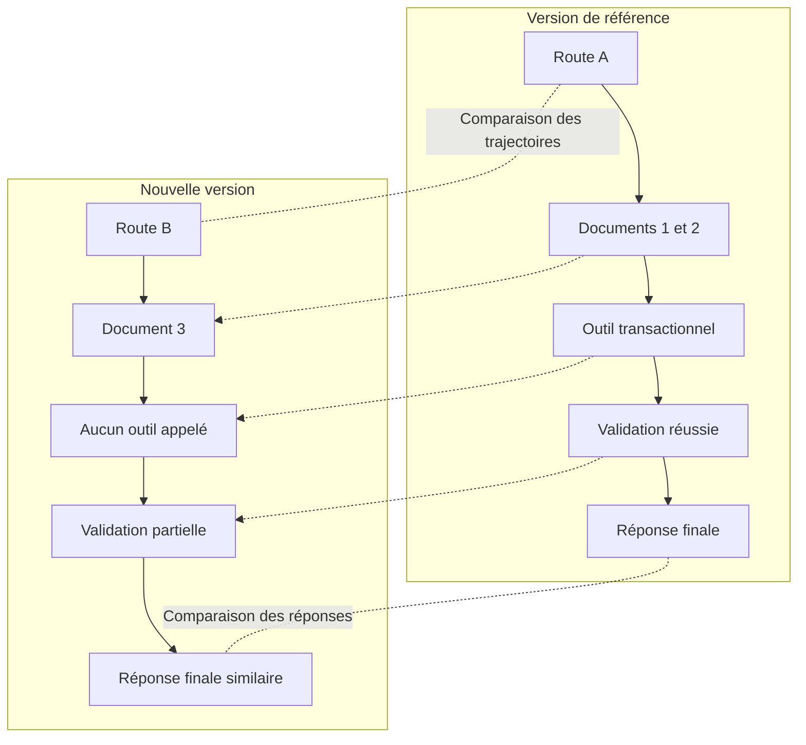

# Observer avant d'optimiser

## Rendre visible le comportement réel d'un système LLM avant de chercher à l'améliorer

Lorsqu'une application intégrant les capacités des LLM produit une réponse insatisfaisante, le premier réflexe consiste souvent à modifier le prompt, changer de modèle ou ajuster quelques paramètres de génération.

La réponse manque de précision ? On enrichit les instructions.

Le système utilise une information incorrecte ? On renforce les règles de réponse.

L'assistant ne déclenche pas l'action attendue ? On ajoute une nouvelle consigne dans le prompt système.

Ces modifications peuvent produire une amélioration immédiate. Elles peuvent aussi déplacer le problème, masquer sa véritable origine ou introduire des régressions sur d'autres cas d'usage.

Car la réponse générée n'est que la partie visible du comportement.

Dans une application LLM, le résultat présenté à l'utilisateur dépend généralement d'une chaîne plus large : interprétation de la demande, construction du contexte, récupération de documents, application de règles métier, sélection d'outils, appels à des services externes, traitement des résultats et validation de la réponse.

Avant d'optimiser un système, il faut donc être capable d'observer ce qu'il fait réellement.

Non pas seulement ce qu'il répond, mais le chemin qu'il emprunte pour produire cette réponse.

---

## Une réponse correcte peut cacher un mauvais comportement

Prenons le cas d'un assistant bancaire chargé d'accompagner un client qui souhaite annuler un virement.

Le client demande :

> Je viens d'effectuer un virement de 2 000 euros. Est-il encore possible de l'annuler ?

L'assistant lui répond :

> Un virement peut être annulé tant qu'il n'a pas encore été exécuté. Consultez son statut depuis votre espace bancaire ou contactez rapidement votre conseiller.

À première vue, la réponse paraît raisonnable.

Elle est prudente, compréhensible et ne promet pas une opération que la banque ne pourrait pas réaliser.

Mais que s'est-il réellement passé ?

Le système a-t-il consulté le statut du virement concerné ?

A-t-il identifié que le client faisait référence à une transaction précise ?

A-t-il appelé le service bancaire permettant de récupérer cette transaction ?

A-t-il vérifié les conditions d'annulation propres à ce type de virement ?

Ou a-t-il simplement généré une réponse plausible à partir de connaissances générales présentes dans le modèle ?

La réponse peut être correcte sur la forme tout en étant incorrecte du point de vue du système attendu.

Dans une application bancaire, la valeur du comportement ne réside pas uniquement dans la qualité rédactionnelle de la réponse. Elle dépend aussi de la capacité du système à utiliser les bonnes données, appliquer les règles appropriées et respecter le parcours prévu.

Une réponse générique peut sembler satisfaisante lors d'une démonstration. Elle devient insuffisante dès lors que le système est censé intervenir dans un processus métier réel.

Optimiser uniquement le texte produit risquerait alors de renforcer une illusion de fiabilité sans corriger le problème principal : l'assistant ne consulte peut-être jamais les données transactionnelles.

---

## Une mauvaise réponse ne vient pas nécessairement du modèle

Considérons maintenant une plateforme de streaming disposant d'un assistant conversationnel.

Un utilisateur demande :

> Trouve-moi un film familial de moins de deux heures, disponible en français et sans scènes trop violentes.

L'assistant recommande un film indisponible dans le pays de l'utilisateur et dont la durée dépasse deux heures.

Le modèle semble avoir mal répondu.

La première réaction pourrait être de modifier le prompt afin d'insister davantage sur les contraintes de durée, de langue et de disponibilité.

Pourtant, plusieurs causes sont possibles.

Le catalogue transmis au système pouvait contenir une information obsolète.

Le moteur de recherche pouvait avoir ignoré le filtre géographique.

La durée du contenu pouvait être absente des métadonnées indexées.

Le système de récupération pouvait avoir sélectionné les films sémantiquement proches de la demande sans appliquer les contraintes structurées.

Le modèle pouvait également avoir reçu dix résultats, dont aucun ne respectait réellement l'ensemble des critères.

Dans ce cas, le LLM n'est pas nécessairement à l'origine du problème. Il produit une réponse à partir d'un contexte déjà dégradé.

Changer de modèle ne corrigera pas une mauvaise indexation du catalogue.

Renforcer le prompt ne rendra pas disponible une métadonnée absente.

Augmenter le nombre de documents récupérés ne compensera pas un filtre régional incorrect.

Avant de modifier le système, il faut donc pouvoir localiser l'étape à laquelle le comportement s'est écarté de ce qui était attendu.

---

## Le comportement appartient au système, pas uniquement au LLM

Une application intégrant les capacités des LLM ne se résume généralement pas à une entrée envoyée à un modèle, puis à une réponse retournée à l'utilisateur.

Elle ressemble davantage à une chaîne de traitement complète.



Chaque étape contribue au comportement final.

Dans un cas bancaire, le système peut devoir identifier le compte concerné, vérifier les droits de l'utilisateur, rechercher la transaction, déterminer son statut, consulter les règles d'annulation puis proposer l'action appropriée.

Dans une plateforme de streaming, il peut devoir comprendre les préférences exprimées, récupérer le profil de l'utilisateur, interroger le catalogue disponible dans sa région, filtrer les contenus, classer les résultats et générer une explication compréhensible.

Le modèle participe au processus, mais il n'en contrôle pas nécessairement toutes les étapes.

Le comportement observable résulte de l'interaction entre :

* les données disponibles ;
* les instructions ;
* le modèle ;
* l'orchestrateur ;
* les outils ;
* les règles métier ;
* les mécanismes de recherche ;
* la mémoire ;
* les validations ;
* les systèmes externes.

Cette distinction change la manière d'aborder l'amélioration.

Il ne s'agit plus de demander uniquement :

> Comment obtenir une meilleure réponse du modèle ?

La question devient :

> Quel composant du système produit ou influence le comportement que nous cherchons à modifier ?

---

## Le monitoring technique ne suffit pas

Les équipes savent généralement superviser un système logiciel.

Elles suivent la disponibilité des services, les temps de réponse, les erreurs, la consommation des ressources, les appels aux dépendances ou encore les échecs de traitement.

Dans une application LLM, elles ajoutent souvent quelques indicateurs supplémentaires :

* nombre de tokens consommés ;
* coût moyen par requête ;
* latence du modèle ;
* taux d'erreur du fournisseur ;
* nombre d'appels aux outils ;
* temps de récupération des documents ;
* volume de conversations.

Ces métriques sont nécessaires.

Elles permettent de détecter une indisponibilité, une dégradation de performance, une augmentation des coûts ou un problème d'exploitation.

Mais elles ne permettent pas toujours de comprendre ce que le système a décidé de faire.

Un service peut répondre en moins de deux secondes, sans erreur technique, tout en suivant une mauvaise trajectoire.

L'appel au modèle peut avoir réussi alors que le mauvais contexte lui a été transmis.

Un outil peut avoir retourné un statut HTTP 200 tout en fournissant une donnée métier inadaptée.

Une recherche documentaire peut être techniquement performante tout en récupérant des documents non pertinents.



Le monitoring technique répond principalement à la question :

> Le système fonctionne-t-il correctement ?

L'observation comportementale cherche à répondre à une autre question :

> Que fait réellement le système lorsqu'il fonctionne ?

Les deux approches sont complémentaires. La seconde ne remplace pas la première, mais elle devient indispensable dès que le résultat dépend de décisions probabilistes, de données récupérées dynamiquement et de plusieurs composants orchestrés.

---

## Rendre observable la chaîne de production du comportement

Observer un système LLM ne signifie pas enregistrer indistinctement tous les prompts, toutes les réponses et toutes les données manipulées.

L'objectif est de produire suffisamment d'informations pour comprendre les décisions prises par le système, sans transformer chaque exécution en une masse de logs inexploitable.

Cette observation peut être structurée autour de six niveaux.



### 1. L'entrée

Il faut d'abord savoir ce que le système a réellement reçu.

La requête envoyée au modèle n'est pas toujours identique au message initial de l'utilisateur. Elle peut avoir été reformulée, enrichie, résumée ou combinée avec un historique de conversation.

Pour une demande bancaire, il peut être utile de connaître :

* la demande initiale ;
* le canal utilisé ;
* l'utilisateur authentifié ;
* le compte concerné ;
* l'état de la session ;
* les informations issues des échanges précédents.

Pour une plateforme de streaming, l'entrée peut également inclure la langue, le pays, le profil familial, les restrictions d'âge ou l'appareil utilisé.

Sans cette visibilité, une équipe peut analyser la réponse du système sans savoir quelles informations étaient réellement disponibles au moment de la génération.

### 2. Le contexte construit

Le modèle ne répond pas uniquement à la demande de l'utilisateur. Il répond à l'ensemble du contexte qui lui est fourni.

Ce contexte peut contenir :

* des instructions système ;
* des règles métier ;
* des documents récupérés ;
* des résultats d'outils ;
* un résumé de conversation ;
* des préférences utilisateur ;
* des contraintes de sécurité ;
* des exemples ;
* des informations provenant d'une mémoire.

Dans le cas de l'annulation d'un virement, il faut pouvoir vérifier si le statut réel de la transaction a été intégré au contexte.

Dans le cas de la recommandation d'un film, il faut savoir si la durée, la langue, la disponibilité régionale et la classification du contenu étaient présentes.

Observer le contexte permet de distinguer une mauvaise génération d'une mauvaise alimentation du modèle.

### 3. Les décisions prises par l'orchestrateur

De nombreuses applications utilisent un routeur ou un orchestrateur pour déterminer le traitement à appliquer.

Le système peut choisir entre plusieurs chemins :

* répondre directement ;
* rechercher des documents ;
* appeler un outil métier ;
* demander une précision ;
* transmettre la demande à un conseiller ;
* déclencher un workflow ;
* refuser l'action.

Ces décisions doivent être observables.

Si l'assistant bancaire n'appelle pas le service de consultation des virements, il faut savoir si le cas d'usage a été mal identifié, si l'outil n'était pas disponible ou si le système a considéré qu'un appel n'était pas nécessaire.

La décision est aussi importante que son résultat.

### 4. L'exécution des outils

Lorsqu'un système utilise des outils, l'observation doit couvrir leur exécution réelle.

Il ne suffit pas de savoir qu'un outil a été appelé.

Il faut également pouvoir déterminer :

* avec quels paramètres ;
* à quel moment ;
* pour quelle intention ;
* avec quel résultat ;
* après combien de tentatives ;
* avec quelle erreur éventuelle ;
* avec quelle transformation du résultat.

Un assistant peut sélectionner le bon outil tout en lui transmettant un mauvais identifiant de transaction.

Il peut appeler correctement le catalogue de streaming, mais oublier de transmettre le pays de l'utilisateur.

Il peut aussi recevoir une réponse correcte d'un service externe puis mal l'interpréter.

Sans trace structurée, ces différences restent invisibles derrière une même réponse finale.

### 5. La sortie produite

La sortie ne correspond pas toujours au texte brut généré par le modèle.

Elle peut être :

* validée ;
* filtrée ;
* reformulée ;
* enrichie ;
* tronquée ;
* traduite ;
* rejetée ;
* remplacée par un message de secours.

Il faut donc distinguer la sortie du modèle de celle qui est effectivement présentée à l'utilisateur.

Un validateur peut, par exemple, détecter que le film recommandé n'est pas disponible dans la région et supprimer cette recommandation.

Si l'utilisateur reçoit malgré tout une réponse vide ou incohérente, le problème ne se situe plus au niveau de la génération initiale, mais dans le mécanisme de correction.

### 6. Le résultat métier

La dernière étape consiste à observer ce que le comportement a réellement produit.

L'utilisateur a-t-il obtenu l'information recherchée ?

A-t-il poursuivi le parcours proposé ?

L'action bancaire a-t-elle été exécutée ?

La recommandation a-t-elle conduit au lancement d'un contenu ?

Un conseiller a-t-il dû reprendre la conversation ?

L'utilisateur a-t-il reformulé immédiatement la même demande ?

Une réponse peut sembler correcte lors d'une évaluation isolée tout en échouant à atteindre l'objectif métier.

L'observation ne doit donc pas s'arrêter au texte. Elle doit, lorsque cela est possible, relier la réponse à son résultat opérationnel.

---

## Observer une interaction bancaire de bout en bout

Dans le cas d'une demande d'annulation de virement, la trajectoire attendue peut être représentée sous la forme d'une séquence.



Ce diagramme rend visibles plusieurs points de contrôle.

Le système doit identifier l'intention, consulter la transaction, appliquer les règles métier, générer une réponse cohérente puis valider le résultat.

Une réponse peut être incorrecte alors même que certaines de ces étapes ont réussi.

L'observation doit permettre de déterminer précisément laquelle a échoué ou a été contournée.

---

## Des logs aux traces comportementales

Enregistrer davantage de logs ne garantit pas une meilleure compréhension.

Une succession de lignes techniques indiquant qu'un routeur, un moteur de recherche et un modèle ont été appelés ne permet pas nécessairement de reconstruire la logique du système.

Pour être exploitable, l'observation doit être corrélée autour d'une même exécution.

Une trace comportementale pourrait prendre la forme suivante :

```json
{
  "traceId": "tr-981745",
  "useCase": "bank-transfer-cancellation",
  "userIntent": "CANCEL_TRANSFER",
  "entities": {
    "transferId": "masked-transfer-id"
  },
  "route": "TRANSFER_SUPPORT",
  "contextSources": [
    "transfer-status-service",
    "cancellation-policy-v4"
  ],
  "toolCalls": [
    {
      "tool": "getTransferStatus",
      "status": "SUCCESS",
      "result": {
        "transferStatus": "PENDING"
      }
    }
  ],
  "decision": "CANCELLATION_REQUEST_ALLOWED",
  "validation": {
    "status": "PASSED",
    "rules": [
      "customer-ownership",
      "transfer-status",
      "cancellation-policy"
    ]
  },
  "finalAction": "DISPLAY_CANCELLATION_CONFIRMATION"
}
```

Cette trace ne cherche pas à enregistrer une chaîne de pensée interne du modèle.

Elle capture des éléments observables et contrôlables du système :

* l'intention retenue ;
* les données consultées ;
* les outils appelés ;
* les décisions applicatives ;
* les règles validées ;
* l'action finale.

Cette distinction est importante.

Comprendre un comportement ne nécessite pas d'exposer un raisonnement interne détaillé du modèle. Il faut surtout rendre visibles les décisions architecturales et métier qui peuvent être vérifiées, comparées et auditées.

---

## Observer sans exposer les données sensibles

L'observation introduit également un risque.

Dans un contexte bancaire, les traces peuvent contenir des données personnelles, des identifiants de comptes, des informations transactionnelles ou des éléments relevant du secret bancaire.

Dans une plateforme de streaming, elles peuvent révéler des habitudes de consommation, des préférences, des profils familiaux ou des données concernant des mineurs.

Il serait donc dangereux d'enregistrer intégralement toutes les conversations et tous les contextes sous prétexte d'améliorer le système.

L'observation doit être conçue avec les mêmes exigences que le reste de l'architecture :

* minimisation des données ;
* masquage des identifiants ;
* contrôle des accès ;
* durée de conservation définie ;
* séparation des environnements ;
* chiffrement ;
* traçabilité des consultations ;
* suppression ou anonymisation des données sensibles.

Toutes les informations ne doivent pas être conservées sous leur forme brute.

Un identifiant technique pseudonymisé peut suffire à corréler les événements.

Le statut d'une transaction peut être utile sans conserver son montant.

Les catégories de préférences peuvent être observées sans enregistrer tout l'historique de visionnage.

L'objectif n'est pas de tout stocker. Il est de conserver les éléments nécessaires pour comprendre le comportement avec un niveau de risque maîtrisé.

---

## Passer d'un jugement à une hypothèse

Sans observation, les anomalies sont souvent formulées de manière générale :

> L'assistant répond mal aux demandes d'annulation.

> Les recommandations ne sont pas suffisamment pertinentes.

> Le modèle ne respecte pas toujours les règles.

Ces formulations décrivent un symptôme, mais elles ne permettent pas de décider précisément quoi modifier.

Une observation structurée permet de produire des hypothèses plus utiles.

Dans le contexte bancaire :

> Lorsque l'utilisateur ne mentionne pas explicitement le mot « virement », le routeur classe certaines demandes d'annulation dans le support général et n'appelle pas le service de consultation des transactions.

Dans le contexte du streaming :

> Lorsque plusieurs contraintes sont exprimées en langage naturel, la recherche sémantique privilégie la proximité thématique et ne transforme pas systématiquement la durée et la disponibilité régionale en filtres structurés.

Ces hypothèses peuvent être vérifiées.

Elles permettent également d'identifier le composant à modifier.

Dans le premier cas, l'amélioration peut concerner le routage ou l'extraction d'intention.

Dans le second, elle peut concerner la traduction des contraintes en filtres de recherche.

Le prompt principal n'est peut-être impliqué dans aucun des deux problèmes.



L'optimisation n'est plus une succession d'ajustements intuitifs. Elle devient une démarche expérimentale.

---

## Une même anomalie peut avoir plusieurs origines

Supposons qu'un assistant bancaire informe parfois un client qu'un virement peut être annulé alors que celui-ci a déjà été exécuté.

Plusieurs causes peuvent produire exactement la même réponse incorrecte.



Sans observation, ces scénarios se confondent.

L'équipe voit une mauvaise réponse et modifie le prompt.

Avec une trace comportementale, elle peut déterminer à quelle étape le système a divergé.

Le même raisonnement s'applique à une plateforme de streaming qui recommande un contenu indisponible.



La qualité d'un système intégrant les capacités des LLM dépend donc autant de sa capacité à produire une réponse que de la capacité de l'équipe à expliquer l'origine de cette réponse.

---

## Les premiers indicateurs comportementaux

L'observation peut également produire des indicateurs plus proches du fonctionnement réel du système.

Dans un assistant bancaire, il peut être pertinent de suivre :

* la proportion de demandes transactionnelles ayant déclenché un appel au système bancaire ;
* le taux de décisions fondées sur une donnée vérifiée ;
* le taux de transfert vers un conseiller ;
* les incohérences entre le statut d'une opération et la réponse produite ;
* les demandes reformulées immédiatement par l'utilisateur ;
* les validations métier échouées.

Dans une plateforme de streaming, on peut observer :

* le respect des contraintes explicites ;
* le taux de recommandations réellement disponibles ;
* la proportion de résultats filtrés après génération ;
* le nombre de requêtes nécessitant une reformulation ;
* la diversité des contenus proposés ;
* le taux de lancement après recommandation ;
* les écarts entre les préférences exprimées et les métadonnées des contenus proposés.

Ces indicateurs ne remplacent pas une évaluation qualitative.

Ils permettent cependant d'identifier des tendances, de détecter des dégradations et de prioriser les investigations.

---

## Commencer par un périmètre limité

Rendre tout le comportement observable dès la première version peut devenir coûteux et complexe.

Une approche plus pragmatique consiste à commencer par les cas d'usage les plus sensibles.

Dans une banque, il peut s'agir des opérations impliquant une transaction, un engagement contractuel, une donnée personnelle ou une décision susceptible d'avoir un impact financier.

Dans une plateforme de streaming, la priorité peut porter sur les profils enfants, les restrictions de contenu, la disponibilité géographique ou les recommandations faisant intervenir plusieurs sources de données.

Pour chaque cas d'usage, il est possible de définir :

* les décisions importantes ;
* les sources de données attendues ;
* les outils qui doivent être appelés ;
* les règles qui doivent être respectées ;
* les événements à tracer ;
* les informations à masquer ;
* les résultats métier à observer.

Ce cadre permet de construire progressivement une observabilité utile, sans enregistrer indistinctement tout ce que fait le système.

---

## Observer pour pouvoir comparer

Dans l'article précédent, nous avons posé la nécessité de figer le comportement d'un système LLM avant de le faire évoluer.

Cette baseline permet de conserver des cas représentatifs, des attentes, des résultats et des invariants.

Mais une baseline fondée uniquement sur les réponses finales reste limitée.

Lorsque deux versions produisent des réponses différentes, elle permet de constater l'écart, mais pas toujours de l'expliquer.

L'observation complète cette baseline.

Elle permet de comparer non seulement les sorties, mais aussi les éléments qui les ont produites :

* les routes choisies ;
* les documents récupérés ;
* les outils appelés ;
* les règles appliquées ;
* les erreurs rencontrées ;
* les validations exécutées ;
* les actions réalisées.



Une nouvelle version peut produire une réponse plus élégante tout en cessant d'appeler un outil métier indispensable.

Elle peut conserver une réponse similaire tout en utilisant une source de données obsolète.

Elle peut aussi modifier légitimement la formulation sans changer la décision métier.

Comparer uniquement les textes rend ces différences difficiles à interpréter.

Observer le système permet de distinguer une variation acceptable d'une dérive réelle.

---

## Avant d'améliorer la réponse, comprendre le chemin

Une application LLM ne doit pas être optimisée comme une simple interface de génération de texte.

Son comportement est produit par un ensemble de composants qui interprètent, recherchent, décident, exécutent et valident.

Lorsqu'un résultat est insatisfaisant, le modèle n'est qu'une cause possible parmi d'autres.

Le véritable enjeu consiste donc à rendre visible la chaîne qui relie la demande de l'utilisateur au résultat final.

Observer l'entrée.

Observer le contexte.

Observer les décisions.

Observer les outils.

Observer les validations.

Observer le résultat métier.

Cette visibilité transforme la manière de faire évoluer le système.

Elle évite de corriger les symptômes par des instructions supplémentaires.

Elle permet de formuler des hypothèses, de cibler les changements et de mesurer leurs effets.

Elle rend également possible une gouvernance fondée sur des faits plutôt que sur une impression générale de qualité.

Car avant d'optimiser une réponse, il faut comprendre le chemin qui l'a produite.

Ce chemin constitue la trajectoire de décision du système.

C'est cette trajectoire qu'il faudra ensuite apprendre à représenter, reconstruire et comparer.

---

## Conclusion - Observer pour améliorer avec maîtrise

L'amélioration d'un système LLM ne devrait pas commencer par une modification du prompt, un changement de modèle ou l'ajout d'une nouvelle règle.

Elle devrait commencer par une question plus simple :

> Que s'est-il réellement passé dans le système ?

Une réponse incorrecte peut provenir du modèle, mais aussi d'un mauvais routage, d'un contexte incomplet, d'une donnée obsolète, d'un outil mal appelé ou d'une validation insuffisante.

À l'inverse, une réponse correcte peut masquer un comportement fragile si le système n'a pas consulté les données attendues, appliqué les règles métier prévues ou suivi la trajectoire nécessaire.

Observer avant d'optimiser permet donc de sortir d'une logique de correction intuitive.

L'observation transforme une impression en constat, un constat en hypothèse, puis une hypothèse en modification ciblée et mesurable.

Elle permet de comprendre non seulement ce que le système produit, mais aussi les conditions dans lesquelles il le produit.

Cette capacité devient essentielle dès que le LLM intervient dans des processus sensibles, comme une opération bancaire, une recommandation personnalisée ou une décision fondée sur plusieurs sources de données.

Figer une baseline permet de détecter qu'un comportement a changé.

Observer le système permet de comprendre pourquoi il a changé.

L'étape suivante consiste désormais à représenter ce chemin de manière plus précise : les décisions prises, les outils appelés, les données utilisées, les bifurcations rencontrées et les validations exécutées.

Autrement dit, il faut apprendre à reconstruire la trajectoire de décision du système.
