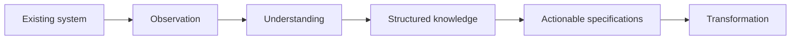
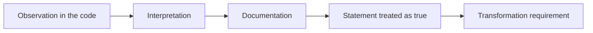
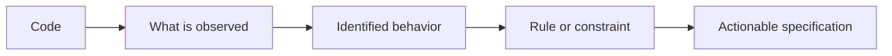
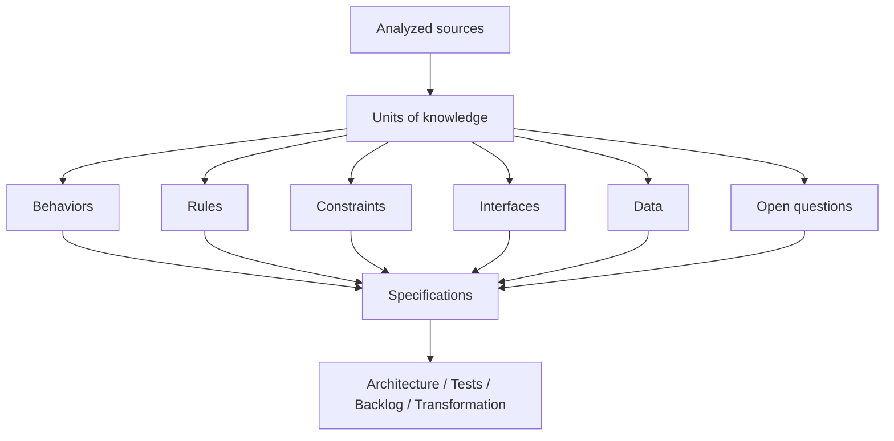
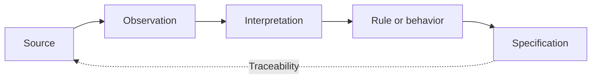
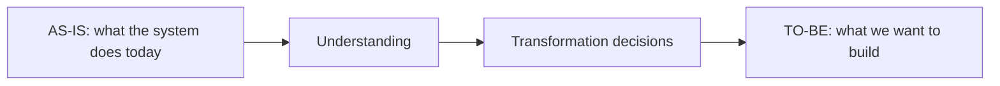
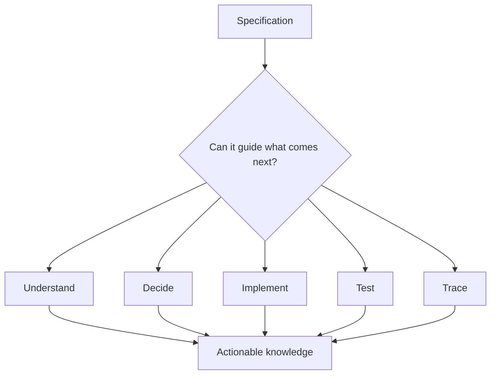
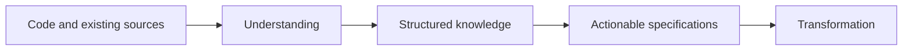

# From Code to Actionable Specifications

> **An agent can quickly explain code and produce documentation. Turning that analysis into specifications reliable enough to guide a modernization requires a different discipline.**

In the first article of this series, [**"Modernizing a Legacy System with AI: Understanding Before Transforming"**](/en/blog/moderniser-systeme-legacy-ia-comprendre-avant-transformer), we drew an initial distinction: quickly exploring a repository does not necessarily mean understanding the system that code makes run.

Coding agents considerably speed up this exploration phase. They let us identify the main modules, follow certain flows, recover scattered rules, or cross-reference several technical sources. But this acceleration removes neither the uncertainty nor the need to verify the conclusions produced.

Once that understanding is underway, a new question naturally arises: what do we do with all the knowledge we have uncovered?

We may end up with identified behaviors, assumed rules, confirmed constraints, technical dependencies, open questions, existing tests, or elements recovered from configuration. Yet this material often remains scattered across the code, conversations with the agent, a few diagrams, and various documents.

The temptation then becomes strong to ask the AI to turn all of it into documentation.

It can do so quickly. It can even produce a document that is clear, structured, and convincing.

But **generating documentation is not yet producing an actionable specification**.

A specification must let us go further: understand what must be preserved, guide a decision, prepare a transformation, produce tests, and, ideally, trace back to the elements that established each important rule.

This transition, from code to knowledge that the rest of the project can actually use, is the subject of this article.

---

## 1. Understanding the System Is Not Yet Enough

At the end of an exploration phase, we rarely have a single document that perfectly describes the system. Instead, we have accumulated fragments of knowledge.

A conversation with the agent tells us a process goes through three components. An integration test reveals an exception that was not immediately visible in the business code. A configuration file changes the behavior observed locally. A developer explains that a particular mechanism was added after a production incident. Some old documentation still provides part of the functional intent.

Individually, these elements are useful. Together, they start to form a representation of the system.

The problem is that a scattered representation remains hard to use.

A team tasked with modernizing the system should not have to re-read the entire Git history, several conversations with agents, and dozens of files just to understand one important business rule.

This material therefore needs to be turned into more structured artifacts.

But this step is not neutral. Structuring knowledge means choosing what we consider to be a behavior, a rule, a constraint, or an exception. It also means deciding which pieces of information are reliable enough to guide the transformation.

The goal, then, is not simply to summarize what we have discovered.

It is to produce knowledge that others can **understand, verify, and use**.

---

## 2. Generating Documentation Has Become Easy

Once the system has been explored, asking an agent to report back what it understood feels almost natural.

From the repository, it can produce, within minutes, a description of the main modules, a summary of several components' responsibilities, a reconstruction of certain flows, or a proposed architecture diagram. Given more context, it can also cross-reference the code, the tests, the configuration, existing documentation, and sometimes the change history.

The result is often impressive. Information that was scattered across several files becomes readable in a coherent document. The vocabulary used resembles that of the project, and the different parts seem to fit together correctly.

This quality of rendering, however, can create an illusion.

> **The writing quality of a document does not guarantee the quality of the knowledge it contains.**

Take an example. An agent analyzes a mechanism that prevents two processes from running at the same time and writes:

> "This mechanism prevents the same operation from being processed twice."

The conclusion sounds reasonable. Yet the observed code could just as well correspond to a safeguard added after a specific incident, a constraint tied to an old partner, or a purely technical limitation that was never actually a business rule.

If this interpretation ends up directly in the documentation, the status of the information has just changed. A hypothesis derived from the analysis becomes a statement of fact. A few steps later, that statement can turn into a requirement for the future system.

The problem is not that the agent forms hypotheses. We do exactly the same thing when we analyze a system manually.

The problem appears when the process erases the boundary between **observation**, **interpretation**, and **established knowledge**.

Convincing documentation can therefore be built on a fragile understanding.

---

## 3. A Specification Is Not a Summary of the Code

This distinction is probably the most important one in this article.

A summary describes what we found.

A specification must let someone act on that knowledge.

Consider the following observation, for example:

> "The method checks the account status before executing the operation."

The sentence correctly describes the code. It remains, however, very limited when it comes to rebuilding or testing the system.

A more actionable specification might become:

> "A financial operation can only be executed when the account is in a status that authorizes transactions. In all other cases, the operation must be rejected before it is sent to the external system."

This wording starts to describe an expected behavior rather than a particular implementation.

But even this second sentence remains insufficient if we do not know which statuses are involved, whether exceptions exist, or whether this rule has actually been confirmed.

Turning code into a specification is therefore not about translating each method into plain language or replacing a technical representation with a paragraph.

We need to progressively rebuild **the logic the system carries**.

This difference also helps us move away from a representation too tightly bound to the current architecture.

If the system today uses three classes to implement a rule, the specification does not necessarily need to reproduce that structure. It should instead describe the behavior that the future architecture will still have to guarantee.

In other words, **the code shows how the system is built; the specification should help us determine what must be preserved when we decide to build it differently.**

---

## 4. Extracting Units of Knowledge Rather Than Producing a Document

One way to reduce ambiguity is to avoid starting immediately with a long piece of documentation.

It can be more useful to first identify relatively small, clearly typed units of knowledge.

For example, an analysis can surface:

- **behaviors**, describing what the system does in a given situation;
- **rules**, expressing the conditions or properties governing those behaviors;
- **constraints**, defining what the transformation will have to respect;
- **interfaces**, representing interactions with other components or systems;
- **data**, along with their meaning and main constraints;
- **open questions**, capturing the elements the analysis cannot yet establish.

This structuring brings an important benefit: it separates knowledge from the way it will later be presented.

The same business rule can be used to produce a functional document, a test scenario, a user story, an architecture constraint, or a regression check.

Knowledge thus becomes more durable than the document that contains it.

This approach also changes how we can work with an agent.

Instead of only asking it to produce documentation for the module, we can ask it to separately identify the observed behaviors, the assumed rules, the dependencies, the exceptions, and the elements that still need validation.

The result is usually less spectacular than a twenty-page document generated instantly.

Yet it is often far more useful for what comes next.

---

## 5. A Specification Must Keep Its Evidence

In the first article, we emphasized one idea: understanding a legacy system must not rely solely on an agent's ability to produce a plausible explanation.

This requirement becomes even more important once we move to specifications.

Suppose a document states:

> "Refunds above a certain amount require manual validation."

Before using this rule to rebuild the system, several questions must remain answerable. Where does it come from? Is it directly visible in the code? Does a test confirm it? Is the threshold configurable? Does functional documentation mention it? Is it actually enforced in production?

The goal is not necessarily to add several pages of references behind every sentence.

It is rather to preserve the **provenance** of important knowledge.

This traceability brings two benefits.

The first is immediate: once a rule becomes important, we can go back to the elements that established it.

The second appears later: as the system evolves, we can determine which specifications are at risk of being affected by a change in a source.

This naturally sets up another topic in this series: building a traceability chain between the existing code, the specifications, and the target backlog.

But before going that far, we already need to keep this minimal link between **what we claim** and **what allows us to claim it**.

---

## 6. Do Not Turn Hypotheses Into Requirements

LLMs have a characteristic that is particularly useful for this kind of work: they can connect scattered elements and propose a coherent interpretation.

This capability is also a source of risk.

A sentence like:

> "This check exists to prevent the creation of inconsistent orders."

can sound perfectly plausible even though nothing in the analyzed sources actually establishes that intent.

The code may only show that a check exists.

The agent then infers a probable reason.

If this sentence is copied into a specification without keeping its confidence level, the hypothesis progressively becomes a requirement.

This is why the categories introduced in the first article remain useful here.

A piece of information can be **observed**, when it appears directly in a source. It can be **probable**, when several clues support a credible but still incomplete interpretation. It becomes **confirmed** once it is sufficiently supported by the sources or validated. It can also remain **contradictory**, when several elements fail to converge, or **unknown**, when the available information simply does not allow a conclusion.

This distinction is not meant to turn every modernization project into a heavy documentation process.

Its main purpose is to prevent a change in wording from artificially changing the status of a piece of knowledge.

> **Changing the form of a hypothesis does not change its level of certainty.**

This rule sounds simple.

It becomes essential, however, once agents produce a significant part of the project's documentation.

---

## 7. Separate the Current System From the Target

Another confusion appears very quickly during a modernization effort.

As we come to understand the existing system, we naturally start imagining how it could be better designed.

We find a strong dependency and already picture decoupling it. We identify several responsibilities in the same module and immediately think about splitting them. We discover an old integration and consider replacing it.

This line of thinking is legitimate.

But it must remain distinct from understanding the existing system.

This separation matters particularly when the same agent takes part in several steps of the work.

An agent can analyze the legacy system, propose a target architecture, and then produce specifications for that target. Without an explicit separation, the decisions it has just proposed can easily end up presented as though they had been discovered in the existing system.

We therefore need to keep at least three levels.

The first corresponds to **what exists today**.

The second corresponds to **what we have understood or inferred from that existing system**.

The third corresponds to **what we decide to build**.

These three levels can naturally influence one another.

They must not be confused.

A rule observed in the legacy system does not carry the same status as a target architecture decision. Likewise, an anomaly in the existing system should not automatically become a requirement simply because it has existed for a long time.

> **Analyzing the existing system and designing the target are two different activities, even when the same agent takes part in both.**

---

## 8. A Specification Is Actionable When It Enables What Comes Next

There remains, in the end, one question: how do we know whether the knowledge produced is structured enough?

Counting the number of pages will not help much.

Neither will counting the diagrams.

A document can be long and still leave every important decision open. Another can be much shorter while still providing the information needed to move forward.

A more interesting way to reason about it is to look at what the specification actually enables us to do.

Can it let someone unfamiliar with the code explain the behavior in question? Does it help identify what must be preserved and what can evolve? Can test scenarios be derived from it? Are the important decisions linked to enough evidence? Are the uncertainties likely to block the transformation identified?

This is not about turning these dimensions into a universal checklist.

The level of precision needed always depends on the intended transformation.

The specification of a critical behavior in a financial system will likely require more validation than a purely internal, low-impact component.

The core idea remains the same: **the quality of a specification is measured first by its ability to support the rest of the work.**

It then becomes a genuine engineering artifact, not merely a rendering of the analysis.

---

## Conclusion: From Code to Knowledge That Can Guide Transformation

AI significantly lowers the cost of exploring and documenting a legacy system.

We can now quickly analyze a repository, reconstruct certain flows, cross-reference different sources, and produce, within minutes, documents that would previously have required far more time.

This capability, however, only solves part of the problem.

Between the code and the transformation lies an essential step: building knowledge reliable enough to be used by others.

An actionable specification is therefore not simply a matter of rephrasing code in natural language. It must distinguish what was observed from what was inferred, preserve the important rules and behaviors, make uncertainties visible, and keep enough provenance to trace back to the sources when necessary.

It must also clearly separate the existing system from the target. What the system does today, what we believe we understand of its intent, and what we decide to build tomorrow belong to three different levels.

The first article in this series tried to answer one question: **what do we really know about the system we want to transform?**

This one adds a second step: **how do we turn that understanding into artifacts capable of guiding the rest of the work?**

We then get a fairly simple chain:

But this chain almost immediately raises a new difficulty.

On a large system, a single agent will probably not carry out every analysis. One agent might explore the architecture, another examine the data, a third analyze the tests, while others take part in producing the specifications or the target.

The question then is no longer just what each agent is capable of producing.

We will need to know how to organize these contributions without fragmenting understanding, multiplying contradictions, or letting agents implicitly decide the workflow.

That is precisely the subject of the next article in this series:

> **Using Multiple Agents Without Losing Control of the Workflow.**
