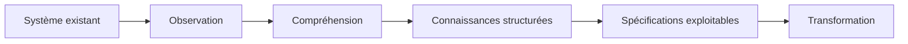
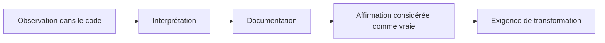
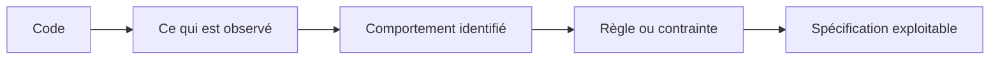
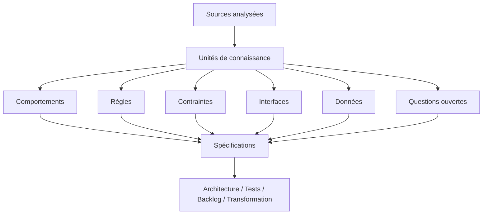
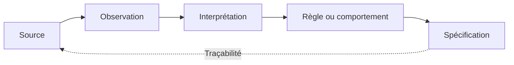
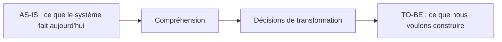
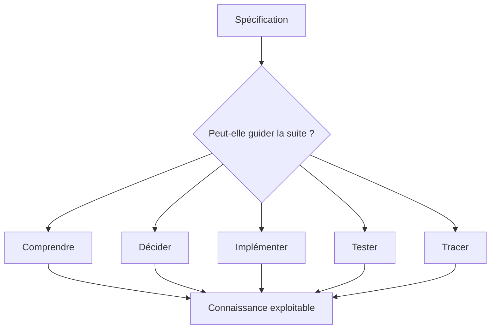
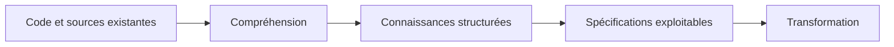

# Passer du code aux spécifications exploitables

> **Un agent peut rapidement expliquer du code et produire de la documentation. Transformer cette analyse en spécifications suffisamment fiables pour guider une modernisation demande une autre discipline.**

Dans le premier article de cette série, [**« Moderniser un système legacy avec l'IA : comprendre avant de transformer »**](/fr/blog/moderniser-systeme-legacy-ia-comprendre-avant-transformer), nous avons posé une première distinction : explorer rapidement un repository ne signifie pas nécessairement comprendre le système que ce code fait fonctionner.

Les agents de code accélèrent considérablement cette phase d'exploration. Ils permettent d'identifier les principaux modules, de suivre certains flux, de retrouver des règles dispersées ou de rapprocher plusieurs sources techniques. Mais cette accélération ne supprime ni les incertitudes ni la nécessité de vérifier les conclusions produites.

Une fois cette compréhension amorcée, une nouvelle question apparaît naturellement : que faisons-nous de toutes les connaissances découvertes ?

Nous pouvons disposer de comportements identifiés, de règles supposées, de contraintes confirmées, de dépendances techniques, de questions ouvertes, de tests existants ou encore d'éléments retrouvés dans la configuration. Pourtant, cette matière reste souvent dispersée entre le code, les conversations avec l'agent, quelques diagrammes et différents documents.

La tentation est alors forte de demander à l'IA de transformer l'ensemble en documentation.

Elle peut le faire rapidement. Elle peut même produire un document clair, structuré et convaincant.

Mais **générer de la documentation n'est pas encore produire une spécification exploitable**.

Une spécification doit permettre d'aller plus loin : comprendre ce qui doit être préservé, guider une décision, préparer une transformation, produire des tests et, idéalement, retrouver les éléments qui ont permis d'établir chaque règle importante.

C'est cette transition, du code vers une connaissance réellement utilisable par la suite du projet, qui constitue le sujet de cet article.

---

## 1. Comprendre le système ne suffit pas encore

À la fin d'une phase d'exploration, nous avons rarement un document unique décrivant parfaitement le système. Nous avons plutôt accumulé des fragments de connaissance.

Une conversation avec l'agent nous indique qu'un traitement passe par trois composants. Un test d'intégration révèle une exception qui n'apparaissait pas immédiatement dans le code métier. Un fichier de configuration modifie le comportement observé localement. Un développeur explique qu'un mécanisme particulier a été ajouté après un incident de production. Une ancienne documentation fournit encore une partie de l'intention fonctionnelle.

Individuellement, ces éléments sont utiles. Ensemble, ils commencent à produire une représentation du système.

Le problème est qu'une représentation dispersée reste difficile à exploiter.

Une équipe chargée de moderniser le système ne devrait pas avoir à relire l'intégralité de l'historique Git, plusieurs conversations avec des agents et des dizaines de fichiers pour comprendre une règle métier importante.

Il faut donc transformer cette matière en artefacts plus structurés.

Mais cette étape n'est pas neutre. Structurer une connaissance signifie choisir ce que nous considérons comme un comportement, une règle, une contrainte ou une exception. Cela implique également de décider quelles informations sont suffisamment fiables pour guider la transformation.

L'objectif n'est donc pas simplement de résumer ce que nous avons découvert.

Il est de produire une connaissance que d'autres pourront **comprendre, vérifier et utiliser**.

---

## 2. Générer de la documentation est devenu facile

Une fois le système exploré, demander à un agent de restituer ce qu'il a compris paraît presque naturel.

À partir du repository, il peut produire en quelques minutes une description des principaux modules, résumer les responsabilités de plusieurs composants, reconstituer certains flux ou proposer un diagramme d'architecture. Avec davantage de contexte, il peut également rapprocher le code, les tests, la configuration, la documentation existante et parfois l'historique des changements.

Le résultat est souvent impressionnant. Les informations qui étaient dispersées dans plusieurs fichiers deviennent lisibles dans un document cohérent. Le vocabulaire utilisé ressemble à celui du projet et les différentes parties semblent s'articuler correctement.

Cette qualité de restitution peut cependant créer une illusion.

> **La qualité rédactionnelle d'un document ne garantit pas la qualité de la connaissance qu'il contient.**

Prenons un exemple. Un agent analyse un mécanisme qui empêche l'exécution simultanée de deux traitements et écrit :

> « Ce mécanisme permet d'éviter le double traitement d'une même opération. »

La conclusion paraît raisonnable. Pourtant, le code observé pourrait également correspondre à une protection ajoutée après un incident particulier, à une contrainte liée à un ancien partenaire ou à une limitation purement technique qui n'a jamais constitué une règle métier.

Si cette interprétation apparaît directement dans la documentation, le statut de l'information vient de changer. Une hypothèse issue de l'analyse devient une affirmation. Puis, quelques étapes plus tard, cette affirmation peut se transformer en exigence pour le futur système.

Le problème n'est pas que l'agent formule des hypothèses. Nous faisons exactement la même chose lorsque nous analysons manuellement un système.

Le problème apparaît lorsque le processus fait disparaître la frontière entre **observation**, **interprétation** et **connaissance établie**.

Une documentation convaincante peut donc être construite sur une compréhension fragile.

---

## 3. Une spécification n'est pas un résumé du code

Cette distinction est probablement la plus importante de cet article.

Un résumé décrit ce que nous avons trouvé.

Une spécification doit permettre à quelqu'un d'agir à partir de cette connaissance.

Considérons par exemple l'observation suivante :

> « La méthode vérifie le statut du compte avant d'exécuter l'opération. »

La phrase décrit correctement le code. Elle reste cependant très limitée lorsqu'il s'agit de reconstruire ou de tester le système.

Une spécification plus exploitable pourrait devenir :

> « Une opération financière ne peut être exécutée que lorsque le compte est dans un statut autorisant les transactions. Dans les autres cas, l'opération doit être rejetée avant son émission vers le système externe. »

Cette formulation commence à décrire un comportement attendu plutôt qu'une implémentation particulière.

Mais même cette seconde phrase reste insuffisante si nous ne savons pas quels statuts sont concernés, s'il existe des exceptions ou si cette règle a réellement été confirmée.

La transformation du code vers la spécification ne consiste donc pas à traduire chaque méthode en français ou à remplacer une représentation technique par un paragraphe.

Il faut progressivement reconstruire **la logique que le système porte**.

Cette différence permet également de sortir d'une représentation trop liée à l'architecture actuelle.

Si le système utilise aujourd'hui trois classes pour implémenter une règle, la spécification n'a pas nécessairement besoin de reproduire cette structure. Elle doit plutôt décrire le comportement que la future architecture devra continuer à garantir.

Autrement dit, **le code montre comment le système est construit ; la spécification doit nous aider à déterminer ce qu'il faut préserver lorsqu'on décidera de le construire autrement.**

---

## 4. Extraire des unités de connaissance plutôt que produire un document

Une manière de réduire les ambiguïtés consiste à ne pas commencer immédiatement par produire une documentation longue.

Il peut être plus utile d'identifier d'abord des unités de connaissance relativement petites et clairement typées.

Par exemple, une analyse peut faire émerger :

- des **comportements**, qui décrivent ce que le système fait dans une situation donnée ;
- des **règles**, qui expriment les conditions ou propriétés gouvernant ces comportements ;
- des **contraintes**, qui définissent ce que la transformation devra respecter ;
- des **interfaces**, qui représentent les interactions avec d'autres composants ou systèmes ;
- des **données**, avec leur signification et leurs contraintes principales ;
- des **questions ouvertes**, qui matérialisent les éléments que l'analyse ne permet pas encore d'établir.

Cette structuration apporte un bénéfice important : elle sépare la connaissance de la manière dont elle sera ensuite présentée.

Une même règle métier pourra être utilisée pour produire un document fonctionnel, un scénario de test, une user story, une contrainte d'architecture ou un contrôle de non-régression.

La connaissance devient ainsi plus durable que le document qui la contient.

Cette approche change également la manière dont nous pouvons travailler avec un agent.

Au lieu de lui demander uniquement de produire une documentation du module, nous pouvons lui demander d'identifier séparément les comportements observés, les règles supposées, les dépendances, les exceptions et les éléments qui nécessitent encore une validation.

Le résultat est généralement moins spectaculaire qu'un document de vingt pages généré immédiatement.

Il est pourtant souvent beaucoup plus utile pour la suite.

---

## 5. Une spécification doit conserver ses preuves

Dans le premier article, nous avons insisté sur une idée : la compréhension d'un système legacy ne doit pas reposer uniquement sur la capacité d'un agent à produire une explication plausible.

Cette exigence devient encore plus importante lorsque nous passons aux spécifications.

Supposons qu'un document affirme :

> « Les remboursements supérieurs à un certain montant nécessitent une validation manuelle. »

Avant d'utiliser cette règle pour reconstruire le système, plusieurs questions doivent rester accessibles. D'où vient-elle ? Est-elle visible directement dans le code ? Un test la confirme-t-il ? Le seuil est-il configurable ? Une documentation fonctionnelle la mentionne-t-elle ? Est-elle réellement appliquée en production ?

L'objectif n'est pas nécessairement d'ajouter plusieurs pages de références derrière chaque phrase.

Il s'agit plutôt de préserver la **provenance** des connaissances importantes.

Cette traçabilité apporte deux bénéfices.

Le premier est immédiat : lorsqu'une règle devient importante, nous pouvons revenir aux éléments qui ont permis de l'établir.

Le second apparaît plus tard : lorsque le système évolue, nous pouvons déterminer quelles spécifications risquent d'être affectées par un changement dans une source.

Cela prépare naturellement un autre sujet de cette série : la construction d'une chaîne de traçabilité entre le code existant, les spécifications et le backlog cible.

Mais avant d'aller aussi loin, il faut déjà conserver ce lien minimal entre **ce que nous affirmons** et **ce qui nous permet de l'affirmer**.

---

## 6. Ne pas transformer les hypothèses en exigences

Les LLM possèdent une caractéristique particulièrement utile pour ce type de travail : ils sont capables de rapprocher des éléments dispersés et d'en proposer une interprétation cohérente.

Cette capacité constitue aussi une source de risque.

Une phrase comme :

> « Cette vérification existe afin d'empêcher la création de commandes incohérentes. »

peut être parfaitement plausible alors que rien dans les sources analysées ne permet réellement d'établir cette intention.

Le code montre peut-être seulement qu'une vérification existe.

L'agent déduit ensuite une raison probable.

Si cette phrase est copiée dans une spécification sans conserver son niveau de confiance, l'hypothèse devient progressivement une exigence.

C'est pourquoi les catégories introduites dans le premier article restent utiles ici.

Une information peut être **observée**, lorsqu'elle apparaît directement dans une source. Elle peut être **probable**, lorsque plusieurs indices permettent une interprétation crédible mais encore incomplète. Elle devient **confirmée** lorsqu'elle est suffisamment soutenue par les sources ou validée. Elle peut aussi rester **contradictoire** lorsque plusieurs éléments ne convergent pas, ou **inconnue** lorsque les informations disponibles ne permettent simplement pas de conclure.

Cette distinction ne vise pas à transformer chaque projet de modernisation en processus documentaire lourd.

Elle sert surtout à empêcher qu'un changement de formulation modifie artificiellement le statut d'une connaissance.

> **Changer la forme d'une hypothèse ne change pas son niveau de certitude.**

Cette règle paraît simple.

Elle devient pourtant essentielle lorsque des agents produisent une partie importante de la documentation du projet.

---

## 7. Séparer l'existant de la cible

Une autre confusion apparaît très rapidement pendant une modernisation.

À mesure que nous comprenons le système existant, nous commençons naturellement à imaginer comment il pourrait être mieux conçu.

Nous trouvons une dépendance forte et imaginons déjà la découpler. Nous identifions plusieurs responsabilités dans un même module et pensons immédiatement à les séparer. Nous découvrons une ancienne intégration et envisageons de la remplacer.

Cette réflexion est légitime.

Mais elle doit rester distincte de la compréhension de l'existant.

Cette séparation est particulièrement importante lorsque le même agent participe à plusieurs étapes du travail.

Un agent peut analyser le legacy, proposer une architecture cible puis produire des spécifications pour cette cible. Sans séparation explicite, les décisions qu'il vient de proposer peuvent facilement se retrouver présentées comme si elles avaient été découvertes dans le système existant.

Nous devons donc conserver au moins trois niveaux.

Le premier correspond à **ce qui existe aujourd'hui**.

Le deuxième correspond à **ce que nous avons compris ou déduit de cet existant**.

Le troisième correspond à **ce que nous décidons de construire**.

Ces trois niveaux peuvent naturellement s'influencer.

Ils ne doivent pas être confondus.

Une règle observée dans le legacy n'a pas le même statut qu'une décision d'architecture cible. De la même manière, une anomalie du système existant ne doit pas être automatiquement transformée en exigence simplement parce qu'elle existe depuis longtemps.

> **Analyser l'existant et concevoir la cible sont deux activités différentes, même lorsqu'un même agent participe aux deux.**

---

## 8. Une spécification est exploitable lorsqu'elle permet la suite

Il reste finalement une question : comment savoir si la connaissance produite est suffisamment structurée ?

Compter le nombre de pages ne nous aidera pas beaucoup.

Compter les diagrammes non plus.

Un document peut être long et laisser toutes les décisions importantes ouvertes. Un autre peut être beaucoup plus court tout en fournissant les informations nécessaires pour avancer.

Une manière plus intéressante de raisonner consiste à regarder ce que la spécification permet réellement de faire.

Peut-elle permettre à une personne qui ne connaît pas le code d'expliquer le comportement concerné ? Permet-elle d'identifier ce qui doit être préservé ou ce qui peut évoluer ? Peut-on en déduire des scénarios de tests ? Les décisions importantes sont-elles reliées à suffisamment de preuves ? Les incertitudes susceptibles de bloquer la transformation sont-elles identifiées ?

Il ne s'agit pas de transformer ces dimensions en checklist universelle.

Le niveau de précision nécessaire dépend toujours de la transformation envisagée.

La spécification d'un comportement critique sur un système financier demandera probablement davantage de validation qu'un composant purement interne à faible impact.

L'idée essentielle reste la même : **la qualité d'une spécification se mesure d'abord par sa capacité à soutenir la suite du travail**.

Elle devient alors un véritable artefact d'ingénierie, et non simplement une restitution de l'analyse.

---

## Conclusion : du code à une connaissance qui peut guider la transformation

L'IA réduit fortement le coût d'exploration et de documentation d'un système legacy.

Nous pouvons aujourd'hui analyser rapidement un repository, reconstituer certains flux, rapprocher différentes sources et produire en quelques minutes des documents qui auraient auparavant demandé beaucoup plus de temps.

Cette capacité ne résout pourtant qu'une partie du problème.

Entre le code et la transformation existe une étape essentielle : la construction d'une connaissance suffisamment fiable pour pouvoir être utilisée par d'autres.

Une spécification exploitable ne consiste donc pas simplement à reformuler le code en langage naturel. Elle doit permettre de distinguer ce qui a été observé de ce qui a été déduit, conserver les règles et comportements importants, rendre visibles les incertitudes et préserver suffisamment de provenance pour pouvoir revenir aux sources lorsque cela devient nécessaire.

Elle doit également séparer clairement l'existant de la cible. Ce que le système fait aujourd'hui, ce que nous pensons comprendre de son intention et ce que nous décidons de construire demain appartiennent à trois niveaux différents.

Le premier article de cette série cherchait à répondre à une question : **que savons-nous réellement du système que nous voulons transformer ?**

Celui-ci ajoute une deuxième étape : **comment transformer cette compréhension en artefacts capables de guider la suite du travail ?**

Nous obtenons alors une chaîne relativement simple :

Mais cette chaîne soulève presque immédiatement une nouvelle difficulté.

Sur un système important, un seul agent ne réalisera probablement pas toutes les analyses. Un agent pourra explorer l'architecture, un autre examiner les données, un troisième analyser les tests, tandis que d'autres participeront à la production des spécifications ou de la cible.

La question ne sera alors plus seulement de savoir ce que chaque agent est capable de produire.

Il faudra savoir comment organiser ces contributions sans fragmenter la compréhension, multiplier les contradictions ou laisser les agents décider implicitement du workflow.

C'est précisément le sujet du prochain article de cette série :

> **Utiliser plusieurs agents sans perdre la maîtrise du workflow.**
