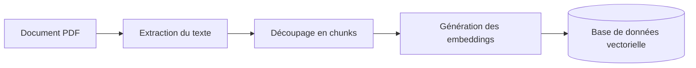

Dans les discussions autour du **RAG (Retrieval-Augmented Generation)**, la conversation commence presque toujours par le modèle. Quel LLM choisir ? Quelle base vectorielle utiliser ? Quel provider d'embeddings donne les meilleurs résultats ?

Sur le terrain, le problème se situe souvent ailleurs.

Sur un projet mené autour d’un **corpus documentaire complexe dans le secteur de l’énergie** comprenant des guides techniques, des référentiels de prix et des rapports d’étude, nous avons très vite observé une réalité simple :

> la qualité des réponses dépend d’abord de la manière dont la donnée est préparée.

Le système était capable de retrouver de l’information. Mais tant que cette information n’était pas correctement structurée, il restait incapable de produire des réponses vraiment fiables sur des questions précises.

## A- Le vrai point de départ d’un projet RAG

Au début, nous avons suivi la chaîne classique que beaucoup mettent en place :

Ce pipeline fonctionne. Il permet d’obtenir des premiers résultats assez rapidement. Pour des questions générales, le système paraissait même correct.

Mais dès que les utilisateurs formulaient des demandes plus fines, les limites apparaissaient :

* réponses trop vagues
* confusion entre plusieurs notions proches
* informations partielles
* contexte récupéré mais mal exploité

Le problème n’était pas que le système ne retrouvait rien. Le problème était qu’il retrouvait des fragments mal préparés, mélangés ou découpés sans logique métier.

À partir de là, notre lecture du RAG a changé.

Nous avons arrêté de voir le sujet comme une simple stack technique et commencé à le considérer comme un **pipeline d’ingénierie de la connaissance**.

## B- Le modèle n’est pas toujours le goulot d’étranglement

Dans beaucoup de projets, on espère améliorer la qualité en changeant de modèle ou en affinant le prompt. Cela peut aider, mais seulement à la marge si la base documentaire est faible.

Quand la donnée source est mal extraite, mal nettoyée ou mal segmentée, le LLM travaille avec un contexte bruité. Et un contexte bruité produit presque toujours :

* des réponses hésitantes
* des rapprochements artificiels entre documents
* des citations peu pertinentes
* une baisse de confiance globale dans le système

Autrement dit, un bon modèle ne compense pas durablement un mauvais pipeline de données.

Dans notre cas, le gain le plus visible n’est pas venu d’un changement de modèle. Il est venu de la manière dont nous avons repensé la **collecte**, l’**extraction**, le **nettoyage**, la **structuration** et surtout le **chunking**.

## C- Un chunk n’est pas un morceau de texte

Le point de bascule du projet a été là.

Au départ, nous traitions les chunks comme des segments techniques : un certain nombre de caractères ou de tokens, découpés de manière assez uniforme. C’est une approche simple, mais elle devient vite insuffisante dès que la documentation porte une vraie logique métier.

Nous avons alors changé de perspective :

> un chunk n’est pas un morceau de texte, c’est une unité de sens métier.

Cette distinction change tout.

Tous les documents ne se découpent pas de la même façon :

* un guide technique ne se découpe pas comme un référentiel de prix
* une règle métier ne se découpe pas comme une fiche descriptive
* un raisonnement ne doit pas être coupé au milieu d’une dépendance logique

Si un chunk contient trop de sujets, l’information devient floue.  
S’il est trop court, il perd le contexte qui le rend compréhensible.

Le bon chunking consiste donc à préserver des blocs de connaissance réutilisables par le système, pas simplement à produire des segments de taille homogène.

## D- Le contexte utile est un équilibre

Le contexte n’est pas bon par nature. Il est bon s’il est **pertinent**, **cohérent** et **proportionné**.

Dans un système RAG, deux excès reviennent souvent :

* **trop de contexte** : le bruit augmente, le signal métier se dilue
* **pas assez de contexte** : l’information devient incomplète ou ambiguë

La performance du système se joue précisément dans cet équilibre.

Et cet équilibre dépend moins du prompt que de la qualité du pipeline de transformation en amont :

* qualité des documents collectés
* fiabilité de l’extraction
* suppression du bruit
* enrichissement structurel
* découpage adapté à chaque type de contenu

Quand ces étapes sont bien conçues, le retrieval devient mécaniquement plus utile. Le modèle reçoit moins de texte inutile et davantage de contexte actionnable.

## E- Ce que ce projet a changé dans ma manière de concevoir le RAG

Ce retour d’expérience a profondément changé ma façon de concevoir les systèmes basés sur les LLM.

Je ne vois plus le RAG comme un moteur de recherche augmenté.

Je le vois comme un **système de structuration de la connaissance métier**.

Dans cette logique, les documents ne sont pas simplement stockés pour être retrouvés. Ils sont préparés pour devenir :

* interrogeables
* exploitables
* comparables
* actionnables

Le RAG commence donc bien avant la requête utilisateur. Il commence dans la façon dont on transforme le corpus brut en unités de connaissance fiables.

Et dans bien des cas, améliorer cette couche de préparation apporte plus de valeur qu’un changement de modèle.

## Conclusion

Si je devais résumer ce projet en une idée, ce serait celle-ci :

> dans un projet RAG sérieux, la donnée est souvent plus stratégique que le modèle.

Le vrai levier ne se situe pas uniquement dans le choix du LLM. Il se situe dans la capacité à construire un pipeline robuste pour :

* collecter les bonnes sources
* extraire proprement le contenu
* structurer l’information
* produire des chunks qui respectent le sens métier

C’est cette discipline qui transforme un prototype “acceptable” en système réellement utile.

Dans un second article, j’irai plus loin sur la **partie architecture**, les **agents** et la **génération de réponses métier** à partir de ce type de pipeline.

Et vous ?

Sur vos projets RAG, vous avez commencé par le modèle ou par la donnée ?
