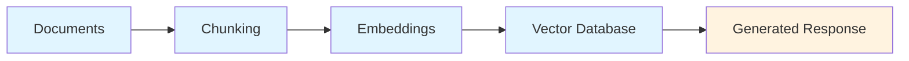
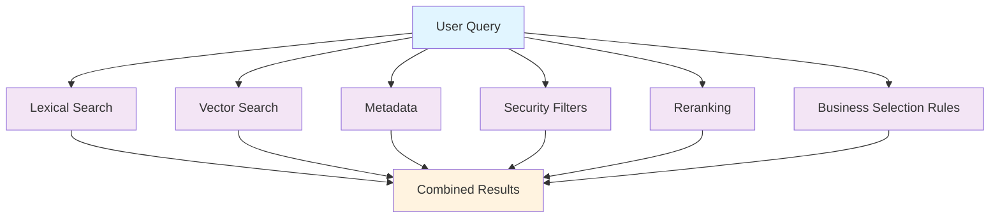
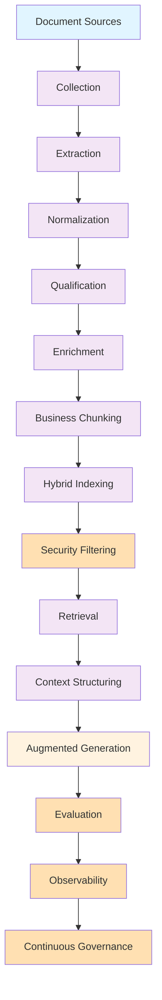

In many generative AI projects, the conversation still starts with the model.

Which LLM should we choose?
Which vector database should we use?
Which framework should we adopt?
Which embeddings provider gives the best results?
Should we use RAG, agents, function calling, or a more advanced architecture?

These questions are important. But in practice, they sometimes come too early.

As soon as you work on AI use cases connected to real documents, a reality emerges quickly: the system's value depends first on the quality of the unstructured data that feeds it.

Procedures, reports, meeting minutes, reference materials, contracts, tickets, presentations, technical guides, internal notes, PDF archives, scanned documents, business exports, or document repositories—these contents represent a large part of an organization's operational knowledge.

But this knowledge is not directly usable by AI.

It is often scattered, heterogeneous, sometimes outdated, sometimes redundant, sometimes sensitive, rarely qualified homogeneously, and not always structured for use in a retrieval or reasoning pipeline.

This is precisely where the real work begins.

The challenge is not merely to index documents to feed an AI assistant. The challenge is to industrialize unstructured data to make it exploitable, secure, governed, evaluable, and reusable across multiple AI use cases.

## A- The AI POC often reveals a documentation debt

A typical first RAG POC follows fairly simple logic:

This approach allows you to quickly obtain visible results. You can query some documents, find relevant passages, generate an answer with citations, and demonstrate the system's potential value.

For an initial experiment, this logic works.

But as soon as questions become more precise, the limitations emerge.

The system sometimes finds fragments that are too short, passages that are poorly segmented, documents that are outdated, redundant content, or information taken out of context. It can also mix sources of different types: a draft, a final version, a work note, a validated report, or a reference document.

The problem is not always the model.

The problem often comes from the corpus.

A poorly prepared corpus produces weak context. And weak context produces fragile answers, even with an excellent model.

This is one of the first lessons from real RAG projects: the POC doesn't just validate a technical architecture. It also reveals the state of the document heritage.

It shows what is well-structured, what is exploitable, what is ambiguous, what is outdated, what lacks metadata, what must be excluded, and what needs clearer governance.

At this point, the subject changes in nature.

We're no longer just talking about a conversational assistant. We're talking about a knowledge transformation pipeline.

## B- Industrialize corpora, not just pipelines

Industrializing an AI use case doesn't consist solely of automating document ingestion.

It's not enough to drop files in a directory, run a parsing script, generate embeddings, and feed a vector database.

This can produce a prototype. But it's not yet an industrial capability.

An industrialized corpus is one that you know how to identify, qualify, transform, index, secure, evaluate, and maintain over time.

This distinction is important.

In a POC, you can accept some handcrafting. You can manually fix a few files, select the best documents, ignore certain edge cases, and test on a small set of questions.

In a system designed to last, this approach is no longer sufficient.

You need to be able to answer more structural questions:

Which corpora should be used?
Which source is authoritative?
Which version is valid?
Which documents should be excluded?
Which contents are sensitive?
Which access rights must be respected?
How do you reindex when a document changes?
How do you measure response quality?
How do you know if the system is regressing?

These questions aren't purely technical. They're also about architecture, governance, security, and operations.

This is why unstructured data should be treated as industrial assets.

Not as a simple file repository.

## C- Document quality is the first condition of reliability

In a document-based AI system, quality doesn't start at the prompt level.

It starts much earlier.

It starts when you collect sources, extract text, clean content, preserve the document's logical structure, identify headings, tables, appendices, references, dates, versions, and useful metadata.

A document can be readable for a human but difficult for a machine to exploit.

A PDF may contain poorly extracted tables.
A scan may produce an approximate OCR.
A presentation may lose its meaning if headings, diagrams, and notes are extracted without structure.
A report may contain important appendices that will be ignored if extraction is too simplistic.
A file may have a clear name for one team but be incomprehensible to an indexing system.

Document quality thus rests on several dimensions.

First, there is extraction quality. Retrieved content must be clean, readable, and sufficiently faithful to the original document.

Then there is structural quality. The system must understand sections, subsections, tables, paragraphs, lists, references, and units of meaning.

There is also business quality. Not all passages have the same value. A definition, a rule, a procedure, a unit price, an assumption, a recommendation, or a conclusion shouldn't be treated exactly the same way.

Finally, there is freshness quality. An outdated document can be more dangerous than a missing one, because it gives the impression of providing a reliable answer while resting on information that is no longer current.

This is where industrialization becomes necessary.

It enables moving from a logic of indexing files to a logic of preparing reliable knowledge units.

## D- Chunking must respect business meaning

In many RAG pipelines, chunking is treated as a technical operation.

You split a document by fixed size, by character count, or by token count. This method is simple, fast, and sometimes sufficient for homogeneous content.

But as soon as documentation carries business logic, this approach reaches its limits.

A chunk isn't just a piece of text.

A chunk must be a reusable unit of meaning for the system.

This means it must contain enough context to be understood but not so much that it mixes multiple subjects. It must preserve logical dependencies. It must avoid cutting a rule in half, separating a hypothesis from its conclusion, or detaching a table from its explanation.

The right segmentation depends on the document type.

A technical guide doesn't chunk the same way as a pricing reference.
A contract doesn't chunk the same way as meeting minutes.
A procedure doesn't chunk the same way as an incident report.
A price table doesn't chunk the same way as a narrative summary.

This is why an industrial pipeline must support multiple chunking strategies.

The segmentation can be structural, when it follows headings and sections. It can be semantic, when it seeks to preserve units of meaning. It can be business-oriented, when it accounts for the nature of information to be exploited. It can also be hybrid, when multiple approaches are combined based on content type.

Chunking is therefore not just a technical step. It's a step in knowledge engineering.

And in serious AI use cases, this step directly influences retrieval quality, context relevance, and final answer reliability.

## E- Indexing doesn't mean putting everything in a vector database

The vector database has become one of RAG's symbols.

It's useful. It allows finding passages semantically close to a question. But it shouldn't be considered the only answer to the search problem.

In many cases, semantic search alone isn't sufficient.

It may be less effective at finding an exact identifier, code, acronym, contractual reference, procedure number, equipment name, date, or precise title.

This is why an industrial indexing strategy must often combine multiple approaches:

Lexical search finds exact matches.

Vector search identifies passages that are close in meaning.

Metadata allows filtering by document type, domain, date, version, status, confidentiality level, or source of reference.

Reranking allows reordering results to prioritize the most useful passages.

Business rules allow prioritizing certain sources based on the question's nature.

For example, a question about a rule should prioritize normative documents or validated guides. A question about an estimate should probably cross technical documents with pricing references. A question about responsibility should return contractual, organizational, or institutional documents.

Indexing therefore shouldn't only answer the question:

> Which passages are close to the request?

It should answer a more demanding question:

> Which passages are relevant for this task, this user profile, this corpus, and this expected level of proof?

This difference enables moving from an augmented search engine to a truly usable AI system.

## F- Security must be built in from the start

A document-based AI system can expose information without directly displaying source documents.

This is often underestimated.

If a user asks a question and the system generates an answer from a document they shouldn't have access to, the security problem already exists. Even if the document isn't downloaded. Even if the source passage isn't shown. Even if the answer seems simply rephrased.

The system used unauthorized information.

Security must therefore be applied at retrieval time, not just at the interface level.

This requires filtering documents according to user rights, respecting confidentiality levels, managing business scopes, excluding sensitive corpora, and tracing the sources used in responses.

Security must also cover the corpus lifecycle.

When a document is deleted, it must be deletable from the index.
When a document becomes outdated, it shouldn't be prioritized.
When a validated version replaces an old version, the system must account for this change.
When content is reclassified as sensitive, it must be removed from the relevant AI usage scope.

The question isn't simply: Can we index this document?

The real question is:

> Can this document be used by AI, for which use case, by which user, in which context, and with what guarantees?

Once AI enters business use cases, security can't be added afterward. It must be part of the architecture.

## G- Govern corpora to control AI use cases

Governance is often seen as an administrative matter.

In an AI project, it becomes a condition of reliability.

Governing a corpus doesn't mean creating documentation to slow down the project. It means clarifying the rules that allow the system to work properly over time.

Who owns the corpus?
Which source is authoritative?
Which version should be used?
Which documents are validated?
Which content is still in draft?
What update frequency should apply?
Which use cases are authorized?
Which are excluded?
Who can access what?
How do you audit responses?

Without these rules, every AI project ends up reconstructing its own logic. Each team creates its own pipeline, conventions, metadata, quality criteria, and exceptions.

In the short term, this feels faster.

In the medium term, it creates debt.

Documentation debt.
Technical debt.
Security debt.
Quality debt.
Operational debt.

Industrialization prevents this fragmentation.

It doesn't mean imposing a single model across all use cases. It means defining a common framework: metadata standards, qualification rules, access policies, indexing principles, evaluation criteria, audit mechanisms, and corpus lifecycle.

Governance isn't opposed to innovation.

It makes innovation sustainable.

## H- Evaluate to move beyond feeling

An AI POC can convince with a few demonstrations.

An industrialized system must be measured.

This is a fundamental difference.

When you test an assistant on ten or twenty questions, you can easily have a positive impression. Some answers are fluent, well-formulated, sometimes even impressive. But this impression isn't enough to certify system reliability.

You must measure.

Measure retrieval quality.
Measure the relevance of retrieved passages.
Measure answer faithfulness to sources.
Measure the rate of sourced responses.
Measure cases where the system answers when it should acknowledge missing information.
Measure corpus coverage.
Measure index freshness.
Measure regressions after model, prompt, chunking, or indexing strategy changes.

Evaluation must become a permanent part of the system.

It can rely on representative question sets, expected answers, reference documents, and difficult cases: ambiguous questions, contradictory documents, missing information, outdated sources, complex business formulations.

Without evaluation, the system stays in the realm of feeling.

With structured evaluation, it becomes controllable.

This measurement capability enables gradual system improvement, comparing multiple strategies, justifying technical choices, and building user confidence.

## I- Scale without uniformizing everything

Scaling is often misunderstood.

It doesn't mean indexing everything in a single global corpus.
It doesn't mean creating a single assistant for all use cases.
It doesn't mean applying the same document strategy to all content.

Scaling means building a shared capability.

This capability must enable handling multiple corpora, formats, sensitivity levels, and use cases with coherent principles.

You can share connectors.
You can share metadata standards.
You can share extraction components.
You can share evaluation strategies.
You can share security mechanisms.
You can share observability and lifecycle rules.

But you must maintain customization per use case.

A general-purpose document assistant doesn't have the same requirements as a decision-support agent.
A synthesis tool doesn't have the same constraints as an estimation system.
An internal support assistant doesn't have the same risks as a tool exploiting legal, financial, or technical documents.

Industrialization shouldn't crush business specifics.

It should provide a common foundation robust enough to avoid starting from scratch for each new use case.

This is where the platform notion becomes interesting.

Not a platform reduced to a vector database.
Not a platform limited to a chatbot.
But a platform for transforming and exploiting unstructured corpora.

A platform capable of ingesting, qualifying, structuring, indexing, securing, searching, evaluating, and maintaining the knowledge needed for AI use cases.

## J- Toward an industrial knowledge chain

At this point, we can represent the target more completely:

This chain shows something important: the LLM is just one component of the system.

It brings language capability, interpretation, reformulation, and synthesis. But it shouldn't alone bear responsibility for quality.

Data brings content.
The pipeline brings structure.
Indexing brings access.
Security brings control.
Governance brings the framework.
Evaluation brings measurement.
The model brings generation.

When these responsibilities are mixed, the system becomes fragile.

When they are separated, AI becomes more reliable.

This separation enables moving from an interesting prototype to truly usable applications.

## Conclusion

Industrializing unstructured data for AI use cases isn't simply preparing documents for a chatbot.

It's building lasting capability.

Capability to transform scattered corpora into exploitable knowledge.
Capability to secure access to that knowledge.
Capability to govern the sources used.
Capability to intelligently index content.
Capability to evaluate answer quality.
Capability to evolve use cases without rebuilding the entire chain each time.

Models will keep evolving. So will frameworks. Vector databases, hybrid engines, agentic architectures, and integration protocols will continue improving.

But one thing will remain constant: without qualified, structured, secure, governed, and evaluated corpora, AI use cases will remain fragile.

Scaling doesn't start with multiplying assistants.

It starts with industrializing the corpora that feed them.

And that's often where the real difference lies between a convincing AI demonstration and a truly useful AI system.

What about you?

In your document-based AI projects, did you start with the model, the prompt... or the corpus?
