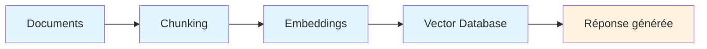
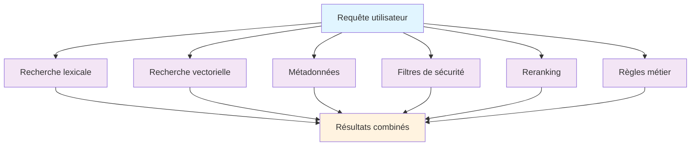
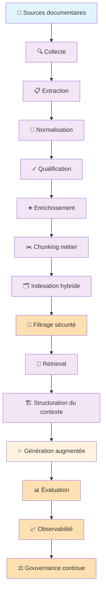

Dans beaucoup de projets d'intelligence artificielle générative, la discussion commence encore par le modèle.

Quel LLM choisir ?  
Quelle base vectorielle utiliser ?  
Quel framework adopter ?  
Quel provider d'embeddings donne les meilleurs résultats ?  
Faut-il utiliser du RAG, des agents, du function calling ou une architecture plus avancée ?

Ces questions sont importantes. Mais sur le terrain, elles arrivent parfois trop tôt.

Dès que l'on travaille sur des usages IA connectés à de vrais documents, une réalité apparaît rapidement : la valeur du système dépend d'abord de la qualité des données non structurées qui l'alimentent.

Procédures, rapports, comptes rendus, référentiels, contrats, tickets, présentations, guides techniques, notes internes, archives PDF, documents scannés, exports métiers ou bases documentaires : ces contenus représentent une grande partie de la connaissance opérationnelle d'une organisation.

Mais cette connaissance n'est pas directement exploitable par l'IA.

Elle est souvent dispersée, hétérogène, parfois obsolète, parfois redondante, parfois sensible, rarement qualifiée de manière homogène, et pas toujours structurée pour être utilisée dans un pipeline de retrieval ou de raisonnement.

C'est précisément là que commence le vrai sujet.

L'enjeu n'est pas seulement d'indexer des documents pour alimenter un assistant IA. L'enjeu est d'industrialiser les données non structurées pour les rendre exploitables, sécurisées, gouvernées, évaluables et réutilisables dans plusieurs usages IA.

## A- Le POC IA révèle souvent une dette documentaire

Un premier POC RAG suit généralement une logique assez simple :

Cette approche permet d'obtenir rapidement des résultats visibles. On peut interroger quelques documents, retrouver des passages pertinents, générer une réponse avec des citations, puis démontrer la valeur potentielle du système.

Pour une première expérimentation, cette logique fonctionne.

Mais dès que les questions deviennent plus précises, les limites apparaissent.

Le système retrouve parfois des fragments trop courts, des passages mal découpés, des documents qui ne sont plus à jour, des contenus redondants ou des informations sorties de leur contexte. Il peut aussi mélanger des sources de nature différente : un brouillon, une version finale, une note de travail, un rapport validé ou un document de référence.

Le problème n'est pas toujours le modèle.

Le problème vient souvent du corpus.

Un corpus mal préparé produit un contexte faible. Et un contexte faible produit des réponses fragiles, même avec un très bon modèle.

C'est l'un des premiers enseignements des projets RAG réels : le POC ne valide pas seulement une architecture technique. Il révèle aussi l'état du patrimoine documentaire.

Il montre ce qui est bien structuré, ce qui est exploitable, ce qui est ambigu, ce qui est obsolète, ce qui manque de métadonnées, ce qui doit être exclu, et ce qui nécessite une gouvernance plus claire.

À ce moment, le sujet change de nature.

On ne parle plus seulement d'un assistant conversationnel. On parle d'une chaîne de transformation de la connaissance.

## B- Industrialiser les corpus, pas seulement les pipelines

Industrialiser un usage IA ne consiste pas uniquement à automatiser l'ingestion de documents.

Il ne suffit pas de déposer des fichiers dans un répertoire, de lancer un script de parsing, de générer des embeddings, puis d'alimenter une base vectorielle.

Cela peut produire un prototype. Mais ce n'est pas encore une capacité industrielle.

Un corpus industrialisé est un corpus que l'on sait identifier, qualifier, transformer, indexer, sécuriser, évaluer et maintenir dans le temps.

Cette différence est importante.

Dans un POC, on peut accepter une part d'artisanat. On peut corriger quelques fichiers manuellement, choisir les meilleurs documents, ignorer certains cas limites et tester sur un petit ensemble de questions.

Dans un système destiné à durer, cette approche ne suffit plus.

Il faut être capable de répondre à des questions plus structurantes :

Quels corpus doivent être utilisés ?
Quelle source fait autorité ?
Quelle version est valide ?
Quels documents doivent être exclus ?
Quels contenus sont sensibles ?
Quels droits d'accès doivent être respectés ?
Comment réindexer lorsqu'un document change ?
Comment mesurer la qualité des réponses ?
Comment savoir si le système régresse ?

Ces questions ne relèvent pas uniquement de la technique. Elles relèvent aussi de l'architecture, de la gouvernance, de la sécurité et de l'exploitation.

C'est pour cette raison que les données non structurées doivent être traitées comme des actifs industriels.

Pas comme un simple stock de fichiers.

## C- La qualité documentaire est la première condition de fiabilité

Dans un système IA basé sur des documents, la qualité ne commence pas au niveau du prompt.

Elle commence beaucoup plus tôt.

Elle commence au moment où l'on collecte les sources, où l'on extrait le texte, où l'on nettoie les contenus, où l'on conserve la structure logique du document, où l'on identifie les titres, les tableaux, les annexes, les références, les dates, les versions et les métadonnées utiles.

Un document peut être lisible pour un humain, mais difficile à exploiter pour une machine.

Un PDF peut contenir des tableaux mal extraits.
Un scan peut produire un OCR approximatif.
Une présentation peut perdre son sens si les titres, les schémas et les notes sont extraits sans structure.
Un rapport peut contenir des annexes importantes qui seront ignorées si l'extraction est trop simple.
Un fichier peut avoir un nom clair pour une équipe, mais incompréhensible pour un système d'indexation.

La qualité documentaire repose donc sur plusieurs dimensions.

Il y a d'abord la qualité d'extraction. Le contenu récupéré doit être propre, lisible et suffisamment fidèle au document original.

Il y a ensuite la qualité structurelle. Le système doit comprendre les sections, les sous-sections, les tableaux, les paragraphes, les listes, les références et les unités de sens.

Il y a aussi la qualité métier. Tous les passages n'ont pas la même valeur. Une définition, une règle, une procédure, un prix unitaire, une hypothèse, une recommandation ou une conclusion ne doivent pas être traités exactement de la même façon.

Enfin, il y a la qualité de fraîcheur. Un document obsolète peut être plus dangereux qu'un document absent, car il donne l'impression d'apporter une réponse fiable alors qu'il repose sur une information dépassée.

C'est ici que l'industrialisation devient nécessaire.

Elle permet de passer d'une logique où l'on indexe des fichiers à une logique où l'on prépare des unités de connaissance fiables.

## D- Le chunking doit respecter le sens métier

Dans beaucoup de pipelines RAG, le chunking est traité comme une opération technique.

On découpe un document par taille fixe, par nombre de caractères ou par nombre de tokens. Cette méthode est simple, rapide et parfois suffisante pour des contenus homogènes.

Mais dès que la documentation porte une logique métier, cette approche atteint ses limites.

Un chunk n'est pas seulement un morceau de texte.

Un chunk doit être une unité de sens réutilisable par le système.

Cela signifie qu'il doit contenir assez de contexte pour être compris, mais pas trop pour éviter de mélanger plusieurs sujets. Il doit préserver les dépendances logiques. Il doit éviter de couper une règle au milieu, de séparer une hypothèse de sa conclusion, ou de détacher un tableau de son explication.

Le bon découpage dépend du type de document.

Un guide technique ne se découpe pas comme un référentiel de prix.
Un contrat ne se découpe pas comme un compte rendu.
Une procédure ne se découpe pas comme un rapport d'incident.
Un tableau tarifaire ne se découpe pas comme une synthèse narrative.

C'est pour cela qu'un pipeline industriel doit permettre plusieurs stratégies de chunking.

Le découpage peut être structurel, lorsqu'il suit les titres et les sections. Il peut être sémantique, lorsqu'il cherche à préserver les unités de sens. Il peut être métier, lorsqu'il tient compte de la nature de l'information à exploiter. Il peut aussi être hybride, lorsque plusieurs approches sont combinées selon le type de contenu.

Le chunking n'est donc pas une simple étape technique. C'est une étape d'ingénierie de la connaissance.

Et dans un usage IA sérieux, cette étape influence directement la qualité du retrieval, la pertinence du contexte et la fiabilité de la réponse finale.

## E- Indexer ne veut pas dire tout mettre dans une base vectorielle

La base vectorielle est devenue l'un des symboles du RAG.

Elle est utile. Elle permet de retrouver des passages proches d'une question sur le plan sémantique. Mais elle ne doit pas être considérée comme l'unique réponse au problème de recherche.

Dans de nombreux cas, la recherche sémantique seule ne suffit pas.

Elle peut être moins efficace pour retrouver un identifiant exact, un code, un sigle, une référence contractuelle, un numéro de procédure, un nom d'équipement, une date ou un intitulé précis.

C'est pourquoi une stratégie d'indexation industrielle doit souvent combiner plusieurs approches :

La recherche lexicale permet de retrouver des correspondances exactes.

La recherche vectorielle permet d'identifier des passages proches en signification.

Les métadonnées permettent de filtrer par type de document, domaine, date, version, statut, niveau de confidentialité ou source de référence.

Le reranking permet de réordonner les résultats pour privilégier les passages les plus utiles.

Les règles métier permettent de prioriser certaines sources selon la nature de la question.

Par exemple, une question sur une règle doit prioriser les documents normatifs ou les guides validés. Une question sur une estimation doit probablement croiser des documents techniques avec des référentiels de prix. Une question sur une responsabilité doit remonter des documents contractuels, organisationnels ou institutionnels.

L'indexation ne doit donc pas seulement répondre à la question :

> quels passages sont proches de la demande ?

Elle doit répondre à une question plus exigeante :

> quels passages sont pertinents pour cette tâche, ce profil utilisateur, ce corpus et ce niveau de preuve attendu ?

C'est cette différence qui permet de passer d'un moteur de recherche augmenté à un véritable système IA exploitable.

## F- La sécurité doit être intégrée dès la conception

Un système IA documentaire peut exposer de l'information sans afficher directement les documents sources.

C'est un point souvent sous-estimé.

Si un utilisateur pose une question et que le système génère une réponse à partir d'un document auquel il ne devrait pas avoir accès, le problème de sécurité existe déjà. Même si le document n'est pas téléchargé. Même si le passage source n'est pas affiché. Même si la réponse semble simplement reformulée.

Le système a utilisé une information non autorisée.

La sécurité doit donc être appliquée au moment du retrieval, pas seulement au niveau de l'interface.

Cela suppose de filtrer les documents selon les droits de l'utilisateur, de respecter les niveaux de confidentialité, de gérer les périmètres métier, d'exclure certains corpus sensibles, et de tracer les sources utilisées dans les réponses.

La sécurité doit aussi couvrir le cycle de vie du corpus.

Lorsqu'un document est supprimé, il doit pouvoir être désindexé.
Lorsqu'un document devient obsolète, il ne doit plus être priorisé.
Lorsqu'une version validée remplace une ancienne version, le système doit tenir compte de cette évolution.
Lorsqu'un contenu est reclassifié comme sensible, il doit être retiré du périmètre d'usage IA concerné.

La question n'est donc pas simplement : peut-on indexer ce document ?

La vraie question est :

> ce document peut-il être utilisé par l'IA, pour quel usage, par quel utilisateur, dans quel contexte et avec quelles garanties ?

À partir du moment où l'IA entre dans des usages métier, la sécurité ne peut plus être ajoutée après coup. Elle doit faire partie de l'architecture.

## G- Gouverner les corpus pour maîtriser les usages IA

La gouvernance est souvent perçue comme un sujet administratif.

Dans un projet IA, elle devient pourtant une condition de fiabilité.

Gouverner un corpus, ce n'est pas produire de la documentation pour ralentir le projet. C'est clarifier les règles qui permettent au système de fonctionner correctement dans la durée.

Qui est responsable du corpus ?
Quelle source fait foi ?
Quelle version doit être utilisée ?
Quels documents sont validés ?
Quels contenus sont encore en brouillon ?
Quelle fréquence de mise à jour faut-il appliquer ?
Quels usages sont autorisés ?
Quels usages sont exclus ?
Qui peut accéder à quoi ?
Comment auditer les réponses ?

Sans ces règles, chaque projet IA finit par reconstruire sa propre logique. Chaque équipe crée son propre pipeline, ses propres conventions, ses propres métadonnées, ses propres critères de qualité et ses propres exceptions.

À court terme, cela donne une impression de rapidité.

À moyen terme, cela crée une dette.

Dette documentaire.
Dette technique.
Dette de sécurité.
Dette de qualité.
Dette d'exploitation.

L'industrialisation permet d'éviter cette fragmentation.

Elle ne signifie pas qu'il faut imposer un modèle unique à tous les usages. Elle signifie qu'il faut définir un cadre commun : standards de métadonnées, règles de qualification, politiques d'accès, principes d'indexation, critères d'évaluation, mécanismes d'audit et cycle de vie des corpus.

La gouvernance n'est donc pas opposée à l'innovation.

Elle rend l'innovation durable.

## H- Évaluer pour sortir du ressenti

Un POC IA peut convaincre avec quelques démonstrations.

Un système industrialisé doit être mesuré.

C'est une différence fondamentale.

Lorsque l'on teste un assistant sur dix ou vingt questions, on peut facilement avoir une impression positive. Certaines réponses sont fluides, bien formulées, parfois même impressionnantes. Mais cette impression ne suffit pas pour qualifier la fiabilité du système.

Il faut mesurer.

Mesurer la qualité du retrieval.
Mesurer la pertinence des passages retrouvés.
Mesurer la fidélité de la réponse aux sources.
Mesurer le taux de réponses sourcées.
Mesurer les cas où le système répond alors qu'il devrait reconnaître une information manquante.
Mesurer la couverture du corpus.
Mesurer la fraîcheur de l'index.
Mesurer les régressions après un changement de modèle, de prompt, de chunking ou de stratégie d'indexation.

L'évaluation doit devenir une brique permanente du système.

Elle peut s'appuyer sur des jeux de questions représentatives, des réponses attendues, des documents de référence et des cas difficiles : questions ambiguës, documents contradictoires, informations absentes, sources obsolètes, formulations métier complexes.

Sans évaluation, le système reste dans le domaine du ressenti.

Avec une évaluation structurée, il devient pilotable.

C'est cette capacité de mesure qui permet d'améliorer progressivement le système, de comparer plusieurs stratégies, de justifier les choix techniques et de construire la confiance des utilisateurs.

## I- Passer à l'échelle sans tout uniformiser

Le passage à l'échelle est souvent mal compris.

Il ne consiste pas à tout indexer dans un seul corpus global.
Il ne consiste pas à créer un assistant unique pour tous les usages.
Il ne consiste pas à appliquer la même stratégie documentaire à tous les contenus.

Passer à l'échelle consiste plutôt à construire une capacité commune.

Cette capacité doit permettre de traiter plusieurs corpus, plusieurs formats, plusieurs niveaux de sensibilité et plusieurs cas d'usage avec des principes cohérents.

On peut mutualiser les connecteurs.
On peut mutualiser les standards de métadonnées.
On peut mutualiser les briques d'extraction.
On peut mutualiser les stratégies d'évaluation.
On peut mutualiser les mécanismes de sécurité.
On peut mutualiser l'observabilité et les règles de cycle de vie.

Mais il faut garder une adaptation par usage.

Un assistant documentaire généraliste n'a pas les mêmes exigences qu'un agent d'aide à la décision.
Un outil de synthèse n'a pas les mêmes contraintes qu'un système d'estimation.
Un assistant de support interne n'a pas les mêmes risques qu'un outil exploitant des documents juridiques, financiers ou techniques.

L'industrialisation ne doit donc pas écraser les spécificités métier.

Elle doit fournir un socle commun suffisamment robuste pour éviter de repartir de zéro à chaque nouveau cas d'usage.

C'est là que la notion de plateforme devient intéressante.

Pas une plateforme réduite à une base vectorielle.
Pas une plateforme limitée à un chatbot.
Mais une plateforme de transformation et d'exploitation des corpus non structurés.

Une plateforme capable d'ingérer, qualifier, structurer, indexer, sécuriser, rechercher, évaluer et maintenir les connaissances nécessaires aux usages IA.

## J- Vers une chaîne industrielle de connaissance

À ce stade, on peut représenter la cible de manière plus complète :

Cette chaîne montre une chose importante : le LLM n'est qu'une brique du système.

Il apporte la capacité de langage, d'interprétation, de reformulation et de synthèse. Mais il ne doit pas porter seul la responsabilité de la qualité.

La donnée apporte le contenu.
Le pipeline apporte la structure.
L'indexation apporte l'accès.
La sécurité apporte le contrôle.
La gouvernance apporte le cadre.
L'évaluation apporte la mesure.
Le modèle apporte la génération.

Lorsque ces responsabilités sont mélangées, le système devient fragile.

Lorsque ces responsabilités sont séparées, l'IA devient plus fiable.

C'est cette séparation qui permet de passer d'un prototype intéressant à un usage réellement exploitable.

## Conclusion

Industrialiser les données non structurées pour les usages IA, ce n'est pas simplement préparer des documents pour un chatbot.

C'est construire une capacité durable.

Une capacité à transformer des corpus dispersés en connaissance exploitable.
Une capacité à sécuriser l'accès à cette connaissance.
Une capacité à gouverner les sources utilisées.
Une capacité à indexer intelligemment les contenus.
Une capacité à évaluer la qualité des réponses.
Une capacité à faire évoluer les usages sans reconstruire toute la chaîne à chaque fois.

Les modèles continueront d'évoluer. Les frameworks aussi. Les bases vectorielles, les moteurs hybrides, les architectures agentiques et les protocoles d'intégration vont encore progresser.

Mais une constante restera : sans corpus qualifiés, structurés, sécurisés, gouvernés et évalués, les usages IA resteront fragiles.

Le passage à l'échelle ne commence donc pas par la multiplication des assistants.

Il commence par l'industrialisation des corpus qui les alimentent.

Et c'est souvent là que se joue la vraie différence entre une démonstration IA convaincante et un système IA réellement utile.

Et vous ?

Sur vos projets IA documentaires, vous avez commencé par le modèle, par le prompt… ou par le corpus ?
