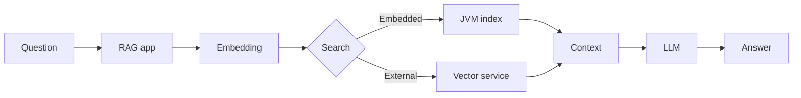
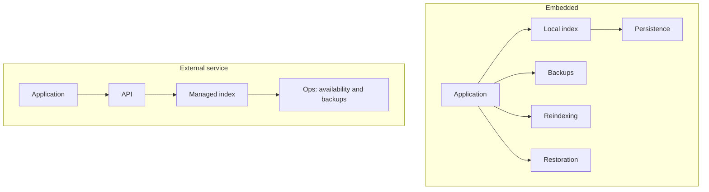
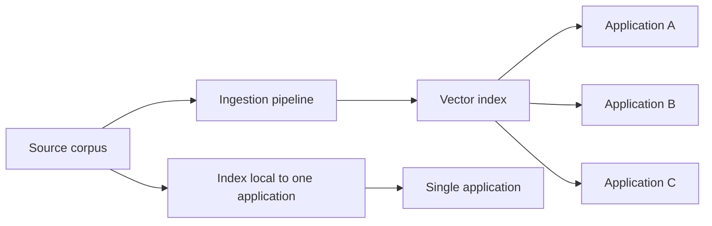
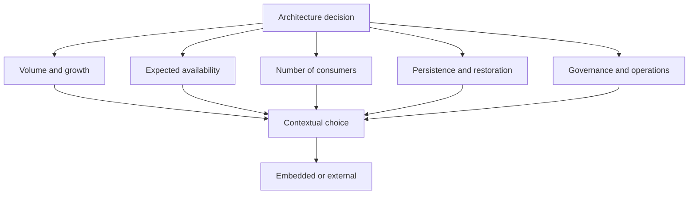

When an application must enrich a model's answers with information from its own documents, the architectural path often seems predetermined.

Documents are split into chunks, transformed into embeddings, and stored in a vector database responsible for retrieving the fragments closest to the user's question.

The reasoning becomes almost automatic:

> RAG, embeddings, vector database.

Qdrant, Weaviate, Pinecone, Elasticsearch, or PostgreSQL with pgvector quickly appear in the architecture diagram.

These solutions address real needs. But they are sometimes introduced before the team has analyzed how the corpus will be produced, updated, shared, and consumed.

Does a corpus belonging to a single application, fed by a controlled process and queried locally, immediately require an independent vector service?

Two recent articles explore this question through implementation.

In <a href="https://thetalkingapp.medium.com/spring-ai-recipe-rag-without-a-separate-vector-database-7c47047ddbb1" target="_blank" rel="noopener noreferrer">Spring AI Recipe: RAG Without a Separate Vector Database</a>, Craig Walls shows how to run a vector store directly in the JVM with Spring AI.

Brian Sam-Bodden extends this approach in <a href="https://medium.com/@bsbodden_68805/in-jvm-rag-that-survives-restarts-4de4e15a4aa1" target="_blank" rel="noopener noreferrer">In-JVM RAG That Survives Restarts</a>, addressing index persistence and restoration after a restart.

These demonstrations establish that a RAG system can work without a separate vector server.

But they primarily raise a more important architectural question:

> When should vector search remain an internal application capability, and when should it become an external infrastructure service?

## A- Two ways to place vector search

In a conventional architecture, the application delegates vector search to a separate service. That service owns its data, its lifecycle, and its operational requirements.

With an embedded engine, the index is managed inside the application process. This can be appropriate when the corpus remains limited, the application is the only consumer, and search does not need to be shared.

The choice is therefore not only about search technology. It is about the boundary between application code and infrastructure.

## B- What an embedded engine really simplifies

An embedded vector store reduces the number of components to deploy and monitor. For a local project, an advanced prototype, or an application with a controlled corpus, that reduction can be significant.

The team may avoid:

* deploying an additional service;
* managing network communication between the application and the search engine;
* synchronizing several environments;
* some of the costs and operational work associated with a shared service.

This simplicity has an important limit. Removing a vector database from the diagram does not remove the constraints associated with storing vectors.

It changes where those constraints are handled.

With an embedded engine, the application gains autonomy and reduces its operational footprint. It also becomes responsible for persistence, backups, reindexing, concurrent writes, and data restoration.

The simplicity visible in the diagram can therefore conceal additional responsibility in application code, deployment scripts, and operating procedures.

## C- Persistence becomes an application decision

An index built only in memory disappears when the process stops. This may be suitable for development or for a corpus that can be regenerated easily. It is harder to justify when ingestion is lengthy, expensive, or dependent on external processing.

Persistence must then be designed explicitly. The team must decide what is saved, when it is saved, which embedding model version produced it, and how restoration will work.

Vectors are not independent of the process that produced them. Changing the embedding model, vector dimensions, chunking method, or metadata may require a full reindexing.

An embedded architecture must therefore answer practical questions:

* Can the index be rebuilt automatically from the source corpus?
* Is the embedding model version stored with the index?
* What happens after a restart or backup restoration?
* Can the corpus be updated without interrupting queries?
* Are concurrent writes supported and controlled?

Persistence is not an implementation detail. It is part of the operating contract of the RAG system.

## D- When embedded search is a reasonable choice

An embedded engine can be a coherent choice when several conditions are met:

* the corpus belongs to a single application;
* the volume remains compatible with the process resources;
* queries do not need to be distributed across several independent consumers;
* the expected availability matches the application's availability;
* the index can be reliably rebuilt or restored;
* the team accepts ownership of the required operations.

In this context, the absence of an external service is not a weakness. It can reduce complexity and keep storage close to the capability that uses it.

However, low volume should not be confused with low criticality. A small corpus may support an important feature. Index size alone is therefore not enough to determine the architecture.

## E- When an external service becomes preferable

An independent vector service becomes more relevant when the index must be shared, replicated, scaled separately, or used by several applications.

It may also be preferable when the search engine's availability must be decoupled from a particular application, when backup and restoration operations must be standardized, or when the volume and update frequency make local management too restrictive.

Sharing provides flexibility, but it also creates a broader responsibility boundary: data isolation, access control, schema evolution, capacity, costs, and service governance.

## F- An architecture decision, not a technology preference

The issue is not about opposing a lightweight solution to an industrial one.

It is about understanding how each approach distributes system responsibilities, then choosing the one that actually matches the system's topology and evolution path.

The right choice may change over time. An application can start with an embedded index and later move to an external service when the corpus, consumer base, or availability requirements change. Conversely, an architecture can remain embedded when sharing would bring no real value.

The useful question is not: “Do we always need a dedicated vector database?”

It is: “Who is responsible for the index, its lifetime, and its restoration?”

Answering that question clearly makes it possible to simplify the infrastructure without moving the problem to a less visible place.
