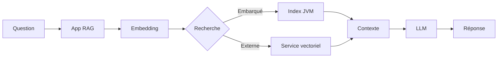
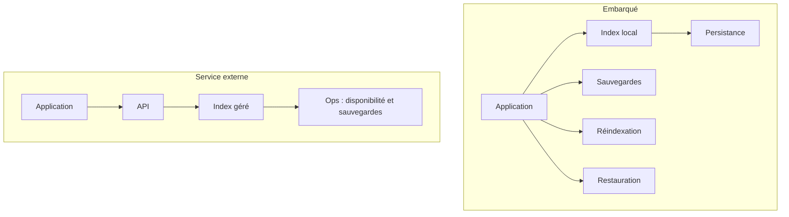
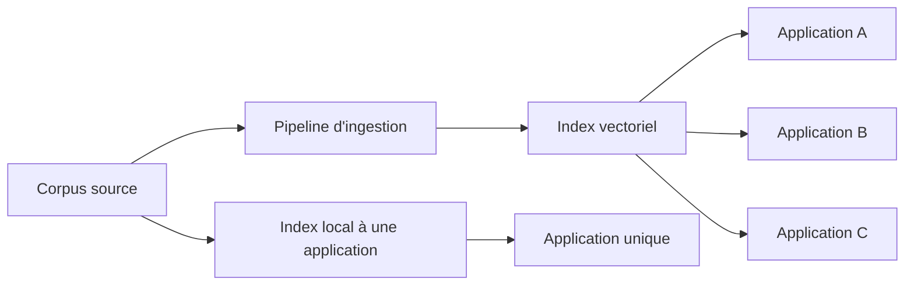
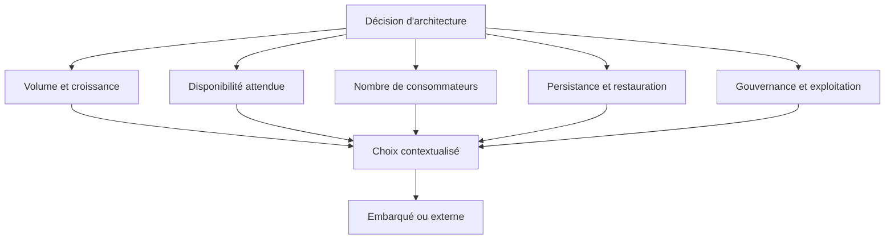

Lorsqu'une application doit enrichir les réponses d'un modèle avec des informations issues de ses propres documents, le chemin d'architecture semble souvent déjà défini.

Les documents sont découpés, transformés en embeddings, puis enregistrés dans une base vectorielle chargée de retrouver les fragments les plus proches de la question de l'utilisateur.

Le raisonnement devient presque automatique :

> RAG, embeddings, base vectorielle.

Qdrant, Weaviate, Pinecone, Elasticsearch ou PostgreSQL avec pgvector rejoignent alors rapidement le diagramme d'architecture.

Ces solutions répondent à de véritables besoins. Mais leur introduction est parfois décidée avant même d'avoir analysé la manière dont le corpus sera produit, mis à jour, partagé et exploité.

Un corpus propre à une seule application, alimenté par un processus contrôlé et interrogé localement, nécessite-t-il immédiatement un service vectoriel indépendant ?

Deux articles récents permettent d'explorer cette question par l'implémentation.

Dans <a href="https://thetalkingapp.medium.com/spring-ai-recipe-rag-without-a-separate-vector-database-7c47047ddbb1" target="_blank" rel="noopener noreferrer">Spring AI Recipe: RAG Without a Separate Vector Database</a>, Craig Walls montre comment exécuter un vector store directement dans la JVM avec Spring AI.

Brian Sam-Bodden prolonge cette approche dans <a href="https://medium.com/@bsbodden_68805/in-jvm-rag-that-survives-restarts-4de4e15a4aa1" target="_blank" rel="noopener noreferrer">In-JVM RAG That Survives Restarts</a>, en traitant la persistance des index et leur restauration après un redémarrage.

Ces démonstrations établissent qu'un système RAG peut fonctionner sans serveur vectoriel séparé.

Mais elles ouvrent surtout une question d'architecture plus importante :

> À quel moment la recherche vectorielle doit-elle rester une capacité interne de l'application, et à quel moment doit-elle devenir un service d'infrastructure externe ?

## A- Deux façons de placer la recherche vectorielle

Dans une architecture classique, l'application délègue la recherche vectorielle à un service distinct. Le service possède ses propres données, son propre cycle de vie et ses propres exigences d'exploitation.

Avec un moteur embarqué, l'index est géré dans le processus de l'application. Cette organisation peut être pertinente lorsque le corpus reste limité, que l'application est la seule consommatrice et que la recherche n'a pas besoin d'être mutualisée.

Le choix ne porte donc pas uniquement sur la technologie de recherche. Il porte sur la frontière entre le code applicatif et l'infrastructure.

## B- Ce que le moteur embarqué simplifie réellement

Un vector store embarqué réduit le nombre de composants à déployer et à surveiller. Pour un projet local, un prototype avancé ou une application dont le corpus est maîtrisé, cette réduction peut être significative.

L'équipe peut notamment éviter :

* le déploiement d'un service supplémentaire ;
* la gestion d'un réseau entre l'application et le moteur de recherche ;
* la synchronisation de plusieurs environnements ;
* une partie des coûts et des opérations liés à un service partagé.

Cette simplicité a cependant une limite importante. Retirer une base vectorielle du diagramme ne retire pas les contraintes liées au stockage des vecteurs.

Cela change l'endroit où elles sont prises en charge.

Avec un moteur embarqué, l'application gagne en autonomie et réduit son empreinte opérationnelle. Elle devient aussi responsable de la persistance, des sauvegardes, des réindexations, des écritures concurrentes et de la restauration des données.

La simplicité visible dans le diagramme peut donc masquer une responsabilité supplémentaire dans le code, les scripts de déploiement et les procédures d'exploitation.

## C- La persistance devient une décision applicative

Un index construit uniquement en mémoire disparaît lorsque le processus s'arrête. Cette option peut convenir à un environnement de développement ou à un corpus facilement régénérable. Elle est plus difficile à défendre lorsque l'ingestion est longue, coûteuse ou dépend de traitements externes.

La persistance doit alors être pensée explicitement. Il faut déterminer ce qui est sauvegardé, à quel moment, avec quelle version du modèle d'embeddings et selon quelle stratégie de restauration.

Les vecteurs ne sont pas indépendants de leur production. Changer de modèle d'embeddings, de dimension vectorielle, de méthode de découpage ou de métadonnées peut rendre nécessaire une réindexation complète.

Une architecture embarquée doit donc répondre à des questions concrètes :

* L'index peut-il être reconstruit automatiquement à partir du corpus source ?
* La version du modèle d'embeddings est-elle conservée avec l'index ?
* Que se passe-t-il après un redémarrage ou une restauration de sauvegarde ?
* Une mise à jour du corpus peut-elle être faite sans interrompre les requêtes ?
* Les écritures concurrentes sont-elles supportées et contrôlées ?

La persistance n'est pas un détail d'implémentation. Elle fait partie du contrat de fonctionnement du système RAG.

## D- Quand l'embarqué est un choix raisonnable

Le moteur embarqué peut être un choix cohérent lorsque plusieurs conditions sont réunies :

* le corpus appartient à une seule application ;
* le volume reste compatible avec les ressources du processus ;
* les requêtes ne doivent pas être réparties entre plusieurs consommateurs indépendants ;
* le niveau de disponibilité attendu est aligné sur celui de l'application ;
* l'index peut être reconstruit ou restauré de manière fiable ;
* l'équipe accepte de porter les opérations nécessaires.

Dans ce contexte, l'absence de service externe n'est pas une faiblesse. Elle peut réduire la complexité et rapprocher le stockage de la capacité qui l'utilise.

Il faut toutefois éviter de confondre faible volume et faible criticité. Un petit corpus peut alimenter une fonctionnalité importante. La taille de l'index ne suffit donc pas à déterminer l'architecture.

## E- Quand le service externe devient préférable

Un service vectoriel indépendant devient plus pertinent lorsque l'index doit être partagé, répliqué, dimensionné séparément ou exploité par plusieurs applications.

Il peut également être préférable lorsque la disponibilité du moteur doit être dissociée de celle d'une application particulière, lorsque les opérations de sauvegarde et de restauration doivent être standardisées, ou lorsque le volume et la fréquence des mises à jour rendent la gestion locale trop contraignante.

La mutualisation apporte alors de la souplesse, mais aussi un périmètre de responsabilité plus large : isolation des données, contrôle des accès, évolution du schéma, capacité, coûts et gouvernance du service.

## F- Une décision d'architecture, pas une préférence de technologie

Le sujet n'est donc pas d'opposer une solution légère à une solution industrielle.

Il s'agit de comprendre comment chaque approche répartit les responsabilités du système, puis de choisir celle qui correspond réellement à sa topologie et à sa trajectoire d'évolution.

Le bon choix peut évoluer. Une application peut commencer avec un index embarqué, puis migrer vers un service externe lorsque le corpus, les consommateurs ou les exigences de disponibilité changent. À l'inverse, une architecture peut aussi rester embarquée lorsque la mutualisation n'apporte aucune valeur réelle.

La question utile n'est donc pas : « Faut-il toujours une base vectorielle dédiée ? »

La question est plutôt : « Qui doit être responsable de l'index, de sa durée de vie et de sa restauration ? »

Répondre clairement à cette question permet de simplifier l'infrastructure sans déplacer le problème vers un endroit moins visible.
