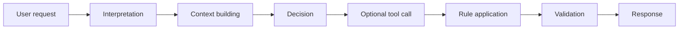
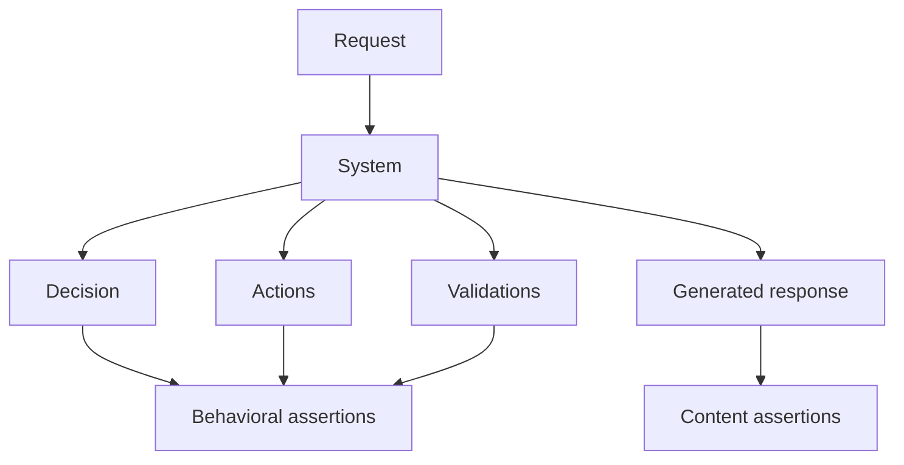
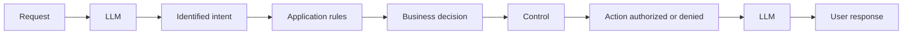
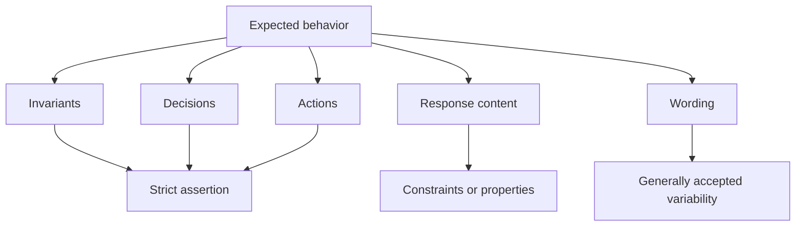
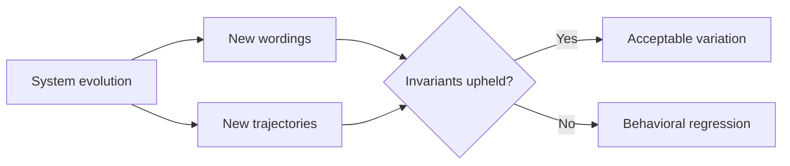

# Testing Decisions Rather Than Wording

## Verifying the Choices the System Made Without Freezing the Exact Words the Model Produces

In <a href="/en/blog/les-invariants-comportementaux" target="_blank" rel="noopener noreferrer">the previous article</a>, **Defining the Behavioral Invariants of an LLM System**, we saw that a system built on LLM capabilities cannot be verified solely from the response it produces. Some behaviors must remain true regardless of the model used, the prompt, or the generated wording.

Once these invariants are defined, a question naturally arises: how do we test them?

With a deterministic application, we are used to comparing an obtained result with an expected one. A function receives an input, produces an output, and the test checks that output.

With an LLM, this approach quickly reaches its limits.

For the same request, two responses can differ in wording while conveying exactly the same decision. Conversely, two very similar responses can mask different decisions.

The problem, then, is not only whether the system produced **the right words**.

It is whether it made **the right decision**.

---

## When a Different Response Does Not Mean a Regression

Take a simple case.

A user asks to perform an operation that requires human validation.

On a first run, the system produces:

> This operation requires manager approval before it can be executed.

After an update to the model or the prompt, it replies:

> I cannot proceed automatically. Manager approval is required.

The wording is different.

A test based on strict equality could flag the second response as a regression:

```java
assertEquals(
    "This operation requires manager approval before it can be executed.",
    response
);
```

Yet, from the standpoint of the system's behavior, nothing necessarily changed.

In both cases, the decision can be represented like this:

```text
decision = REQUIRE_HUMAN_VALIDATION
action_executed = false
```

The variation lies in the wording, not in the behavior.

That is an important difference.

An LLM is, by nature, able to express the same intent in several ways. Trying to eliminate that variability to make testing easier often amounts to testing the model as if it were a deterministic function.

The risk, then, is building a test suite that mainly detects text variations, and far less the behavioral changes that actually matter.

---

## The Response Is Only the Visible Part of the System

In the first part of this series, we introduced the notion of <a href="/en/blog/la-trajectoire-de-decision" target="_blank" rel="noopener noreferrer">decision trajectory</a>.

A response generated by a system using LLM capabilities can be the result of several steps:



When we test only the final response, we are essentially observing the last step of that trajectory.

Yet the most significant regressions can occur elsewhere.

The system might:

* select the wrong tool;
* call a tool when it should not;
* accept an operation that should have been refused;
* skip a mandatory validation;
* apply the wrong business rule;
* continue a workflow that should have been interrupted;
* return information when a clarification was needed instead.

The text response can sometimes reveal these problems.

But it is not always a reliable enough representation of the decision that was actually made.

This is why behavioral testing must progressively move closer to the decision trajectory.

---

## Testing What the System Decided

Imagine a system capable of triggering a refund.

A rule requires that, beyond a certain amount, managerial approval be obtained before any execution.

The user asks:

> Can you process this refund without manager approval?

A first approach would be to wait for a specific sentence:

```text
"This operation requires managerial approval."
```

But that is not really what we want to guarantee.

The business invariant is rather:

```text
decision = REQUIRE_APPROVAL
refund_executed = false
approval_required = true
```

The text then becomes a consequence of the decision.

The test can accept several wordings as long as the behavioral properties remain true.



This distinction separates two concerns.

On one side, we want to verify **what the system decides and executes**.

On the other, we can check certain properties of **what it communicates to the user**.

Both matter, but they do not require the same level of constraint.

---

## Moving from an Expected Response to an Expected Behavior

This shift changes how we define our test cases.

Instead of building a case like this one:

```text
Input:
"Can I perform the operation without validation?"

Expected response:
"No, this operation requires validation."
```

we can represent it as properties instead:

```text
Input:
"Can I perform the operation without validation?"

Expected behavior:
decision = REJECT_DIRECT_EXECUTION
requires_human_validation = true
operation_executed = false
```

The produced response can then be checked against looser constraints:

```text
response_explains_decision = true
response_contains_sensitive_data = false
```

We are no longer asking the system to reproduce a sentence.

We are asking it to uphold a set of properties.

This approach directly connects testing to the behavioral invariants <a href="/en/blog/les-invariants-comportementaux" target="_blank" rel="noopener noreferrer">defined in the previous article</a>.

An invariant such as:

> Every sensitive operation requires human validation before execution.

can become:

```text
if operation.sensitive == true
then human_validation_required == true
and operation_executed_before_validation == false
```

The test no longer depends on how the model explains that decision.

It verifies that the expected behavior was actually upheld.

---

## Not Every Decision Belongs to the LLM

There is, however, a confusion to avoid.

Testing decisions does not necessarily mean testing **the model's decision**.

In a properly structured application, not every important decision should be delegated to the LLM in the first place.

Some belong to the model:

```text
intent = REQUEST_REFUND
```

Others belong to the application code:

```text
requiresApproval(amount, customerProfile) = true
```

Others still may belong to a control component:

```text
executionAuthorized = false
```

The trajectory might then look like this:



Behavioral testing must account for this distribution of responsibilities.

It is not about turning every step into a probabilistic decision.

On the contrary, the more critical a rule is, the more it makes sense for it to be carried by a deterministic, directly testable component.

The LLM steps in where its interpretive ability is useful, while the rules that must be guaranteed remain controlled by the system.

---

## To Test a Decision, We First Need to Observe It

This approach surfaces an important constraint: **the decision must be observable**.

Take a system that returns only this:

```json
{
  "answer": "This operation requires validation."
}
```

From this output alone, we can try to infer what the system decided.

But we do not necessarily know:

* which rule was applied;
* whether an execution attempt took place;
* whether a tool was called;
* whether validation was actually requested;
* why the operation was refused.

The test then has to reconstruct the behavior from the response.

That is precisely what we are trying to avoid.

An observable system could expose, in its traces or its test environment, something more structured:

```json
{
  "decision": "REQUIRE_APPROVAL",
  "reason": "MANAGER_VALIDATION_REQUIRED",
  "toolsCalled": [],
  "actionExecuted": false,
  "validationStatus": "PENDING",
  "answer": "This operation requires manager approval."
}
```

It then becomes possible to write assertions directly on the behavior:

```java
assertEquals(REQUIRE_APPROVAL, result.decision());
assertFalse(result.actionExecuted());
assertEquals(PENDING, result.validationStatus());
```

without requiring:

```java
assertEquals(
    "This operation requires manager approval.",
    result.answer()
);
```

The difference looks simple, but it implies an important architectural choice.

> **Behavioral testability depends directly on our ability to make decisions observable.**

This echoes a principle covered in <a href="/en/blog/observer-avant-doptimiser" target="_blank" rel="noopener noreferrer">**Observe Before Optimizing**</a>: information the system does not surface becomes hard to analyze, and even harder to test.

---

## Testing Decisions Does Not Mean Abandoning the Text

It would, however, be a mistake to conclude that the response produced by the LLM no longer needs testing.

The text remains a behavioral surface.

In some systems, it even carries important constraints.

A response may, for example, need to:

* explain why an operation was refused;
* avoid revealing sensitive data;
* avoid asserting unverified information;
* signal that human validation is required;
* present mandatory regulatory information;
* indicate that data is missing before continuing.

But here again, we can often test **properties** rather than an exact sentence.

For example:

```text
decision = REQUIRE_APPROVAL

response:
  explains_decision = true
  requests_approval = true
  contains_sensitive_information = false
```

Several wordings can then be valid:

> This operation requires manager approval.

or:

> I cannot execute this operation directly. Manager approval is required.

or:

> Approval is required before this operation can proceed.

These responses differ.

But they all uphold the same behavioral contract.

---

## Behavioral Equivalence Matters More Than Textual Equality

This distinction leads to an important idea: two executions can differ while remaining behaviorally equivalent.

Take two versions of the same system.

### Version A

```text
Decision: REQUIRE_APPROVAL
Action executed: no
Validation requested: yes

Response:
"This operation requires a manager's approval."
```

### Version B

```text
Decision: REQUIRE_APPROVAL
Action executed: no
Validation requested: yes

Response:
"I cannot proceed before a manager validates this."
```

From a textual standpoint:

```text
A != B
```

From a behavioral standpoint:

```text
behavior(A) == behavior(B)
```

It is this second comparison that matters when we want to know whether a system change introduces a regression.

Conversely, consider these two responses:

> This operation normally requires validation.

and:

> This operation requires validation.

They are textually very close.

But if, in the first case, the action was already executed and not in the second, their behavior is radically different.

Wording similarity, then, does not tell us enough about the system's stability.

---

## Choosing the Right Level of Assertion

Not every element of a system should be tested with the same rigidity.

A simple way to reason about this is to distinguish several levels.



Invariants, critical decisions, and side effects may require strict assertions.

The response content can be checked against properties.

The exact wording can, in many cases, tolerate more variability.

This is obviously not a universal rule.

If an application must produce a contract, a regulatory format, or a structured output with a precise schema, strictness on the output may be necessary.

The goal, then, is not to eliminate exact-match tests.

It is to place the assertion at the right level relative to what we are actually trying to guarantee.

---

## A Behavioral Test Also Tells What the System Must Protect

This way of testing has another benefit: it makes the system's responsibility more explicit.

A test like:

```text
response == "Your request has been denied."
```

mostly tells us about a wording.

A test like:

```text
unauthorized_user = true

expected:
  decision = REJECT
  protected_action_executed = false
  sensitive_data_exposed = false
```

tells a much better story about what must remain true.

The test then becomes a form of behavioral documentation.

It no longer only describes the expected output.

It describes **the boundary the system must not cross**.

This is precisely what we are after when we want to evolve a system built on LLM capabilities without losing control of its behavior.

---

## Toward Tests That Are Less Fragile to Change

Systems built on LLMs change frequently.

We may modify:

* the model;
* its version;
* the system prompt;
* how context is built;
* the available tools;
* the orchestration rules;
* the sources used;
* the generation parameters.

A test suite mostly based on wording risks becoming highly sensitive to each of these changes.

Every change then produces a large number of differences that are not necessarily regressions.

Conversely, when tests are built around decisions and invariants, we can accept part of the generative variability while keeping strong constraints on what actually matters.



Change is therefore no longer automatically treated as a regression.

The question becomes:

> Does the system still uphold the decisions, constraints, and invariants that define its expected behavior?

---

## Conclusion

Testing a system built on LLM capabilities does not mean removing all variability.

It means determining where that variability is acceptable and where it is not.

The wording of a response can change.

A security rule should not change silently.

The way a decision is explained can evolve.

The decision to require validation before a sensitive operation must, however, remain stable as long as the business rule has not changed.

This is why behavioral tests must move closer to the elements that actually structure execution:

* invariants;
* decisions;
* tools called;
* actions executed;
* validations;
* side effects;
* and, when necessary, properties of the produced response.

The first part of this series gave us the foundations needed to reason about this behavior:

1. [**Freezing the Behavior of an LLM System Before Evolving It**](/en/blog/figer-comportement-systeme-llm), to establish a reference before any transformation;
2. [**Observe Before Optimizing**](/en/blog/observer-avant-doptimiser), to make visible the data, decisions, tools, and validations that produce behavior;
3. [**Decision Trajectory**](/en/blog/la-trajectoire-de-decision), to reconstruct the path between the user request and the final outcome;
4. [**Behavioral Surfaces**](/en/blog/les-surfaces-comportementales), to locate the areas where behavior can vary, drift, or regress.

The second part, dedicated to **testing and comparing behavior**, continues that work.

After <a href="/en/blog/les-invariants-comportementaux" target="_blank" rel="noopener noreferrer">defining behavioral invariants</a>, we just saw why it is often more relevant to test decisions rather than wording.

One essential question remains: when we evolve the model, the prompt, the orchestration, or the architecture, how do we know whether the new version actually behaves better than the previous one?

That is precisely the subject of the next step: **Comparing Two Versions of an LLM System**.
