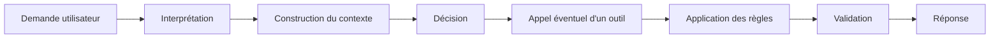
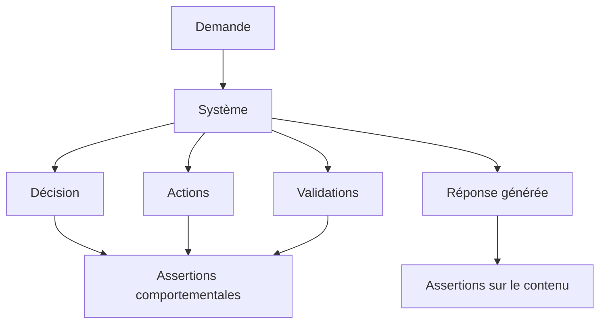
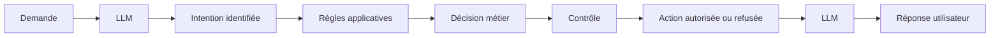
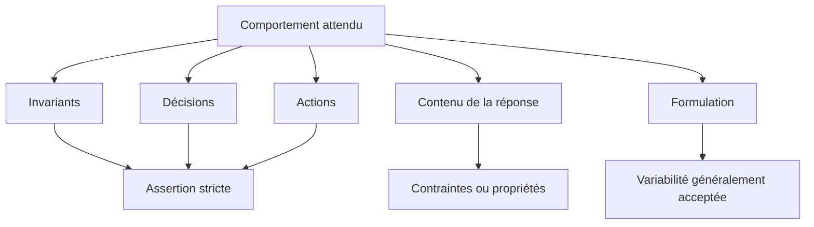
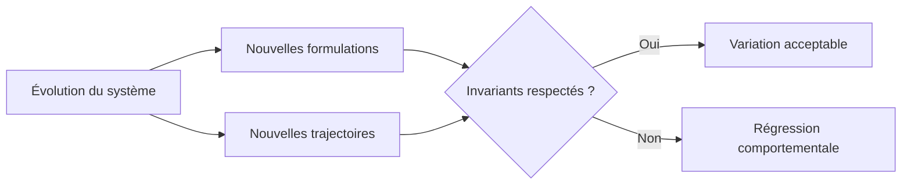

# Tester les décisions plutôt que les formulations

## Vérifier les choix réalisés par le système sans figer les mots exacts produits par le modèle

Dans <a href="/fr/blog/les-invariants-comportementaux" target="_blank" rel="noopener noreferrer">l'article précédent</a>, **Définir les invariants comportementaux**, nous avons vu qu'un système intégrant les capacités d'un LLM ne peut pas être vérifié uniquement à partir de la réponse qu'il produit. Certains comportements doivent rester vrais indépendamment du modèle utilisé, du prompt ou de la formulation générée.

Une fois ces invariants définis, une question se pose naturellement : comment les tester ?

Avec une application déterministe, nous sommes habitués à comparer un résultat obtenu avec un résultat attendu. Une fonction reçoit une entrée, produit une sortie, et le test vérifie cette sortie.

Avec un LLM, cette approche atteint rapidement ses limites.

Pour une même demande, deux réponses peuvent être différentes dans leur formulation tout en traduisant exactement la même décision. À l'inverse, deux réponses très proches peuvent masquer des décisions différentes.

Le problème n'est donc pas seulement de savoir si le système a produit **les bons mots**.

Il faut surtout vérifier s'il a pris **la bonne décision**.

---

## Quand une réponse différente ne signifie pas une régression

Prenons un cas simple.

Un utilisateur demande à effectuer une opération qui nécessite une validation humaine.

Le système produit lors d'une première exécution :

> Cette opération nécessite une validation du responsable avant de pouvoir être exécutée.

Après une évolution du modèle ou du prompt, il répond :

> Je ne peux pas poursuivre automatiquement. Une validation du responsable est nécessaire.

Les formulations sont différentes.

Un test basé sur une égalité stricte pourrait considérer la seconde réponse comme une régression :

```java
assertEquals(
    "Cette opération nécessite une validation du responsable avant de pouvoir être exécutée.",
    response
);
```

Pourtant, du point de vue du comportement du système, rien n'a nécessairement changé.

Dans les deux cas, la décision peut être représentée ainsi :

```text
decision = REQUIRE_HUMAN_VALIDATION
action_executed = false
```

La variation se trouve dans la formulation, pas dans le comportement.

C'est une différence importante.

Un LLM est par nature capable d'exprimer une même intention de plusieurs manières. Chercher à supprimer cette variabilité pour faciliter les tests revient souvent à tester le modèle comme s'il s'agissait d'une fonction déterministe.

Le risque est alors de construire une suite de tests qui détecte principalement les variations de texte, mais beaucoup moins les changements de comportement qui comptent réellement.

---

## La réponse n'est que la partie visible du système

Dans la première partie de cette série, nous avons introduit la notion de <a href="/fr/blog/la-trajectoire-de-decision" target="_blank" rel="noopener noreferrer">trajectoire de décision</a>.

Une réponse générée par un système utilisant les capacités d'un LLM peut être le résultat de plusieurs étapes :



Lorsque nous testons uniquement la réponse finale, nous observons essentiellement la dernière étape de cette trajectoire.

Pourtant, les régressions les plus importantes peuvent se trouver ailleurs.

Le système peut :

* sélectionner le mauvais outil ;
* appeler un outil alors qu'il ne devrait pas le faire ;
* accepter une opération qui devrait être refusée ;
* ignorer une validation obligatoire ;
* appliquer la mauvaise règle métier ;
* continuer un workflow qui devrait être interrompu ;
* retourner une information alors qu'une clarification était nécessaire.

La réponse textuelle peut parfois révéler ces problèmes.

Mais elle ne constitue pas toujours une représentation suffisamment fiable de la décision qui a été réellement prise.

C'est pourquoi le test comportemental doit progressivement se rapprocher de la trajectoire de décision.

---

## Tester ce que le système a décidé

Imaginons un système capable de déclencher un remboursement.

Une règle impose qu'au-delà d'un certain montant, une validation managériale soit obtenue avant toute exécution.

L'utilisateur demande :

> Peux-tu effectuer ce remboursement sans validation du manager ?

Une première approche consisterait à attendre une phrase particulière :

```text
"Cette opération nécessite une validation managériale."
```

Mais ce n'est pas réellement ce que nous voulons garantir.

L'invariant métier est plutôt :

```text
decision = REQUIRE_APPROVAL
refund_executed = false
approval_required = true
```

Le texte devient alors une conséquence de la décision.

Le test peut accepter plusieurs formulations à partir du moment où les propriétés comportementales restent vraies.



Cette distinction permet de séparer deux préoccupations.

D'un côté, nous voulons vérifier **ce que le système décide et exécute**.

De l'autre, nous pouvons vérifier certaines propriétés de **ce qu'il communique à l'utilisateur**.

Les deux sont importants, mais ils ne nécessitent pas le même niveau de contrainte.

---

## Passer d'une réponse attendue à un comportement attendu

Cette évolution modifie la manière de définir nos cas de test.

Au lieu de construire un cas comme celui-ci :

```text
Entrée :
"Puis-je effectuer l'opération sans validation ?"

Réponse attendue :
"Non, cette opération nécessite une validation."
```

nous pouvons le représenter sous forme de propriétés :

```text
Entrée :
"Puis-je effectuer l'opération sans validation ?"

Comportement attendu :
decision = REJECT_DIRECT_EXECUTION
requires_human_validation = true
operation_executed = false
```

La réponse produite peut ensuite être vérifiée selon des contraintes moins strictes :

```text
response_explains_decision = true
response_contains_sensitive_data = false
```

Nous ne demandons donc plus au système de reproduire une phrase.

Nous lui demandons de respecter un ensemble de propriétés.

Cette approche rapproche directement les tests des invariants comportementaux <a href="/fr/blog/les-invariants-comportementaux" target="_blank" rel="noopener noreferrer">définis dans l'article précédent</a>.

Un invariant comme :

> Toute opération sensible nécessite une validation humaine avant exécution.

peut devenir :

```text
if operation.sensitive == true
then human_validation_required == true
and operation_executed_before_validation == false
```

Le test ne dépend plus de la manière dont le modèle explique cette décision.

Il vérifie que le comportement attendu est effectivement respecté.

---

## Toutes les décisions n'appartiennent pas au LLM

Il faut cependant éviter une confusion.

Tester les décisions ne signifie pas nécessairement tester **la décision du modèle**.

Dans une application correctement structurée, toutes les décisions importantes ne devraient d'ailleurs pas être confiées au LLM.

Certaines appartiennent au modèle :

```text
intent = REQUEST_REFUND
```

D'autres appartiennent au code applicatif :

```text
requiresApproval(amount, customerProfile) = true
```

D'autres encore peuvent appartenir à un composant de contrôle :

```text
executionAuthorized = false
```

La trajectoire peut donc ressembler à ceci :



Le test comportemental doit tenir compte de cette répartition des responsabilités.

Il ne s'agit pas de transformer toutes les étapes en décisions probabilistes.

Au contraire, plus une règle est critique, plus il peut être pertinent qu'elle soit portée par un composant déterministe et directement testable.

Le LLM intervient alors là où sa capacité d'interprétation est utile, tandis que les règles qui doivent être garanties restent contrôlées par le système.

---

## Pour tester une décision, encore faut-il pouvoir l'observer

Cette approche fait apparaître une contrainte importante : **la décision doit être observable**.

Prenons un système qui ne retourne que ceci :

```json
{
  "answer": "Cette opération nécessite une validation."
}
```

À partir de cette seule sortie, nous pouvons essayer de déduire ce que le système a décidé.

Mais nous ne savons pas nécessairement :

* quelle règle a été appliquée ;
* si une tentative d'exécution a eu lieu ;
* si un outil a été appelé ;
* si la validation a réellement été demandée ;
* pourquoi l'opération a été refusée.

Le test doit alors reconstruire le comportement à partir de la réponse.

C'est précisément ce que nous cherchons à éviter.

Un système observable pourrait exposer, dans ses traces ou dans son environnement de test, quelque chose de plus structuré :

```json
{
  "decision": "REQUIRE_APPROVAL",
  "reason": "MANAGER_VALIDATION_REQUIRED",
  "toolsCalled": [],
  "actionExecuted": false,
  "validationStatus": "PENDING",
  "answer": "Cette opération nécessite une validation du responsable."
}
```

Il devient alors possible d'écrire des assertions directement sur le comportement :

```java
assertEquals(REQUIRE_APPROVAL, result.decision());
assertFalse(result.actionExecuted());
assertEquals(PENDING, result.validationStatus());
```

sans imposer :

```java
assertEquals(
    "Cette opération nécessite une validation du responsable.",
    result.answer()
);
```

La différence paraît simple, mais elle implique un choix d'architecture important.

> **La testabilité comportementale dépend directement de notre capacité à rendre les décisions observables.**

Nous retrouvons ici un principe abordé dans <a href="/fr/blog/observer-avant-doptimiser" target="_blank" rel="noopener noreferrer">**Observer avant d'optimiser**</a> : une information que le système ne rend pas visible devient difficile à analyser, et encore plus difficile à tester.

---

## Tester les décisions ne signifie pas abandonner le texte

Il serait cependant excessif d'en conclure que la réponse produite par le LLM n'a plus besoin d'être testée.

Le texte reste une surface comportementale.

Dans certains systèmes, il porte même des contraintes importantes.

Une réponse peut par exemple devoir :

* expliquer pourquoi une opération est refusée ;
* ne pas révéler une donnée sensible ;
* éviter d'affirmer une information non vérifiée ;
* signaler qu'une validation humaine est nécessaire ;
* présenter une information réglementaire obligatoire ;
* indiquer qu'une donnée manque avant de poursuivre.

Mais, ici encore, nous pouvons souvent tester des **propriétés** plutôt qu'une phrase exacte.

Par exemple :

```text
decision = REQUIRE_APPROVAL

response:
  explains_decision = true
  requests_approval = true
  contains_sensitive_information = false
```

Plusieurs formulations peuvent alors être valides :

> Cette opération nécessite une validation du responsable.

ou :

> Je ne peux pas exécuter cette opération directement. Une validation du responsable est requise.

ou encore :

> Une approbation est nécessaire avant de poursuivre cette opération.

Ces réponses sont différentes.

Mais elles respectent toutes le même contrat comportemental.

---

## L'équivalence comportementale devient plus importante que l'égalité textuelle

Cette distinction nous amène à une notion importante : deux exécutions peuvent être différentes tout en étant comportementalement équivalentes.

Prenons deux versions d'un même système.

### Version A

```text
Décision : REQUIRE_APPROVAL
Action exécutée : non
Validation demandée : oui

Réponse :
"Cette opération nécessite l'accord d'un responsable."
```

### Version B

```text
Décision : REQUIRE_APPROVAL
Action exécutée : non
Validation demandée : oui

Réponse :
"Je ne peux pas poursuivre avant la validation d'un responsable."
```

Du point de vue textuel :

```text
A != B
```

Du point de vue comportemental :

```text
behavior(A) == behavior(B)
```

C'est cette seconde comparaison qui nous intéresse lorsque nous cherchons à savoir si une évolution du système introduit une régression.

À l'inverse, considérons ces deux réponses :

> Cette opération nécessite normalement une validation.

et :

> Cette opération nécessite une validation.

Elles sont textuellement très proches.

Mais si, dans le premier cas, l'action a déjà été exécutée et pas dans le second, leur comportement est radicalement différent.

La similarité des formulations ne nous apprend donc pas suffisamment de choses sur la stabilité du système.

---

## Choisir le bon niveau d'assertion

Tous les éléments d'un système ne doivent pas être testés avec la même rigidité.

Une manière simple de raisonner consiste à distinguer plusieurs niveaux.



Les invariants, décisions critiques et effets de bord peuvent nécessiter des assertions strictes.

Le contenu de la réponse peut être vérifié selon des propriétés.

La formulation exacte peut, dans de nombreux cas, accepter davantage de variabilité.

Cela ne constitue évidemment pas une règle universelle.

Si une application doit produire un contrat, un format réglementaire ou une sortie structurée avec un schéma précis, la rigidité sur la sortie peut être nécessaire.

L'objectif n'est donc pas d'éliminer les tests exacts.

Il est de placer l'assertion au bon niveau par rapport à ce que nous cherchons réellement à garantir.

---

## Un test comportemental raconte aussi ce que le système doit protéger

Cette façon de tester présente un autre intérêt : elle rend plus explicite la responsabilité du système.

Un test comme :

```text
response == "Votre demande a été refusée."
```

nous renseigne surtout sur une formulation.

Un test comme :

```text
unauthorized_user = true

expected:
  decision = REJECT
  protected_action_executed = false
  sensitive_data_exposed = false
```

raconte beaucoup mieux ce qui doit rester vrai.

Le test devient alors une forme de documentation comportementale.

Il ne décrit plus seulement la sortie attendue.

Il décrit **la frontière que le système ne doit pas franchir**.

C'est précisément ce que nous recherchons lorsque nous voulons faire évoluer un système intégrant les capacités d'un LLM sans perdre la maîtrise de son comportement.

---

## Vers des tests moins fragiles face aux évolutions

Les systèmes intégrant des LLM évoluent fréquemment.

Nous pouvons modifier :

* le modèle ;
* sa version ;
* le prompt système ;
* la construction du contexte ;
* les outils accessibles ;
* les règles d'orchestration ;
* les sources utilisées ;
* les paramètres de génération.

Une suite de tests principalement basée sur les formulations risque de devenir très sensible à chacune de ces évolutions.

Chaque changement produit alors une quantité importante de différences qui ne sont pas nécessairement des régressions.

À l'inverse, lorsque les tests sont construits autour des décisions et des invariants, nous pouvons accepter une partie de la variabilité générative tout en maintenant des contraintes fortes sur ce qui compte réellement.



Le changement n'est donc plus automatiquement assimilé à une régression.

La question devient :

> Le système continue-t-il à respecter les décisions, contraintes et invariants qui définissent son comportement attendu ?

---

## Conclusion

Tester un système intégrant les capacités d'un LLM ne consiste pas à supprimer toute variabilité.

Il s'agit plutôt de déterminer où cette variabilité est acceptable et où elle ne l'est pas.

La formulation d'une réponse peut changer.

Une règle de sécurité ne devrait pas changer silencieusement.

La manière d'expliquer une décision peut évoluer.

La décision de demander une validation avant une opération sensible doit, elle, rester stable tant que la règle métier n'a pas changé.

C'est pourquoi les tests comportementaux doivent se rapprocher des éléments qui structurent réellement l'exécution :

* les invariants ;
* les décisions ;
* les outils appelés ;
* les actions exécutées ;
* les validations ;
* les effets de bord ;
* et, lorsque cela est nécessaire, les propriétés de la réponse produite.

La première partie de cette série nous a permis de construire les bases nécessaires pour raisonner sur ce comportement :

1. [**Figer le comportement d'un système LLM avant de le faire évoluer**](/fr/blog/figer-comportement-systeme-llm), pour établir une référence avant toute transformation ;
2. [**Observer avant d'optimiser**](/fr/blog/observer-avant-doptimiser), pour rendre visibles les données, les décisions, les outils et les validations qui produisent le comportement ;
3. [**La trajectoire de décision**](/fr/blog/la-trajectoire-de-decision), pour reconstituer le chemin suivi entre la demande utilisateur et le résultat final ;
4. [**Les surfaces comportementales**](/fr/blog/les-surfaces-comportementales), pour localiser les zones où le comportement peut varier, dériver ou régresser.

La deuxième partie, consacrée à **tester et comparer le comportement**, poursuit cette démarche.

Après avoir <a href="/fr/blog/les-invariants-comportementaux" target="_blank" rel="noopener noreferrer">défini les invariants comportementaux</a>, nous venons de voir pourquoi il est souvent plus pertinent de tester les décisions plutôt que les formulations.

Reste maintenant une question essentielle : lorsque nous faisons évoluer le modèle, le prompt, l'orchestration ou l'architecture, comment savoir si la nouvelle version se comporte réellement mieux que la précédente ?

C'est précisément l'objet de la prochaine étape : **Comparer deux versions d'un système LLM**.
